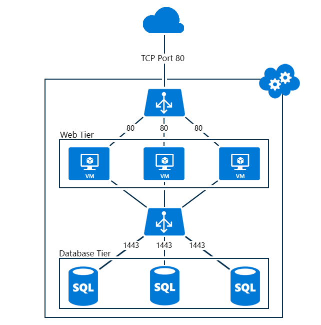

<properties
   pageTitle="Get started with Internal Load Balancer | Microsoft Azure"
   description="Configure Internal Load Balancer and how to implement for virtual machines and cloud deployments."
   services="load-balancer"
   documentationCenter="na"
   authors="joaoma"
   manager="adinah"
   editor="tysonn" />
<tags
   ms.service="load-balancer"
   ms.devlang="na"
   ms.topic="get-started-article"
   ms.tgt_pltfrm="na"
   ms.workload="infrastructure-services"
   ms.date="09/01/2015"
   ms.author="joaoma" />

# Get started configuring an internal load balancer

> [AZURE.SELECTOR]
- [Azure Classic steps](load-balancer-internal-getstarted.md)
- [Resource Manager PowerShell steps](load-balancer-internal-arm-powershell.md)

Azure Internal Load Balancing (ILB) provides load balancing between virtual machines that reside inside a cloud service or a virtual network with a regional scope. For information about the use and configuration of virtual networks with a regional scope, see [Regional Virtual Networks](virtual-networks-migrate-to-regional-vnet.md). Existing virtual networks that have been configured for an affinity group cannot use ILB.

## To create an internal load-balanced set for virtual machines

To create an Azure internal load-balanced set and the servers that will send their traffic to it, you must do the following:

1. Create an instance of Internal Load Balancing that will be the endpoint of incoming traffic to be load balanced across the servers of a load-balanced set.

1. Add endpoints corresponding to the virtual machines that will be receiving the incoming traffic.

1. Configure the servers that will be sending the traffic to be load balanced to send their traffic to the virtual IP (VIP) address of the Internal Load Balancing instance.

### Step 1: Create an Internal Load Balancing instance

For an existing cloud service or a cloud service deployed under a regional virtual network, you can create an Internal Load Balancing instance with the following Windows PowerShell commands:

	$svc="<Cloud Service Name>"
	$ilb="<Name of your ILB instance>"
	$subnet="<Name of the subnet within your virtual network>"
	$IP="<The IPv4 address to use on the subnet-optional>"

	Add-AzureInternalLoadBalancer -ServiceName $svc -InternalLoadBalancerName $ilb –SubnetName $subnet –StaticVNetIPAddress $IP

To use these commands, fill in the values and remove the < and >. Here is an example:

	$svc="WebCloud-NY"
	$ilb="SQL-BE"
	$subnet="Farm1"
	$IP="192.168.98.10"
	Add-AzureInternalLoadBalancer -ServiceName $svc -InternalLoadBalancerName $ilb –SubnetName $subnet –StaticVNetIPAddress $IP

### Step 2: Add endpoints to the Internal Load Balancing instance

For existing virtual machines, you can add endpoints to the Internal Load Balancing instance with the following commands:

	$svc="<Cloud service name>"
	$vmname="<Name of the VM>"
	$epname="<Name of the endpoint>"
	$lbsetname="<Name of the load balancer set>"
	$prot="tcp" or "udp"
	$locport=<local port number>
	$pubport=<public port number>
	$ilb="<Name of your ILB instance>"
	Get-AzureVM –ServiceName $svc –Name $vmname | Add-AzureEndpoint -Name $epname -LbsetName $lbsetname -Protocol $prot -LocalPort $locport -PublicPort $pubport –DefaultProbe -InternalLoadBalancerName $ilb | Update-AzureVM

To use these commands, fill in the values and remove the < and >.

Note that this use of the [Add-AzureEndpoint](https://msdn.microsoft.com/library/dn495300.aspx) Windows PowerShell cmdlet uses the DefaultProbe parameter set. For more information on additional parameter sets, see [Add-AzureEndpoint](https://msdn.microsoft.com/library/dn495300.aspx).

Here is an example:

	$svc="AZ-LOB1"
	$vmname="SQL-LOBAZ1"
	$epname="SQL1"
	$lbsetname="SQL-LB"
	$prot="tcp"
	$locport=1433
	$pubport=1433
	$ilb="SQL ILB"
	Get-AzureVM –ServiceName $svc –Name $vmname | Add-AzureEndpoint -Name $epname -Lbset $lbsetname -Protocol $prot -LocalPort $locport -PublicPort $pubport –DefaultProbe -InternalLoadBalancerName $ilb | Update-AzureVM

### Step 3: Configure your servers to send their traffic to the new Internal Load Balancing endpoint

You must configure the servers whose traffic is going to be load balanced to use the new IP address (the VIP) of the Internal Load Balancing instance. This is the address on which the Internal Load Balancing instance is listening. In most cases, you need to just add or modify a DNS record for the VIP of the Internal Load Balancing instance.

If you specified the IP address during the creation of the Internal Load Balancing instance, you already have the VIP. Otherwise, you can see the VIP from the following commands:

	$svc="<Cloud Service Name>"
	Get-AzureService -ServiceName $svc | Get-AzureInternalLoadBalancer

To use these commands, fill in the values and remove the < and >. Here is an example:

	$svc="WebCloud-NY"
	Get-AzureService -ServiceName $svc | Get-AzureInternalLoadBalancer

From the display of the Get-AzureInternalLoadBalancer command, note the IP address and make the necessary changes to your servers or DNS records to ensure that traffic gets sent to the VIP.

>[AZURE.NOTE] The Microsoft Azure platform uses a static, publicly routable IPv4 address for a variety of administrative scenarios. The IP address is 168.63.129.16. This IP address should not be blocked by any firewalls, because it can cause unexpected behavior.
>With respect to Azure Internal Load Balancing, this IP address is used by monitoring probes from the load balancer to determine the health state for virtual machines in a load balanced set. If a Network Security Group is used to restrict traffic to Azure virtual machines in an internally load-balanced set or is applied to a Virtual Network Subnet, ensure that a Network Security Rule is added to allow traffic from 168.63.129.16.

## End-to-end examples of internal load balancing

To step you through the end-to end process of creating a load-balanced set for two example configurations, see the following sections.

### An Internet-facing, multi-tier application

The Contoso Corporation wants to provide load balancing between a set of Internet-facing web servers and a set of database servers. Both sets of servers are hosted in a single Azure cloud service. Web server traffic to TCP port 1433 must be distributed among three virtual machines in the database tier. Figure 1 shows the configuration.

Figure 1: Example of an Internet-facing, multi-tier application

The configuration consists of the following:

- The existing cloud service hosting the virtual machines is named Contoso-PartnerSite.

- The three existing database servers are named PARTNER-SQL-1, PARTNER-SQL-2, and PARTNER-SQL-3.

- Web servers in the web tier connect to the database servers in the database tier by using the DNS name partner-sql.external.contoso.com.

The following commands configure a new Internal Load Balancing instance named PARTNER-DBTIER and add endpoints to the virtual machines corresponding to the three database servers:

	$svc="Contoso-PartnerSite"
	$ilb="PARTNER-DBTIER"
	Add-AzureInternalLoadBalancer -ServiceName $svc -InternalLoadBalancerName $ilb

	$prot="tcp"
	$locport=1433
	$pubport=1433
	$epname="DBTIER1"
	$lbsetname="SQL-LB"
	$vmname="PARTNER-SQL-1"
	Get-AzureVM –ServiceName $svc –Name $vmname | Add-AzureEndpoint -Name $epname -LbSetName $lbsetname -Protocol $prot -LocalPort $locport -PublicPort $pubport –DefaultProbe -InternalLoadBalancerName $ilb | Update-AzureVM

	$epname="DBTIER2"
	$vmname="PARTNER-SQL-2"
	Get-AzureVM –ServiceName $svc –Name $vmname | Add-AzureEndpoint -Name $epname -LbSetName $lbsetname -Protocol $prot -LocalPort $locport -PublicPort $pubport –DefaultProbe -InternalLoadBalancerName $ilb | Update-AzureVM

	$epname="DBTIER3"
	$vmname="PARTNER-SQL-3"
	Get-AzureVM –ServiceName $svc –Name $vmname | Add-AzureEndpoint -Name $epname -LbSetName $lbsetname -Protocol $prot -LocalPort $locport -PublicPort $pubport –DefaultProbe -InternalLoadBalancerName $ilb | Update-AzureVM

Next, Contoso determined the VIP of the PARTNER-DBTIER instance of Internal Load Balancing with the following command:

	Get-AzureService -ServiceName $svc | Get-AzureInternalLoadBalancer

From the display of this command, Contoso noted the VIP address of 100.64.65.211 and configured the DNS Address (A) record for the name partner-sql.external.contoso.com to use this new address.

### An LOB application hosted in Azure

The Contoso Corporation wants to host a line-of-business (LOB) application on a set of web servers in Azure. Client traffic to TCP port 80 must be load-balanced among three virtual machines running in a cross-premises virtual network. Figure 2 shows the configuration.

Figure 2: Example of an LOB application hosted in Azure

The configuration consists of the following:

- The existing cloud service hosting the virtual machines is named Contoso-Legal.

- The subnet on which the LOB servers are located is named LOB-LEGAL, and Contoso has chosen the address 198.168.99.145 as the VIP address for the internal load balancer.

- The three existing LOB servers are named LEGAL-1, LEGAL-2, and LEGAL-3.

- Intranet web clients connect to the LOB servers by using the DNS name legalnet.corp.contoso.com.

The following commands create an Internal Load Balancing instance named LEGAL-ILB and add endpoints to the virtual machines corresponding to the three LOB servers:

	$svc="Contoso-Legal"
	$ilb="LEGAL-ILB"
	$subnet="LOB-LEGAL"
	$IP="198.168.99.145"
	Add-AzureInternalLoadBalancer –ServiceName $svc -InternalLoadBalancerName $ilb –SubnetName $subnet –StaticVNetIPAddress $IP

	$prot="tcp"
	$locport=80
	$pubport=80
	$epname="LOB1"
	$lbsetname="LOB-LB"
	$vmname="LEGAL-1"
	Get-AzureVM –ServiceName $svc –Name $vmname | Add-AzureEndpoint -Name $epname-LbSetName $lbsetname -Protocol $prot -LocalPort $locport -PublicPort $pubport –DefaultProbe -InternalLoadBalancerName $ilb | Update-AzureVM

	$epname="LOB2"
	$vmname="LEGAL2"
	Get-AzureVM –ServiceName $svc –Name $vmname | Add-AzureEndpoint -Name $epname -LbSetName $lbsetname -Protocol $prot -LocalPort $locport -PublicPort $pubport –DefaultProbe -InternalLoadBalancerName $ilb | Update-AzureVM

	$epname="LOB3"
	$vmname="LEGAL3"
	Get-AzureVM –ServiceName $svc –Name $vmname | Add-AzureEndpoint -Name $epname -LbSetName $lbsetname -Protocol $prot -LocalPort $locport -PublicPort $pubport –DefaultProbe -InternalLoadBalancerName $ilb | Update-AzureVM

Next, Contoso configured the DNS A record for the legalnet.corp.contoso.com name to use 198.168.99.145.

## Add a virtual machine to Internal Load Balancing

To add a virtual machine to an Internal Load Balancing instance as it is created, you can use the New-AzureInternalLoadBalancerConfig and New-AzureVMConfig cmdlets.

Here is an example:

	$svc="AZ-LOB1"
	$ilb="LOB-ILB"
	$vnet="LOBNet_Azure"
	$subnet="LOBServers"
	$vmname="LOB-WEB1"
	$adminuser="Lando"
	$adminpw="Platform327"
	$regionname="North Central US"

	$myilbconfig=New-AzureInternalLoadBalancerConfig -InternalLoadBalancerName $ilb -SubnetName $subnet
	$images = Get-AzureVMImage
	New-AzureVMConfig -Name $vmname -InstanceSize Small -ImageName $images[50].ImageName | Add-AzureProvisioningConfig -Windows -AdminUsername $adminuser -Password $adminpw | New-AzureVM -ServiceName $svc -InternalLoadBalancerConfig $myilbconfig -Location $regionname –VNetName $vnet

## To configure Internal Load Balancing for cloud services

Internal Load Balancing is supported for both virtual machines and cloud services. An Internal Load Balancing endpoint created in a cloud service that is outside a regional virtual network will be accessible only within the cloud service.

The Internal Load Balancing configuration has to be set during the creation of the first deployment in the cloud service, as shown in the sample below.

>[AZURE.IMPORTANT] A prerequisite to run the steps below is to have a virtual network already created for the cloud deployment. You will need the virtual network name and subnet name to create the Internal Load Balancing.

### Step 1

Open the service configuration file (.cscfg) for your cloud deployment in Visual Studio and add the following section to create the Internal Load Balancing under the last "`</Role>`" item for the network configuration.

	<NetworkConfiguration>
	  <LoadBalancers>
	    <LoadBalancer name="name of the load balancer">
	      <FrontendIPConfiguration type="private" subnet="subnet-name" staticVirtualNetworkIPAddress="static-IP-address"/>
	    </LoadBalancer>
	  </LoadBalancers>
	</NetworkConfiguration>

Let's add the values for the network configuration file to show how it will look. In the example, assume you created a subnet called "test_vnet" with a subnet 10.0.0.0/24 called test_subnet and a static IP 10.0.0.4. The load balancer will be named testLB.

	<NetworkConfiguration>
	  <LoadBalancers>
	    <LoadBalancer name="testLB">
	      <FrontendIPConfiguration type="private" subnet="test_subnet" staticVirtualNetworkIPAddress="10.0.0.4"/>
	    </LoadBalancer>
	  </LoadBalancers>
	</NetworkConfiguration>

For more information about the load balancer schema, see [Add load balancer](https://msdn.microsoft.com/library/azure/dn722411.aspx).

### Step 2

Change the service definition (.csdef) file to add endpoints to the Internal Load Balancing. The moment a role instance is created, the service definition file will add the role instances to the Internal Load Balancing.

	<WorkerRole name="worker-role-name" vmsize="worker-role-size" enableNativeCodeExecution="[true|false]">
	  <Endpoints>
	    <InputEndpoint name="input-endpoint-name" protocol="[http|https|tcp|udp]" localPort="local-port-number" port="port-number" certificate="certificate-name" loadBalancerProbe="load-balancer-probe-name" loadBalancer="load-balancer-name" />
	  </Endpoints>
	</WorkerRole>

Following the same values from the example above, let's add the values to the service definition file.

	<WorkerRole name=WorkerRole1" vmsize="A7" enableNativeCodeExecution="[true|false]">
	  <Endpoints>
	    <InputEndpoint name="endpoint1" protocol="http" localPort="80" port="80" loadBalancer="testLB" />
	  </Endpoints>
	</WorkerRole>

The network traffic will be load balanced using the testLB load balancer using port 80 for incoming requests, sending to worker role instances also on port 80.

## Remove an Internal Load Balancing configuration

To remove a virtual machine as an endpoint from an Internal Load Balancing instance, use the following commands:

	$svc="<Cloud service name>"
	$vmname="<Name of the VM>"
	$epname="<Name of the endpoint>"
	Get-AzureVM -ServiceName $svc -Name $vmname | Remove-AzureEndpoint -Name $epname | Update-AzureVM

To use these commands, fill in the values, removing the < and >.

Here is an example:

	$svc="AZ-LOB1"
	$vmname="SQL-LOBAZ1"
	$epname="SQL1"
	Get-AzureVM -ServiceName $svc -Name $vmname | Remove-AzureEndpoint -Name $epname | Update-AzureVM

To remove an Internal Load Balancing instance from a cloud service, use the following commands:

	$svc="<Cloud service name>"
	Remove-AzureInternalLoadBalancer -ServiceName $svc

To use these commands, fill in the value and remove the < and >.

Here is an example:

	$svc="AZ-LOB1"
	Remove-AzureInternalLoadBalancer -ServiceName $svc

## Additional information about Internal Load Balancing cmdlets

To obtain additional information about Internal Load Balancing cmdlets, run the following commands at a Windows PowerShell prompt:

- Get-help New-AzureInternalLoadBalancerConfig -full

- Get-help Add-AzureInternalLoadBalancer -full

- Get-help Get-AzureInternalLoadbalancer -full

- Get-help Remove-AzureInternalLoadBalancer -full

## See also

[Configure a load balancer distribution mode](load-balancer-distribution-mode.md)

[Configure idle TCP timeout settings for your load balancer](load-balancer-tcp-idle-timeout.md)
