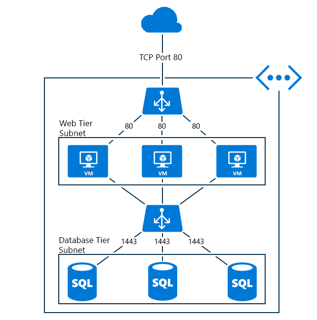
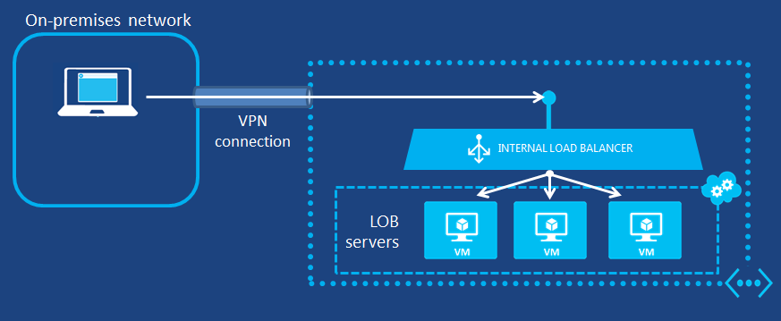
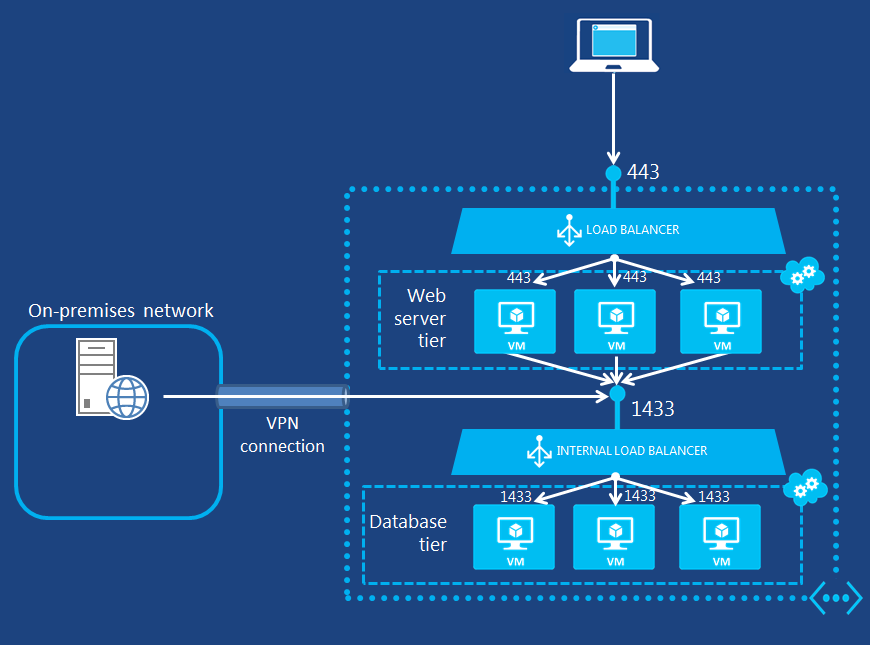

# Internal load balancer overview

Unlike the Internet facing load balancer, the internal load balancer (ILB) directs traffic only to resources inside the cloud service or using VPN to access the Azure infrastructure. The infrastructure restricts access to the load balanced virtual IP addresses (VIPs) of a Cloud Service or a Virtual Network so that they will never be directly exposed to an Internet endpoint. This enables internal line of business (LOB) applications to run in Azure and be accessed from within the cloud or from resources on-premises.

## Why you may need an internal load balancer

Azure Internal Load Balancing (ILB) provides load balancing between virtual machines that reside inside of a cloud service or a virtual network with a regional scope. For information about the use and configuration of virtual networks with a regional scope, see [Regional Virtual Networks](https://azure.microsoft.com/blog/2014/05/14/regional-virtual-networks/) in the Azure blog. Existing virtual networks that have been configured for an affinity group cannot use ILB.

ILB enables the following types of load balancing:

* Within a cloud service, from virtual machines to a set of virtual machines that reside within the same cloud service (see Figure 1).
* Within a virtual network, from virtual machines in the virtual network to a set of virtual machines that reside within the same cloud service of the virtual network (see Figure 2).
* For a cross-premises virtual network, from on-premises computers to a set of virtual machines that reside within the same cloud service of the virtual network (see Figure 3).
* Internet-facing, multi-tier applications in which the back-end tiers are not Internet-facing but require load balancing for traffic from the Internet-facing tier.
* Load balancing for LOB applications hosted in Azure without requiring additional load balancer hardware or software. Including on-premises servers in the set of computers whose traffic is load balanced.

## Internet facing multi-tier applications

The web tier has Internet facing endpoints for Internet clients and is part of a load-balanced set. The load balancer  distributes incoming traffic from web clients for TCP port 443 (HTTPS) to the web servers.

The database servers are behind an ILB endpoint which the web servers use for storage. This database service load balanced endpoint, which traffic is load balanced across the database servers in the ILB set.

The following image shows the Internet facing multi-tier application within the same cloud service.

Figure 1 - Internet facing multi-tier application

Another possible use for a multi-tier application is when the ILB deployed to a different cloud service than the one consuming the service for the ILB.

Cloud services using the same virtual network will have access to the ILB endpoint. The following image shows front-end web servers are in a different cloud service from the database back-end and using the ILB endpoint within the same virtual network.

Figure 2 - Front-end servers in a different cloud service

## Intranet line of business applications

Traffic from clients on the on-premises network get load-balanced across the set of LOB servers using VPN connection to Azure network.

The client machine will have access to an IP address from Azure VPN service using point to site VPN. It allows the use the LOB application hosted behind the ILB endpoint.

Figure 3 - LOB applications hosted behind the LB endpoint

Another scenario for the LOB is to have a site to site VPN to the virtual network where the ILB endpoint is configured. This allows on-premises network traffic to be routed to the ILB endpoint.

Figure 4 - On-premises network traffic routed to the ILB endpoint

## Limitations

Internal Load Balancer configurations do not support SNAT. In the context of this document, SNAT refers to port masquerading source  network address translation.  This applies to scenarios where a VM in a load balancer pool needs to reach the respective internal Load Balancer's frontend IP address. This scenario is not supported for internal Load Balancer. Connection failures will occur when the flow is load balanced to the VM which originated the flow. You must use a proxy style load balancer for such scenarios.

## Next Steps

[Azure Resource Manager support for Azure Load Balancer](load-balancer-arm.md)

[Get started configuring an Internet facing load balancer](load-balancer-get-started-internet-arm-ps.md)

[Get started configuring an Internal load balancer](load-balancer-get-started-ilb-arm-ps.md)

[Configure a Load balancer distribution mode](load-balancer-distribution-mode.md)

[Configure idle TCP timeout settings for your load balancer](load-balancer-tcp-idle-timeout.md)
