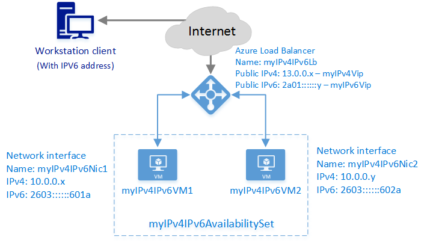

# Create a public load balancer with IPv6 using Azure CLI

>[!NOTE] 
>This article describes an introductory IPv6 feature to allow Basic Load Balancers to provide both IPv4 and IPv6 connectivity. Comprehensive IPv6 connectivity is now available with [IPv6 for Azure VNETs](../virtual-network/ipv6-overview.md) which integrates IPv6 connectivity with your Virtual Networks and includes key features such as IPv6 Network Security Group rules, IPv6 User-defined routing, IPv6 Basic and Standard load balancing, and more.  IPv6 for Azure VNETs is the recommended standard for IPv6 applications in Azure. 
See [IPv6 for Azure VNET Powershell Deployment](../virtual-network/virtual-network-ipv4-ipv6-dual-stack-standard-load-balancer-powershell.md) 

An Azure load balancer is a Layer-4 (TCP, UDP) load balancer. Load balancers provide high availability by distributing incoming traffic among healthy service instances in cloud services or virtual machines in a load balancer set. Load balancers can also present these services on multiple ports or multiple IP addresses or both.

## Example deployment scenario

The following diagram illustrates the load balancing solution that's deployed by using the example template described in this article.



In this scenario, you create the following Azure resources:

* Two virtual machines (VMs)
* A virtual network interface for each VM with both IPv4 and IPv6 addresses assigned
* A public load balancer with an IPv4 and an IPv6 public IP address
* An availability set that contains the two VMs
* Two load balancing rules to map the public VIPs to the private endpoints

## Deploy the solution by using Azure CLI

The following steps show how to create a public load balancer by using Azure CLI. Using CLI, you create and configure each object individually, and then put them together to create a resource.

To deploy a load balancer, create and configure the following objects:

* **Front-end IP configuration**: Contains public IP addresses for incoming network traffic.
* **Back-end address pool**: Contains network interfaces (NICs) for the virtual machines to receive network traffic from the load balancer.
* **Load balancing rules**: Contains rules that map a public port on the load balancer to a port in the back-end address pool.
* **Inbound NAT rules**: Contains network address translation (NAT) rules that map a public port on the load balancer to a port for a specific virtual machine in the back-end address pool.
* **Probes**: Contains health probes that are used to check the availability of virtual machine instances in the back-end address pool.

## Set up Azure CLI

In this example, you run the Azure CLI tools in a PowerShell command window. To improve readability and reuse, you use PowerShell's scripting capabilities, not the Azure PowerShell cmdlets.

1. [Install and Configure the Azure CLI](https://docs.microsoft.com/cli/azure/install-azure-cli?view=azure-cli-latest) by following the steps in the linked article and sign in to your Azure account.

2. Set up PowerShell variables for use with the Azure CLI commands:

    ```powershell
    $subscriptionid = "########-####-####-####-############"  # enter subscription id
    $location = "southcentralus"
    $rgName = "pscontosorg1southctrlus09152016"
    $vnetName = "contosoIPv4Vnet"
    $vnetPrefix = "10.0.0.0/16"
    $subnet1Name = "clicontosoIPv4Subnet1"
    $subnet1Prefix = "10.0.0.0/24"
    $subnet2Name = "clicontosoIPv4Subnet2"
    $subnet2Prefix = "10.0.1.0/24"
    $dnsLabel = "contoso09152016"
    $lbName = "myIPv4IPv6Lb"
    ```

## Create a resource group, a load balancer, a virtual network, and subnets

1. Create a resource group:

    ```azurecli
    az group create --name $rgName --location $location
    ```

2. Create a load balancer:

    ```azurecli
    $lb = az network lb create --resource-group $rgname --location $location --name $lbName
    ```

3. Create a virtual network:

    ```azurecli
    $vnet = az network vnet create  --resource-group $rgname --name $vnetName --location $location --address-prefixes $vnetPrefix
    ```

4. In this virtual network, create two subnets:

    ```azurecli
    $subnet1 = az network vnet subnet create --resource-group $rgname --name $subnet1Name --address-prefix $subnet1Prefix --vnet-name $vnetName
    $subnet2 = az network vnet subnet create --resource-group $rgname --name $subnet2Name --address-prefix $subnet2Prefix --vnet-name $vnetName
    ```

## Create public IP addresses for the front-end pool

1. Set up the PowerShell variables:

    ```powershell
    $publicIpv4Name = "myIPv4Vip"
    $publicIpv6Name = "myIPv6Vip"
    ```

2. Create a public IP address for the front-end IP pool:

    ```azurecli
    $publicipV4 = az network public-ip create --resource-group $rgname --name $publicIpv4Name --location $location --version IPv4 --allocation-method Dynamic --dns-name $dnsLabel
    $publicipV6 = az network public-ip create --resource-group $rgname --name $publicIpv6Name --location $location --version IPv6 --allocation-method Dynamic --dns-name $dnsLabel
    ```

    > [!IMPORTANT]
    > The load balancer uses the domain label of the public IP as its fully qualified domain name (FQDN). This a change from classic deployment, which uses the cloud service name as the load balancer FQDN.
    >
    > In this example, the FQDN is *contoso09152016.southcentralus.cloudapp.azure.com*.

## Create front-end and back-end pools

In this section, you create the following IP pools:
* The front-end IP pool that receives the incoming network traffic on the load balancer.
* The back-end IP pool where the front-end pool sends the load-balanced network traffic.

1. Set up the PowerShell variables:

    ```powershell
    $frontendV4Name = "FrontendVipIPv4"
    $frontendV6Name = "FrontendVipIPv6"
    $backendAddressPoolV4Name = "BackendPoolIPv4"
    $backendAddressPoolV6Name = "BackendPoolIPv6"
    ```

2. Create a front-end IP pool, and associate it with the public IP that you created in the previous step and the load balancer.

    ```azurecli
    $frontendV4 = az network lb frontend-ip create --resource-group $rgname --name $frontendV4Name --public-ip-address $publicIpv4Name --lb-name $lbName
    $frontendV6 = az network lb frontend-ip create --resource-group $rgname --name $frontendV6Name --public-ip-address $publicIpv6Name --lb-name $lbName
    $backendAddressPoolV4 = az network lb address-pool create --resource-group $rgname --name $backendAddressPoolV4Name --lb-name $lbName
    $backendAddressPoolV6 = az network lb address-pool create --resource-group $rgname --name $backendAddressPoolV6Name --lb-name $lbName
    ```

## Create the probe, NAT rules, and load balancer rules

This example creates the following items:

* A probe rule to check for connectivity to TCP port 80.
* A NAT rule to translate all incoming traffic on port 3389 to port 3389 for RDP.\*
* A NAT rule to translate all incoming traffic on port 3391 to port 3389 for remote desktop protocol (RDP).\*
* A load balancer rule to balance all incoming traffic on port 80 to port 80 on the addresses in the back-end pool.

\* NAT rules are associated with a specific virtual-machine instance behind the load balancer. The network traffic that arrives on port 3389 is sent to the specific virtual machine and port that's associated with the NAT rule. You must specify a protocol (UDP or TCP) for a NAT rule. You cannot assign both protocols to the same port.

1. Set up the PowerShell variables:

    ```powershell
    $probeV4V6Name = "ProbeForIPv4AndIPv6"
    $natRule1V4Name = "NatRule-For-Rdp-VM1"
    $natRule2V4Name = "NatRule-For-Rdp-VM2"
    $lbRule1V4Name = "LBRuleForIPv4-Port80"
    $lbRule1V6Name = "LBRuleForIPv6-Port80"
    ```

2. Create the probe.

    The following example creates a TCP probe that checks for connectivity to the back-end TCP port 80 every 15 seconds. After two consecutive failures, it marks the back-end resource as unavailable.

    ```azurecli
    $probeV4V6 = az network lb probe create --resource-group $rgname --name $probeV4V6Name --protocol tcp --port 80 --interval 15 --threshold 2 --lb-name $lbName
    ```

3. Create inbound NAT rules that allow RDP connections to the back-end resources:

    ```azurecli
    $inboundNatRuleRdp1 = az network lb inbound-nat-rule create --resource-group $rgname --name $natRule1V4Name --frontend-ip-name $frontendV4Name --protocol Tcp --frontend-port 3389 --backend-port 3389 --lb-name $lbName
    $inboundNatRuleRdp2 = az network lb inbound-nat-rule create --resource-group $rgname --name $natRule2V4Name --frontend-ip-name $frontendV4Name --protocol Tcp --frontend-port 3391 --backend-port 3389 --lb-name $lbName
    ```

4. Create load balancer rules that send traffic to different back-end ports, depending on the front end that received the request.

    ```azurecli
    $lbruleIPv4 = az network lb rule create --resource-group $rgname --name $lbRule1V4Name --frontend-ip-name $frontendV4Name --backend-pool-name $backendAddressPoolV4Name --probe-name $probeV4V6Name --protocol Tcp --frontend-port 80 --backend-port 80 --lb-name $lbName
    $lbruleIPv6 = az network lb rule create --resource-group $rgname --name $lbRule1V6Name --frontend-ip-name $frontendV6Name --backend-pool-name $backendAddressPoolV6Name --probe-name $probeV4V6Name --protocol Tcp --frontend-port 80 --backend-port 8080 --lb-name $lbName
    ```

5. Check your settings:

    ```azurecli
    az network lb show --resource-group $rgName --name $lbName
    ```

    Expected output:

        info:    Executing command network lb show
        info:    Looking up the load balancer "myIPv4IPv6Lb"
        data:    Id                              : /subscriptions/########-####-####-####-############/resourceGroups/pscontosorg1southctrlus09152016/providers/Microsoft.Network/loadBalancers/myIPv4IPv6Lb
        data:    Name                            : myIPv4IPv6Lb
        data:    Type                            : Microsoft.Network/loadBalancers
        data:    Location                        : southcentralus
        data:    Provisioning state              : Succeeded
        data:
        data:    Frontend IP configurations:
        data:    Name             Provisioning state  Private IP allocation  Private IP   Subnet  Public IP
        data:    ---------------  ------------------  ---------------------  -----------  ------  ---------
        data:    FrontendVipIPv4  Succeeded           Dynamic                                     myIPv4Vip
        data:    FrontendVipIPv6  Succeeded           Dynamic                                     myIPv6Vip
        data:
        data:    Probes:
        data:    Name                 Provisioning state  Protocol  Port  Path  Interval  Count
        data:    -------------------  ------------------  --------  ----  ----  --------  -----
        data:    ProbeForIPv4AndIPv6  Succeeded           Tcp       80          15        2
        data:
        data:    Backend Address Pools:
        data:    Name             Provisioning state
        data:    ---------------  ------------------
        data:    BackendPoolIPv4  Succeeded
        data:    BackendPoolIPv6  Succeeded
        data:
        data:    Load Balancing Rules:
        data:    Name                  Provisioning state  Load distribution  Protocol  Frontend port  Backend port  Enable floating IP  Idle timeout in minutes
        data:    --------------------  ------------------  -----------------  --------  -------------  ------------  ------------------  -----------------------
        data:    LBRuleForIPv4-Port80  Succeeded           Default            Tcp       80             80            false               4
        data:    LBRuleForIPv6-Port80  Succeeded           Default            Tcp       80             8080          false               4
        data:
        data:    Inbound NAT Rules:
        data:    Name                 Provisioning state  Protocol  Frontend port  Backend port  Enable floating IP  Idle timeout in minutes
        data:    -------------------  ------------------  --------  -------------  ------------  ------------------  -----------------------
        data:    NatRule-For-Rdp-VM1  Succeeded           Tcp       3389           3389          false               4
        data:    NatRule-For-Rdp-VM2  Succeeded           Tcp       3391           3389          false               4
        info:    network lb show

## Create NICs

Create NICs and associate them with NAT rules, load balancer rules, and probes.

1. Set up the PowerShell variables:

    ```powershell
    $nic1Name = "myIPv4IPv6Nic1"
    $nic2Name = "myIPv4IPv6Nic2"
    $subnet1Id = "/subscriptions/$subscriptionid/resourceGroups/$rgName/providers/Microsoft.Network/VirtualNetworks/$vnetName/subnets/$subnet1Name"
    $subnet2Id = "/subscriptions/$subscriptionid/resourceGroups/$rgName/providers/Microsoft.Network/VirtualNetworks/$vnetName/subnets/$subnet2Name"
    $backendAddressPoolV4Id = "/subscriptions/$subscriptionid/resourceGroups/$rgname/providers/Microsoft.Network/loadbalancers/$lbName/backendAddressPools/$backendAddressPoolV4Name"
    $backendAddressPoolV6Id = "/subscriptions/$subscriptionid/resourceGroups/$rgname/providers/Microsoft.Network/loadbalancers/$lbName/backendAddressPools/$backendAddressPoolV6Name"
    $natRule1V4Id = "/subscriptions/$subscriptionid/resourceGroups/$rgname/providers/Microsoft.Network/loadbalancers/$lbName/inboundNatRules/$natRule1V4Name"
    $natRule2V4Id = "/subscriptions/$subscriptionid/resourceGroups/$rgname/providers/Microsoft.Network/loadbalancers/$lbName/inboundNatRules/$natRule2V4Name"
    ```

2. Create a NIC for each back end, and add an IPv6 configuration:

    ```azurecli
    $nic1 = az network nic create --name $nic1Name --resource-group $rgname --location $location --private-ip-address-version "IPv4" --subnet $subnet1Id --lb-address-pools $backendAddressPoolV4Id --lb-inbound-nat-rules $natRule1V4Id
    $nic1IPv6 = az network nic ip-config create --resource-group $rgname --name "IPv6IPConfig" --private-ip-address-version "IPv6" --lb-address-pools $backendAddressPoolV6Id --nic-name $nic1Name

    $nic2 = az network nic create --name $nic2Name --resource-group $rgname --location $location --private-ip-address-version "IPv4" --subnet $subnet2Id --lb-address-pools $backendAddressPoolV4Id --lb-inbound-nat-rules $natRule2V4Id
    $nic2IPv6 = az network nic ip-config create --resource-group $rgname --name "IPv6IPConfig" --private-ip-address-version "IPv6" --lb-address-pools $backendAddressPoolV6Id --nic-name $nic2Name
    ```

## Create the back-end VM resources, and attach each NIC

To create VMs, you must have a storage account. For load balancing, the VMs need to be members of an availability set. For more information about creating VMs, see [Create an Azure VM by using PowerShell](../virtual-machines/virtual-machines-windows-ps-create.md?toc=%2fazure%2fload-balancer%2ftoc.json).

1. Set up the PowerShell variables:

    ```powershell
    $availabilitySetName = "myIPv4IPv6AvailabilitySet"
    $vm1Name = "myIPv4IPv6VM1"
    $vm2Name = "myIPv4IPv6VM2"
    $nic1Id = "/subscriptions/$subscriptionid/resourceGroups/$rgname/providers/Microsoft.Network/networkInterfaces/$nic1Name"
    $nic2Id = "/subscriptions/$subscriptionid/resourceGroups/$rgname/providers/Microsoft.Network/networkInterfaces/$nic2Name"
    $imageurn = "MicrosoftWindowsServer:WindowsServer:2012-R2-Datacenter:latest"
    $vmUserName = "vmUser"
    $mySecurePassword = "PlainTextPassword*1"
    ```

    > [!WARNING]
    > This example uses the username and password for the VMs in cleartext. Take appropriate care when you use these credentials in cleartext. For a more secure method of handling credentials in PowerShell, see the [`Get-Credential`](https://technet.microsoft.com/library/hh849815.aspx) cmdlet.

2. Create the availability set:

    ```azurecli
    $availabilitySet = az vm availability-set create --name $availabilitySetName --resource-group $rgName --location $location
    ```

3. Create the virtual machines with the associated NICs:

    ```azurecli
	az vm create --resource-group $rgname --name $vm1Name --image $imageurn --admin-username $vmUserName --admin-password $mySecurePassword --nics $nic1Id --location $location --availability-set $availabilitySetName --size "Standard_A1" 

	az vm create --resource-group $rgname --name $vm2Name --image $imageurn --admin-username $vmUserName --admin-password $mySecurePassword --nics $nic2Id --location $location --availability-set $availabilitySetName --size "Standard_A1" 
	```


