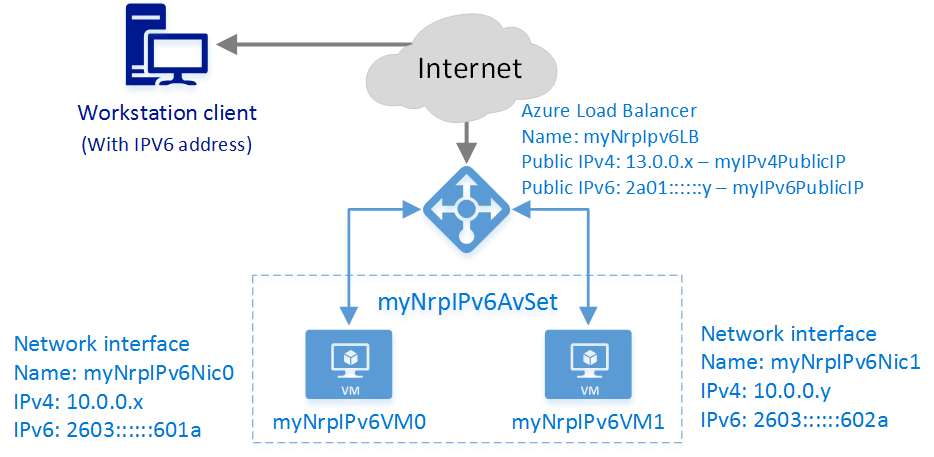

---
title: Create an Internet-facing load balancer with IPv6 - Azure PowerShell
titleSuffix: Azure Load Balancer
description: Learn how to create an Internet facing load balancer with IPv6 using PowerShell for Resource Manager
services: load-balancer
documentationcenter: na
author: asudbring
keywords: ipv6, azure load balancer, dual stack, public ip, native ipv6, mobile, iot
ms.service: load-balancer
ms.custom: seodec18
ms.devlang: na
ms.topic: article
ms.tgt_pltfrm: na
ms.workload: infrastructure-services
ms.date: 09/25/2017
ms.author: allensu
---

# Get started creating an Internet facing load balancer with IPv6 using PowerShell for Resource Manager

> [!div class="op_single_selector"]
> * [PowerShell](load-balancer-ipv6-internet-ps.md)
> * [Azure CLI](load-balancer-ipv6-internet-cli.md)
> * [Template](load-balancer-ipv6-internet-template.md)

>[!NOTE] 
>This article describes an introductory IPv6 feature to allow Basic Load Balancers to provide both IPv4 and IPv6 connectivity. Comprehensive IPv6 connectivity is now available with [IPv6 for Azure VNETs](../virtual-network/ipv6-overview.md) which integrates IPv6 connectivity with your Virtual Networks and includes key features such as IPv6 Network Security Group rules, IPv6 User-defined routing, IPv6 Basic and Standard load balancing, and more.  IPv6 for Azure VNETs is the recommended standard for IPv6 applications in Azure. 
See [IPv6 for Azure VNET Powershell Deployment](../virtual-network/virtual-network-ipv4-ipv6-dual-stack-standard-load-balancer-powershell.md) 

An Azure load balancer is a Layer-4 (TCP, UDP) load balancer. The load balancer provides high availability by distributing incoming traffic among healthy service instances in cloud services or virtual machines in a load balancer set. Azure Load Balancer can also present those services on multiple ports, multiple IP addresses, or both.

[!INCLUDE [updated-for-az](../../includes/updated-for-az.md)]

## Example deployment scenario

The following diagram illustrates the load balancing solution being deployed in this article.



In this scenario you will create the following Azure resources:

* an Internet-facing Load Balancer with an IPv4 and an IPv6 Public IP address
* two load balancing rules to map the public VIPs to the private endpoints
* an Availability Set to that contains the two VMs
* two virtual machines (VMs)
* a virtual network interface for each VM with both IPv4 and IPv6 addresses assigned

## Deploying the solution using the Azure PowerShell

The following steps show how to create an Internet facing load balancer using Azure Resource Manager with PowerShell. With Azure Resource Manager, each resource is created and configured individually, then put together to create a resource.

To deploy a load balancer, you create and configure the following objects:

* Frontend IP configuration - contains public IP addresses for incoming network traffic.
* Backend address pool - contains network interfaces (NICs) for the virtual machines to receive network traffic from the load balancer.
* Load balancing rules - contains rules mapping a public port on the load balancer to port in the back-end address pool.
* Inbound NAT rules - contains rules mapping a public port on the load balancer to a port for a specific virtual machine in the back-end address pool.
* Probes - contains health probes used to check availability of virtual machines instances in the back-end address pool.

For more information, see [Azure Load Balancer components](./components.md).

## Set up PowerShell to use Resource Manager

Make sure you have the latest production version of the Azure Resource Manager module for PowerShell.

1. Sign into Azure

    ```azurepowershell-interactive
    Connect-AzAccount
    ```

    Enter your credentials when prompted.

2. Check the subscriptions for the account

   ```azurepowershell-interactive
    Get-AzSubscription
    ```

3. Choose which of your Azure subscriptions to use.

    ```azurepowershell-interactive
    Select-AzSubscription -SubscriptionId 'GUID of subscription'
    ```

4. Create a resource group (skip this step if using an existing resource group)

    ```azurepowershell-interactive
    New-AzResourceGroup -Name NRP-RG -location "West US"
    ```

## Create a virtual network and a public IP address for the front-end IP pool

1. Create a virtual network with a subnet.

    ```azurepowershell-interactive
    $backendSubnet = New-AzVirtualNetworkSubnetConfig -Name LB-Subnet-BE -AddressPrefix 10.0.2.0/24
    $vnet = New-AzvirtualNetwork -Name VNet -ResourceGroupName NRP-RG -Location 'West US' -AddressPrefix 10.0.0.0/16 -Subnet $backendSubnet
    ```

2. Create Azure Public IP address (PIP) resources for the front-end IP address pool. Be sure to change the value for `-DomainNameLabel` before running the following commands. The value must be unique within the Azure region.

    ```azurepowershell-interactive
    $publicIPv4 = New-AzPublicIpAddress -Name 'pub-ipv4' -ResourceGroupName NRP-RG -Location 'West US' -AllocationMethod Static -IpAddressVersion IPv4 -DomainNameLabel lbnrpipv4
    $publicIPv6 = New-AzPublicIpAddress -Name 'pub-ipv6' -ResourceGroupName NRP-RG -Location 'West US' -AllocationMethod Dynamic -IpAddressVersion IPv6 -DomainNameLabel lbnrpipv6
    ```

    > [!IMPORTANT]
    > The load balancer uses the domain label of the public IP as prefix for its FQDN. In this example, the FQDNs are *lbnrpipv4.westus.cloudapp.azure.com* and *lbnrpipv6.westus.cloudapp.azure.com*.

## Create a Front-End IP configurations and a Back-End Address Pool

1. Create front-end address configuration that uses the Public IP addresses you created.

    ```azurepowershell-interactive
    $FEIPConfigv4 = New-AzLoadBalancerFrontendIpConfig -Name "LB-Frontendv4" -PublicIpAddress $publicIPv4
    $FEIPConfigv6 = New-AzLoadBalancerFrontendIpConfig -Name "LB-Frontendv6" -PublicIpAddress $publicIPv6
    ```

2. Create back-end address pools.

    ```azurepowershell-interactive
    $backendpoolipv4 = New-AzLoadBalancerBackendAddressPoolConfig -Name "BackendPoolIPv4"
    $backendpoolipv6 = New-AzLoadBalancerBackendAddressPoolConfig -Name "BackendPoolIPv6"
    ```

## Create LB rules, NAT rules, a probe, and a load balancer

This example creates the following items:

* a NAT rule to translate all incoming traffic on port 443 to port 4443
* a load balancer rule to balance all incoming traffic on port 80 to port 80 on the addresses in the back-end pool.
* a load balancer rule to allow RDP connection to the VMs on port 3389.
* a probe rule to check the health status on a page named *HealthProbe.aspx* or a service on port 8080
* a load balancer that uses all these objects

1. Create the NAT rules.

    ```azurepowershell-interactive
    $inboundNATRule1v4 = New-AzLoadBalancerInboundNatRuleConfig -Name "NicNatRulev4" -FrontendIpConfiguration $FEIPConfigv4 -Protocol TCP -FrontendPort 443 -BackendPort 4443
    $inboundNATRule1v6 = New-AzLoadBalancerInboundNatRuleConfig -Name "NicNatRulev6" -FrontendIpConfiguration $FEIPConfigv6 -Protocol TCP -FrontendPort 443 -BackendPort 4443
    ```

2. Create a health probe. There are two ways to configure a probe:

    HTTP probe

    ```azurepowershell-interactive
    $healthProbe = New-AzLoadBalancerProbeConfig -Name 'HealthProbe-v4v6' -RequestPath 'HealthProbe.aspx' -Protocol http -Port 80 -IntervalInSeconds 15 -ProbeCount 2
    ```

    or TCP probe

    ```azurepowershell-interactive
    $healthProbe = New-AzLoadBalancerProbeConfig -Name 'HealthProbe-v4v6' -Protocol Tcp -Port 8080 -IntervalInSeconds 15 -ProbeCount 2
    $RDPprobe = New-AzLoadBalancerProbeConfig -Name 'RDPprobe' -Protocol Tcp -Port 3389 -IntervalInSeconds 15 -ProbeCount 2
    ```

    For this example, we are going to use the TCP probes.

3. Create a load balancer rule.

    ```azurepowershell-interactive
    $lbrule1v4 = New-AzLoadBalancerRuleConfig -Name "HTTPv4" -FrontendIpConfiguration $FEIPConfigv4 -BackendAddressPool $backendpoolipv4 -Probe $healthProbe -Protocol Tcp -FrontendPort 80 -BackendPort 8080
    $lbrule1v6 = New-AzLoadBalancerRuleConfig -Name "HTTPv6" -FrontendIpConfiguration $FEIPConfigv6 -BackendAddressPool $backendpoolipv6 -Probe $healthProbe -Protocol Tcp -FrontendPort 80 -BackendPort 8080
    $RDPrule = New-AzLoadBalancerRuleConfig -Name "RDPrule" -FrontendIpConfiguration $FEIPConfigv4 -BackendAddressPool $backendpoolipv4 -Probe $RDPprobe -Protocol Tcp -FrontendPort 3389 -BackendPort 3389
    ```

4. Create the load balancer using the previously created objects.

    ```azurepowershell-interactive
    $NRPLB = New-AzLoadBalancer -ResourceGroupName NRP-RG -Name 'myNrpIPv6LB' -Location 'West US' -FrontendIpConfiguration $FEIPConfigv4,$FEIPConfigv6 -InboundNatRule $inboundNATRule1v6,$inboundNATRule1v4 -BackendAddressPool $backendpoolipv4,$backendpoolipv6 -Probe $healthProbe,$RDPprobe -LoadBalancingRule $lbrule1v4,$lbrule1v6,$RDPrule
    ```

## Create NICs for the back-end VMs

1. Get the Virtual Network and Virtual Network Subnet, where the NICs need to be created.

    ```azurepowershell-interactive
    $vnet = Get-AzVirtualNetwork -Name VNet -ResourceGroupName NRP-RG
    $backendSubnet = Get-AzVirtualNetworkSubnetConfig -Name LB-Subnet-BE -VirtualNetwork $vnet
    ```

2. Create IP configurations and NICs for the VMs.

    ```azurepowershell-interactive
    $nic1IPv4 = New-AzNetworkInterfaceIpConfig -Name "IPv4IPConfig" -PrivateIpAddressVersion "IPv4" -Subnet $backendSubnet -LoadBalancerBackendAddressPool $backendpoolipv4 -LoadBalancerInboundNatRule $inboundNATRule1v4
    $nic1IPv6 = New-AzNetworkInterfaceIpConfig -Name "IPv6IPConfig" -PrivateIpAddressVersion "IPv6" -LoadBalancerBackendAddressPool $backendpoolipv6 -LoadBalancerInboundNatRule $inboundNATRule1v6
    $nic1 = New-AzNetworkInterface -Name 'myNrpIPv6Nic0' -IpConfiguration $nic1IPv4,$nic1IPv6 -ResourceGroupName NRP-RG -Location 'West US'

    $nic2IPv4 = New-AzNetworkInterfaceIpConfig -Name "IPv4IPConfig" -PrivateIpAddressVersion "IPv4" -Subnet $backendSubnet -LoadBalancerBackendAddressPool $backendpoolipv4
    $nic2IPv6 = New-AzNetworkInterfaceIpConfig -Name "IPv6IPConfig" -PrivateIpAddressVersion "IPv6" -LoadBalancerBackendAddressPool $backendpoolipv6
    $nic2 = New-AzNetworkInterface -Name 'myNrpIPv6Nic1' -IpConfiguration $nic2IPv4,$nic2IPv6 -ResourceGroupName NRP-RG -Location 'West US'
    ```

## Create virtual machines and assign the newly created NICs

For more information about creating a VM, see [Create and preconfigure a Windows Virtual Machine with Resource Manager and Azure PowerShell](../virtual-machines/virtual-machines-windows-ps-create.md?toc=%2fazure%2fload-balancer%2ftoc.json)

1. Create an Availability Set and Storage account

    ```azurepowershell-interactive
    New-AzAvailabilitySet -Name 'myNrpIPv6AvSet' -ResourceGroupName NRP-RG -location 'West US'
    $availabilitySet = Get-AzAvailabilitySet -Name 'myNrpIPv6AvSet' -ResourceGroupName NRP-RG
    New-AzStorageAccount -ResourceGroupName NRP-RG -Name 'mynrpipv6stacct' -Location 'West US' -SkuName "Standard_LRS"
    $CreatedStorageAccount = Get-AzStorageAccount -ResourceGroupName NRP-RG -Name 'mynrpipv6stacct'
    ```

2. Create each VM and assign the previous created NICs

    ```azurepowershell-interactive
    $mySecureCredentials= Get-Credential -Message "Type the username and password of the local administrator account."

    $vm1 = New-AzVMConfig -VMName 'myNrpIPv6VM0' -VMSize 'Standard_G1' -AvailabilitySetId $availabilitySet.Id
    $vm1 = Set-AzVMOperatingSystem -VM $vm1 -Windows -ComputerName 'myNrpIPv6VM0' -Credential $mySecureCredentials -ProvisionVMAgent -EnableAutoUpdate
    $vm1 = Set-AzVMSourceImage -VM $vm1 -PublisherName MicrosoftWindowsServer -Offer WindowsServer -Skus 2012-R2-Datacenter -Version "latest"
    $vm1 = Add-AzVMNetworkInterface -VM $vm1 -Id $nic1.Id -Primary
    $osDisk1Uri = $CreatedStorageAccount.PrimaryEndpoints.Blob.ToString() + "vhds/myNrpIPv6VM0osdisk.vhd"
    $vm1 = Set-AzVMOSDisk -VM $vm1 -Name 'myNrpIPv6VM0osdisk' -VhdUri $osDisk1Uri -CreateOption FromImage
    New-AzVM -ResourceGroupName NRP-RG -Location 'West US' -VM $vm1

    $vm2 = New-AzVMConfig -VMName 'myNrpIPv6VM1' -VMSize 'Standard_G1' -AvailabilitySetId $availabilitySet.Id
    $vm2 = Set-AzVMOperatingSystem -VM $vm2 -Windows -ComputerName 'myNrpIPv6VM1' -Credential $mySecureCredentials -ProvisionVMAgent -EnableAutoUpdate
    $vm2 = Set-AzVMSourceImage -VM $vm2 -PublisherName MicrosoftWindowsServer -Offer WindowsServer -Skus 2012-R2-Datacenter -Version "latest"
    $vm2 = Add-AzVMNetworkInterface -VM $vm2 -Id $nic2.Id -Primary
    $osDisk2Uri = $CreatedStorageAccount.PrimaryEndpoints.Blob.ToString() + "vhds/myNrpIPv6VM1osdisk.vhd"
    $vm2 = Set-AzVMOSDisk -VM $vm2 -Name 'myNrpIPv6VM1osdisk' -VhdUri $osDisk2Uri -CreateOption FromImage
    New-AzVM -ResourceGroupName NRP-RG -Location 'West US' -VM $vm2
    ```


