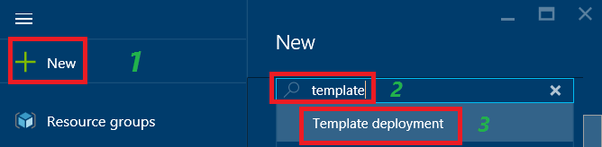
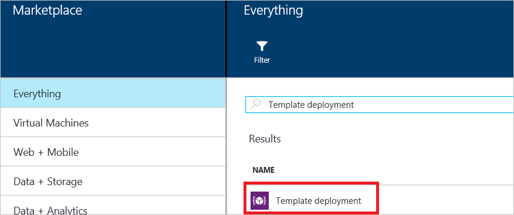
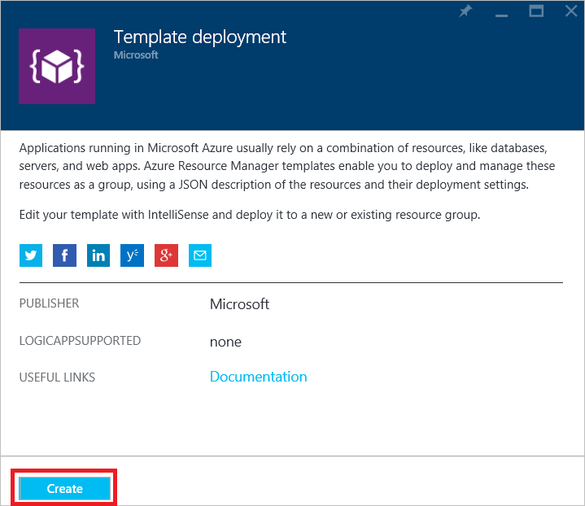
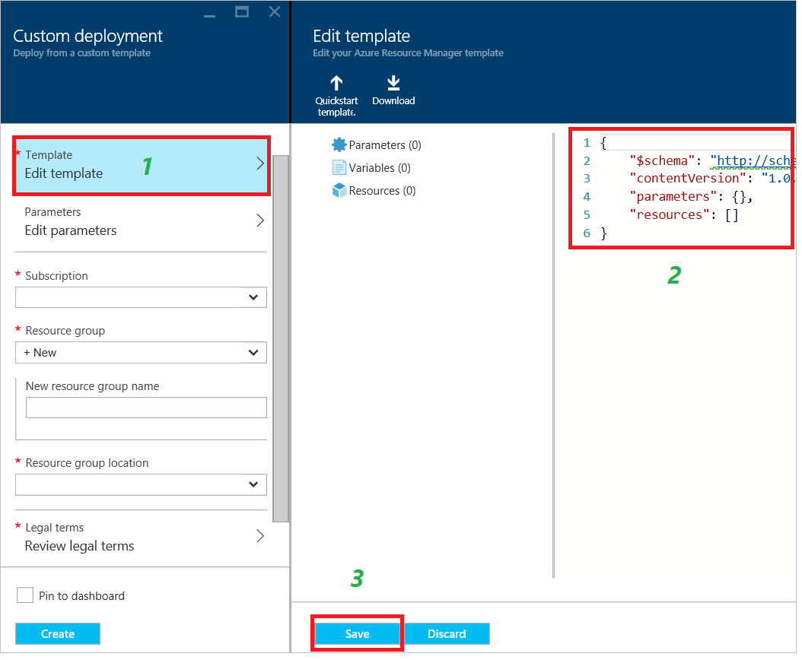
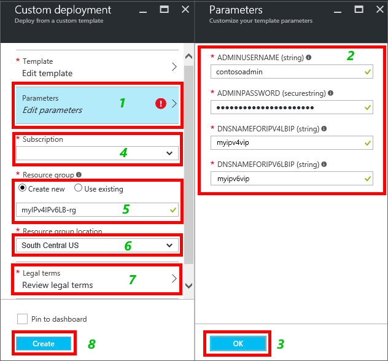
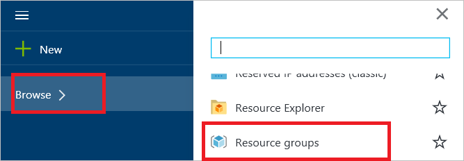
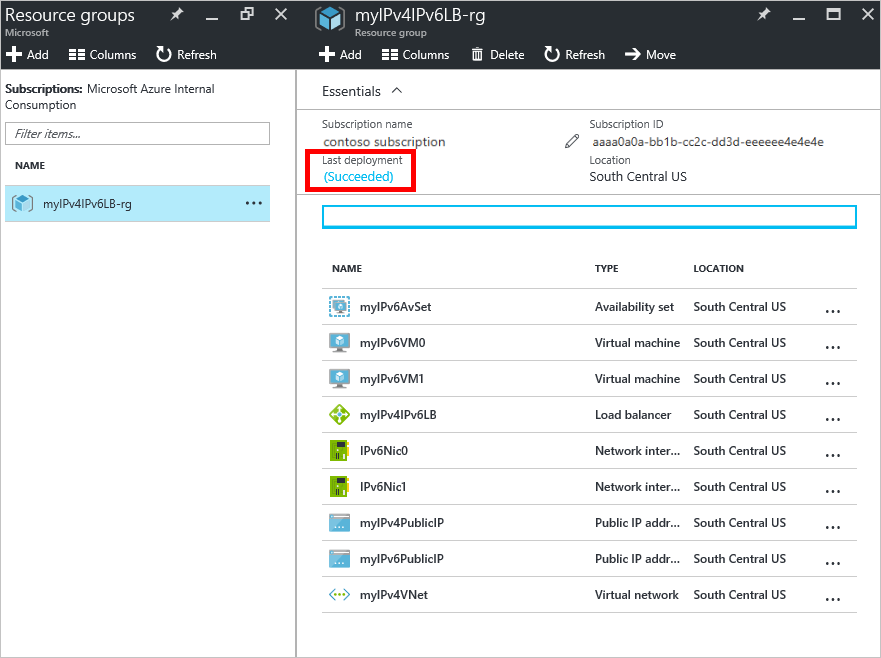
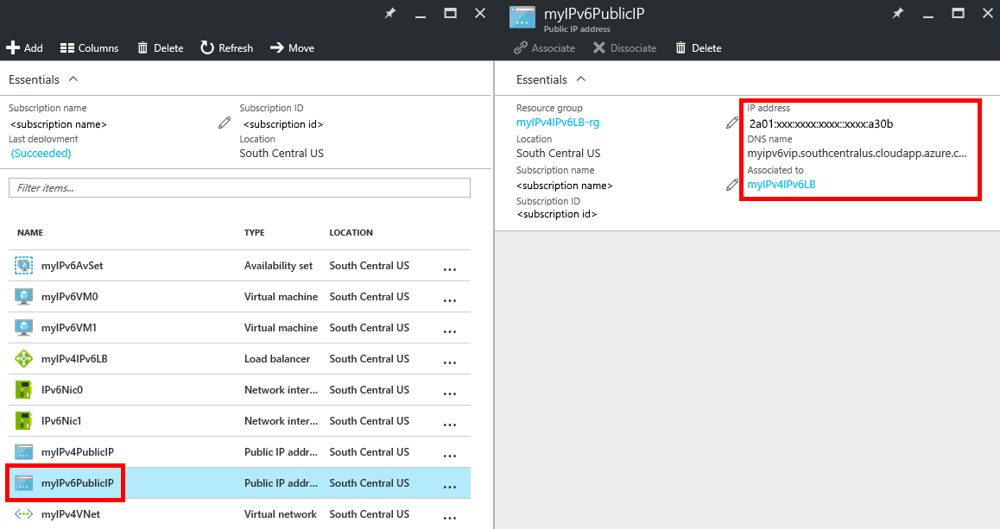

# Deploy an Internet-facing load-balancer solution with IPv6 using a template

> [!div class="op_single_selector"]
> * [PowerShell](load-balancer-ipv6-internet-ps.md)
> * [Azure CLI](load-balancer-ipv6-internet-cli.md)
> * [Template](load-balancer-ipv6-internet-template.md)

>[!NOTE] 
>This article describes an introductory IPv6 feature to allow Basic Load Balancers to provide both IPv4 and IPv6 connectivity. Comprehensive IPv6 connectivity is now available with [IPv6 for Azure VNETs](../virtual-network/ipv6-overview.md) which integrates IPv6 connectivity with your Virtual Networks and includes key features such as IPv6 Network Security Group rules, IPv6 User-defined routing, IPv6 Basic and Standard load balancing, and more.  IPv6 for Azure VNETs is the recommended standard for IPv6 applications in Azure. 
See [IPv6 for Azure VNET Powershell Deployment](../virtual-network/virtual-network-ipv4-ipv6-dual-stack-standard-load-balancer-powershell.md)  

An Azure load balancer is a Layer-4 (TCP, UDP) load balancer. The load balancer provides high availability by distributing incoming traffic among healthy service instances in cloud services or virtual machines in a load balancer set. Azure Load Balancer can also present those services on multiple ports, multiple IP addresses, or both.

## Example deployment scenario

The following diagram illustrates the load balancing solution being deployed using the example template described in this article.

In this scenario you will create the following Azure resources:

* a virtual network interface for each VM with both IPv4 and IPv6 addresses assigned
* an Internet-facing Load Balancer with an IPv4 and an IPv6 Public IP address
* two load balancing rules to map the public VIPs to the private endpoints
* an Availability Set that contains the two VMs
* two virtual machines (VMs)

## Deploying the template using the Azure portal

This article references a template that is published in the [Azure Quickstart Templates](https://azure.microsoft.com/documentation/templates/201-load-balancer-ipv6-create/) gallery. You can download the template from the gallery or launch the deployment in Azure directly from the gallery. This article assumes you have downloaded the template to your local computer.

1. Open the Azure portal and sign in with an account that has permissions to create VMs and networking resources within an Azure subscription. Also, unless you're using existing resources, the account needs permission to create a resource group and a storage account.
2. Click "+New" from the menu then type "template" in the search box. Select "Template deployment" from the search results.

    

3. In the Everything blade, click "Template deployment."

    

4. Click "Create."

    

5. Click "Edit template." Delete the existing contents and copy/paste in the entire contents of the template file (to include the start and end { }), then click "Save."

    > [!NOTE]
    > If you are using Microsoft Internet Explorer, when you paste you receive a dialog box asking you to allow access to the Windows clipboard. Click "Allow access."

    

6. Click "Edit parameters." In the Parameters blade, specify the values per the guidance in the Template parameters section, then click "Save" to close the Parameters blade. In the Custom Deployment blade, select your subscription, an existing resource group or create one. If you are creating a resource group, then select a location for the resource group. Next, click **Legal terms**, then click **Purchase** for the legal terms. Azure begins deploying the resources. It takes several minutes to deploy all the resources.

    

    For more information about these parameters, see the [Template parameters and variables](#template-parameters-and-variables) section later in this article.

7. To see the resources created by the template, click Browse, scroll down the list until you see "Resource groups," then click it.

    

8. On the Resource groups blade, click the name of the resource group you specified in step 6. You see a list of all the resources that were deployed. If all went well, it should say "Succeeded" under "Last deployment." If not, ensure that the account you're using has permissions to create the necessary resources.

    

    > [!NOTE]
    > If you browse your Resource Groups immediately after completing step 6, "Last deployment" will display the status of "Deploying" while the resources are being deployed.

9. Click "myIPv6PublicIP" in the list of resources. You see that it has an IPv6 address under IP address, and that its DNS name is the value you specified for the dnsNameforIPv6LbIP parameter in step 6. This resource is the public IPv6 address and host name that is accessible to Internet-clients.

    

## Validate connectivity

When the template has deployed successfully, you can validate connectivity by completing the following tasks:

1. Sign in to the Azure portal and connect to each of the VMs created by the template deployment. If you deployed a Windows Server VM, run ipconfig /all from a command prompt. You see that the VMs have both IPv4 and IPv6 addresses. If you deployed Linux VMs, you need to configure the Linux OS to receive dynamic IPv6 addresses using the instructions provided for your Linux distribution.
2. From an IPv6 Internet-connected client, initiate a connection to the public IPv6 address of the load balancer. To confirm that the load balancer is balancing between the two VMs, you could install a web server like Microsoft Internet Information Services (IIS) on each of the VMs. The default web page on each server could contain the text "Server0" or "Server1" to uniquely identify it. Then, open an Internet browser on an IPv6 Internet-connected client and browse to the hostname you specified for the dnsNameforIPv6LbIP parameter of the load balancer to confirm end-to-end IPv6 connectivity to each VM. If you only see the web page from only one server, you may need to clear your browser cache. Open multiple private browsing sessions. You should see a response from each server.
3. From an IPv4 Internet-connected client, initiate a connection to the public IPv4 address of the load balancer. To confirm that the load balancer is load balancing the two VMs, you could test using IIS, as detailed in Step 2.
4. From each VM, initiate an outbound connection to an IPv6 or IPv4-connected Internet device. In both cases, the source IP seen by the destination device is the public IPv4 or IPv6 address of the load balancer.

> [!NOTE]
> ICMP for both IPv4 and IPv6 is blocked in the Azure network. As a result, ICMP tools like ping always fail. To test connectivity, use a TCP alternative such as TCPing or the PowerShell Test-NetConnection cmdlet. Note that the IP addresses shown in the diagram are examples of values that you might see. Since the IPv6 addresses are assigned dynamically, the addresses you receive will differ and can vary by region. Also, it is common for the public IPv6 address on the load balancer to start with a different prefix than the private IPv6 addresses in the back-end pool.

## Template parameters and variables

An Azure Resource Manager template contains multiple variables and parameters that you can customize to your needs. Variables are used for fixed values that you do not want a user to change. Parameters are used for values that you want a user to provide when deploying the template. The example template is configured for the scenario described in this article. You can customize this to needs of your environment.

The example template used in this article includes the following variables and parameters:

| Parameter / Variable | Notes |
| --- | --- |
| adminUsername |Specify the name of the admin account used to sign in to the virtual machines with. |
| adminPassword |Specify the password for the admin account used to sign in to the virtual machines with. |
| dnsNameforIPv4LbIP |Specify the DNS host name you want to assign as the public name of the load balancer. This name resolves to the load balancer's public IPv4 address. The name must be lowercase and match the regex: ^[a-z][a-z0-9-]{1,61}[a-z0-9]$. |
| dnsNameforIPv6LbIP |Specify the DNS host name you want to assign as the public name of the load balancer. This name resolves to the load balancer's public IPv6 address. The name must be lowercase and match the regex: ^[a-z][a-z0-9-]{1,61}[a-z0-9]$. This can be the same name as the IPv4 address. When a client sends a DNS query for this name Azure will return both the A and AAAA records when the name is shared. |
| vmNamePrefix |Specify the VM name prefix. The template appends a number (0, 1, etc.) to the name when the VMs are created. |
| nicNamePrefix |Specify the network interface name prefix. The template appends a number (0, 1, etc.) to the name when the network interfaces are created. |
| storageAccountName |Enter the name of an existing storage account or specify the name of a new one to be created by the template. |
| availabilitySetName |Enter then name of the availability set to be used with the VMs |
| addressPrefix |The address prefix used to define the address range of the Virtual Network |
| subnetName |The name of the subnet in created for the VNet |
| subnetPrefix |The address prefix used to define the address range of the subnet |
| vnetName |Specify the name for the VNet used by the VMs. |
| ipv4PrivateIPAddressType |The allocation method used for the private IP address (Static or Dynamic) |
| ipv6PrivateIPAddressType |The allocation method used for the private IP address (Dynamic). IPv6 only supports Dynamic allocation. |
| numberOfInstances |The number of load balanced instances deployed by the template |
| ipv4PublicIPAddressName |Specify the DNS name you want to use to communicate with the public IPv4 address of the load balancer. |
| ipv4PublicIPAddressType |The allocation method used for the public IP address (Static or Dynamic) |
| Ipv6PublicIPAddressName |Specify the DNS name you want to use to communicate with the public IPv6 address of the load balancer. |
| ipv6PublicIPAddressType |The allocation method used for the public IP address (Dynamic). IPv6 only supports Dynamic allocation. |
| lbName |Specify the name of the load balancer. This name is displayed in the portal or used when referring to it with a CLI or PowerShell command. |

The remaining variables in the template contain derived values that are assigned when Azure creates the resources. Do not change those variables.

## Next steps

For the JSON syntax and properties of a load balancer in a template, see [Microsoft.Network/loadBalancers](/azure/templates/microsoft.network/loadbalancers).
