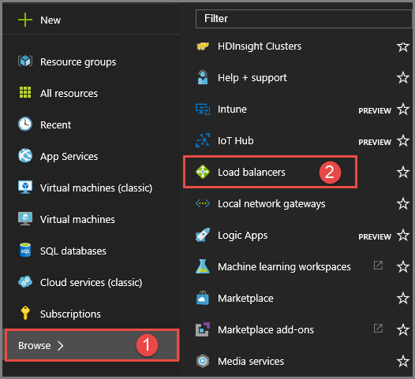
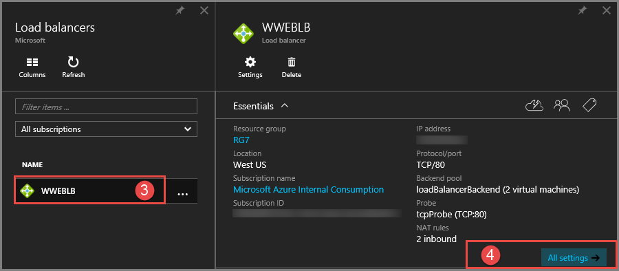
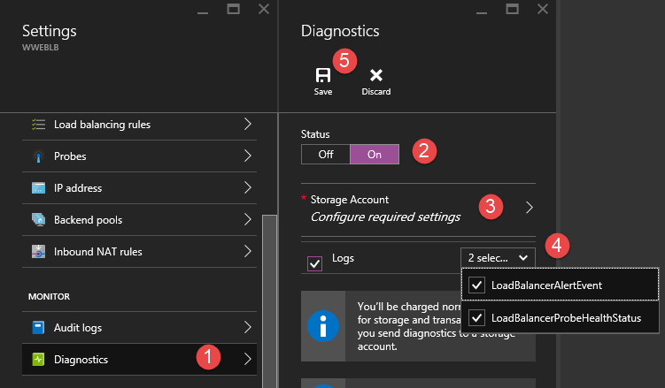

# Log analytics for public Basic Load Balancer

>[!IMPORTANT] 
>Azure Load Balancer supports two different types: Basic and Standard. This article discusses Basic Load Balancer. For more information about Standard Load Balancer, see [Standard Load Balancer overview](load-balancer-standard-overview.md) which exposes telemetry via multi-dimensional metrics in Azure Monitor.

You can use different types of logs in Azure to manage and troubleshoot Basic Load Balancers. Some of these logs can be accessed through the portal. All logs can be extracted from Azure blob storage, and viewed in different tools, such as Excel and PowerBI. You can learn more about the different types of logs from the list below.

* **Audit logs:** You can use [Azure Audit Logs](../monitoring-and-diagnostics/insights-debugging-with-events.md) (formerly known as Operational Logs) to view all operations being submitted to your Azure subscription(s), and their status. Audit logs are enabled by default, and can be viewed in the Azure portal.
* **Alert event logs:** You can use this log to view alerts raised by the load balancer. The status for the load balancer is collected every five minutes. This log is only written if a load balancer alert event is raised.
* **Health probe logs:** You can use this log to view problems detected by your health probe, such as the number of instances in your backend-pool that are not receiving requests from the load balancer because of health probe failures. This log is written to when there is a change in the health probe status.

> [!IMPORTANT]
> Log analytics currently works only for public Basic load balancers. Logs are only available for resources deployed in the Resource Manager deployment model. You cannot use logs for resources in the classic deployment model. For more information about the deployment models, see [Understanding Resource Manager deployment and classic deployment](../azure-resource-manager/resource-manager-deployment-model.md).

## Enable logging

Audit logging is automatically enabled for every Resource Manager resource. You need to enable event and health probe logging to start collecting the data available through those logs. Use the following steps to enable logging.

Sign-in to the [Azure portal](http://portal.azure.com). If you don't already have a load balancer, [create a load balancer](load-balancer-get-started-internet-arm-ps.md) before you continue.

1. In the portal, click **Browse**.
2. Select **Load Balancers**.

    

3. Select an existing load balancer >> **All Settings**.
4. On the right side of the dialog under the name of the load balancer, scroll to **Monitoring**, click **Diagnostics**.

    

5. In the **Diagnostics** pane, under **Status**, select **On**.
6. Click **Storage Account**.
7. Under **LOGS**, select an existing storage account, or create a new one. Use the slider to determine how many days worth of event data will be stored in the event logs. 
8. Click **Save**.

Diagnostics will be saved in Table Storage in the specified storage account. If logs are not being saved, it is because no relevant logs are being produced.



> [!NOTE]
> Audit logs do not require a separate storage account. The use of storage for event and health probe logging will incur service charges.

## Audit log

The audit log is generated by default. The logs are preserved for 90 days in Azure's Event Logs store. Learn more about these logs by reading the [View events and audit logs](../monitoring-and-diagnostics/insights-debugging-with-events.md) article.

## Alert event log

This log is only generated if you've enabled it on a per load balancer basis. The events are logged in JSON format and stored in the storage account you specified when you enabled the logging. The following is an example of an event.

```json
{
    "time": "2016-01-26T10:37:46.6024215Z",
    "systemId": "32077926-b9c4-42fb-94c1-762e528b5b27",
    "category": "LoadBalancerAlertEvent",
    "resourceId": "/SUBSCRIPTIONS/XXXXXXXXXXXXXXXXX-XXXX-XXXX-XXXXXXXXX/RESOURCEGROUPS/RG7/PROVIDERS/MICROSOFT.NETWORK/LOADBALANCERS/WWEBLB",
    "operationName": "LoadBalancerProbeHealthStatus",
    "properties": {
        "eventName": "Resource Limits Hit",
        "eventDescription": "Ports exhausted",
        "eventProperties": {
            "public ip address": "40.117.227.32"
        }
    }
}
```

The JSON output shows the *eventname* property which will describe the reason for the load balancer created an alert. In this case, the alert generated was due to TCP port exhaustion caused by source IP NAT limits (SNAT).

## Health probe log

This log is only generated if you've enabled it on a per load balancer basis as detailed above. The data is stored in the storage account you specified when you enabled the logging. A container named 'insights-logs-loadbalancerprobehealthstatus' is created and the following data is logged:

```json
{
    "records":[
    {
        "time": "2016-01-26T10:37:46.6024215Z",
        "systemId": "32077926-b9c4-42fb-94c1-762e528b5b27",
        "category": "LoadBalancerProbeHealthStatus",
        "resourceId": "/SUBSCRIPTIONS/XXXXXXXXXXXXXXXXX-XXXX-XXXX-XXXX-XXXXXXXXX/RESOURCEGROUPS/RG7/PROVIDERS/MICROSOFT.NETWORK/LOADBALANCERS/WWEBLB",
        "operationName": "LoadBalancerProbeHealthStatus",
        "properties": {
            "publicIpAddress": "40.83.190.158",
            "port": "81",
            "totalDipCount": 2,
            "dipDownCount": 1,
            "healthPercentage": 50.000000
        }
    },
    {
        "time": "2016-01-26T10:37:46.6024215Z",
        "systemId": "32077926-b9c4-42fb-94c1-762e528b5b27",
        "category": "LoadBalancerProbeHealthStatus",
        "resourceId": "/SUBSCRIPTIONS/XXXXXXXXXXXXXXXXX-XXXX-XXXX-XXXX-XXXXXXXXX/RESOURCEGROUPS/RG7/PROVIDERS/MICROSOFT.NETWORK/LOADBALANCERS/WWEBLB",
        "operationName": "LoadBalancerProbeHealthStatus",
        "properties": {
            "publicIpAddress": "40.83.190.158",
            "port": "81",
            "totalDipCount": 2,
            "dipDownCount": 0,
            "healthPercentage": 100.000000
        }
    }]
}
```

The JSON output shows in the properties field the basic information for the probe health status. The *dipDownCount* property shows the total number of instances on the back-end which are not receiving network traffic due to failed probe responses.

## View and analyze the audit log

You can view and analyze audit log data using any of the following methods:

* **Azure tools:** Retrieve information from the audit logs through Azure PowerShell, the Azure Command Line Interface (CLI), the Azure REST API, or the Azure preview portal. Step-by-step instructions for each method are detailed in the [Audit operations with Resource Manager](../azure-resource-manager/resource-group-audit.md) article.
* **Power BI:** If you do not already have a [Power BI](https://powerbi.microsoft.com/pricing) account, you can try it for free. Using the [Azure Audit Logs content pack for Power BI](https://powerbi.microsoft.com/documentation/powerbi-content-pack-azure-audit-logs), you can analyze your data with pre-configured dashboards, or you can customize views to suit your requirements.

## View and analyze the health probe and event log

You need to connect to your storage account and retrieve the JSON log entries for event and health probe logs. Once you download the JSON files, you can convert them to CSV and view in Excel, PowerBI, or any other data visualization tool.

> [!TIP]
> If you are familiar with Visual Studio and basic concepts of changing values for constants and variables in C#, you can use the [log converter tools](https://github.com/Azure-Samples/networking-dotnet-log-converter) available from GitHub.

## Additional resources

* [Visualize your Azure Audit Logs with Power BI](http://blogs.msdn.com/b/powerbi/archive/2015/09/30/monitor-azure-audit-logs-with-power-bi.aspx) blog post.
* [View and analyze Azure Audit Logs in Power BI and more](https://azure.microsoft.com/blog/analyze-azure-audit-logs-in-powerbi-more/) blog post.

## Next steps

[Understand load balancer probes](load-balancer-custom-probe-overview.md)
