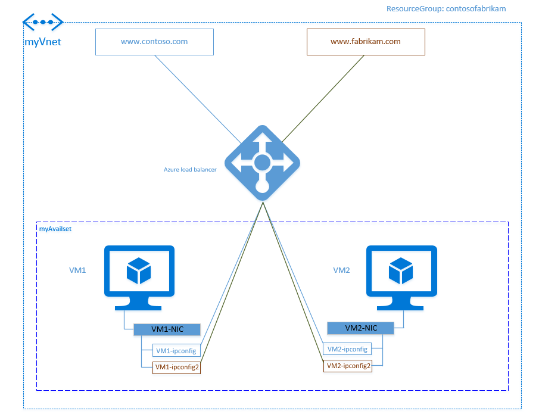

# Load balancing on multiple IP configurations by using the Azure portal

> [!div class="op_single_selector"]
> * [Portal](load-balancer-multiple-ip.md)
> * [PowerShell](load-balancer-multiple-ip-powershell.md)
> * [CLI](load-balancer-multiple-ip-cli.md)

In this article, we're going to show you how to use Azure Load Balancer with multiple IP addresses on a secondary network interface controller (NIC). The following diagram illustrates our scenario:

In our scenario, we're using the following configuration:

- Two virtual machines (VMs) that are running Windows.
- Each VM has a primary and a secondary NIC.
- Each secondary NIC has two IP configurations.
- Each VM hosts two websites: contoso.com and fabrikam.com.
- Each website is bound to an IP configuration on the secondary NIC.
- Azure Load Balancer is used to expose two front-end IP addresses, one for each website. The front-end addresses are used to distribute traffic to the respective IP configuration for each website.
- The same port number is used for both front-end IP addresses and back-end pool IP addresses.

## Prerequisites

Our scenario example assumes that you have a resource group named **contosofabrikam** that is configured as follows:

- The resource group includes a virtual network named **myVNet**.
- The **myVNet** network includes two VMs named **VM1** and **VM2**.
- VM1 and VM2 are in the same availability set named **myAvailset**. 
- VM1 and VM2 each have a primary NIC named **VM1NIC1** and **VM2NIC1**, respectively. 
- VM1 and VM2 each have a secondary NIC named **VM1NIC2** and **VM2NIC2**, respectively.

For more information about creating VMs with multiple NICs, see [Create a VM with multiple NICs by using PowerShell](../virtual-machines/windows/multiple-nics.md).

## Perform load balancing on multiple IP configurations

Complete the following steps to achieve the scenario outlined in this article.

### Step 1: Configure the secondary NICs

For each VM in your virtual network, add the IP configuration for the secondary NIC:  

1. Browse to the Azure portal: https://portal.azure.com. Sign in with your Azure account.

2. In the upper left of the screen, select the **Resource Group** icon. Then select the resource group where your VMs are located (for example, **contosofabrikam**). The **Resource groups** pane displays all of the resources and NICs for the VMs.

3. For the secondary NIC of each VM, add the IP configuration:

    1. Select the secondary NIC that you want to configure.
    
    2. Select **IP configurations**. In the next pane, near the top, select **Add**.

    3. Under **Add IP configurations**, add a second IP configuration to the NIC: 

        1. Enter a name for the secondary IP configuration. (For example, for VM1 and VM2, name the IP configuration **VM1NIC2-ipconfig2** and **VM2NIC2-ipconfig2**, respectively.)

        2. For the **Private IP address**, **Allocation** setting, select **Static**.

        3. Select **OK**.

After the second IP configuration for the secondary NIC is complete, it's displayed under the **IP configurations** settings for the given NIC.

### Step 2: Create the load balancer

Create your load balancer for the configuration:

1. Browse to the Azure portal: https://portal.azure.com. Sign in with your Azure account.

2. In the upper left of the screen, select **Create a resource** > **Networking** > **Load Balancer**. Next, select **Create**.

3. Under **Create load balancer**, type a name for your load balancer. In this scenario, we're using the name **mylb**.

4. Under **Public IP address**, create a new public IP called **PublicIP1**.

5. Under **Resource Group**, select the existing resource group for your VMs (for example, **contosofabrikam**). Select the location to deploy your load balancer to, and then select **OK**.

The load balancer starts to deploy. Deployment can take a few minutes to successfully complete. After deployment is complete, the load balancer is displayed as a resource in your resource group.

### Step 3: Configure the front-end IP pool

For each website (contoso.com and fabrikam.com), configure the front-end IP pool on your load balancer:

1. In the portal, select **More services**. In the filter box, type **Public IP address** and then select **Public IP addresses**. In the next pane, near the top, select **Add**.

2. Configure two public IP addresses (**PublicIP1** and **PublicIP2**) for both websites (contoso.com and fabrikam.com):

   1. Type a name for your front-end IP address.

   2. For **Resource Group**, select the existing resource group for your VMs (for example, **contosofabrikam**).

   3. For **Location**, select the same location as the VMs.

   4. Select **OK**.

      After the public IP addresses are created, they are displayed under the **Public IP** addresses.

3. In the portal, select **More services**. In the filter box, type **load balancer** and then select **Load Balancer**. 

4. Select the load balancer (**mylb**) that you want to add the front-end IP pool to.

5. Under **Settings**, select **Frontend IP configuration**. In the next pane, near the top, select **Add**.

6. Type a name for your front-end IP address (for example, **contosofe** or **fabrikamfe**).

7. Select **IP address**. Under **Choose Public IP address**, select the IP addresses for your front-end (**PublicIP1** or **PublicIP2**).

8. Create the second front-end IP address by repeating <a href="#step3-3">step 3</a> through <a href="#step3-7">step 7</a> in this section.

After the front-end pool is configured, the IP addresses are displayed under your load balancer **Frontend IP configuration** settings. 
    
### Step 4: Configure the back-end pool

For each website (contoso.com and fabrikam.com), configure the back-end address pool on your load balancer:
        
1. In the portal, select **More services**. In the filter box, type **load balancer** and then select **Load Balancer**.

2. Select the load balancer (**mylb**) that you want to add the back-end pool to.

3. Under **Settings**, select **Backend Pools**. Type a name for your back-end pool (for example, **contosopool** or **fabrikampool**). In the next pane, near the top, select **Add**. 

4. For **Associated to**, select **Availability set**.

5. For **Availability set**, select **myAvailset**.

6. Add the target network IP configurations for both VMs: 

    
    
    1. For **Target virtual machine**, select the VM that you want to add to the back-end pool (for example, **VM1** or **VM2**).

    2. For **Network IP configuration**, select the IP configuration of the secondary NIC for the VM that you selected in the previous step (for example, **VM1NIC2-ipconfig2** or **VM2NIC2-ipconfig2**).

7. Select **OK**.

After the back-end pool is configured, the addresses are displayed under your load balancer **Backend pool** settings.

### Step 5: Configure the health probe

Configure a health probe for your load balancer:

1. In the portal, select **More services**. In the filter box, type **load balancer** and then select **Load Balancer**.

2. Select the load balancer (**mylb**) that you want to add the health probe to.

3. Under **Settings**, select **Health probe**. In the next pane, near the top, select **Add**. 

4. Type a name for the health probe (for example, **HTTP**). Select **OK**.

### Step 6: Configure load balancing rules

For each website (contoso.com and fabrikam.com), configure the load balancing rules:
    
1. Under **Settings**, select **Load balancing rules**. In the next pane, near the top, select **Add**. 

2. For **Name**, type a name for the load balancing rule (for example, **HTTPc** for contoso.com, or **HTTPf** for fabrikam.com).

3. For **Frontend IP address**, select the front-end IP address that you previously created (for example, **contosofe** or **fabrikamfe**).

4. For **Port** and **Backend port**, keep the default value **80**.

5. For **Floating IP (direct server return)**, select **Disabled**.

6. Select **OK**.

7. Create the second load balancer rule by repeating <a href="#step6-1">step 1</a> through <a href="#step6-6">step 6</a> in this section.

After the rules are configured, they are displayed under your load balancer **Load balancing rules** settings.

### Step 7: Configure DNS records

As the last step, configure your DNS resource records to point to the respective front-end IP addresses for your load balancer. You can host your domains in Azure DNS. For more information about using Azure DNS with Load Balancer, see [Using Azure DNS with other Azure services](../dns/dns-for-azure-services.md).

## Next steps
- Learn more about how to combine load balancing services in Azure in [Using load-balancing services in Azure](../traffic-manager/traffic-manager-load-balancing-azure.md).
- Learn how you can use different types of logs to manage and troubleshoot load balancer in [Azure Monitor logs for Azure Load Balancer](../load-balancer/load-balancer-monitor-log.md).
