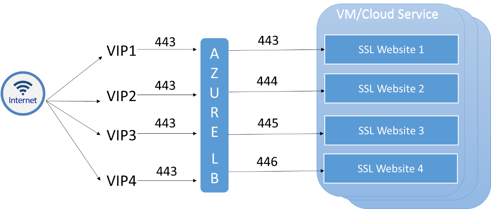

# Configure multiple VIPs for a cloud service

[!INCLUDE [load-balancer-basic-sku-include.md](../../includes/load-balancer-basic-sku-include.md)]

You can access Azure cloud services over the public Internet by using an IP address provided by Azure. This public IP address is referred to as a VIP (virtual IP) since it is linked to the Azure load balancer, and not the Virtual Machine (VM) instances within the cloud service. You can access any VM instance within a cloud service by using a single VIP.

However, there are scenarios in which you may need more than one VIP as an entry point to the same cloud service. For instance, your cloud service may host multiple websites that require SSL connectivity using the default port of 443, as each site is hosted for a different customer, or tenant. In this scenario, you need to have a different public facing IP address for each website. The diagram below illustrates a typical multi-tenant web hosting with a need for multiple SSL certificates on the same public port.



In the example above, all VIPs use the same public port (443) and traffic is redirected to one or more load balanced VMs on a unique private port for the internal IP address of the cloud service hosting all the websites.

> [!NOTE]
> Another situation requiring the use the multiple VIPs is hosting multiple SQL AlwaysOn availability group listeners on the same set of Virtual Machines.

VIPs are dynamic by default, which means that the actual IP address assigned to the cloud service may change over time. To prevent that from happening, you can reserve a VIP for your service. To learn more about reserved VIPs, see [Reserved Public IP](../virtual-network/virtual-networks-reserved-public-ip.md).

> [!NOTE]
> Please see [IP Address pricing](https://azure.microsoft.com/pricing/details/ip-addresses/) for information on pricing on VIPs and reserved IPs.

You can use PowerShell to verify the VIPs used by your cloud services, as well as add and remove VIPs, associate a VIP to an endpoint, and configure load balancing on a specific VIP.

## Limitations

At this time, Multi VIP functionality is limited to the following scenarios:

* **IaaS only**. You can only enable Multi VIP for cloud services that contain VMs. You cannot use Multi VIP in PaaS scenarios with role instances.
* **PowerShell only**. You can only manage Multi VIP by using PowerShell.

These limitations are temporary, and may change at any time. Make sure to revisit this page to verify future changes.

## How to add a VIP to a cloud service
To add a VIP to your service, run the following PowerShell command:

```powershell
Add-AzureVirtualIP -VirtualIPName Vip3 -ServiceName myService
```

This command displays a result similar to the following sample:

    OperationDescription OperationId                          OperationStatus
    -------------------- -----------                          ---------------
    Add-AzureVirtualIP   4bd7b638-d2e7-216f-ba38-5221233d70ce Succeeded

## How to remove a VIP from a cloud service
To remove the VIP added to your service in the example above, run the following PowerShell command:

```powershell
Remove-AzureVirtualIP -VirtualIPName Vip3 -ServiceName myService
```

> [!IMPORTANT]
> You can only remove a VIP if it has no endpoints associated to it.


## How to retrieve VIP information from a Cloud Service
To retrieve the VIPs associated with a cloud service, run the following PowerShell script:

```powershell
$deployment = Get-AzureDeployment -ServiceName myService
$deployment.VirtualIPs
```

The script displays a result similar to the following sample:

    Address         : 191.238.74.148
    IsDnsProgrammed : True
    Name            : Vip1
    ReservedIPName  :
    ExtensionData   :

    Address         :
    IsDnsProgrammed :
    Name            : Vip2
    ReservedIPName  :
    ExtensionData   :

    Address         :
    IsDnsProgrammed :
    Name            : Vip3
    ReservedIPName  :
    ExtensionData   :

In this example, the cloud service has 3 VIPs:

* **Vip1** is the default VIP, you know that because the value for IsDnsProgrammedName is set to true.
* **Vip2** and **Vip3** are not used as they do not have any IP addresses. They will only be used if you associate an endpoint to the VIP.

> [!NOTE]
> Your subscription will only be charged for extra VIPs once they are associated with an endpoint. For more information on pricing, see [IP Address pricing](https://azure.microsoft.com/pricing/details/ip-addresses/).

## How to associate a VIP to an endpoint

To associate a VIP on a cloud service to an endpoint, run the following PowerShell command:

```powershell
Get-AzureVM -ServiceName myService -Name myVM1 |
    Add-AzureEndpoint -Name myEndpoint -Protocol tcp -LocalPort 8080 -PublicPort 80 -VirtualIPName Vip2 |
    Update-AzureVM
```

The command creates an endpoint linked to the VIP called *Vip2* on port *80*, and links it to the VM named *myVM1* in a cloud service named *myService* using *TCP* on port *8080*.

To verify the configuration, run the following PowerShell command:

```powershell
$deployment = Get-AzureDeployment -ServiceName myService
$deployment.VirtualIPs
```

The output looks similar to the following example:

    Address         : 191.238.74.148
    IsDnsProgrammed : True
    Name            : Vip1
    ReservedIPName  :
    ExtensionData   :

    Address         : 191.238.74.13
    IsDnsProgrammed :
    Name            : Vip2
    ReservedIPName  :
    ExtensionData   :

    Address         :
    IsDnsProgrammed :
    Name            : Vip3
    ReservedIPName  :
    ExtensionData   :

## How to enable load balancing on a specific VIP

You can associate a single VIP with multiple virtual machines for load balancing purposes. For example, you have a cloud service named *myService*, and two virtual machines named *myVM1* and *myVM2*. And your cloud service has multiple VIPs, one of them named *Vip2*. If you want to ensure that all traffic to port *81* on *Vip2* is balanced between *myVM1* and *myVM2* on port *8181*, run the following PowerShell script:

```powershell
Get-AzureVM -ServiceName myService -Name myVM1 |
    Add-AzureEndpoint -Name myEndpoint -LoadBalancedEndpointSetName myLBSet -Protocol tcp -LocalPort 8181 -PublicPort 81 -VirtualIPName Vip2 -DefaultProbe |
    Update-AzureVM

Get-AzureVM -ServiceName myService -Name myVM2 |
    Add-AzureEndpoint -Name myEndpoint -LoadBalancedEndpointSetName myLBSet -Protocol tcp -LocalPort 8181 -PublicPort 81 -VirtualIPName Vip2  -DefaultProbe |
    Update-AzureVM
```

You can also update your load balancer to use a different VIP. For example, if you run the PowerShell command below, you will change the load balancing set to use a VIP named Vip1:

```powershell
Set-AzureLoadBalancedEndpoint -ServiceName myService -LBSetName myLBSet -VirtualIPName Vip1
```

## Next Steps

[Azure Monitor logs for Azure Load Balance](load-balancer-monitor-log.md)

[Internet facing load balancer overview](load-balancer-internet-overview.md)

[Get started on Internet facing load balancer](load-balancer-get-started-internet-arm-ps.md)

[Virtual Network Overview](../virtual-network/virtual-networks-overview.md)

[Reserved IP REST APIs](https://msdn.microsoft.com/library/azure/dn722420.aspx)
