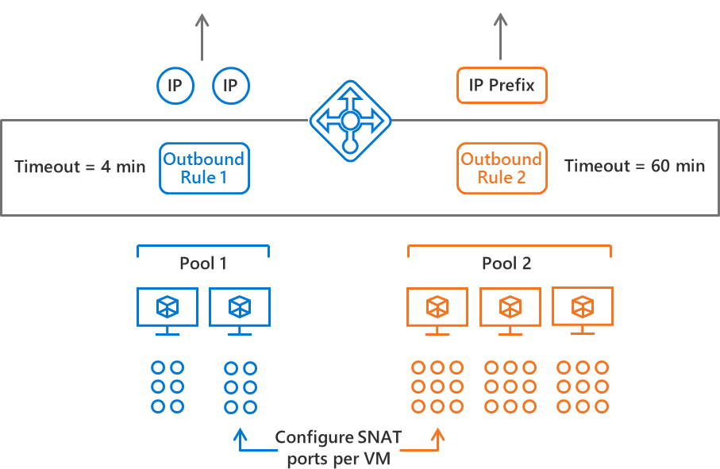

# Load Balancer outbound rules

Azure Load Balancer provides outbound connectivity from a virtual network in addition to inbound.  Outbound rules make it simple to configure public [Standard Load Balancer](load-balancer-standard-overview.md)'s outbound network address translation.  You have full declarative control over outbound connectivity to scale and tune this ability to your specific needs.



With outbound rules, you can use Load Balancer to: 
- define outbound NAT from scratch.
- scale and tune the behavior of existing outbound NAT. 

Outbound rules allow you to control:
- which virtual machines should be translated to which public IP addresses. 
- how [outbound SNAT ports](load-balancer-outbound-connections.md#snat) should be allocated.
- which protocols to provide outbound translation for.
- what duration to use for outbound connection idle timeout.
- whether to send a TCP Reset on idle timeout (in Public Preview). 

Outbound rules expand [scenario 2](load-balancer-outbound-connections.md#lb) in described in the [outbound connections](load-balancer-outbound-connections.md) article and the scenario precedence remains as-is.

## Outbound rule

Like all Load Balancer rules, outbound rules follow the same familiar syntax as load balancing and inbound NAT rules:

**frontend** + **parameters** + **backend pool**

An outbound rule configures outbound NAT for _all virtual machines identified by the backend pool_ to be translated to the _frontend_.  And _parameters_ provide additional fine grained control over the outbound NAT algorithm.

API version "2018-07-01" permits an outbound rule definition structured as follows:

```json
      "outboundRules": [
        {
          "frontendIPConfigurations": [ list_of_frontend_ip_configuations ],
          "allocatedOutboundPorts": number_of_SNAT_ports,
          "idleTimeoutInMinutes": 4 through 66,
          "enableTcpReset": true | false,
          "protocol": "Tcp" | "Udp" | "All",
          "backendAddressPool": backend_pool_reference,
        }
      ]
```

>[!NOTE]
>The effective outbound NAT configuration is a composite of all outbound rules and load balancing rules. Outbound rules are incremental to load balancing rules. Review [disabling outbound NAT for a load balancing rule](#disablesnat) to manage the effective outbound NAT translation when multiple rules apply to a VM. You must [disable outbound SNAT](#disablesnat) when defining an outbound rule which is using the same public IP address as a load balancing rule.

### <a name="scale"></a> Scale outbound NAT with multiple IP addresses

While an outbound rule can be used with just a single public IP address, outbound rules ease the configuration burden for scaling outbound NAT. You can use multiple IP addresses to plan for large scale scenarios and you can use outbound rules to mitigate [SNAT exhaustion](load-balancer-outbound-connections.md#snatexhaust) prone patterns.  

Each additional IP address provided by a frontend provides 64,000 ephemeral ports for Load Balancer to use as SNAT ports. While load balancing or inbound NAT rules have a single frontend, the outbound rule expands the frontend notion and allows multiple frontends per rule.  With multiple frontends per rule, the quantity of available SNAT ports is multiplied with each public IP address, and very large scenarios can be supported.

Additionally, you can use a [public IP prefix](https://aka.ms/lbpublicipprefix) directly with an outbound rule.  This provides for easier scaling and simplified whitelisting of flows originating from your Azure deployment. You can configure a frontend IP configuration within the Load Balancer resource to reference a public IP address prefix directly.  This allows Load Balancer exclusive control over the public IP prefix and the outbound rule will automatically use all public IP addresses contained within the public IP prefix for outbound connections.  Each of the IP addresses within the range of the public IP prefix provide 64,000 ephemeral ports per IP address for Load Balancer to use as SNAT ports.   

You cannot have individual public IP address resources created from the public IP prefix when using this option as the outbound rule must have complete control of the public IP prefix.  If you need more fine grained control, you can create individual public IP address resource from the public IP prefix and assign multiple public IP addresses individually to the frontend of an outbound rule.

### <a name="snatports"></a> Tune SNAT port allocation

You can use outbound rules to tune the [automatic SNAT port allocation based on backend pool size](load-balancer-outbound-connections.md#preallocatedports) and allocate more or less than the automatic SNAT port allocation provides.

Use the following parameter to allocate 10,000 SNAT ports per VM (NIC IP configuration).
 

          "allocatedOutboundPorts": 10000

Each public IP address from all frontends of an outbound rule contributes up to 64,000 ephemeral ports for us as SNAT ports.  Load Balancer allocates SNAT ports in multiples of 8. If you provide a value not divisible by 8, the configuration operation is rejected.  If you attempt to allocate more SNAT ports than are available based on the number of public IP addresses, the configuration operation is rejected.  For example, if you allocate 10,000 ports per VM and 7 VMs in a backend pool would share a single public IP address, the configuration is rejected (7 x 10,0000 SNAT ports > 64,000 SNAT ports).  You can add more public IP addresses to the frontend of the outbound rule to enable the scenario.

You can revert back to [automatic SNAT port allocation based on backend pool size](load-balancer-outbound-connections.md#preallocatedports) by specifying 0 for number of ports.

### <a name="idletimeout"></a> Control outbound flow idle timeout

Outbound rules provide a configuration parameter to control the outbound flow idle timeout and match it to the needs of your application.  Outbound idle timeouts default to 4 minutes.  The parameter accepts a value from 4 to 66 to specific the number of minutes for the idle timeout for flows matching this particular rule.

Use the following parameter to set the outbound idle timeout to 1 hour:

          "idleTimeoutInMinutes": 60

### <a name="tcprst"></a> <a name="tcpreset"></a> Enable TCP Reset on idle timeout (Preview)

The default behavior of Load Balancer is to drop the flow silently when the outbound idle timeout has been reached.  With the enableTCPReset parameter, you can enable a more predictable application behavior and control whether to send bidirectional TCP Reset (TCP RST) at the time out of outbound idle timeout. 

Use the following parameter to enable TCP Reset on an outbound rule:

           "enableTcpReset": true

Review [TCP Reset on idle timeout (Preview)](https://aka.ms/lbtcpreset) for details including region availability.

### <a name="proto"></a> Support both TCP and UDP transport protocols with a single rule

You will likely want to use "All" for the transport protocol of the outbound rule, but you can also apply the outbound rule to a specific transport protocol as well if there is a need to do so.

Use the following parameter to set the protocol to TCP and UDP:

          "protocol": "All"

### <a name="disablesnat"></a> Disable outbound NAT for a load balancing rule

As stated previously, load balancing rules provide automatic programming of outbound NAT. However, some scenarios benefit or require you to disable the automatic programming of outbound NAT by the load balancing rule to allow you to control or refine the behavior.  Outbound rules have scenarios where it is important to stop the automatic outbound NAT programming.

You can use this parameter in two ways:
- Optional suppression of using the inbound IP address for outbound NAT.  Outbound rules are incremental to load balancing rules and with this parameter set, the outbound rule is in control.
  
- Tune the outbound NAT parameters of an IP address used for inbound and outbound simultaneously.  The automatic outbound NAT programming must be disabled to allow an outbound rule to take control.  For example, in order to change the SNAT port allocation of an address also used for inbound, this parameter must be set to true.  If you attempt to use an outbound rule to redefine the parameters of an IP address also used for inbound and have not released outbound NAT programming of the load balancing rule, the operation to configure an outbound rule will fail.

>[!IMPORTANT]
> Your virtual machine will not have outbound connectivity if you set this parameter to true and do not have an outbound rule (or [instance-level public IP scenario](load-balancer-outbound-connections.md#ilpip) to define outbound connectivity.  Some operations of your VM or your application may depend on having outbound connectivity available. Make sure you understand the dependencies of your scenario and have considered impact of making this change.

You can disable outbound SNAT on the load balancing rule with this configuration parameter:

```json
      "loadBalancingRules": [
        {
          "disableOutboundSnat": true
        }
      ]
```

The disableOutboundSNAT parameter defaults to false, which means the load balancing rule **does** provide automatic outbound NAT as a mirror image of the load balancing rule configuration.  

If you set disableOutboundSnat to true on the load balancing rule, the load balancing rule releases control of the otherwise automatic outbound NAT programming.  Outbound SNAT as a result of the load balancing rule is disabled.

### Reuse existing or define new backend pools

Outbound rules do not introduce a new concept for defining the group of VMs to which the rule should apply.  Instead, they reuse the concept of a backend pool, which is also used for load balancing rules. You can use this to simplify the configuration by either reusing an existing backend pool definition or creating one specifically for an outbound rule.

## Scenarios

### <a name="groom"></a> Groom outbound connections to a specific set of public IP addresses

You can use an outbound rule to groom outbound connections to appear to originate from a specific set of public IP addresses to ease whitelisting scenarios.  This source public IP address can be the same as used by a load balancing rule or a different set of public IP addresses than used by a load balancing rule.  

1. Create [public IP prefix](https://aka.ms/lbpublicipprefix) (or public IP addresses from public IP prefix)
2. Create a public Standard Load Balancer
3. Create frontends referencing the public IP prefix (or public IP addresses) you wish to use
4. Reuse a backend pool or create a backend pool and place the VMs into a backend pool of the public Load Balancer
5. Configure an outbound rule on the public Load Balancer to program outbound NAT for these VMs using the frontends
   
If you do not wish for the load balancing rule to be used for outbound, you need to [disable outbound SNAT](#disablesnat) on the load balancing rule.

### <a name="modifysnat"></a> Modify SNAT port allocation

You can use outbound rules to tune the [automatic SNAT port allocation based on backend pool size](load-balancer-outbound-connections.md#preallocatedports).

For example, if you have two virtual machines sharing a single public IP address for outbound NAT, you may wish to increase the number of SNAT ports allocated from the default 1024 ports if you are experiencing SNAT exhaustion. Each public IP address can contribute up to 64,000 ephemeral ports.  If you configure an outbound rule with a single public IP address frontend, you can distribute a total of 64,000 SNAT ports to VMs in the backend pool.  For two VMs, a maximum of 32,000 SNAT ports can be allocated with an outbound rule (2x 32,000 = 64,000).

Review [outbound connections](load-balancer-outbound-connections.md) and the details on how [SNAT](load-balancer-outbound-connections.md#snat) ports are allocated and used.

### <a name="outboundonly"></a> Enable outbound only

You can use a public Standard Load Balancer to provide outbound NAT for a group of VMs. In this scenario, you can use an outbound rule by itself, without the need for any additional rules.

#### Outbound NAT for VMs only (no inbound)

Define a public Standard Load Balancer, place the VMs into the backend pool, and configure an outbound rule to program outbound NAT and groom the outbound connections to originate from a specific public IP address. You can also use a public IP prefix simplify white-listing the source of outbound connections.

1. Create a public Standard Load Balancer.
2. Create a backend pool and place the VMs into a backend pool of the public Load Balancer.
3. Configure an outbound rule on the public Load Balancer to program outbound NAT for these VMs.

#### Outbound NAT for internal Standard Load Balancer scenarios

When using an internal Standard Load Balancer, outbound NAT is not available until outbound connectivity has been explicitly declared. You can define outbound connectivity using an outbound rule to create outbound connectivity for VMs behind an internal Standard Load Balancer with these steps:

1. Create a public Standard Load Balancer.
2. Create a backend pool and place the VMs into a backend pool of the public Load Balancer in addition to the internal Load Balancer.
3. Configure an outbound rule on the public Load Balancer to program outbound NAT for these VMs.

#### Enable both TCP & UDP protocols for outbound NAT with a public Standard Load Balancer

- When using a public Standard Load Balancer, the automatic outbound NAT programming provided matches the transport protocol of the load balancing rule.  

   1. Disable outbound SNAT on the load balancing rule.
   2. Configure an outbound rule on the same Load Balancer.
   3. Reuse the backend pool already used by your VMs.
   4. Specify "protocol": "All" as part of the outbound rule.

- When only inbound NAT rules are used, no outbound NAT is provided.

   1. Place VMs in a backend pool.
   2. Define one or more frontend IP configurations with public IP address(es) or public IP prefix.
   3. Configure an outbound rule on the same Load Balancer.
   4. Specify "protocol": "All" as part of the outbound rule

## Limitations

- The maximum number of usable ephemeral ports per frontend IP address is 64,000.
- The range of the configurable outbound idle timeout is 4 to 66 minutes (240 to 4000 seconds).
- Load Balancer does not support ICMP for outbound NAT.
- Portal cannot be used to configure or view outbound rules.  Use templates, REST API, Az CLI 2.0, or PowerShell instead.

## Next steps

- Learn about using [Load Balancer for outbound connections](load-balancer-outbound-connections.md).
- Learn about [Standard Load Balancer](load-balancer-standard-overview.md).
- Learn about [bidirectional TCP Reset on idle timeout](load-balancer-tcp-reset.md).
- [Configure outbound rules with Azure CLI 2.0](configure-load-balancer-outbound-cli.md).
