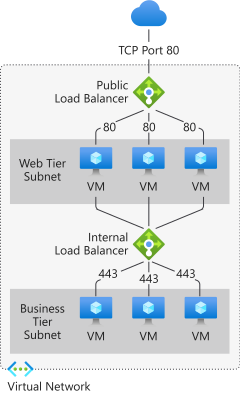

# What is Azure Load Balancer?

*Load balancing* refers to evenly distributing load (incoming network traffic) across a group of backend resources or servers. 

Azure Load Balancer operates at layer four of the Open Systems Interconnection (OSI) model. It's the single point of contact for clients. Load Balancer distributes inbound flows that arrive at the load balancer's front end to backend pool instances. These flows are according to configured load balancing rules and health probes. The backend pool instances can be Azure Virtual Machines or instances in a virtual machine scale set.

A **[public load balancer](./components.md#frontend-ip-configurations)** can provide outbound connections for virtual machines (VMs) inside your virtual network. These connections are accomplished by translating their private IP addresses to public IP addresses. Public Load Balancers are used to load balance internet traffic to your VMs.

An **[internal (or private) load balancer](./components.md#frontend-ip-configurations)** is used where private IPs are needed at the frontend only. Internal load balancers are used to load balance traffic inside a virtual network. A load balancer frontend can be accessed from an on-premises network in a hybrid scenario.

  

*Figure: Balancing multi-tier applications by using both public and internal Load Balancer*

For more information on the individual load balancer components, see [Azure Load Balancer components](./components.md).

## Why use Azure Load Balancer?
With Standard Load Balancer, you can scale your applications and create highly available services. 
Load balancer supports both inbound and outbound scenarios. Load balancer provides low latency and high throughput, and scales up to millions of flows for all TCP and UDP applications.

Key scenarios that you can accomplish using Standard Load Balancer include:

- Load balance **[internal](./quickstart-load-balancer-standard-internal-portal.md)** and **[external](./tutorial-load-balancer-standard-manage-portal.md)** traffic to Azure virtual machines.

- Increase availability by distributing resources **[within](./tutorial-load-balancer-standard-public-zonal-portal.md)** and **[across](./tutorial-load-balancer-standard-public-zone-redundant-portal.md)** zones.

- Configure **[outbound connectivity ](./load-balancer-outbound-connections.md)** for Azure virtual machines.

- Use **[health probes](./load-balancer-custom-probe-overview.md)** to monitor load-balanced resources.

- Employ **[port forwarding](./tutorial-load-balancer-port-forwarding-portal.md)** to access virtual machines in a virtual network by public IP address and port.

- Enable support for **[load-balancing](../virtual-network/virtual-network-ipv4-ipv6-dual-stack-standard-load-balancer-powershell.md)** of **[IPv6](../virtual-network/ipv6-overview.md)**.

- Standard Load Balancer provides multi-dimensional metrics through [Azure Monitor](../azure-monitor/overview.md).  These metrics can be filtered, grouped, and broken out for a given dimension.  They provide current and historic insights into performance and health of your service. [Insights for Azure Load Balancer] (https://docs.microsoft.com/azure/load-balancer/load-balancer-insights) offers a preconfigured dashboard with useful visualizations for these metrics.  Resource Health is also supported. Review **[Standard Load Balancer Diagnostics](load-balancer-standard-diagnostics.md)** for more details.

- Load balance services on **[multiple ports, multiple IP addresses, or both](./load-balancer-multivip-overview.md)**.

- Move **[internal](./move-across-regions-internal-load-balancer-portal.md)** and **[external](./move-across-regions-external-load-balancer-portal.md)** load balancer resources across Azure regions.

- Load balance TCP and UDP flow on all ports simultaneously using **[HA ports](./load-balancer-ha-ports-overview.md)**.

### Secure by default

Standard Load Balancer is built on the zero trust network security model at its core. Standard Load Balancer is secure by default and part of your virtual network. The virtual network is a private and isolated network.  This means Standard Load Balancers and Standard Public IP addresses are closed to inbound flows unless opened by Network Security Groups. NSGs are used to explicitly permit allowed traffic.  If you do not have an NSG on a subnet or NIC of your virtual machine resource, traffic is not allowed to reach this resource. To learn more about NSGs and how to apply them for your scenario, see [Network Security Groups](../virtual-network/network-security-groups-overview.md).
Basic Load Balancer is open to the internet by default. In addition, Load Balancer does not store customer data.

## Pricing and SLA

For Standard Load Balancer pricing information, see [Load Balancer pricing](https://azure.microsoft.com/pricing/details/load-balancer/).
Basic Load Balancer is offered at no charge.
See [SLA for Load Balancer](https://aka.ms/lbsla). Basic Load Balancer has no SLA.

## What's new?

Subscribe to the RSS feed and view the latest Azure Load Balancer feature updates on the [Azure Updates](https://azure.microsoft.com/updates/?category=networking&query=load%20balancer) page.

## Next steps

See [Create a public standard load balancer](quickstart-load-balancer-standard-public-portal.md) to get started with using a load balancer.

For more information on Azure Load Balancer limitations and components see [Azure Load Balancer components](./components.md) and [Azure Load Balancer concepts](./concepts.md)
