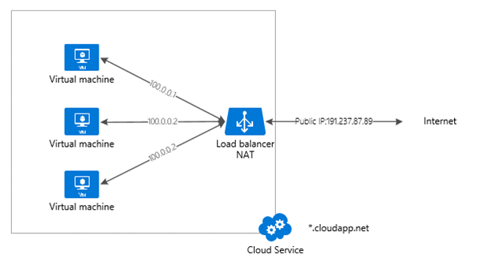
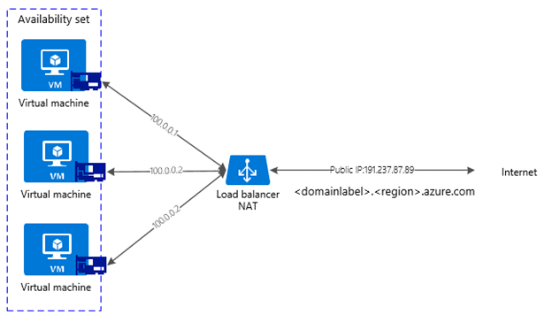

<properties
   pageTitle="Azure Load Balancer overview | Microsoft Azure"
   description="Overview of Azure Load Balancer features, architecture, and implementation. Learn how the load balancer works and leverage it in the cloud."
   services="load-balancer"
   documentationCenter="na"
   authors="joaoma"
   manager="carmonm"
   editor="tysonn" />
<tags
   ms.service="load-balancer"
   ms.devlang="na"
   ms.topic="article"
   ms.tgt_pltfrm="na"
   ms.workload="infrastructure-services"
   ms.date="05/19/2016"
   ms.author="joaoma" />

# Azure Load Balancer overview

The Azure Load Balancer delivers high availability and network performance to your applications. It is a Layer 4 (TCP, UDP) load balancer that distributes incoming traffic among healthy service instances in cloud services or virtual machines defined in a load-balanced set.

It can be configured to:

- Load balance incoming Internet traffic to virtual machines. This is called [Internet-facing load balancing](load-balancer-internet-overview.md).
- Load balance traffic between virtual machines in a virtual network, between virtual machines in cloud services, or between on-premises computers and virtual machines in a cross-premises virtual network. This is called [internal load balancing](load-balancer-internal-overview.md).
- Forward external traffic to a specific virtual machine.

All resources in the cloud need a public IP address to be reachable from the Internet. The cloud infrastructure in Microsoft Azure uses non-routable IP addresses for its resources. It uses network address translation (NAT) with public IP addresses to communicate to the Internet. 

It's important to understand the differences between the Azure classic and Resource Manager [deployment models](../resource-manager-deployment-model.md) because the load balancer is configured differently in each.

### Azure classic deployment model

In this model a public IP address and a FQDN are assigned to a cloud service. Virtual machines that are deployed within a cloud service boundary can be grouped to use a load balancer. The load balancer will do port translation and load balance the network traffic by leveraging the public IP address for the cloud service.

Port translation is done through endpoints that have a one-to-one relationship between the public-assigned port of the public IP address and the local port assigned to send traffic to a specific virtual machine. Load balancing is done through load balancer endpoints. Those endpoints have a one-to-many relationship between the public IP address and the local ports assigned to all virtual machines in the cloud service that respond to the load-balanced network traffic.

The domain label for the public IP address that the load balancer uses in this deployment model is <cloud service name>.cloudapp.net. The graphic below shows the Azure Load Balancer in this model.

### Azure Resource Manager deployment model

In this model there is no need to create a cloud service to load balance traffic to virtual machines, but the load balancer must be explicitly created.

A public IP address is its own resource and can be associated with a domain label or a DNS name. The public IP address in this case is associated with the load balancer resource. This way, load balancer rules and inbound NAT rules will use the public IP address as the Internet endpoint for the resources that are receiving load-balanced network traffic.

A private or public IP address is assigned to the network interface resource attached to a virtual machine. Once a network interface is added to a load balancer's back-end IP address pool, the load balancer will start sending load-balanced network traffic based on the load-balanced rules that are created.

The graphic below shows the Azure Load Balancer in this model:

## Load balancer features

### Hash-based distribution

The load balancer uses a hash-based distribution algorithm. By default, it uses a 5-tuple (source IP, source port, destination IP, destination port, and protocol type) hash to map traffic to available servers. It provides stickiness only *within* a transport session. Packets in the same TCP or UDP session will be directed to the same datacenter IP instance behind the load-balanced endpoint. When the client closes and reopens the connection or starts a new session from the same source IP, the source port changes. This may cause the traffic to go to a different datacenter IP endpoint.

For more details, see [Load balancer distribution mode](load-balancer-distribution-mode.md). The graphic below shows the hash-based distribution:

### Port forwarding

The load balancer gives you control over how inbound communication is managed. This communication can include traffic that's initiated from Internet hosts or virtual machines in other cloud services or virtual networks. This control is represented by an endpoint (also called an input endpoint).

An endpoint listens on a public port and forwards traffic to an internal port.  You can map the same ports for an internal or external endpoint or use a different port for them. For example, you can have a web server configured to listen to port 81 while the public endpoint mapping is port 80. The creation of a public endpoint triggers the creation of a load balancer instance.

The default use and configuration of endpoints on a virtual machine that you create by using the Azure portal are for the Remote Desktop Protocol (RDP) and remote Windows PowerShell session traffic. You can use these endpoints to remotely administer the virtual machine over the Internet.

### Automatic reconfiguration

The load balancer instantly reconfigures itself when you scale instances up or down. For example, this reconfiguration can happen when you increase the instance count for web/worker roles in a cloud service or when you add additional virtual machines into the same load-balanced set.

### Service monitoring

The load balancer can probe the health of the various server instances. When a probe fails to respond, the load balancer stops sending new connections to the unhealthy instances. Existing connections are not impacted.

Three types of probes are supported:

- **Guest agent probe (on PaaS VMs only)****:** The load balancer utilizes the guest agent inside the virtual machine. It listens and responds with an HTTP 200 OK response only when the instance is in the ready state (i.e. the instance is not in a state like busy, recycling, or stopping). If the guest agent fails to respond with an HTTP 200 OK, the load balancer marks the instance as unresponsive and stops sending traffic to that instance. The load balancer will continue to ping the instance. If the guest agent responds with an HTTP 200, the load balancer will send traffic to that instance again. When you're using a web role, your website code typically runs in w3wp.exe, which is not monitored by the Azure fabric or guest agent. This means that failures in w3wp.exe (e.g. HTTP 500 responses) will not be reported to the guest agent, and the load balancer will not know to take that instance out of rotation.
- **HTTP custom probe:** This probe overrides the default (guest agent) probe. You can use it to create your own custom logic to determine the health of the role instance. The load balancer will regularly probe your endpoint (every 15 seconds, by default). The instance will be considered in rotation if it responds with a TCP ACK or HTTP 200 within the timeout period (default of 31 seconds).  This can be useful for implementing your own logic to remove instances from the load balancer's rotation. For example, you can configure the instance to return a non-200 status if the instance is above 90% CPU.  For web roles that use w3wp.exe, you also get automatic monitoring of your website, since failures in your website code will return a non-200 status to the probe.  
- **TCP custom probe:** This probe relies on successful TCP session establishment to a defined probe port.

For more information, see the [LoadBalancerProbe schema](https://msdn.microsoft.com/library/azure/jj151530.aspx).

### Source NAT

All outbound traffic to the Internet that originates from your service undergoes source NAT (SNAT) by using the same VIP address as for incoming traffic. SNAT provides important benefits:

- It enables easy upgrade and disaster recovery of services, since the VIP can be dynamically mapped to another instance of the service.
- It makes access control list (ACL) management easier, since the ACL can be expressed in terms of VIPs and hence do no change as services scale up or down or get redeployed.

The load balancer configuration supports full cone NAT for UDP. Full cone NAT is a type of NAT where the port allows inbound connections from any external host (in response to an outbound request).

>[AZURE.NOTE] For each new outbound connection that a VM initiates, an outbound port is also allocated by the load balancer. The external host will see traffic with a virtual IP (VIP)-allocated port.  If your scenarios require a large number of outbound connections, we recommend that the VMs use [instance-level public IP](../virtual-network/virtual-networks-instance-level-public-ip.md) addresses so that they have a dedicated outbound IP address for SNAT. This will reduce the risk of port exhaustion.
>
>The maximum number of ports that can be used by the VIP or an instance-level public IP (PIP) is 64,000. This is a TCP standard limitation.

####Support for multiple load-balanced IP addresses for virtual machines

You can get more than one load-balanced public IP address assigned to a set of virtual machines. With this ability, you can host multiple SSL websites and/or multiple SQL Server AlwaysOn Availability Group listeners on the same set of virtual machines. See more at [Multiple VIPs per cloud service](load-balancer-multivip.md).

####Template-based deployments through Azure Resource Manager####

The load balancer can be managed through Resource Manager-based APIs and tools. To learn more about Resource Manager, see the [Resource Manager overview](../resource-group-overview.md) .

[AZURE.INCLUDE [load-balancer-compare-tm-ag-lb-include.md](../../includes/load-balancer-compare-tm-ag-lb-include.md)]

## Next steps

[Internet-facing load balancer overview](load-balancer-internet-overview.md)

[Internal load balancer overview](load-balancer-internal-overview.md)

[Get started creating an Internet-facing load balancer](load-balancer-get-started-internet-arm-ps.md)
