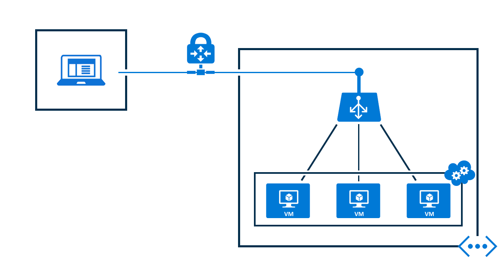

# Azure Load Balancer overview

Azure Load Balancer delivers high availability and network performance to your applications. It is a Layer 4 (TCP, UDP) load balancer that distributes incoming traffic among healthy instances of services defined in a load-balanced set. 

Azure Load Balancer can be configured to:

* Load balance incoming Internet traffic to virtual machines. This configuration is known as [Public load balancing](#publicloadbalancer).
* Load balance traffic between virtual machines in a virtual network or between on-premises computers and virtual machines in a cross-premises virtual network. This configuration is known as [internal load balancing](#internalloadbalancer).
* Forward external traffic to a specific virtual machines.

Load Balancer contains the following child resources that configure as per your business scenario:

* Front-end IP configuration – a Load balancer can include one or more frontend IP addresses, otherwise known as a virtual IPs (VIPs). These IP addresses serve as ingress for the traffic.
* Back-end address pool – these are IP addresses associated with the virtual machine Network Interface Card (NIC) to which load is distributed.
* Load balancing rules – a rule property maps a given frontend IP and port combination to a set of backend IP addresses and port combination. A single load balancer can have multiple load balancing rules. Each rule is a combination of a frontend IP and port and backend IP and port associated with VMs.
* Probes – probes enable you to keep track of the health of VM instances. If a health probe fails, the VM instance is taken out of rotation automatically.
* Inbound NAT rules – NAT rules defining the inbound traffic flowing through the frontend IP and distributed to the backend IP.

Azure Load Balancer supports two different types: [Basic](#basicloadbalancer) and [Standard](#standardloadbalancer). 

## Why use Basic Load Balancer?

## Why use Standard Load Balancer?

The Azure Load Balancer Standard SKU and Public IP Standard SKU together enable you to build highly scalable and reliable architectures. Applications that use Load Balancer Standard can take advantage of new capabilities. Low latency, high throughput, and scale are available for millions of flows for all TCP and UDP applications. You can use Load Balancer Standard for the full range of virtual data centers. From small scale deployments to large and complex multi-zone architectures, use Load Balancer Standard to take advantage of the following capabilities:

- Enterprise scale can be achieved with Load Balancer Standard. This feature can be used with any virtual machine (VM) instance within a virtual network, up to 1,000 VM instances.

- New diagnostic insights are available to help you understand, manage, and troubleshoot this vital component of your virtual data center. Use Azure Monitor (preview) to show, filter, and group new multi-dimensional metrics for continuous data path health measurements. Monitor your data from front-end to VM, endpoint health probes, for TCP connection attempts, and to outbound connections.

- Network Security Groups (NSGs) are now required for any VM instance that is associated with Load Balancer Standard SKUs or Public IP Standard SKUs. NSGs provide enhanced security for your scenario.

- High Availability (HA) Ports provide high reliability and scale for network virtual appliances (NVAs) and other application scenarios. HA Ports load balance all ports on an Azure Internal Load Balancer (ILB) front-end to a pool of VM instances.

- Outbound connections now use a new Source Network Address Translation (SNAT) port allocation model that provides greater resiliency and scale.

- Load Balancer Standard with Availability Zones can be used to construct zone-redundant and zonal architectures. Both of these architectures can include cross-zone load balancing. You can achieve zone-redundancy without dependency on DNS records. A single IP address is zone-redundant by default.  A single IP address can reach any VM in a virtual network within a region that is across all Availability Zones.

You can use Load Balancer Standard either in a public or internal configuration to support the following fundamental scenarios:

- Load balance inbound traffic to healthy back-end instances.
- Port forward inbound traffic to a single back-end instance.
- Translate outbound traffic from a private IP address within the virtual network to a Public IP address.

## What is a public Load Balancer?

Azure load balancer maps the public IP address and port number of incoming traffic to the private IP address and port number of the virtual machine and vice versa for the response traffic from the virtual machine. Load balancing rules allow you to distribute specific types of traffic between multiple virtual machines or services. For example, you can spread the load of web request traffic across multiple web servers or web roles.

### Example of a public Load Balancer

The following figure shows a load-balanced endpoint for web traffic that is shared among three virtual machines for the public and private TCP port of 80. These three virtual machines are in a load-balanced set.

**Figure - Load-balanced endpoint for web traffic**

When Internet clients send web page requests to the public IP address of the cloud service on TCP port 80, the Azure Load Balancer distributes the requests between the three virtual machines in the load-balanced set. For more information about load balancer algorithms, see the [load balancer overview page](load-balancer-overview.md#load-balancer-features).

By default, Azure Load Balancer distributes network traffic equally among multiple virtual machine instances. You can also configure session affinity, For more information, see [load balancer distribution mode](load-balancer-distribution-mode.md).

##  What is an internal Load Balancer?

Internal Load Balancer only directs traffic to resources that are inside a cloud service or that use a VPN to access Azure infrastructure. In this respect, internal Load Balancer differs from an internet-facing load balancer. Azure infrastructure restricts access to the load-balanced frontend IP addresses of a cloud service or to a virtual network. Frontend IP addresses and virtual networks are never directly exposed to an internet endpoint. Internal line-of-business applications run in Azure and are accessed from within Azure or from on-premises resources.

### Why use an internal load balancer?

Internal Load Balancer provides load balancing between virtual machines (VMs) that reside inside a virtual network with a regional scope. For information about virtual networks with a regional scope, see [Regional virtual networks](https://azure.microsoft.com/blog/2014/05/14/regional-virtual-networks/) in the Azure blog. Existing virtual networks that are configured for an affinity group cannot use the internal Load Balancer.

Internal Load Balancer enables the following types of load balancing:

* Within a virtual network: Load balancing from VMs in the virtual network to a set of VMs that reside within the same virtual network. See this <a href="#figure2">example</a>.
* For a cross-premises virtual network: Load balancing from on-premises computers to a set of VMs that reside within the same virtual network. See this <a href="#figure3">example</a>.
* For multi-tier applications: Load balancing for internet-facing multi-tier applications where the back-end tiers are not internet-facing. The back-end tiers require traffic load balancing from the internet-facing tier.
* For line-of-business applications: Load balancing for line-of-business applications that are hosted in Azure without additional load balancer hardware or software. This scenario includes on-premises servers that are in the set of computers whose traffic is load-balanced.

### Load balancing for internet-facing multi-tier applications

The web tier has internet-facing endpoints for internet clients and is part of a load-balanced set. The internal Load Balancer distributes incoming traffic from web clients for TCP port 443 (HTTPS) to the web servers.

The database servers are behind an internal Load Balancer endpoint that the web servers use for storage. The internal Load Balancer endpoint is a database service load-balanced endpoint. Traffic is load-balanced across the database servers in the ILB set.

The following image shows internal load balancing for the internet-facing multi-tier application within the same cloud service.

Another scenario is available for multi-tier applications. The load balancer is deployed to a different cloud service from the one that consumes the service for the ILB.

Cloud services that use the same virtual network can access the ILB endpoint. The following image shows front-end web servers that are in a different cloud service from the database back-end. The front-end servers use the ILB endpoint within the same virtual network as the back-end.

### Load balancing for intranet line-of-business applications

Traffic from clients on the on-premises network is load-balanced across the set of line-of-business servers that use a VPN connection to the Azure network.

The client machine can access an IP address from the Azure VPN service by using a point-to-site VPN. The line-of-business application can be hosted behind the ILB endpoint.

Another scenario for line-of-business applications is a site-to-site VPN to the virtual network where the ILB endpoint is configured. On-premises network traffic is routed to the ILB endpoint.

### Limitations

Internal Load Balancer configurations don't support SNAT. In this article, SNAT refers to scenarios that involve port-masquerading source network address translation. A VM in a load balancer pool must reach the front-end IP address of the respective internal load balancer. Connection failures occur when the flow is load-balanced to the VM that originated the flow. These scenarios are not supported for internal Load Balancer. A proxy-style load balancer must be used instead.

## Next steps

- Learn how to create a [basic public load balancer](load-balancer-create-inetrnet-portal.md)

