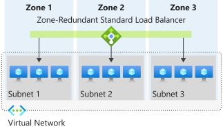
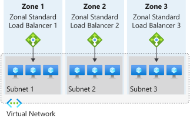

# Load Balancer and Availability Zones

Azure Load Balancer supports availability zones scenarios. You can use Standard Load Balancer to increase availability throughout your scenario by aligning resources with, and distribution across zones.  Review this document to understand these concepts and fundamental scenario design guidance.

A Load Balancer can either be **zone redundant, zonal,** or **non-zonal**. The load balancer's availability zone selection is synonymous with its frontend IP's zone selection. For public load balancers, if the public IP in the Load balancer's frontend is zone redundant then the load balancer is also zone-redundant. If the public IP in the load balancer's frontend is zonal, then the load balancer will also be designated to the same zone. To configure the zone-related properties for your load balancer, select the appropriate type of frontend needed.

## Zone redundant

In a region with Availability Zones, a Standard Load Balancer can be zone-redundant with traffic served by a single IP address. A single frontend IP address survives zone failure. The frontend IP may be used to reach all (non-impacted) backend pool members no matter the zone. Up to one availability zone can fail and the data path survives as long as the remaining zones in the region remain healthy.

The frontend's IP address is served simultaneously by multiple independent infrastructure deployments in multiple availability zones. Any retries or reestablishment will succeed in other zones not affected by the zone failure.

  

*Figure: Zone redundant load balancer*

## Zonal

You can choose to have a frontend guaranteed to a single zone, which is known as a *zonal*.  With this scenario,  a single zone in a region serves all inbound or outbound flow.  Your frontend shares fate with the health of the zone.  The data path is unaffected by failures in zones other than where it was guaranteed. You can use zonal frontends to expose an IP address per Availability Zone.  

Additionally, the use of zonal frontends directly for load-balanced endpoints within each zone is supported. You can use this configuration to expose per zone load-balanced endpoints to individually monitor each zone. For public endpoints, you can integrate them with a DNS load-balancing product like [Traffic Manager](../traffic-manager/traffic-manager-overview.md) and use a single DNS name.

  

*Figure: Zonal load balancer*

For a public load balancer frontend, you add a **zones** parameter to the public IP. This public IP is referenced by the frontend IP configuration used by the respective rule.

For an internal load balancer frontend, add a **zones** parameter to the internal load balancer frontend IP configuration. A zonal frontend guarantees an IP address in a subnet to a specific zone.

## Non-Zonal

Load Balancers can also be created in a non-zonal configuration by use of a "no-zone" frontend. In these scenarios, a public load balancer would use a public IP or public IP prefix, an internal load balancer would use a private IP.  This option doesn't give a guarantee of redundancy. 

>[!NOTE]
>All public IP addresses that are upgraded from Basic SKU to Standard SKU will be of type "no-zone". Learn how to [Upgrade a public IP address in the Azure portal](../virtual-network/ip-services/public-ip-upgrade-portal.md).

##  Design considerations

Now that you understand the zone-related properties for Standard Load Balancer, the following design considerations might help as you design for high availability.

### Tolerance to zone failure

- A **zone redundant** frontend can serve a zonal resource in any zone with a single IP address.  The IP can survive one zone failure as long as the remaining zones are healthy within the region.
- A **zonal** frontend is a reduction of the service to a single zone and shares fate with the respective zone. If the deployment in your zone goes down, your load balancer won't survive this failure.

Members in the backend pool of a load balancer are normally associated with a single zone such as with zonal virtual machines.  A common design for production workloads would be to have multiple zonal resources. For example, placing virtual machines from zone 1, 2, and 3 in the backend of a load balancer with a zone-redundant frontend meets this design principle.

### Multiple frontends

Using multiple frontends allow you to load balance traffic on more than one port and/or IP address.  When designing your architecture, ensure you account for how zone redundancy interacts with multiple frontends.  If your goal is to always have every frontend resilient to failure, then all IP addresses assigned as frontends must be zone-redundant.  If a set of frontends is intended to be associated with a single zone, then every IP address for that set must be associated with that specific zone. A load balancer isn't required in each zone. Instead, each zonal front end, or set of zonal frontends, could be associated with virtual machines in the backend pool that are part of that specific availability zone.

### Transition between regional zonal models

In the case where a region is augmented to have [availability zones](../availability-zones/az-overview.md), any existing IPs would remain non-zonal like IPs used for load balancer frontends. To ensure your architecture can take advantage of the new zones, creation of new frontend IPs is recommended. Once created, you can replace the existing non-zonal frontend with a new zone-redundant frontend using the method described [here](../virtual-network/ip-services/configure-public-ip-load-balancer.md#change-or-remove-public-ip-address).  All existing load balancing and NAT rules transition to the new frontend.

### Control vs data plane implications

Zone-redundancy doesn't imply hitless data plane or control plane. Zone-redundant flows can use any zone and your flows will use all healthy zones in a region. In a zone failure, traffic flows using healthy zones aren't affected.

Traffic flows using a zone at the time of zone failure may be affected but applications can recover. Traffic continues in the healthy zones within the region upon retransmission when Azure has converged around the zone failure.

Review [Azure cloud design patterns](/azure/architecture/patterns/) to improve the resiliency of your application to failure scenarios.

## Limitations

* Zones can't be changed, updated, or created for the resource after creation.
* Resources can't be updated from zonal to zone-redundant or vice versa after creation.

## Next steps
- Learn more about [Availability Zones](../availability-zones/az-overview.md)
- Learn more about [Standard Load Balancer](./load-balancer-overview.md)
- Learn how to [load balance VMs within a zone using a zonal Standard Load Balancer](./quickstart-load-balancer-standard-public-cli.md)
- Learn how to [load balance VMs across zones using a zone redundant Standard Load Balancer](./quickstart-load-balancer-standard-public-cli.md)
- Learn about [Azure cloud design patterns](/azure/architecture/patterns/) to improve the resiliency of your application to failure scenarios.
