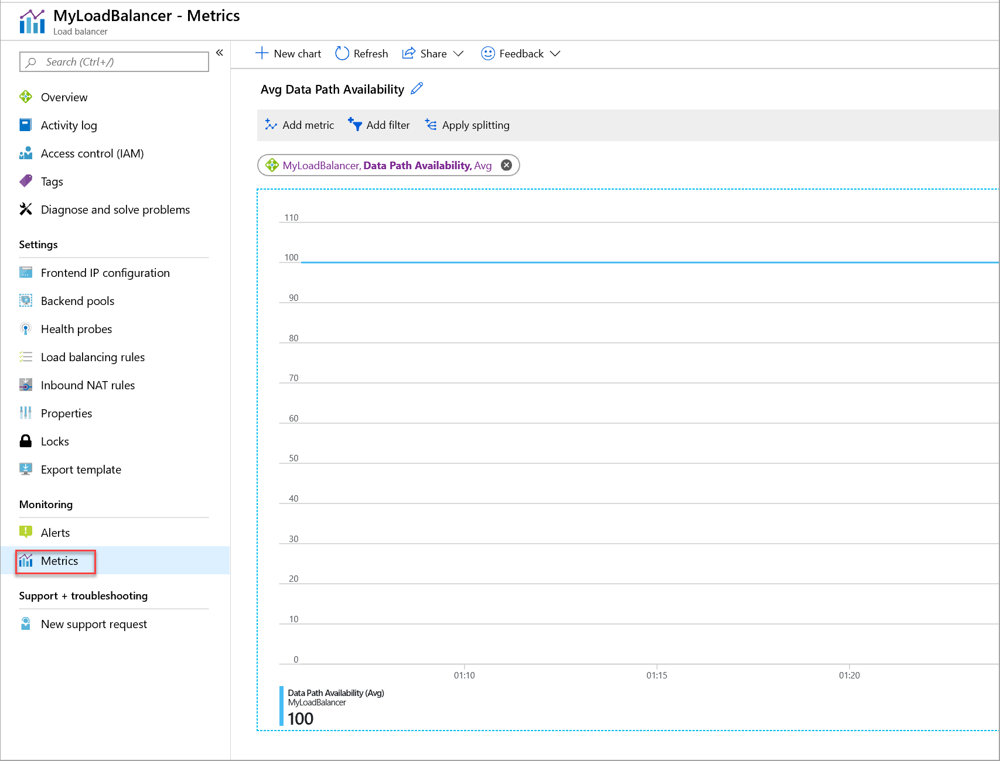
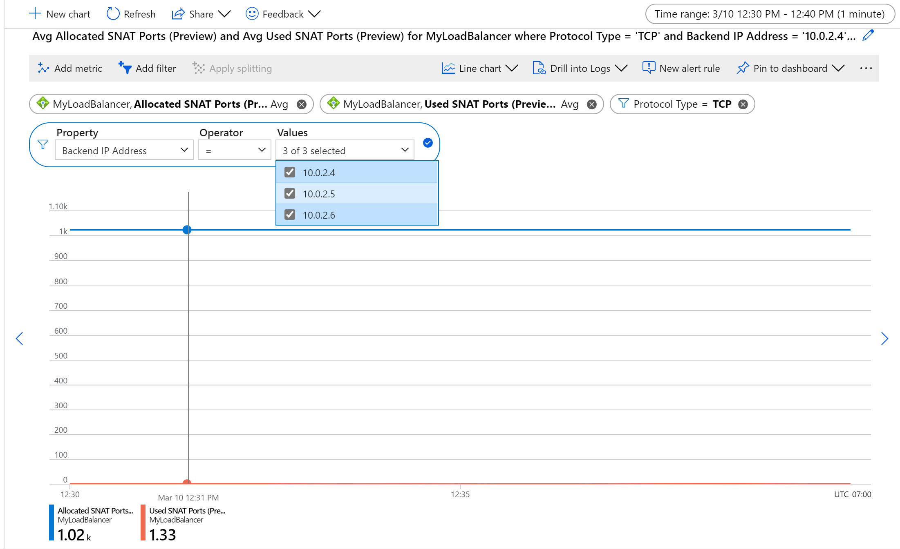
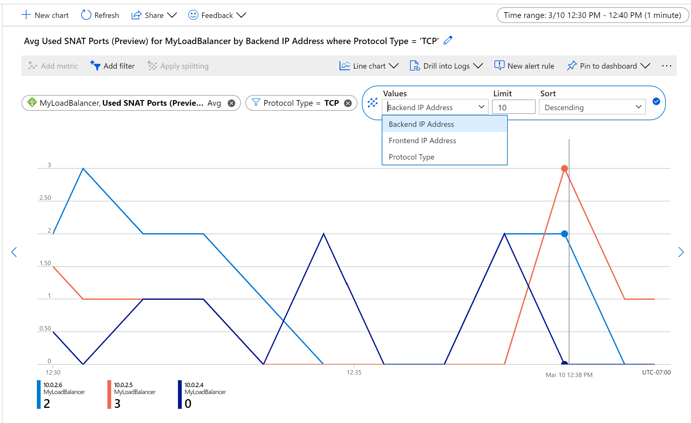
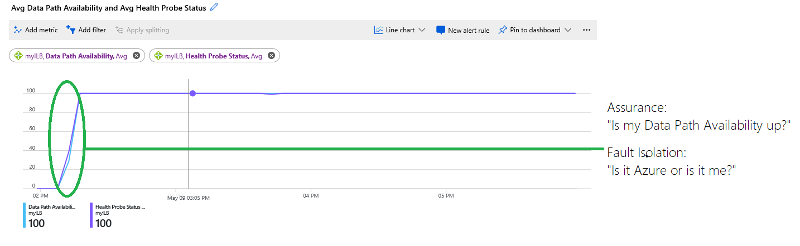

# Standard Load Balancer diagnostics with metrics, alerts and resource health

Azure Standard Load Balancer exposes the following diagnostic capabilities:

* **Multi-dimensional metrics and alerts**: Provides multi-dimensional diagnostic capabilities through [Azure Monitor](../azure-monitor/overview.md) for standard load balancer configurations. You can monitor, manage, and troubleshoot your standard load balancer resources.

* **Resource health**: The Resource Health status of your Load Balancer is available in the Resource Health page under Monitor. This automatic check informs you of the current availability of your Load Balancer resource.
This article provides a quick tour of these capabilities, and it offers ways to use them for Standard Load Balancer. 

## Multi-dimensional metrics

Azure Load Balancer provides multi-dimensional metrics via the Azure Metrics in the Azure portal, and it helps you get real-time diagnostic insights into your load balancer resources. 

The various Standard Load Balancer configurations provide the following metrics:

| Metric | Resource type | Description | Recommended aggregation |
| --- | --- | --- | --- |
| Data path availability | Public and internal load balancer | Standard Load Balancer continuously exercises the data path from within a region to the load balancer front end, all the way to the SDN stack that supports your VM. As long as healthy instances remain, the measurement follows the same path as your application's load-balanced traffic. The data path that your customers use is also validated. The measurement is invisible to your application and does not interfere with other operations.| Average |
| Health probe status | Public and internal load balancer | Standard Load Balancer uses a distributed health-probing service that monitors your application endpoint's health according to your configuration settings. This metric provides an aggregate or per-endpoint filtered view of each instance endpoint in the load balancer pool. You can see how Load Balancer views the health of your application, as indicated by your health probe configuration. |  Average |
| SYN (synchronize) count | Public and internal load balancer | Standard Load Balancer does not terminate Transmission Control Protocol (TCP) connections or interact with TCP or UDP packet flows. Flows and their handshakes are always between the source and the VM instance. To better troubleshoot your TCP protocol scenarios, you can make use of SYN packets counters to understand how many TCP connection attempts are made. The metric reports the number of TCP SYN packets that were received.| Sum |
| SNAT connection count | Public load balancer |Standard Load Balancer reports the number of outbound flows that are masqueraded to the Public IP address front end. Source network address translation (SNAT) ports are an exhaustible resource. This metric can give an indication of how heavily your application is relying on SNAT for outbound originated flows. Counters for successful and failed outbound SNAT flows are reported and can be used to troubleshoot and understand the health of your outbound flows.| Sum |
| Allocated SNAT ports | Public load balancer | Standard Load Balancer reports the number of SNAT ports allocated per backend instance | Average. |
| Used SNAT ports | Public load balancer | Standard Load Balancer reports the number of SNAT ports that are utilized per backend instance. | Average | 
| Byte count |  Public and internal load balancer | Standard Load Balancer reports the data processed per front end. You may notice that the bytes are not distributed equally across the backend instances. This is expected as Azure's Load Balancer algorithm is based on flows | Sum |
| Packet count |  Public and internal load balancer | Standard Load Balancer reports the packets processed per front end.| Sum |

  >[!NOTE]
  >When using distributing traffic from an internal load balancer through an NVA or firewall Syn Packet, Byte Count, and Packet Count metrics are not be available and will show as zero. 
  
  >[!NOTE]
  >Max and min aggregations are not available for the SYN count, packet count, SNAT connection count, and byte count metrics 
  
### View your load balancer metrics in the Azure portal

The Azure portal exposes the load balancer metrics via the Metrics page, which is available on both the load balancer resource page for a particular resource and the Azure Monitor page. 

To view the metrics for your Standard Load Balancer resources:
1. Go to the Metrics page and do either of the following:
   * On the load balancer resource page, select the metric type in the drop-down list.
   * On the Azure Monitor page, select the load balancer resource.
2. Set the appropriate metric aggregation type.
3. Optionally, configure the required filtering and grouping.
4. Optionally, configure the time range and aggregation. By default time is displayed in UTC.

  >[!NOTE] 
  >Time aggregation is important when interpreting certain metrics as data is sampled once per minute. If time aggregation is set to five minutes and metric aggregation type Sum is used for metrics such as SNAT Allocation, your graph will display five times the total  allocated SNAT ports. 

*Figure: Data Path Availability metric for Standard Load Balancer*

### Retrieve multi-dimensional metrics programmatically via APIs

For API guidance for retrieving multi-dimensional metric definitions and values, see [Azure Monitoring REST API walkthrough](../azure-monitor/essentials/rest-api-walkthrough.md#retrieve-metric-definitions-multi-dimensional-api). These metrics can be written to a storage account by adding a [Diagnostic Setting](../azure-monitor/essentials/diagnostic-settings.md) for the 'All Metrics' category. 

### Common diagnostic scenarios and recommended views

#### Is the data path up and available for my Load Balancer Frontend?

Expand

The data path availability metric describes the health of the data path within the region to the compute host where your VMs are located. The metric is a reflection of the health of the Azure infrastructure. You can use the metric to:
- Monitor the external availability of your service
- Dig deeper and understand whether the platform on which your service is deployed is healthy or whether your guest OS or application instance is healthy.
- Isolate whether an event is related to your service or the underlying data plane. Do not confuse this metric with the health probe status ("Backend Instance availability").

To get the Data Path Availability for your Standard Load Balancer resources:
1. Make sure the correct load balancer resource is selected. 
2. In the **Metric** drop-down list, select **Data Path Availability**. 
3. In the **Aggregation** drop-down list, select **Avg**. 
4. Additionally, add a filter on the Frontend IP address or Frontend port as the dimension with the required front-end IP address or front-end port, and then group them by the selected dimension.

*Figure: Load Balancer Frontend probing details*

The metric is generated by an active, in-band measurement. A probing service within the region originates traffic for the measurement. The service is activated as soon as you create a deployment with a public front end, and it continues until you remove the front end. 

A packet matching your deployment's front end and rule is generated periodically. It traverses the region from the source to the host where a VM in the back-end pool is located. The load balancer infrastructure performs the same load balancing and translation operations as it does for all other traffic. This probe is in-band on your load-balanced endpoint. After the probe arrives on the compute host, where a healthy VM in the back-end pool is located, the compute host generates a response to the probing service. Your VM does not see this traffic.

Datapath availability fails for the following reasons:
- Your deployment has no healthy VMs remaining in the back-end pool. 
- An infrastructure outage has occurred.

For diagnostic purposes, you can use the [Data Path Availability metric together with the health probe status](#vipavailabilityandhealthprobes).

Use **Average** as the aggregation for most scenarios.

#### Are the Backend Instances for my Load Balancer responding to probes?

  
Expand

The health probe status metric describes the health of your application deployment as configured by you when you configure the health probe of your load balancer. The load balancer uses the status of the health probe to determine where to send new flows. Health probes originate from an Azure infrastructure address and are visible within the guest OS of the VM.

To get the health probe status for your Standard Load Balancer resources:
1. Select the **Health Probe Status** metric with **Avg** aggregation type. 
2. Apply a filter on the required Frontend IP address or port (or both).

Health probes fail for the following reasons:
- You configure a health probe to a port that is not listening or not responding or is using the wrong protocol. If your service is using direct server return (DSR, or floating IP) rules, make sure that the service is listening on the IP address of the NIC's IP configuration and not just on the loopback that's configured with the front-end IP address.
- Your probe is not permitted by the Network Security Group, the VM's guest OS firewall, or the application layer filters.

Use **Average** as the aggregation for most scenarios.

#### How do I check my outbound connection statistics? 

  
Expand

The SNAT connections metric describes the volume of successful and failed connections for [outbound flows](./load-balancer-outbound-connections.md).

A failed connections volume of greater than zero indicates SNAT port exhaustion. You must investigate further to determine what may be causing these failures. SNAT port exhaustion manifests as a failure to establish an [outbound flow](./load-balancer-outbound-connections.md). Review the article about outbound connections to understand the scenarios and mechanisms at work, and to learn how to mitigate and design to avoid SNAT port exhaustion. 

To get SNAT connection statistics:
1. Select **SNAT Connections** metric type and **Sum** as aggregation. 
2. Group by **Connection State** for successful and failed SNAT connection counts to be represented by different lines. 

*Figure: Load Balancer SNAT connection count*

#### How do I check my SNAT port usage and allocation?

  
Expand

The Used SNAT Ports metric tracks how many SNAT ports are being consumed to maintain outbound flows. This indicates how many unique flows are established between an internet source and a backend VM or virtual machine scale set that is behind a load balancer and does not have a public IP address. By comparing the number of SNAT ports you are using with the Allocated SNAT Ports metric, you can determine if your service is experiencing or at risk of SNAT exhaustion and resulting outbound flow failure. 

If your metrics indicate risk of [outbound flow](./load-balancer-outbound-connections.md) failure, reference the article and take steps to mitigate this to ensure service health.

To view SNAT port usage and allocation:
1. Set the time aggregation of the graph to 1 minute to ensure desired data is displayed.
1. Select **Used SNAT Ports** and/or **Allocated SNAT Ports** as the metric type and **Average** as the aggregation
    * By default these metrics are the average number of SNAT ports allocated to or used by each backend VM or VMSS, corresponding to all frontend public IPs mapped to the Load Balancer, aggregated over TCP and UDP.
    * To view total SNAT ports used by or allocated for the load balancer use metric aggregation **Sum**
1. Filter to a specific **Protocol Type**, a set of **Backend IPs**, and/or **Frontend IPs**.
1. To monitor health per backend or frontend instance, apply splitting. 
    * Note splitting only allows for a single metric to be displayed at a time. 
1. For example, to monitor SNAT usage for TCP flows per machine, aggregate by **Average**, split by **Backend IPs** and filter by **Protocol Type**. 

*Figure: Average TCP SNAT port allocation and usage for a set of backend VMs*

*Figure: TCP SNAT port usage per backend instance*

#### How do I check inbound/outbound connection attempts for my service?

  
Expand

A SYN packets metric describes the volume of TCP SYN packets, which have arrived or were sent (for [outbound flows](../load-balancer-outbound-connections.md)) that are associated with a specific front end. You can use this metric to understand TCP connection attempts to your service.

Use **Sum** as the aggregation for most scenarios.

*Figure: Load Balancer SYN count*

#### How do I check my network bandwidth consumption? 

  
Expand

The bytes and packet counters metric describes the volume of bytes and packets that are sent or received by your service on a per-front-end basis.

Use **Sum** as the aggregation for most scenarios.

To get byte or packet count statistics:
1. Select the **Bytes Count** and/or **Packet Count** metric type, with **Sum** as the aggregation. 
2. Do either of the following:
   * Apply a filter on a specific front-end IP, front-end port, back-end IP, or back-end port.
   * Get overall statistics for your load balancer resource without any filtering.

*Figure: Load Balancer byte count*

#### How do I diagnose my load balancer deployment?

  
Expand

By using a combination of the Data Path Availability and Health Probe Status metrics on a single chart you can identify where to look for the problem and resolve the problem. You can gain assurance that Azure is working correctly and use this knowledge to conclusively determine that the configuration or application is the root cause.

You can use health probe metrics to understand how Azure views the health of your deployment as per the configuration you have provided. Looking at health probes is always a great first step in monitoring or determining a cause.

You can take it a step further and use Data Path availability metric to gain insight into how Azure views the health of the underlying data plane that's responsible for your specific deployment. When you combine both metrics, you can isolate where the fault might be, as illustrated in this example:

*Figure: Combining Data Path Availability and Health Probe Status metrics*

The chart displays the following information:
- The infrastructure hosting your VMs was unavailable and at 0 percent at the beginning of the chart. Later, the infrastructure was healthy and the VMs were reachable, and more than one VM was placed in the back end. This information is indicated by the blue trace for data path availability, which was later at 100 percent. 
- The health probe status, indicated by the purple trace, is at 0 percent at the beginning of the chart. The circled area in green highlights where the health probe status became healthy, and at which point the customer's deployment was able to accept new flows.

The chart allows customers to troubleshoot the deployment on their own without having to guess or ask support whether other issues are occurring. The service was unavailable because health probes were failing due to either a misconfiguration or a failed application.

## Configure alerts for multi-dimensional metrics ###

Azure Standard Load Balancer supports easily configurable alerts for multi-dimensional metrics. Configure custom thresholds for specific metrics to trigger alerts with varying levels of severity to empower a touchless resource monitoring experience.

To configure alerts:
1. Go to the alert sub-blade for the load balancer
1. Create new alert rule
    1.  Configure alert condition
    1.  (Optional) Add action group for automated repair
    1.  Assign alert severity, name and description that enables intuitive reaction

### Inbound availability alerting
To alert for inbound availability,  you can create two separate alerts using the data path availability and health probe status metrics. Customers may have different scenarios that require specific alerting logic, but the below examples will be helpful for most configurations.

Using data path availability, you can fire alerts whenever a specific load balancing rule becomes unavailable. You can configure this alert by setting an alert condition for the data path availability and splitting by all current values and future values for both Frontend Port and Frontend IP Address. Setting the alert logic to be less than or equal to 0 will cause this alert to be fired whenever any load balancing rule becomes unresponsive. Set the aggregation granularity and frequency of evaluation according to your desired evaluation. 

With health probe status you can alert when a given backend instance fails to respond to the health probe for a significant amount of time. Set up your alert condition to use the health probe status metric and split by Backend IP Address and Backend Port. This will ensure that you can alert separately for each individual backend instance’s ability to serve traffic on a specific port. Use the **Average** aggregation type and set the threshold value according to how frequently your backend instance is probed and what you consider to be your healthy threshold. 

You can also alert on a backend pool level by not splitting by any dimensions and using the **Average** aggregation type. This will allow you to set up alert rules such as alert when 50% of my backend pool members are unhealthy.

### Outbound availability alerting
To configure for outbound availability, you can configure two separate alerts using the SNAT Connection Count and Used SNAT Port metrics.

To detect outbound connection failures, configure an alert using SNAT Connection Count and filtering to Connection State = Failed. Use the **Total** aggregation. You can then also split this by Backend IP Address set to all current and future values to alert separately for each backend instance experiencing failed connections. Set the threshold to be greater than zero or a higher number if you expect to see some outbound connection failures.

Through Used SNAT Ports you can alert on a higher risk of SNAT exhaustion and outbound connection failure. Ensure you are splitting by Backend IP address and Protocol when using this alert and use the **Average** aggregation. Set the threshold to be greater than a percentage(s) of the number of ports you have allocated per instance that you deem unsafe. For example, you may configure a low severity alert when a backend instance uses 75% of its allocated ports and a high severity when it uses 90% or 100% of its allocated ports.  
## Resource health status

Health status for the Standard Load Balancer resources is exposed via the existing **Resource health** under **Monitor > Service Health**. It is evaluated every **two minutes** by measuring Data Path Availability which determines whether your Frontend Load Balancing endpoints are available.

| Resource health status | Description |
| --- | --- |
| Available | Your standard load balancer resource is healthy and available. |
| Degraded | Your standard load balancer has platform or user initiated events impacting performance. The Datapath Availability metric has reported less than 90% but greater than 25% health for at least two minutes. You will experience moderate to severe performance impact. [Follow the troubleshooting RHC guide](./troubleshoot-rhc.md) to determine whether there are user initiated events causing impacting your availability.
| Unavailable | Your standard load balancer resource is not healthy. The Datapath Availability metric has reported less the 25% health for at least two minutes. You will experience significant performance impact or lack of availability for inbound connectivity. There may be user or platform events causing unavailability. [Follow the troubleshooting RHC guide](./troubleshoot-rhc.md) to determine whether there are user initiated events impacting your availability. |
| Unknown | Resource health status for your standard load balancer resource has not been updated yet or has not received Data Path availability information for the last 10 minutes. This state should be transient and will reflect correct status as soon as data is received. |

To view the health of your public Standard Load Balancer resources:
1. Select  **Monitor** > **Service Health**.

   

   *Figure: The Service Health link on Azure Monitor*

2. Select **Resource Health**, and then make sure that **Subscription ID** and **Resource Type = Load Balancer** are selected.

   

   *Figure: Select resource for health view*

3. In the list, select the Load Balancer resource to view its historical health status.

    

   *Figure: Load Balancer resource health view*
 
Generic resource health status description are available in the [RHC documentation](../service-health/resource-health-overview.md). For specific statuses for the Azure Load Balancer are listed in the below table: 

## Next steps

- Learn about using [Insights](./load-balancer-insights.md) to view these metrics preconfigured for your Load Balancer
- Learn more about [Standard Load Balancer](./load-balancer-overview.md).
- Learn more about your [Load balancer outbound connectivity](./load-balancer-outbound-connections.md).
- Learn about [Azure Monitor](../azure-monitor/overview.md).
- Learn about the [Azure Monitor REST API](/rest/api/monitor/) and [how to retrieve metrics via REST API](/rest/api/monitor/metrics/list).
