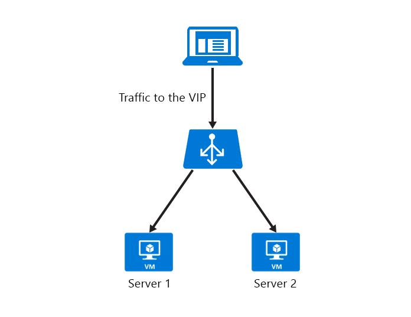

# Configure TCP idle timeout settings for Azure Load Balancer

[!INCLUDE [updated-for-az](../../includes/updated-for-az.md)]

[!INCLUDE [cloud-shell-try-it.md](../../includes/cloud-shell-try-it.md)]

If you choose to install and use PowerShell locally, this article requires the Azure PowerShell module version 5.4.1 or later. Run `Get-Module -ListAvailable Az` to find the installed version. If you need to upgrade, see [Install Azure PowerShell module](/powershell/azure/install-Az-ps). If you're running PowerShell locally, you also need to run `Connect-AzAccount` to create a connection with Azure.

## TCP Idle Timeout
Azure Load Balancer has an idle timeout setting of 4 minutes to 30 minutes. By default, it is set to 4 minutes. If a period of inactivity is longer than the timeout value, there's no guarantee that the TCP or HTTP session is maintained between the client and your cloud service.

When the connection is closed, your client application may receive the following error message: "The underlying connection was closed: A connection that was expected to be kept alive was closed by the server."

A common practice is to use a TCP keep-alive. This practice keeps the connection active for a longer period. For more information, see these [.NET examples](https://msdn.microsoft.com/library/system.net.servicepoint.settcpkeepalive.aspx). With keep-alive enabled, packets are sent during periods of inactivity on the connection. Keep-alive packets ensure the idle timeout value isn't reached and the connection is maintained for a long period.

The setting works for inbound connections only. To avoid losing the connection, configure the TCP keep-alive with an interval less than the idle timeout setting or increase the idle timeout value. To support these scenarios, support for a configurable idle timeout has been added.

TCP keep-alive works for scenarios where battery life isn't a constraint. It isn't recommended for mobile applications. Using a TCP keep-alive in a mobile application can drain the device battery faster.



The following sections describe how to change idle timeout settings for public IP and load balancer resources.

>[!NOTE]
> TCP idle timeout does not affect load balancing rules on UDP protocol.


## Configure the TCP timeout for your instance-level public IP to 15 minutes

```azurepowershell-interactive
$publicIP = Get-AzPublicIpAddress -Name MyPublicIP -ResourceGroupName MyResourceGroup
$publicIP.IdleTimeoutInMinutes = "15"
Set-AzPublicIpAddress -PublicIpAddress $publicIP
```

`IdleTimeoutInMinutes` is optional. If it isn't set, the default timeout is 4 minutes. The acceptable timeout range is 4 to 30 minutes.

## Set the TCP timeout on a load-balanced rule to 15 minutes

To set the idle timeout for a load balancer, the 'IdleTimeoutInMinutes' is set on the load-balanced rule. For example:

```azurepowershell-interactive
$lb = Get-AzLoadBalancer -Name "MyLoadBalancer" -ResourceGroup "MyResourceGroup"
$lb | Set-AzLoadBalancerRuleConfig -Name myLBrule -IdleTimeoutInMinutes 15
```
## Next steps

[Internal load balancer overview](load-balancer-internal-overview.md)

[Get started configuring an Internet-facing load balancer](quickstart-create-standard-load-balancer-powershell.md)

[Configure a load balancer distribution mode](load-balancer-distribution-mode.md)
