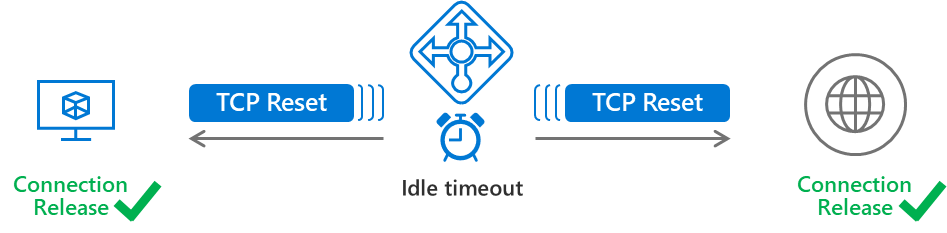

# Load Balancer with TCP Reset on Idle (Public Preview)

You can use [Standard Load Balancer](load-balancer-standard-overview.md) to create a more predictable application behavior for your scenarios with bidirectional TCP Resets (TCP RST packet) for each configurable idle timeout.  Load Balancer's default behavior is to silently drop flows when the idle timeout of a flow is reached.



>[!NOTE] 
>Load Balancer with TCP reset on idle timeout functionality is available as Public Preview at this time and available in a limited set of [regions](#regions). This preview is provided without a service level agreement and is not recommended for production workloads. Certain features may not be supported or may have constrained capabilities. See the [Supplemental Terms of Use for Microsoft Azure Previews](https://azure.microsoft.com/support/legal/preview-supplemental-terms/) for details.
 
You change this default behavior and enable sending TCP Resets on idle timeout on inbound NAT rules, load balancing rules, and [outbound rules](https://aka.ms/lboutboundrules).  When enabled per rule, Load Balancer will send bidirectional TCP Reset (TCP RST packets) to both client and server endpoints at the time of idle timeout for all matching flows.

Endpoints receiving TCP RST packets close the corresponding socket immediately. This provides an immediate notification to the endpoints that the release of the connection has occurred and any future communication on the same TCP connection will fail.  Applications can purge connections when the socket closes and reestablish connections as needed without waiting for the TCP connection to eventually time out.

For many scenarios, this may reduce the need to send TCP (or application layer) keepalives to refresh the idle timeout of a flow. 

If your idle durations exceed those of allowed by the configuration or your application shows an undesirable behavior with TCP Resets enabled, you may still need to use TCP keepalives (or application layer keepalives) to monitor the liveness of the TCP connections.  Further, keepalives can also remain useful for when the connection is proxied somewhere in the path, particularly application layer keepalives.  

Carefully examine the entire end to end scenario to decide whether you benefit from enabling TCP Resets, adjusting the idle timeout, and if additional steps may be required to ensure the desired application behavior.

## Enabling TCP Reset on idle timeout

Using API version 2018-07-01, you can enable sending of bidirectional TCP Resets on idle timeout on a per rule basis:

```json
      "loadBalancingRules": [
        {
          "enableTcpReset": true | false,
        }
      ]
```

```json
      "inboundNatRules": [
        {
          "enableTcpReset": true | false,
        }
      ]
```

```json
      "outboundRules": [
        {
          "enableTcpReset": true | false,
        }
      ]
```

## <a name="regions"></a> Region availability

This parameter is currently effective in the following regions.  In regions not listed here, the parameter has no effect.

| Region |
|---|
| Asia Southeast |
| Europe West |
| US East 2 |
| US North |
| US West |

This table will be updated as the preview is expanded to other regions.  

## Limitations

- Limited [region availability](#regions).
- Portal cannot be used to configure or view TCP Reset.  Use templates, REST API, Az CLI 2.0, or PowerShell instead.

## Next steps

- Learn about [Standard Load Balancer](load-balancer-standard-overview.md).
- Learn about [outbound rules](load-balancer-outbound-rules-overview.md).
