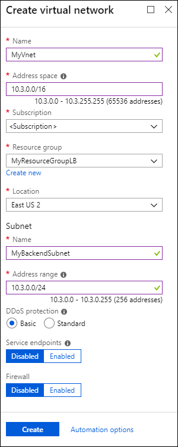
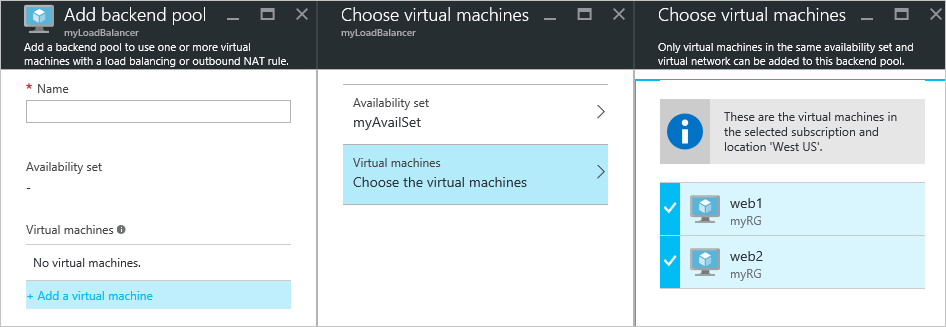

# Quickstart: Create a Basic Load Balancer by using the Azure portal

Load balancing provides a higher level of availability and scale by spreading incoming requests across virtual machines (VMs). You can use the Azure portal to create a load balancer and balance traffic among VMs. This quickstart shows you how to create and configure a load balancer, back-end servers, and network resources at the Basic pricing tier.

If you don't have an Azure subscription, create a [free account](https://azure.microsoft.com/free/?WT.mc_id=A261C142F) before you begin. 

To do the tasks in this quickstart, sign in to the [Azure portal](https://portal.azure.com).

## Create a Basic Load Balancer

First, create a public Basic Load Balancer by using the portal. The name and public IP address you create are automatically configured as the load balancer's front end.

1. On the top left-hand side of the screen, click **Create a resource** > **Networking** > **Load Balancer**.
2. In the **Basics** tab of the **Create load balancer** page, enter or select the following information, accept the defaults for the remaining settings, and then select **Review + create**:

    | Setting                 | Value                                              |
    | ---                     | ---                                                |
    | Subscription               | Select your subscription.    |    
    | Resource group         | Select **Create new** and type *MyResourceGroupLB* in the text box.|
    | Name                   | *myLoadBalancer*                                   |
    | Region         | Select **West Europe**.                                        |
    | Type          | Select **Public**.                                        |
    | SKU           | Select **Basic**.                          |
    | Public IP address | Select **Create new**. |
    | Public IP address name              | *MyPublicIP*   |
    | Assignment| Static|

3. In the **Review + create** tab, click **Create**.   


## Create back-end servers

Next, create a virtual network and two virtual machines for the back-end pool of your Basic load balancer. 

### Create a virtual network

1. On the upper-left side of the portal, select **Create a resource** > **Networking** > **Virtual network**.
   
1. In the **Create virtual network** pane, type or select these values:
   
   - **Name**: Type *MyVnet*.
   - **ResourceGroup**: Drop down **Select existing** and select **MyResourceGroupLB**. 
   - **Subnet** > **Name**: Type *MyBackendSubnet*.
   
1. Select **Create**.

   

### Create virtual machines

1. On the upper-left side of the portal, select **Create a resource** > **Compute** > **Windows Server 2016 Datacenter**. 
   
1. In **Create a virtual machine**, type or select the following values in the **Basics** tab:
   - **Subscription** > **Resource Group**: Drop down and select **MyResourceGroupLB**.
   - **Instance Details** > **Virtual machine name**: Type *MyVM1*.
   - **Instance Details** > **Availability Options**: 
     1. Drop down and select **Availability set**. 
     2. Select **Create new**, type *MyAvailabilitySet*, and select **OK**.
  
1. Select the **Networking** tab, or select **Next: Disks**, then **Next: Networking**. 
   
   Make sure the following are selected:
   - **Virtual network**: **MyVnet**
   - **Subnet**: **MyBackendSubnet**
   - **Public IP**: **MyVM1-ip**
   
   To create a new network security group (NSG), a type of firewall, under **Network Security Group**, select **Advanced**. 
   1. In the **Configure network security group** field, select **Create new**. 
   1. Type *MyNetworkSecurityGroup*, and select **OK**. 
   
1. Select the **Management** tab, or select **Next** > **Management**. Under **Monitoring**, set **Boot diagnostics** to **Off**.
   
1. Select **Review + create**.
   
1. Review the settings, and then select **Create**. 

1. Follow the steps to create a second VM named *MyVM2*, with a **Public IP** address of *MyVM2-ip*, and all the other settings the same as MyVM1. 

### Create NSG rules for the VMs

In this section, you create network security group (NSG) rules for the VMs, to allow inbound internet (HTTP) and remote desktop (RDP) connections.

1. Select **All resources** on the left menu. From the resource list, select **MyNetworkSecurityGroup** in the **MyResourceGroupLB** resource group.
   
1. Under **Settings**, select **Inbound security rules**, and then select **Add**.
   
1. In the **Add inbound security rule** dialog, for the HTTP rule, type or select the following:
   
   - **Source**: Select **Service Tag**.  
   - **Source service tag**: Select **Internet**. 
   - **Destination port ranges**: Type *80*.
   - **Protocol**: Select **TCP**. 
   - **Action**: Select **Allow**.  
   - **Priority**: Type *100*. 
   - **Name**: Type *MyHTTPRule*. 
   - **Description**: Type *Allow HTTP*. 
   
1. Select **Add**. 
   
   
   
1. Repeat the steps for the inbound RDP rule, with the following differing values:
   - **Destination port ranges**: Type *3389*.
   - **Priority**: Type *200*. 
   - **Name**: Type *MyRDPRule*. 
   - **Description**: Type *Allow RDP*. 

## Create resources for the load balancer

In this section, you configure load balancer settings for a back-end address pool, a health probe, and a load balancer rule.

### Create a backend address pool

To distribute traffic to the VMs, the load balancer uses a back-end address pool. The back-end address pool contains the IP addresses of the virtual network interfaces (NICs) that are connected to the load balancer. 

**To create a back-end address pool that includes VM1 and VM2:**

1. Select **All resources** on the left menu, and then select **MyLoadBalancer** from the resource list.
   
1. Under **Settings**, select **Backend pools**, and then select **Add**.
   
1. On the **Add a backend pool** page, type or select the following values:
   
   - **Name**: Type *MyBackEndPool*.
   - **Associated to**: Drop down and select **Availability set**.
   - **Availability set**: Select **MyAvailabilitySet**.
   
1. Select **Add a target network IP configuration**. 
   1. Add each virtual machine (**MyVM1** and **MyVM2**) that you created to the back-end pool.
   2. After you add each machine, drop down and select its **Network IP configuration**. 
   
1. Select **OK**.
   
   
   
1. On the **Backend pools** page, expand **MyBackendPool** and make sure both **VM1** and **VM2** are listed.

### Create a health probe

To allow the load balancer to monitor VM status, you use a health probe. The health probe dynamically adds or removes VMs from the load balancer rotation based on their response to health checks. 

**To create a health probe to monitor the health of the VMs:**

1. Select **All resources** on the left menu, and then select **MyLoadBalancer** from the resource list.
   
1. Under **Settings**, select **Health probes**, and then select **Add**.
   
1. On the **Add a health probe** page, type or select the following values:
   
   - **Name**: Type *MyHealthProbe*.
   - **Protocol**: Drop down and select **HTTP**. 
   - **Port**: Type *80*. 
   - **Path**: Accept */* for the default URI. You can replace this value with any other URI. 
   - **Interval**: Type *15*. Interval is the number of seconds between probe attempts.
   - **Unhealthy threshold**: Type *2*. This value is the number of consecutive probe failures that occur before a VM is considered unhealthy.
   
1. Select **OK**.
   
   

### Create a load balancer rule

A load balancer rule defines how traffic is distributed to the VMs. The rule defines the front-end IP configuration for incoming traffic, the back-end IP pool to receive the traffic, and the required source and destination ports. 

The load balancer rule named **MyLoadBalancerRule** listens to port 80 in the front-end **LoadBalancerFrontEnd**. The rule sends network traffic to the back-end address pool **MyBackEndPool**, also on port 80. 

**To create the load balancer rule:**


1. Select **All resources** on the left menu, and then select **MyLoadBalancer** from the resource list.
   
1. Under **Settings**, select **Load balancing rules**, and then select **Add**.
   
1. On the **Add load balancing rule** page, type or select the following values:
   
   - **Name**: Type *MyLoadBalancerRule*.
   - **Frontend IP address:** Type *LoadBalancerFrontend*.
   - **Protocol**: Select **TCP**.
   - **Port**: Type *80*.
   - **Backend port**: Type *80*.
   - **Backend pool**: Select **MyBackendPool**.
   - **Health probe**: Select **MyHealthProbe**. 
   
1. Select **OK**.
   
   

## Test the load balancer

You'll use the public IP address to test the load balancer on the VMs. 

In the portal, on the **Overview** page for **MyLoadBalancer**, find its public IP address under **Public IP Address**. Hover over the address and select the **Copy** icon to copy it. 

### Install IIS on the VMs

Install Internet Information Services (IIS) on the virtual machines to help test the load balancer.

**To remote desktop (RDP) into the VM:**

1. In the portal, select **All resources** on the left menu. From the resource list, select **MyVM1** in the **MyResourceGroupLB** resource group.
   
1. On the **Overview** page, select **Connect**, and then select **Download RDP file**. 
   
1. Open the RDP file you downloaded, and select **Connect**.
   
1. On the Windows Security screen, select **More choices** and then **Use a different account**. 
   
   Enter username and password and select **OK**.
   
1. Respond **Yes** to any certificate prompt. 
   
   The VM desktop opens in a new window. 
   
**To install IIS**

1. Select **All services** in the left-hand menu, select **All resources**, and then from the resources list, select **myVM1** that is located in the *myResourceGroupSLB* resource group.
2. On the **Overview** page, select **Connect** to RDP into the VM.
5. Log into the VM with the credentials that you provided during the creation of this VM. This launches a remote desktop session with virtual machine - *myVM1*.
6. On the server desktop, navigate to **Windows Administrative Tools**>**Windows PowerShell**.
7. In the PowerShell Window, run the following commands to install the IIS server, remove the  default iisstart.htm file, and then add a new iisstart.htm file that displays the name of the VM:

   ```azurepowershell
    
    # install IIS server role
    Install-WindowsFeature -name Web-Server -IncludeManagementTools
    
    # remove default htm file
    remove-item  C:\inetpub\wwwroot\iisstart.htm
    
    # Add a new htm file that displays server name
    Add-Content -Path "C:\inetpub\wwwroot\iisstart.htm" -Value $("Hello World from " + $env:computername)
   ```
6. Close the RDP session with *myVM1*.
7. Repeat steps 1 to 6 to install IIS and the updated iisstart.htm file on *myVM2*.
   
1. Repeat the steps for the virtual machine **MyVM2**, except set the destination server to **MyVM2**.

### Test the load balancer

Open a browser and paste your load balancer's public IP address into the browser's address bar. The IIS web server default page should appear in the browser.


To see the load balancer distribute traffic across both VMs running your app, you can force-refresh your web browser.
## Clean up resources

To delete the load balancer and all related resources when you no longer need them, open the **MyResourceGroupLB** resource group and select **Delete resource group**.

## Next steps

In this quickstart, you created a Basic-tier load balancer. You created and configured a resource group, network resources, back-end servers, a health probe, and rules to use with the load balancer. You installed IIS on the VMs and used it to test the load balancer. 

To learn more about Azure Load Balancer, continue to the tutorials.

> [!div class="nextstepaction"]
> [Azure Load Balancer tutorials](tutorial-load-balancer-basic-internal-portal.md)
