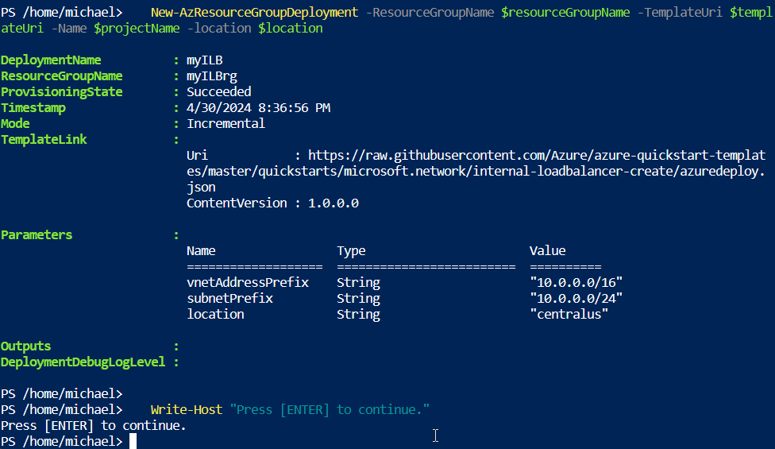

# Quickstart: Create an internal load balancer to load balance VMs using an ARM template

In this quickstart, you learn to use an Azure Resource Manager template (ARM template) to create an internal Azure load balancer. The internal load balancer distributes traffic to virtual machines in a virtual network. The template creates a virtual network, network interfaces, and an internal load balancer.

Using an ARM template takes fewer steps comparing to other deployment methods.

[!INCLUDE [About Azure Resource Manager](../../includes/resource-manager-quickstart-introduction.md)]

If your environment meets the prerequisites and you're familiar with using ARM templates, select the **Deploy to Azure** button. The template opens in the Azure portal.

:::image type="content" source="~/reusable-content/ce-skilling/azure/media/template-deployments/deploy-to-azure-button.svg" alt-text="Button to deploy the Resource Manager template to Azure." border="false" link="https://portal.azure.com/#create/Microsoft.Template/uri/https%3A%2F%2Fraw.githubusercontent.com%2FAzure%2Fazure-quickstart-templates%2Fmaster%2Fquickstarts%2Fmicrosoft.compute%2Finternal-loadbalancer-create%2Fazuredeploy.json":::

## Prerequisites

If you don't have an Azure subscription, create a [free account](https://azure.microsoft.com/free/?WT.mc_id=A261C142F) before you begin.

## Review the template

The template used in this quickstart is from the [Azure Quickstart Templates](https://azure.microsoft.com/resources/templates/internal-loadbalancer-create/).

:::code language="json" source="~/quickstart-templates/quickstarts/microsoft.network/internal-loadbalancer-create/azuredeploy.json":::

Multiple Azure resources have been defined in the template:

- [**Microsoft.Network/virtualNetworks**](/azure/templates/microsoft.network/virtualNetworks): Virtual network for load balancer and virtual machines.
- [**Microsoft.Network/networkInterfaces**](/azure/templates/microsoft.network/networkInterfaces): Network interfaces for virtual machines.
- [**Microsoft.Network/loadBalancers**](/azure/templates/microsoft.network/loadBalancers): Internal load balancer.

To find more templates that are related to Azure Load Balancer, see [Azure Quickstart Templates](https://azure.microsoft.com/resources/templates/?resourceType=Microsoft.Network&pageNumber=1&sort=Popular).

## Deploy the template

In this step, you deploy the template using Azure PowerShell with the `[New-AzResourceGroupDeployment](/powershell/module/az.resources/new-azresourcegroupdeployment)` command. 

1. Select **Try it** from the following code block to open Azure Cloud Shell, and then follow the instructions to sign in to Azure.

   ```azurepowershell-interactive
   $projectName = Read-Host -Prompt "Enter a project name with 12 or less letters or numbers that is used to generate Azure resource names"
   $location = Read-Host -Prompt "Enter the location (i.e. centralus)"

   $resourceGroupName = "${projectName}rg"
   $templateUri = "https://raw.githubusercontent.com/Azure/azure-quickstart-templates/master/quickstarts/microsoft.network/internal-loadbalancer-create/azuredeploy.json"
    
   New-AzResourceGroup -Name $resourceGroupName -Location $location
   New-AzResourceGroupDeployment -ResourceGroupName $resourceGroupName -TemplateUri $templateUri -Name $projectName -location $location

   Write-Host "Press [ENTER] to continue."
   ```

   Wait until you see the prompt from the console.

2. Select **Copy** from the previous code block to copy the PowerShell script.

3. Right-click the shell console pane and then select **Paste**.

4. Enter the values.

   The resource group name is the project name with **`rg`** appended. You need the resource group name in the next section.

It takes about 10 minutes to deploy the template. When completed, the output is similar to:



Azure PowerShell is used to deploy the template. You can also use the Azure portal, Azure CLI, and REST API. To learn other deployment methods, see [Deploy templates](../azure-resource-manager/templates/deploy-portal.md).

## Review deployed resources

1. Sign in to the [Azure portal](https://portal.azure.com).

1. Select **Resource groups** from the left pane.

1. Select the resource group that you created in the previous section. The default resource group name is **myResourceGroupLB**

1. Verify the following resources were created in the resource group:

:::image type="content" source="media/quickstart-load-balancer-standard-internal-template/verify-creation.png" alt-text="User Azure portal to verify creation of resources." border="true":::

## Clean up resources

When no longer needed, you can use the [Remove-AzResourceGroup](/powershell/module/az.resources/remove-azresourcegroup) command to remove the resource group, load balancer, and the remaining resources.

```azurepowershell-interactive
Remove-AzResourceGroup -Name "${projectName}rg"
```

## Next steps

For a step-by-step tutorial that guides you through the process of creating a template, see:

> [!div class="nextstepaction"]
> [Tutorial: Create and deploy your first ARM template](../azure-resource-manager/templates/template-tutorial-create-first-template.md)