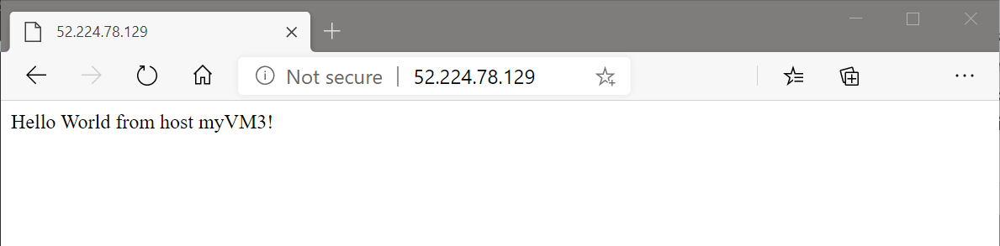

# Quickstart: Create a Standard Load Balancer to load balance VMs using Azure CLI

This quickstart shows you how to create a public Load Balancer. To test the load balancer, you deploy two virtual machines (VMs) running Ubuntu server and load balance a web app between the two VMs.

[!INCLUDE [cloud-shell-try-it.md](../../includes/cloud-shell-try-it.md)] 

If you choose to install and use the CLI locally, this tutorial requires that you are running a version of the Azure CLI version 2.0.28 or later. To find the version, run `az --version`. If you need to install or upgrade, see [Install the Azure CLI]( /cli/azure/install-azure-cli).

## Create a resource group

Create a resource group with [az group create](https://docs.microsoft.com/cli/azure/group). An Azure resource group is a logical container into which Azure resources are deployed and managed.

The following example creates a resource group named *myResourceGroupSLB* in the *eastus* location:

```azurecli-interactive
  az group create \
    --name myResourceGroupSLB \
    --location eastus
```

## Create a public IP address

To access your web app on the Internet, you need a public IP address for the load balancer. Use [az network public-ip create](https://docs.microsoft.com/cli/azure/network/public-ip) to create a Standard zone redundant Public IP address named *myPublicIP* in *myResourceGroupSLB*.

```azurecli-interactive
  az network public-ip create --resource-group myResourceGroupSLB --name myPublicIP --sku standard
```

To create a zonal Public IP address in zone 1 use:

```azurecli-interactive
  az network public-ip create --resource-group myResourceGroupSLB --name myPublicIP --sku standard --zone 1
```

Use `-SKU Basic` to create a Basic Public IP. Basic Public IPs are not compatible with **Standard** load balancer. Microsoft recommends using **Standard** for production workloads.

> [!IMPORTANT]
> The rest of this quickstart assumes that **Standard** SKU is chosen during the SKU selection process above.

## Create Azure Load balancer

This section details how you can create and configure the following components of the load balancer:
  - a frontend IP pool that receives the incoming network traffic on the load balancer.
  - a backend IP pool where the frontend pool sends the load balanced network traffic.
  - a health probe that determines health of the backend VM instances.
  - a load balancer rule that defines how traffic is distributed to the VMs.

### Create the load balancer

Create a public Azure Load Balancer with [az network lb create](https://docs.microsoft.com/cli/azure/network/lb?view=azure-cli-latest) named **myLoadBalancer** that includes a frontend pool named **myFrontEnd**, a backend pool named **myBackEndPool** that is associated with the public IP address **myPublicIP** that you created in the preceding step. Use `--sku basic` to create a Basic Public IP. Microsoft recommends Standard SKU for production workloads.

```azurecli-interactive
  az network lb create \
    --resource-group myResourceGroupSLB \
    --name myLoadBalancer \
    --sku standard \
    --public-ip-address myPublicIP \
    --frontend-ip-name myFrontEnd \
    --backend-pool-name myBackEndPool       
```

> [!IMPORTANT]
> The rest of this quickstart assumes that **Standard** SKU is chosen during the SKU selection process above.

### Create the health probe

A health probe checks all virtual machine instances to make sure they can send network traffic. The virtual machine instance with failed probe checks is removed from the load balancer until it goes back online and a probe check determines that it's healthy. Create a health probe with [az network lb probe create](https://docs.microsoft.com/cli/azure/network/lb/probe?view=azure-cli-latest) to monitor the health of the virtual machines. 

```azurecli-interactive
  az network lb probe create \
    --resource-group myResourceGroupSLB \
    --lb-name myLoadBalancer \
    --name myHealthProbe \
    --protocol tcp \
    --port 80   
```

### Create the load balancer rule

A load balancer rule defines the frontend IP configuration for the incoming traffic and the backend IP pool to receive the traffic, along with the required source and destination port. Create a load balancer rule *myLoadBalancerRuleWeb* with [az network lb rule create](https://docs.microsoft.com/cli/azure/network/lb/rule?view=azure-cli-latest) for listening to port 80 in the frontend pool *myFrontEnd* and sending load-balanced network traffic to the backend address pool *myBackEndPool* also using port 80. 

```azurecli-interactive
  az network lb rule create \
    --resource-group myResourceGroupSLB \
    --lb-name myLoadBalancer \
    --name myHTTPRule \
    --protocol tcp \
    --frontend-port 80 \
    --backend-port 80 \
    --frontend-ip-name myFrontEnd \
    --backend-pool-name myBackEndPool \
    --probe-name myHealthProbe  
```

## Configure virtual network

Before you deploy some VMs and can test your load balancer, create the supporting virtual network resources.

### Create a virtual network

Create a virtual network named *myVnet* with a subnet named *mySubnet* in the *myResourceGroup* using [az network vnet create](https://docs.microsoft.com/cli/azure/network/vnet).

```azurecli-interactive
  az network vnet create \
    --resource-group myResourceGroupSLB \
    --location eastus \
    --name myVnet \
    --subnet-name mySubnet
```

### Create a network security group

For a Standard Load Balancer, the VMs in the backend address for are required to have NICs that belong to a Network Security group. Create network security group to define inbound connections to your virtual network.

```azurecli-interactive
  az network nsg create \
    --resource-group myResourceGroupSLB \
    --name myNetworkSecurityGroup
```

### Create a network security group rule

Create a network security group rule to allow inbound connections through port 80.

```azurecli-interactive
  az network nsg rule create \
    --resource-group myResourceGroupSLB \
    --nsg-name myNetworkSecurityGroup \
    --name myNetworkSecurityGroupRuleHTTP \
    --protocol tcp \
    --direction inbound \
    --source-address-prefix '*' \
    --source-port-range '*' \
    --destination-address-prefix '*' \
    --destination-port-range 80 \
    --access allow \
    --priority 200
```

### Create NICs

Create three network interfaces with [az network nic create](/cli/azure/network/nic#az-network-nic-create) and associate them with the Public IP address and the network security group. 

```azurecli-interactive

  az network nic create \
    --resource-group myResourceGroupSLB \
    --name myNicVM1 \
    --vnet-name myVnet \
    --subnet mySubnet \
    --network-security-group myNetworkSecurityGroup \
    --lb-name myLoadBalancer \
    --lb-address-pools myBackEndPool

  az network nic create \
    --resource-group myResourceGroupSLB \
    --name myNicVM2 \
    --vnet-name myVnet \
    --subnet mySubnet \
    --network-security-group myNetworkSecurityGroup \
    --lb-name myLoadBalancer \
    --lb-address-pools myBackEndPool
  
  az network nic create \
    --resource-group myResourceGroupSLB \
    --name myNicVM3 \
    --vnet-name myVnet \
    --subnet mySubnet \
    --network-security-group myNetworkSecurityGroup \
    --lb-name myLoadBalancer \
    --lb-address-pools myBackEndPool

```

## Create backend servers

In this example, you create three virtual machines to be used as backend servers for the load balancer. To verify that the load balancer was successfully created, you also install NGINX on the virtual machines.

If you're creating a Basic Load Balancer with a Basic Public IP, you will need to create an Availability Set using ([az vm availabilityset create](/cli/azure/network/nic) to add your virtual machines into. Standard Load Balancers do not require this additional step. Microsoft recommends using Standard.

### Create three virtual machines

You can use a cloud-init configuration file to install NGINX and run a 'Hello World' Node.js app on a Linux virtual machine. In your current shell, create a file named cloud-init.txt and copy and paste the following configuration into the shell. Make sure that you copy the whole cloud-init file correctly, especially the first line:

```yaml
#cloud-config
package_upgrade: true
packages:
  - nginx
  - nodejs
  - npm
write_files:
  - owner: www-data:www-data
  - path: /etc/nginx/sites-available/default
    content: |
      server {
        listen 80;
        location / {
          proxy_pass http://localhost:3000;
          proxy_http_version 1.1;
          proxy_set_header Upgrade $http_upgrade;
          proxy_set_header Connection keep-alive;
          proxy_set_header Host $host;
          proxy_cache_bypass $http_upgrade;
        }
      }
  - owner: azureuser:azureuser
  - path: /home/azureuser/myapp/index.js
    content: |
      var express = require('express')
      var app = express()
      var os = require('os');
      app.get('/', function (req, res) {
        res.send('Hello World from host ' + os.hostname() + '!')
      })
      app.listen(3000, function () {
        console.log('Hello world app listening on port 3000!')
      })
runcmd:
  - service nginx restart
  - cd "/home/azureuser/myapp"
  - npm init
  - npm install express -y
  - nodejs index.js
```

Create the virtual machines with [az vm create](/cli/azure/vm#az-vm-create).

```azurecli-interactive

  az vm create \
    --resource-group myResourceGroupSLB \
    --name myVM1 \
    --availability-set myAvailabilitySet \
    --nics myNicVM1 \
    --image UbuntuLTS \
    --generate-ssh-keys \
    --custom-data cloud-init.txt \
    --no-wait
   
  az vm create \
    --resource-group myResourceGroupSLB \
    --name myVM2 \
    --availability-set myAvailabilitySet \
    --nics myNicVM2 \
    --image UbuntuLTS \
    --generate-ssh-keys \
    --custom-data cloud-init.txt \
    --no-wait

   az vm create \
    --resource-group myResourceGroupSLB \
    --name myVM3 \
    --availability-set myAvailabilitySet \
    --nics myNicVM3 \
    --image UbuntuLTS \
    --generate-ssh-keys \
    --custom-data cloud-init.txt \
    --no-wait

```

It may take a few minutes for the VMs to get deployed.

## Test the load balancer

To get the public IP address of the load balancer, use [az network public-ip show](/cli/azure/network/public-ip#az-network-public-ip-show). Copy the public IP address, and then paste it into the address bar of your browser.

```azurecli-interactive
  az network public-ip show \
    --resource-group myResourceGroupSLB \
    --name myPublicIP \
    --query [ipAddress] \
    --output tsv
```

   

## Clean up resources

When no longer needed, you can use the [az group delete](/cli/azure/group#az-group-delete) command to remove the resource group, load balancer, and all related resources.

```azurecli-interactive
  az group delete --name myResourceGroupSLB
```

## Next steps
In this quickstart, you created a Standard Load Balancer, attached VMs to it, configured the Load Balancer traffic rule, health probe, and then tested the Load Balancer. To learn more about Azure Load Balancer, continue to [Azure Load Balancer tutorials](tutorial-load-balancer-standard-public-zone-redundant-portal.md).

Learn more about [Load Balancer and Availability zones](load-balancer-standard-availability-zones.md).