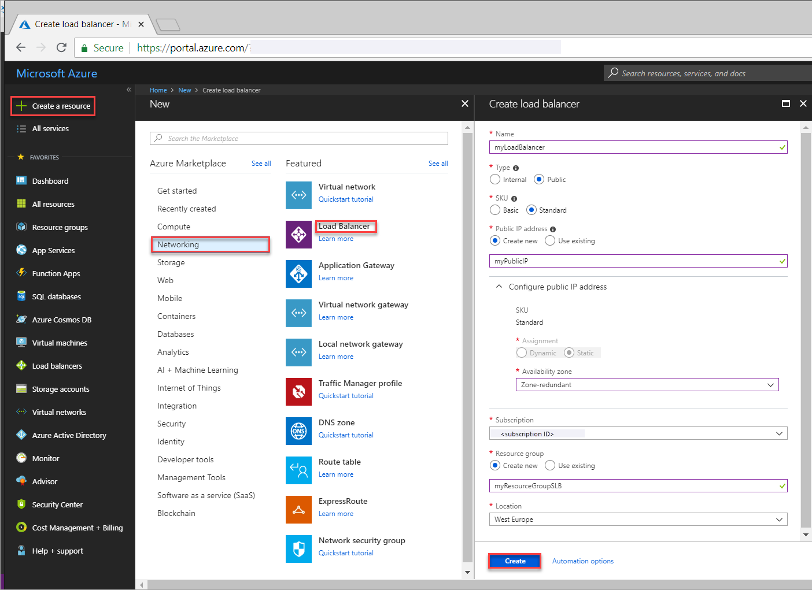
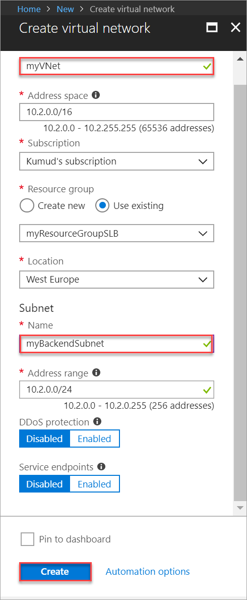
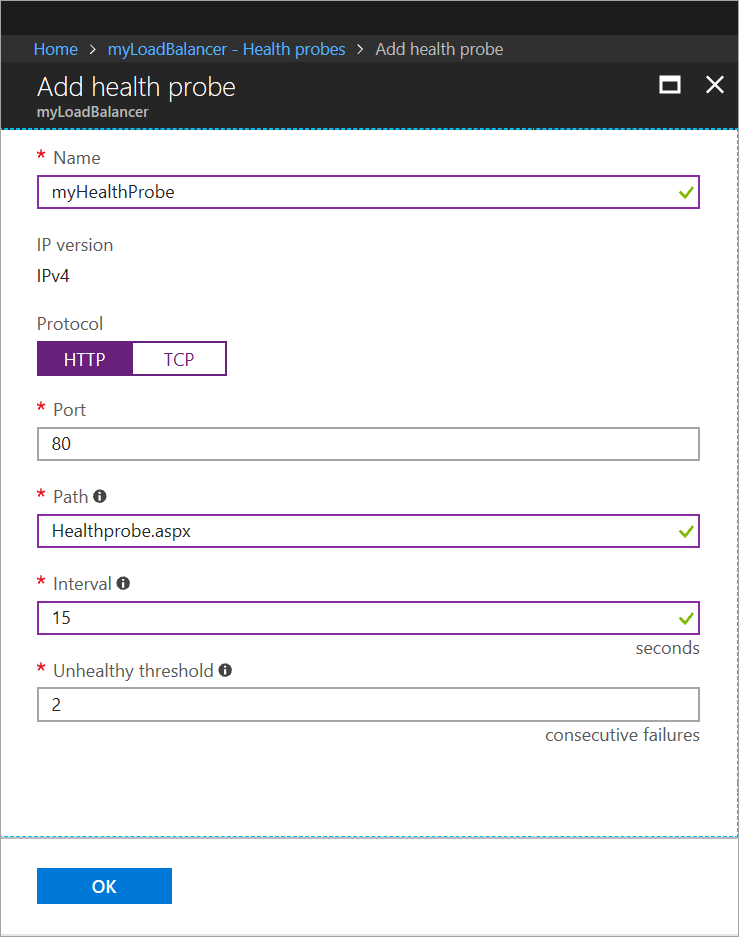
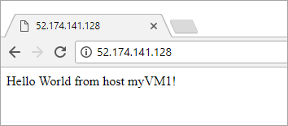

# Quickstart: Create a Standard Load Balancer to load balance VMs using the Azure portal

Load balancing provides a higher level of availability and scale by spreading incoming requests across multiple virtual machines. You can use the Azure portal to create a load balancer to load balance virtual machines (VMs). This quickstart shows you how to load balance VMs using a Standard Load Balancer.

If you don't have an Azure subscription, create a [free account](https://azure.microsoft.com/free/?WT.mc_id=A261C142F) before you begin. 

## Sign in to Azure

Sign in to the Azure portal at [http://portal.azure.com](http://portal.azure.com).

## Create a public load balancer

In this section, you create a public load balancer that helps load balance virtual machines. Standard Load Balancer only supports a Standard Public IP address. When you create a Standard Load Balancer, and you must also create a new Standard Public IP address that is configured as the frontend (named as *LoadBalancerFrontend* by default) for the Standard Load Balancer. 

1. On the top left-hand side of the screen, click **Create a resource** > **Networking** > **Load Balancer**.
2. In the **Create load balancer** page, enter or select the following information, accept the defaults for the remaining settings, and then select **Create**:

    | Setting                 | Value                                              |
    | ---                     | ---                                                |
    | Name                   | *myLoadBalancer*                                   |
    | Type          | Public                                        |
    | SKU           | Standard                          |
    | Public IP address | Select **Create new** and type *myPublicIP* in the text box. The Standard SKU for the Public IP address is selected by default. For **Availability zone**, select **Zone-redundant**. |
    | Subscription               | Select your subscription.    |
    |Resource group | Select **Create new**, and then type *myResourceGroupSLB*.    |
    | Location           | Select **West Europe**.                          |
    

## Create backend servers

In this section, you create a virtual network, create two virtual machines for the backend pool of your load balancer, and then install IIS on the virtual machines to help test the load balancer.

### Create a virtual network
1. On the top left-hand side of the screen click **New** > **Networking** > **Virtual network** and enter these values for the virtual network:
    - *myVnet* - for the name of the virtual network.
    - *myResourceGroupSLB* - for the name of the existing resource group
    - *myBackendSubnet* - for the subnet name.
2. Click **Create** to create the virtual network.

    

### Create virtual machines

1. On the top left-hand side of the screen, click **New** > **Compute** > **Windows Server 2016 Datacenter** and enter these values for the virtual machine:
    - *myVM1* - for the name of the virtual machine.        
    - *myResourceGroupSLB* - for **Resource group**, select **Use existing**, and then select *myResourceGroupSLB*.
2. Click **OK**.
3. Select **DS1_V2** for the size of the virtual machine, and click **Select**.
4. Enter these values for the VM settings:
    1. Ensure that  *myVNet* is selected as the virtual network, and *myBackendSubnet* is selected as the subnet.
    2. For **Public IP address**, in the **Create Public IP address** pane, select **Standard**, and then select **OK**.
    3. For **Network Security Group**, select **Advanced**, and then do the following:
        1. Select *Network security group (firewall), and the **Choose network security group** page, select **Create new**. 
        2. In the **Create network security group** page, for **Name**, enter *myNetworkSecurityGroup*, and then select **OK**.
5. Click **Disabled** to disable boot diagnostics.
6. Click **OK**, review the settings on the summary page, and then click **Create**.
7. Using steps 1-6, create a second VM, named, *VM2* with *myAvailibilityset* as the Availability set, *myVnet* as its virtual network, *myBackendSubnet* and its subnet, and **myNetworkSecurityGroup* as its network security group. 

### Create NSG rule

In this section, you create a NSG rule to allow inbound connections using HTTP.

1. Click **All resources** in the left-hand menu, and then from the resources list click **myNetworkSecurityGroup** that is located in the **myResourceGroupSLB** resource group.
2. Under **Settings**, click **Inbound security rules**, and then click **Add**.
3. Enter these values for the inbound security rule named *myHTTPRule* to allow for an inbound HTTP connections using port 80:
    - *Service Tag* - for **Source**.
    - *Internet* - for **Source service tag**
    - *80* - for **Destination port ranges**
    - *TCP* - for **Protocol**
    - *Allow* - for **Action**
    - *100* for **Priority**
    - *myHTTPRule* for name
    - *Allow HTTP* - for description
4. Click **OK**.
 
### Install IIS

1. Click **All resources** in the left-hand menu, and then from the resources list click **myVM1** that is located in the *myResourceGroupLB* resource group.
2. On the **Overview** page, click **Connect** to RDP into the VM.
3. Log into the VM with username *azureuser*.
4. On the server desktop, navigate to **Windows Administrative Tools**>**Server Manager**.
5. In Server Manager, click **Add Roles and features**.
6. In the **Add Roles and Features Wizard**, use the following values:
    - In the **Select installation type** page, click **Role-based or feature-based installation**.
    - In the **Select destination server** page, click **myVM1**
    - In the **Select server role** page, click **Web Server (IIS)**
    - Follow instructions to complete the rest of the wizard 
7. Repeat steps 1 to 6 for the virtual machine *myVM2*.

## Create load balancer resources

In this section, you  configure load balancer settings for a backend address pool and a health probe, and specify a load balancer rule.

### Create a backend address pool

To distribute traffic to the VMs, a backend address pool contains the IP addresses of the virtual (NICs) connected to the load balancer. Create the backend address pool *myBackendPool* to inlcude *VM1* and *VM2*.

1. Click **All resources** in the left-hand menu, and then click **myLoadBalancer** from the resources list.
2. Under **Settings**, click **Backend pools**, then click **Add**.
3. On the **Add a backend pool** page, do the following:
   - For name, type *myBackendPool*, as the name for your backend pool.
   - For **Virtual network**, select *myVNet*.
   - Add *myVM1* and *my VM2* under **Virtual Machine** along with their corresponding IP addresses, and then select **Add**.
    - Click **OK**.

3. Check to make sure your load balancer backend pool setting displays both the VMs **VM1** and **VM2**.

### Create a health probe

To allow the load balancer to monitor the status of your app, you use a health probe. The health probe dynamically adds or removes VMs from the load balancer rotation based on their response to health checks. Create a health probe *myHealthProbe* to monitor the health of the VMs.

1. Click **All resources** in the left-hand menu, and then click **myLoadBalancer** from the resources list.
2. Under **Settings**, click **Health probes**, then click **Add**.
3. Use these values to create the health probe:
    - *myHealthProbe* - for the name of the health probe.
    - **HTTP** - for the protocol type.
    - *80* - for the port number.
    - *15* - for number of **Interval** in seconds between probe attempts.
    - *2* - for number of **Unhealthy threshold** or consecutive probe failures that must occur before a VM is considered unhealthy.
4. Click **OK**.

   

### Create a load balancer rule

A load balancer rule is used to define how traffic is distributed to the VMs. You define the frontend IP configuration for the incoming traffic and the backend IP pool to receive the traffic, along with the required source and destination port. Create a load balancer rule *myLoadBalancerRuleWeb* for listening to port 80 in the frontend *FrontendLoadBalancer* and sending load-balanced network traffic to the backend address pool *myBackEndPool* also using port 80. 

1. Click **All resources** in the left-hand menu, and then click **myLoadBalancer** from the resources list.
2. Under **Settings**, click **Load balancing rules**, then click **Add**.
3. Use these values to configure the load balancing rule:
    - *myHTTPRule* - for the name of the load balancing rule.
    - **TCP** - for the protocol type.
    - *80* - for the port number.
    - *80* - for the backend port.
    - *myBackendPool* - for the name of the backend pool.
    - *myHealthProbe* - for the name of the health probe.
4. Click **OK**.
    
    

## Test the load balancer
1. Find the public IP address for the Load Balancer on the **Overview** screen. Click **All resources** and then click **myPublicIP**.

2. Copy the public IP address, and then paste it into the address bar of your browser. The default page of IIS Web server is displayed on the browser.

      

## Clean up resources

When no longer needed, delete the resource group, load balancer, and all related resources. To do so, select the resource group that contains the load balancer and click **Delete**.

## Next steps

In this quickstart, you created a Standard Load Balancer, attached VMs to it, configured the load balancer traffic rule, health probe, and then tested the load balancer. To learn more about Azure Load Balancer, continue to the tutorials for Azure Load Balancer.

> [!div class="nextstepaction"]
> [Azure Load Balancer tutorials](tutorial-load-balancer-standard-public-zone-redundant-portal.md)
