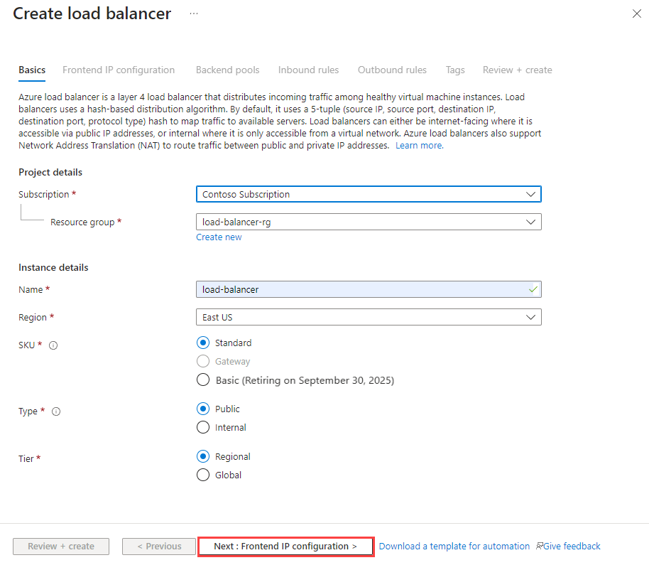

# Quickstart: Create a Standard Load Balancer to load balance VMs using the Azure portal

Load balancing provides a higher level of availability and scale by spreading incoming requests across multiple virtual machines. You can use the Azure portal to create a load balancer to load balance virtual machines (VMs). This quickstart shows you how to load balance VMs using a Standard Load Balancer.

If you don't have an Azure subscription, create a [free account](https://azure.microsoft.com/free/?WT.mc_id=A261C142F) before you begin. 

## Sign in to Azure

Sign in to the Azure portal at [https://portal.azure.com](https://portal.azure.com).

## Create a public load balancer

In this section, you create a public load balancer that helps load balance virtual machines. Standard Load Balancer only supports a Standard Public IP address. When you create a Standard Load Balancer, and you must also create a new Standard Public IP address that is configured as the frontend (named as *LoadBalancerFrontend* by default) for the Standard Load Balancer. 

1. On the top left-hand side of the screen, select **Create a resource** > **Networking** > **Load Balancer**.
2. In the **Basics** tab of the **Create load balancer** page, enter or select the following information, accept the defaults for the remaining settings, and then select **Review + create**:

    | Setting                 | Value                                              |
    | ---                     | ---                                                |
    | Subscription               | Select your subscription.    |    
    | Resource group         | Select **Create new** and type *MyResourceGroupSLB* in the text box.|
    | Name                   | *myLoadBalancer*                                   |
    | Region         | Select **West Europe**.                                        |
    | Type          | Select **Public**.                                        |
    | SKU           | Select **Standard**.                          |
    | Public IP address | Select **Create new**. |
    | Public IP address name              | Type *myPublicIP* in the text box.   |
    |Availability zone| Select **Zone redundant**.    |
3. In the **Review + create** tab, cliselect **Create**.   

    

## Create load balancer resources

In this section, you configure load balancer settings for a backend address pool, a health probe, and specify a balancer rule.

### Create a backend address pool

To distribute traffic to the VMs, a backend address pool contains the IP addresses of the virtual (NICs) connected to the load balancer. Create the backend address pool *myBackendPool* to include virtual machines for load balancing internet traffic.

1. Select **All services** in the left-hand menu, select **All resources**, and then select **myLoadBalancer** from the resources list.
2. Under **Settings**, select **Backend pools**, then select **Add**.
3. On the **Add a backend pool** page, for name, type *myBackendPool*, as the name for your backend pool, and then select **Add**.

### Create a health probe

To allow the load balancer to monitor the status of your app, you use a health probe. The health probe dynamically adds or removes VMs from the load balancer rotation based on their response to health checks. Create a health probe *myHealthProbe* to monitor the health of the VMs.

1. Select **All services** in the left-hand menu, select **All resources**, and then select **myLoadBalancer** from the resources list.
2. Under **Settings**, select **Health probes**, then select **Add**.
    | Setting | Value |
    | ------- | ----- |
    | Name | Enter *myHealthProbe*. |
    | Protocol | Select **HTTP**. |
    | Port | Enter *80*.|
    | Interval | Enter *15* for number of **Interval** in seconds between probe attempts. |
    | Unhealthy threshold | Select *2* for number of **Unhealthy threshold** or consecutive probe failures that must occur before a VM is considered unhealthy.|
    | Health probe | Select *myHealthProbe*. |
4. Select **OK**.

   

### Create a load balancer rule

A load balancer rule is used to define how traffic is distributed to the VMs. You define the frontend IP configuration for the incoming traffic and the backend IP pool to receive the traffic, along with the required source and destination port. Create a load balancer rule *myLoadBalancerRuleWeb* for listening to port 80 in the frontend *FrontendLoadBalancer* and sending load-balanced network traffic to the backend address pool *myBackEndPool* also using port 80. 

1. Select **All services** in the left-hand menu, select **All resources**, and then select **myLoadBalancer** from the resources list.
2. Under **Settings**, select **Load balancing rules**, then select **Add**.
3. Use these values to configure the load balancing rule:
    | Setting | Value |
    | ------- | ----- |
    | Name | Enter *myHTTPRule*. |
    | Protocol | Select **TCP**. |
    | Port | Enter *80*.|
    | Backend port | Enter *80*. |
    | Backend pool | Select *myBackendPool*.|
    | Health probe | Select *myHealthProbe*. |
4. Leave the rest of the defaults and select **OK**.
4. Select **OK**.

## Create backend servers

In this section, you create a virtual network, create two virtual machines for the backend pool of your load balancer, and then install IIS on the virtual machines to help test the load balancer.

### Create a virtual network
1. On the upper-left side of the screen, select **Create a resource** > **Networking** > **Virtual network**.

1. In **Create virtual network**, enter or select this information:

    | Setting | Value |
    | ------- | ----- |
    | Name | Enter *myVNet*. |
    | Address space | Enter *10.1.0.0/16*. |
    | Subscription | Select your subscription.|
    | Resource group | Select existing resource - *MyResourceGroupSLB*,. |
    | Location | Select **West Europe**.|
    | Subnet - Name | Enter *myBackendSubnet*. |
    | Subnet - Address range | Enter *10.1.0.0/24*. |

1. Leave the rest of the defaults and select **Create**.

### Create virtual machines
Standard Load Balancer only supports VMs with Standard IP addresses in the backend pool. In this section, you will create two VMs (*myVM1* and *myVM2*) with a Standard public IP address (*myPublicIP*) in two different zones (*Zone 1* and *Zone2*) that are added to the backend pool of the Standard Load Balancer that was created earlier.

1. On the upper-left side of the portal, select **Create a resource** > **Compute** > **Windows Server 2016 Datacenter**. 
   
1. In **Create a virtual machine**, type or select the following values in the **Basics** tab:
   - **Subscription** > **Resource Group**: Select **MyResourceGroupSLB**.
   - **Instance Details** > **Virtual machine name**: Type *MyVM1*.
   - **Instance Details** > **Region** > select **West Europe**.
   - **Instance Details** > **Availability Options** > Select **Availability zones**. 
   - **Instance Details** > **Availability zone** > Select **1**.
  
1. Select the **Networking** tab, or select **Next: Disks**, then **Next: Networking**. 
   
   - Make sure the following are selected:
       - **Virtual network**: **MyVnet**
       - **Subnet**: **MyBackendSubnet**
       - **Public IP** > select **Create new**, and in the **Create public IP address** window, for **SKU**, select **Standard**.
      
   - To create a new network security group (NSG), a type of firewall, under **Network Security Group**, select **Advanced**. 
       1. In the **Configure network security group** field, select **Create new**. 
       1. Type *MyNetworkSecurityGroup*, and select **OK**.

    - To make the VM a part of the load balancer's backend pool, complete the following steps:
        - In **Load Balancing**, for **Place this virtual machine behind an existing load balancing solution**, select **Yes**.
        - In **Load balancing settings**, for **Load balancing options**, select **Azure load balancer**.
        - For **Select a load balancer**, *myLoadBalancer*. 
1. Select the **Management** tab, or select **Next** > **Management**. Under **Monitoring**, set **Boot diagnostics** to **Off**. 
1. Select **Review + create**.   
1. Review the settings, and then select **Create**.
1. Follow the steps to create a second VM named *MyVM2*, with a Standard SKU public IP address named *MyVM2-ip*, and **Availability zone** setting of **2** and all the other settings the same as *MyVM1*. 

### Create NSG rule

In this section, you create a NSG rule to allow inbound connections using HTTP.

1. Select **All services** in the left-hand menu, select **All resources**, and then from the resources list select **myNetworkSecurityGroup** that is located in the **myResourceGroupSLB** resource group.
2. Under **Settings**, select **Inbound security rules**, and then select **Add**.
3. Enter these values for the inbound security rule named *myHTTPRule* to allow for an inbound HTTP connections using port 80:
    - *Service Tag* - for **Source**.
    - *Internet* - for **Source service tag**
    - *80* - for **Destination port ranges**
    - *TCP* - for **Protocol**
    - *Allow* - for **Action**
    - *100* for **Priority**
    - *myHTTPRule* for name
    - *Allow HTTP* - for description
4. Select **OK**.
 
### Install IIS

1. Select **All services** in the left-hand menu, select **All resources**, and then from the resources list, select **myVM1** that is located in the *myResourceGroupSLB* resource group.
2. On the **Overview** page, select **Connect** to RDP into the VM.
3. Log into the VM with username *azureuser*.
4. On the server desktop, navigate to **Windows Administrative Tools**>**Server Manager**.
5. In Server Manager, select **Add Roles and features**.
6. In the **Add Roles and Features Wizard**, use the following values:
    - In the **Select installation type** page, select **Role-based or feature-based installation**.
    - In the **Select destination server** page, select **myVM1**
    - In the **Select server role** page, select **Web Server (IIS)**
    - Follow instructions to complete the rest of the wizard 
7. Repeat steps 1 to 6 for the virtual machine *myVM2*.

## Test the load balancer
1. Find the public IP address for the Load Balancer on the **Overview** screen. Select **All services** in the left-hand menu, select **All resources**,and then select **myPublicIP**.

2. Copy the public IP address, and then paste it into the address bar of your browser. The default page of IIS Web server is displayed on the browser.

      
To see the load balancer distribute traffic across all three VMs running your app, you can force-refresh your web browser.
## Clean up resources

When no longer needed, delete the resource group, load balancer, and all related resources. To do so, select the resource group that contains the load balancer and select **Delete**.

## Next steps

In this quickstart, you created a Standard Load Balancer, attached VMs to it, configured the load balancer traffic rule, health probe, and then tested the load balancer. To learn more about Azure Load Balancer, continue to the tutorials for Azure Load Balancer.

> [!div class="nextstepaction"]
> [Azure Load Balancer tutorials](tutorial-load-balancer-standard-public-zone-redundant-portal.md)
