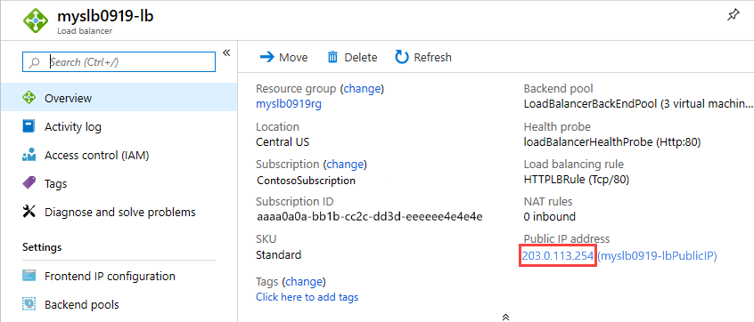

# Quickstart: Create a Load Balancer to load balance VMs by using Azure Resource Manager template

Load balancing provides a higher level of availability and scale by spreading incoming requests across multiple virtual machines (VMs). This quickstart shows you how to deploy an Azure Resource Manager template that creates a Standard load balancer to load balance VMs. Using Resource Manager template takes fewer steps comparing to other deployment methods.

[!INCLUDE [About Azure Resource Manager](../../includes/resource-manager-quickstart-introduction.md)]

If you don't have an Azure subscription, create a [free account](https://azure.microsoft.com/free/?WT.mc_id=A261C142F) before you begin.

## Create a Load Balancer

Load Balancer and Public IP SKUs must match. When you create a Standard Load Balancer, you must also create a new Standard Public IP address that is configured as the frontend for the Standard load balancer. If you want to create a Basic Load Balancer, use [this template](https://azure.microsoft.com/resources/templates/201-2-vms-loadbalancer-natrules/). Microsoft recommends using Standard SKU for production workloads.

### Review the template

The template used in this quickstart is from [Azure Quickstart Templates](https://raw.githubusercontent.com/Azure/azure-quickstart-templates/master/101-load-balancer-standard-create/azuredeploy.json).

:::code language="json" source="~/quickstart-templates/101-load-balancer-standard-create/azuredeploy.json" range="1-324" highlight="58-122":::

Multiple Azure resources have been defined in the template:

- [**Microsoft.Network/loadBalancers**](/azure/templates/microsoft.network/loadbalancers)
- [**Microsoft.Network/publicIPAddresses**](/azure/templates/microsoft.network/publicipaddresses): for the load balancer, and for each of the three virtual machines.
- [**Microsoft.Network/networkSecurityGroups**](/azure/templates/microsoft.network/networksecuritygroups)
- [**Microsoft.Network/virtualNetworks**](/azure/templates/microsoft.network/virtualnetworks)
- [**Microsoft.Compute/virutalMachines**](/azure/templates/microsoft.compute/virtualmachines) (3 of them)
- [**Microsoft.Network/networkInterfaces**](/azure/templates/microsoft.network/networkinterfaces) (3 of them)
- [**Microsoft.Compute/virtualMachine/extensions**](/azure/templates/microsoft.compute/virtualmachines/extensions) (3 of them): use to configure the IIS, and the web pages

To find more templates that are related to Azure Load Balancer, see [Azure Quickstart Templates](https://azure.microsoft.com/resources/templates/?resourceType=Microsoft.Network&pageNumber=1&sort=Popular).

### Deploy the template

1. Select **Try it** from the following code block to open Azure Cloud Shell, and then follow the instructions to sign in to Azure.

   ```azurepowershell-interactive
   $projectName = Read-Host -Prompt "Enter a project name with 12 or less letters or numbers that is used to generate Azure resource names"
   $location = Read-Host -Prompt "Enter the location (i.e. centralus)"
   $adminUserName = Read-Host -Prompt "Enter the virtual machine administrator account name"
   $adminPassword = Read-Host -Prompt "Enter the virtual machine administrator password" -AsSecureString

   $resourceGroupName = "${projectName}rg"
   $templateUri = "https://raw.githubusercontent.com/Azure/azure-quickstart-templates/master/101-load-balancer-standard-create/azuredeploy.json"

   New-AzResourceGroup -Name $resourceGroupName -Location $location
   New-AzResourceGroupDeployment -ResourceGroupName $resourceGroupName -TemplateUri $templateUri -projectName $projectName -location $location -adminUsername $adminUsername -adminPassword $adminPassword

   Write-Host "Press [ENTER] to continue."
   ```

   Wait until you see the prompt from the console.

1. Select **Copy** from the previous code block to copy the PowerShell script.

1. Right-click the shell console pane and then select **Paste**.

1. Enter the values.

   The template deployment creates three availability zones. Availability zones are supported only in [certain regions](../availability-zones/az-overview.md). Use one of the supported regions. If you aren't sure, enter **centralus**.

   The resource group name is the project name with **rg** appended. You need the resource group name in the next section.

It takes about 10 minutes to deploy the template. When completed, the output is similar to:


Azure PowerShell is used to deploy the template. In addition to Azure PowerShell, you can also use the Azure portal, Azure CLI, and REST API. To learn other deployment methods, see [Deploy templates](../azure-resource-manager/templates/deploy-portal.md).

## Test the load balancer

1. Sign in to the [Azure portal](https://portal.azure.com).

1. Select **Resource groups** from the left pane.

1. Select the resource group that you created in the previous section. The default resource group name is the project name with **rg** appended.

1. Select the load balancer. Its default name is the project name with **-lb** appended.

1. Copy only the IP address part of the public IP address, and then paste it into the address bar of your browser.

   

    The browser displays the default page of the Internet Information Services (IIS) web server.

   

To see the load balancer distribute traffic across all three VMs, you can force a refresh of your web browser from the client machine.

## Clean up resources

When you no longer need them, delete the resource group, the load balancer, and all related resources. To do so, go to the Azure portal, select the resource group that contains the load balancer, and then select **Delete resource group**.

## Next steps

In this quickstart, you created a Standard load balancer, attached VMs to it, configured the load-balancer traffic rule, did a health probe, and then tested the load balancer.

To learn more, continue to the tutorials for Load Balancer.

> [!div class="nextstepaction"]
> [Azure Load Balancer tutorials](tutorial-load-balancer-standard-public-zone-redundant-portal.md)
