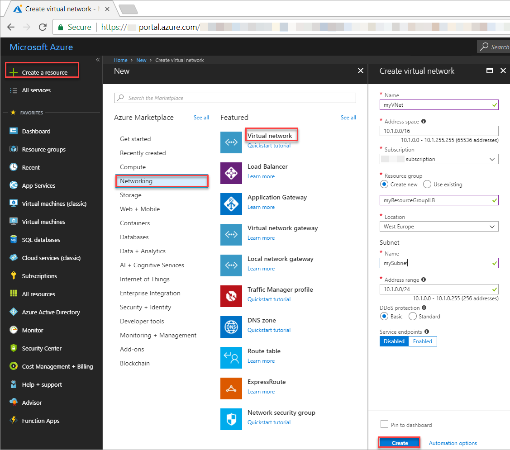
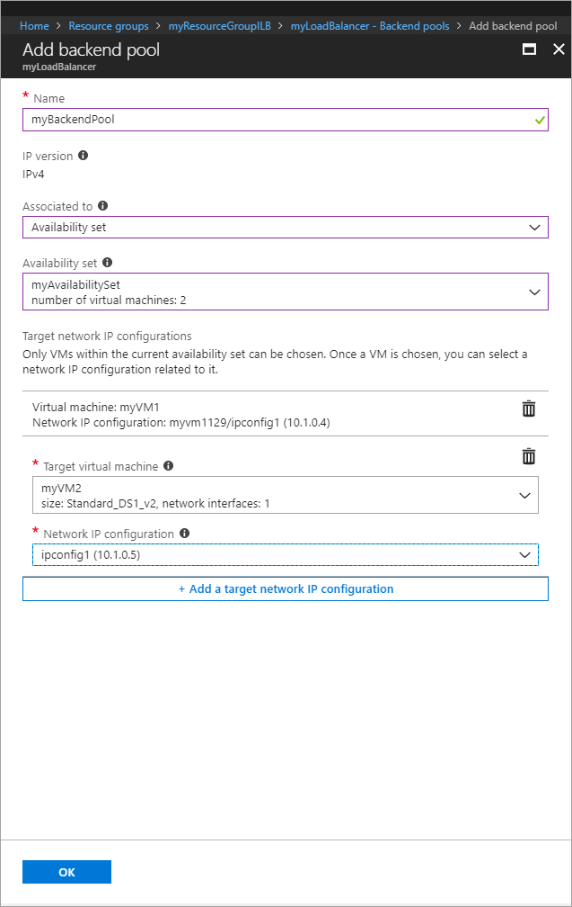
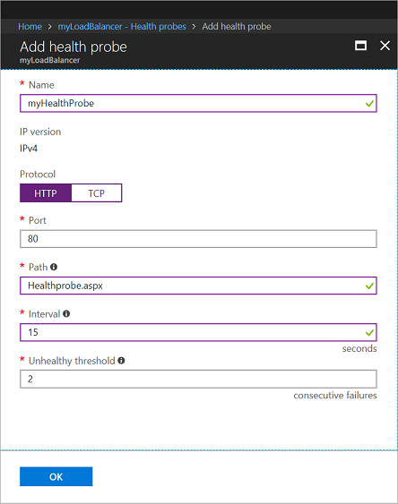
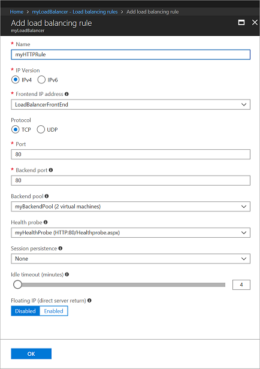
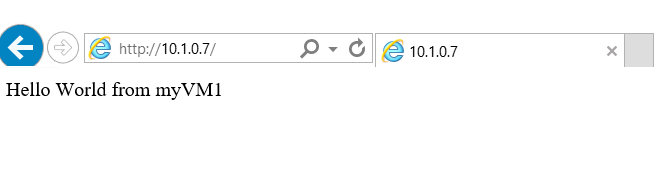

# Tutorial: Load balance internal traffic with Basic Load Balancer to VMs using the Azure portal

Load balancing provides a higher level of availability and scale by spreading incoming requests across multiple virtual machines. You can use the Azure portal to load balance internal traffic to virtual machines with a Basic Load Balancer. This tutorial shows you how to create network resources, backend servers, and an internal Basic Load Balancer.

If you prefer, you can complete this tutorial using the [Azure CLI](load-balancer-get-started-ilb-arm-cli.md) or [Azure PowerShell](load-balancer-get-started-ilb-arm-ps.md).

If you don't have an Azure subscription, create a [free account](https://azure.microsoft.com/free/?WT.mc_id=A261C142F) before you begin. 

## Sign in to the Azure portal

Sign in to the Azure portal at [https://portal.azure.com](https://portal.azure.com).

## Create a virtual network
1. On the top left-hand side of the screen click **New** > **Networking** > **Virtual network** and enter these values for the virtual network:
    - *myVnet* - for the name of the virtual network.
    - *myResourceGroupILB* - for the name of the existing resource group
    - *myBackendSubnet* - for the subnet name.
2. Click **Create** to create the virtual network.



## Create a Basic Load Balancer
Create an internal Basic Load Balancer using the portal.

1. On the top left-hand side of the screen, click **Create a resource** > **Networking** > **Load Balancer**.
2. In the **Create a load balancer** page enter these values for the load balancer:
    - *myLoadBalancer* - for the name of the load balancer.
    - **Internal** - for the type of the load balancer.
    - **Basic** - for SKU version.
    - **10.1.0.7** - for the static private IP address.
    - *myVNet* - for virtual network that you choose from the list of existing networks.
    - *mySubnet* - for subnet that you choose from the list of existing subnets.
    - *myResourceGroupILB* - for the name of the new resource group that you create.
3. Click **Create** to create the load balancer.
   
    ## Create backend servers

In this section, you create two virtual machines for the backend pool of your Basic Load Balancer, and then install IIS on the virtual machines to help test the load balancer.

### Create virtual machines

1. On the top left-hand side of the screen, click **Create a resource** > **Compute** > **Windows Server 2016 Datacenter** and enter these values for the virtual machine:
    - *myVM1* - for the name of the virtual machine.        
    - *azureuser* - for the administrator user name.   
    - *myResourceGroupILB* - for **Resource group**, select **Use existing**, and then select *myResourceGroupILB*.
2. Click **OK**.
3. Select **DS1_V2** for the size of the virtual machine, and click **Select**.
4. Enter these values for the VM settings:
    - *myAvailabilitySet* - for the name of the new Availability set that you create.
    -  *myVNet* - ensure it is selected as the virtual network.
    - *myBackendSubnet* - ensure it is selected as the subnet.
5. Under **Network Security Group**, select **Advanced**. Next, for **Network security group (firewall)**, select **None**.
5. Click **Disabled** to disable boot diagnostics.
6. Click **OK**, review the settings on the summary page, and then click **Create**.
7. Using steps 1-6, create a second VM, named, *VM2* with *myAvailabilityset* as the Availability set, *myVnet* as the virtual network, *myBackendSubnet* as subnet, and select **None** for the **Network security group (firewall)**. 

### Install IIS and customize the default web page

1. Click **All resources** in the left-hand menu, and then from the resources list click **myVM1** that is located in the *myResourceGroupILB* resource group.
2. On the **Overview** page, click **Connect** to RDP into the VM.
3. Log into the VM.
4. On the server desktop, navigate to **Windows Administrative Tools**>**Server Manager**.
5. Launch Windows PowerShell on VM1 and using the following commands to install IIS server and update the default htm file.
    ```powershell-interactive
    # Install IIS
      Install-WindowsFeature -name Web-Server -IncludeManagementTools
    
    # Remove default htm file
     remove-item  C:\inetpub\wwwroot\iisstart.htm
    
    #Add custom htm file
     Add-Content -Path "C:\inetpub\wwwroot\iisstart.htm" -Value $("Hello World from " + $env:computername)
    ```
5. Close the RDP connection with *myVM1*.
6. Repeat steps 1-5 with *myVM2* to install IIS and customize the default web page.

## Create Basic Load Balancer resources

In this section, you  configure load balancer settings for a backend address pool and a health probe, and specify load balancer and NAT rules.


### Create a backend address pool

To distribute traffic to the VMs, a back-end address pool contains the IP addresses of the virtual (NICs) connected to the load balancer. Create the backend address pool *myBackendPool* to include *VM1* and *VM2*.

1. Click **All resources** in the left-hand menu, and then click **myLoadBalancer** from the resources list.
2. Under **Settings**, click **Backend pools**, then click **Add**.
3. On the **Add a backend pool** page, do the following:
    - For name, type *myBackEndPool*, as the name for your backend pool.
    - For **Associated to**, from the drop-down menu, click **Availability set**
    - For **Availability set**, click, **myAvailabilitySet**.
    - Click **Add a target network IP configuration** to add each virtual machine (*myVM1* & *myVM2*) that you created to the backend pool.
    - Click **OK**.

        

3. Check to make sure your load balancer backend pool setting displays both the VMs **VM1** and **VM2**.

### Create a health probe

To allow the Basic Load Balancer to monitor the status of your app, you use a health probe. The health probe dynamically adds or removes VMs from the load balancer rotation based on their response to health checks. Create a health probe *myHealthProbe* to monitor the health of the VMs.

1. Click **All resources** in the left-hand menu, and then click **myLoadBalancer** from the resources list.
2. Under **Settings**, click **Health probes**, then click **Add**.
3. Use these values to create the health probe:
    - *myHealthProbe* - for the name of the health probe.
    - **HTTP** - for the protocol type.
    - *80* - for the port number.
    - *15* - for number of **Interval** in seconds between probe attempts.
    - *2* - for number of **Unhealthy threshold** or consecutive probe failures that must occur before a VM is considered unhealthy.
4. Click **OK**.

   

### Create a Load Balancer rule

A Load Balancer rule is used to define how traffic is distributed to the VMs. You define the front-end IP configuration for the incoming traffic and the back-end IP pool to receive the traffic, along with the required source and destination port. Create a Load Balancer rule *myLoadBalancerRuleWeb* for listening to port 80 in the frontend *LoadBalancerFrontEnd* and sending load-balanced network traffic to the backend address pool *myBackEndPool* also using port 80. 

1. Click **All resources** in the left-hand menu, and then click **myLoadBalancer** from the resources list.
2. Under **Settings**, click **Load balancing rules**, then click **Add**.
3. Use these values to configure the load balancing rule:
    - *myHTTPRule* - for the name of the load balancing rule.
    - **TCP** - for the protocol type.
    - *80* - for the port number.
    - *80* - for the backend port.
    - *myBackendPool* - for the name of the backend pool.
    - *myHealthProbe* - for the name of the health probe.
4. Click **OK**.
    
    

## Create a virtual machine to test the load balancer
In order to test the internal load balancer, you must create a virtual machine that is located in the same virtual network as the backend server VMs.
1. On the top left-hand side of the screen, click **Create a resource** > **Compute** > **Windows Server 2016 Datacenter** and enter these values for the virtual machine:
    - *myVMTest* - for the name of the virtual machine.        
    - *myResourceGroupILB* - for **Resource group**, select **Use existing**, and then select *myResourceGroupILB*.
2. Click **OK**.
3. Select **DS1_V2** for the size of the virtual machine, and click **Select**.
4. Enter these values for the VM settings:
    -  *myVNet* - ensure it is selected as the virtual network.
    - *myBackendSubnet* - ensure it is selected as the subnet.
5. Click **Disabled** to disable boot diagnostics.
6. Click **OK**, review the settings on the summary page, and then click **Create**.

## Test the load balancer
1. In the Azure portal, get the Private IP address for the Load Balancer on the **Overview** screen. To do so:
    a. Click **All resources** in the left-hand menu, and then click **myLoadBalancer** from the resources list.
    b. In the **Overview** details page, copy the Private IP address (in this example, it is 10.1.0.7).

2. Create a remote connection to *myVMTest* as follows:
    a. Click **All resources** in the left-hand menu, and then from the resources list click **myVMTest** that is located in the *myResourceGroupILB* resource group.
2. On the **Overview** page, click **Connect** to start a remote session with the VM.
3. Log into the *myVMTest*.
3. Paste the Private IP address into the address bar of the browser in *myVMTest*. The default page of IIS Web server is displayed on the browser.

      

To see the load balancer distribute traffic across both VMs running your app, you can force-refresh your web browser.

## Clean up resources

When no longer needed, delete the resource group, load balancer, and all related resources. To do so, select the resource group that contains the load balancer and click **Delete**.

## Next steps

In this tutorial, you created a resource group, network resources, and backend servers. You then used those resources to create an internal load balancer to load balance internal traffic to VMs. Next, learn how to [load balance VMs across availability zones](tutorial-load-balancer-standard-public-zone-redundant-portal.md)
