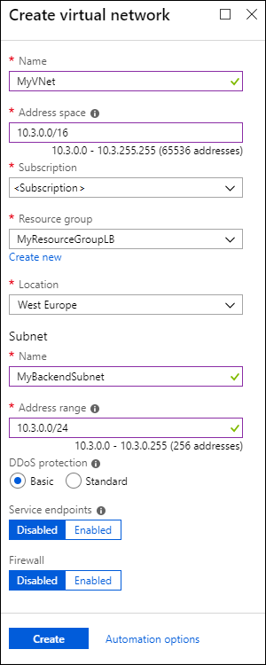
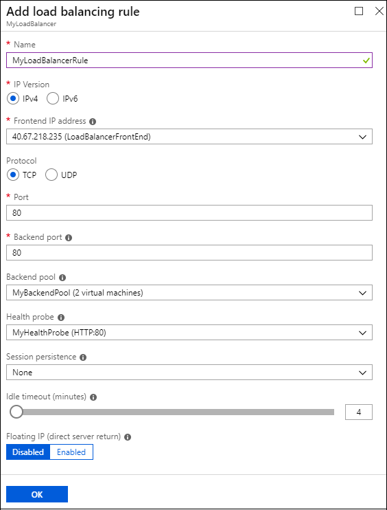
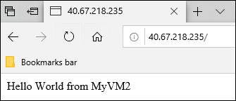

# Tutorial: Configure port forwarding in Azure Load Balancer using the portal

Port forwarding lets you connect to virtual machines (VMs) in an Azure virtual network by using an Azure Load Balancer public IP address and port number. 

In this tutorial, you set up port forwarding on an Azure Load Balancer. You learn how to:

> [!div class="checklist"]
> * Create a public Standard load balancer to balance network traffic over VMs. 
> * Create a virtual network and VMs with a network security group (NSG) rule. 
> * Add the VMs to the load balancer back-end address pool.
> * Create a load balancer health probe and traffic rules.
> * Create load balancer inbound NAT port-forwarding rules.
> * Install and configure IIS on the VMs to view load balancing and port forwarding in action.

If you don't have an Azure subscription, create a [free account](https://azure.microsoft.com/free/?WT.mc_id=A261C142F) before you begin. 

For all steps in this tutorial, sign in to the Azure portal at [https://portal.azure.com](https://portal.azure.com).

## Create a Standard load balancer

First, create a public Standard load balancer that can balance traffic load over VMs. A Standard load balancer supports only a Standard public IP address. When you create a Standard load balancer, you also create a new Standard public IP address, which is configured as the load balancer front end and named **LoadBalancerFrontEnd** by default. 

1. On the top left-hand side of the screen, click **Create a resource** > **Networking** > **Load Balancer**.
2. In the **Basics** tab of the **Create load balancer** page, enter or select the following information, accept the defaults for the remaining settings, and then select **Review + create**:

    | Setting                 | Value                                              |
    | ---                     | ---                                                |
    | Subscription               | Select your subscription.    |    
    | Resource group         | Select **Create new** and type *MyResourceGroupLB* in the text box.|
    | Name                   | *myLoadBalancer*                                   |
    | Region         | Select **West Europe**.                                        |
    | Type          | Select **Public**.                                        |
    | SKU           | Select **Standard**.                          |
    | Public IP address | Select **Create new**. |
    | Public IP address name              | Type *myPublicIP* in the text box.   |
    |Availability zone| Select **Zone redundant**.    |
     
    >[!NOTE]
     >Make sure to create your Load Balancer and all resources for it in a location that supports Availability Zones. For more information, see [Regions that support Availability Zones](../availability-zones/az-overview.md#services-support-by-region). 

3. In the **Review + create** tab, click **Create**.  
  
## Create and configure back-end servers

Create a virtual network with two virtual machines, and add the VMs to the back-end pool of your load balancer. 

### Create a virtual network

1. On the upper-left side of the portal, select **Create a resource** > **Networking** > **Virtual network**.
   
1. In the **Create virtual network** pane, type or select these values:
   
   - **Name**: Type *MyVNet*.
   - **ResourceGroup**: Drop down **Select existing** and select **MyResourceGroupLB**. 
   - **Subnet** > **Name**: Type *MyBackendSubnet*.
   
1. Select **Create**.

   

### Create VMs and add them to the load balancer back-end pool

1. On the upper-left side of the portal, select **Create a resource** > **Compute** > **Windows Server 2016 Datacenter**. 
   
1. In **Create a virtual machine**, type or select the following values in the **Basics** tab:
   - **Subscription** > **Resource Group**: Drop down and select **MyResourceGroupLB**.
   - **Virtual machine name**: Type *MyVM1*.
   - **Region**: Select **West Europe**. 
   - **Username**: Type *azureuser*.
   - **Password**: Type *Azure1234567*. 
     Retype the password in the **Confirm password** field.
   
1. Select the **Networking** tab, or select **Next: Disks**, then **Next: Networking**. 
   
   Make sure the following are selected:
   - **Virtual network**: **MyVNet**
   - **Subnet**: **MyBackendSubnet**
   
1. Under **Public IP**, select **Create new**, select **Standard** on the **Create public IP address** page, and then select **OK**. 
   
1. Under **Network Security Group**, select **Advanced** to create a new network security group (NSG), a type of firewall. 
   1. In the **Configure network security group** field, select **Create new**. 
   1. Type *MyNetworkSecurityGroup*, and select **OK**. 
   
   >[!NOTE]
   >Observe that by default, the NSG already has an incoming rule to open port 3389, the remote desktop (RDP) port.
   
1. Add the VM to a load balancer back-end pool that you create:
   
   1. Under **LOAD BALANCING** > **Place this virtual machine behind an existing load balancing solution?**, select **Yes**. 
   1. For **Load balancing options**, drop down and select **Azure load balancer**. 
   1. For **Select a load balancer**, drop down and select **MyLoadBalancer**. 
   1. Under **Select a backend pool**, select **Create new**, then type *MyBackendPool*, and select **Create**. 
   
   
   
1. Select the **Management** tab, or select **Next** > **Management**. Under **Monitoring**, set **Boot diagnostics** to **Off**.
   
1. Select **Review + create**.
   
1. Review the settings, and when validation succeeds, select **Create**. 

1. Follow the steps to create a second VM named *MyVM2*, with all the other settings the same as MyVM1. 
   
   For **Network Security Group**, after selecting **Advanced**, drop down and select the **MyNetworkSecurityGroup** that you already created. 
   
   Under **Select a backend pool**, make sure **MyBackendPool** is selected. 

### Create an NSG rule for the VMs

Create a network security group (NSG) rule for the VMs to allow inbound internet (HTTP) connections.

>[!NOTE]
>By default, the NSG already has a rule that opens port 3389, the remote desktop (RDP) port.

1. Select **All resources** on the left menu. From the resource list, select **MyNetworkSecurityGroup** in the **MyResourceGroupLB** resource group.
   
1. Under **Settings**, select **Inbound security rules**, and then select **Add**.
   
1. In the **Add inbound security rule** dialog, type or select the following:
   
   - **Source**: Select **Service Tag**.  
   - **Source service tag**: Select **Internet**. 
   - **Destination port ranges**: Type *80*.
   - **Protocol**: Select **TCP**. 
   - **Action**: Select **Allow**.  
   - **Priority**: Type *100*. 
   - **Name**: Type *MyHTTPRule*. 
   - **Description**: Type *Allow HTTP*. 
   
1. Select **Add**. 
   
   
   
## Create load balancer resources

In this section, you inspect the load balancer back-end pool, and configure a load balancer health probe and traffic rules.

### View the back-end address pool

To distribute traffic to the VMs, the load balancer uses a back-end address pool, which contains the IP addresses of the virtual network interfaces (NICs) that are connected to the load balancer. 

You created your load balancer back-end pool and added VMs to it when you created the VMs. You can also create back-end pools and add or remove VMs from the load balancer **Backend pools** page. 

1. Select **All resources** on the left menu, and then select **MyLoadBalancer** from the resource list.
   
1. Under **Settings**, select **Backend pools**.
   
1. On the **Backend pools** page, expand **MyBackendPool** and make sure both **VM1** and **VM2** are listed.

1. Select **MyBackendPool**. 
   
   On the **MyBackendPool** page, under **VIRTUAL MACHINE** and **IP ADDRESS**, you can remove or add available VMs to the pool.

You can create new back-end pools by selecting **Add** on the **Backend pools** page.

### Create a health probe

To allow the load balancer to monitor VM status, you use a health probe. The health probe dynamically adds or removes VMs from the load balancer rotation based on their response to health checks. 

1. Select **All resources** on the left menu, and then select **MyLoadBalancer** from the resource list.
   
1. Under **Settings**, select **Health probes**, and then select **Add**.
   
1. On the **Add health probe** page, type or select the following values:
   
   - **Name**: Type *MyHealthProbe*.
   - **Protocol**: Drop down and select **HTTP**. 
   - **Port**: Type *80*. 
   - **Path**: Accept */* for the default URI. You can replace this value with any other URI. 
   - **Interval**: Type *15*. Interval is the number of seconds between probe attempts.
   - **Unhealthy threshold**: Type *2*. This value is the number of consecutive probe failures that occur before a VM is considered unhealthy.
   
1. Select **OK**.
   
   

### Create a load balancer rule

A load balancer rule defines how traffic is distributed to the VMs. The rule defines the front-end IP configuration for incoming traffic, the back-end IP pool to receive the traffic, and the required source and destination ports. 

The load balancer rule named **MyLoadBalancerRule** listens to port 80 in the front-end **LoadBalancerFrontEnd**. The rule sends network traffic to the back-end address pool **MyBackendPool**, also on port 80. 

1. Select **All resources** on the left menu, and then select **MyLoadBalancer** from the resource list.
   
1. Under **Settings**, select **Load balancing rules**, and then select **Add**.
   
1. On the **Add load balancing rule** page, type or select the following values:
   
   - **Name**: Type *MyLoadBalancerRule*.
   - **Protocol**: Select **TCP**.
   - **Port**: Type *80*.
   - **Backend port**: Type *80*.
   - **Backend pool**: Select **MyBackendPool**.
   - **Health probe**: Select **MyHealthProbe**. 
   
1. Select **OK**.
   
   

## Create an inbound NAT port-forwarding rule

Create a load balancer inbound network address translation (NAT) rule to forward traffic from a specific port of the front-end IP address to a specific port of a back-end VM.

1. Select **All resources** in the left-hand menu, and then select **MyLoadBalancer** from the resource list.
   
1. Under **Settings**, select **Inbound NAT rules**, and then select **Add**. 
   
1. On the **Add inbound NAT rule** page, type or select the following values:
   
   - **Name**: Type *MyNATRuleVM1*.
   - **Port**: Type *4221*.
   - **Target virtual machine**: Select **MyVM1** from the drop-down.
   - **Port mapping**: Select **Custom**.
   - **Target port**: Type *3389*.
   
1. Select **OK**.
   
1. Repeat the steps to add an inbound NAT rule named *MyNATRuleVM2*, using **Port**: *4222* and **Target virtual machine**: **MyVM2**.

## Test the load balancer

In this section, you'll install Internet Information Services (IIS) on the back-end servers, and customize the default web page to show the machine name. Then, you'll use the load balancer's public IP address to test the load balancer. 

Each back-end VM serves a different version of the default IIS web page, so you can see the load balancer distribute requests between the two VMs.

### Connect to the VMs with RDP

Connect to each VM with Remote Desktop (RDP). 

1. In the portal, select **All resources** on the left menu. From the resource list, select each VM in the **MyResourceGroupLB** resource group.
   
1. On the **Overview** page, select **Connect**, and then select **Download RDP file**. 
   
1. Open the RDP file you downloaded, and select **Connect**.
   
1. On the Windows Security screen, select **More choices** and then **Use a different account**. 
   
   Enter username *azureuser* and password *Azure1234567*, and select **OK**.
   
1. Respond **Yes** to any certificate prompt. 
   
   The VM desktop opens in a new window. 

### Install IIS and replace the default IIS web page 

Use PowerShell to install IIS and replace the default IIS web page with a page that displays the name of the VM.

1. On MyVM1 and on MyVM2, launch **Windows PowerShell** from the **Start** menu. 

2. Run the following commands to install IIS and replace the default IIS web page:
   
   ```powershell-interactive
    # Install IIS
      Install-WindowsFeature -name Web-Server -IncludeManagementTools
    
    # Remove default htm file
     remove-item  C:\inetpub\wwwroot\iisstart.htm
    
    #Add custom htm file that displays server name
     Add-Content -Path "C:\inetpub\wwwroot\iisstart.htm" -Value $("Hello World from " + $env:computername)
    
   ```
   
1. Close the RDP connections with MyVM1 and MyVM2 by selecting **Disconnect**. Don't shut down the VMs.

### Test load balancing

1. In the portal, on the **Overview** page for **MyLoadBalancer**, copy the public IP address under **Public IP address**. Hover over the address and select the **Copy** icon to copy it. In this example, it is **40.67.218.235**. 
   
1. Paste or type the load balancer's public IP address (*40.67.218.235*) into the address bar of your internet browser. 
   
   The customized IIS web server default page appears in the browser. The message reads either **Hello World from MyVM1**, or **Hello World from MyVM2**.
   
    
   
1. Refresh the browser to see the load balancer distribute traffic across VMs. Sometimes the **MyVM1** page appears, and other times the **MyVM2** page appears, as the load balancer distributes the requests to each back-end VM.
   
   >[!NOTE]
   >You may need to clear your browser cache or open a new browser window between attempts.

## Test port forwarding

With port forwarding, you can remote desktop to a back-end VM by using the IP address of the load balancer and the front-end port value defined in the NAT rule. 

1. In the portal, on the **Overview** page for **MyLoadBalancer**, copy its public IP address. Hover over the address and select the **Copy** icon to copy it. In this example, it is **40.67.218.235**. 
   
1. Open a command prompt, and use the following command to create a remote desktop session with MyVM2, using the load balancer's public IP address and the front-end port you defined in the VM's NAT rule. 
   
   ```
   mstsc /v:40.67.218.235:4222
   ```
  
1. Open the downloaded RDP file, and select **Connect**.
   
1. On the Windows Security screen, select **More choices** and then **Use a different account**. 
   
   Enter username *azureuser* and password *Azure1234567*, and select **OK**.
   
1. Respond **Yes** to any certificate prompt. 
   
   The MyVM2 desktop opens in a new window. 

The RDP connection succeeds, because the inbound NAT rule **MyNATRuleVM2** directs traffic from the load balancer's front-end port 4222 to MyVM2's port 3389 (the RDP port).

## Clean up resources

To delete the load balancer and all related resources when you no longer need them, open the **MyResourceGroupLB** resource group and select **Delete resource group**.

## Next steps

In this tutorial, you created a Standard public load balancer. You created and configured network resources, back-end servers, a health probe, and rules for the load balancer. You installed IIS on the back-end VMs and used the load balancer's public IP address to test the load balancer. You set up and tested port forwarding from a specified port on the load balancer to a port on a back-end VM. 

To learn more about Azure Load Balancer, continue to more load balancer tutorials.

> [!div class="nextstepaction"]
> [Azure Load Balancer tutorials](tutorial-load-balancer-standard-public-zone-redundant-portal.md)
