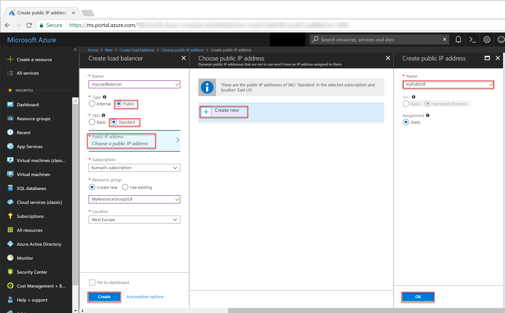

# Tutorial: Configure port fowarding in Load Balancer using the Azure portal

Port forwarding using Azure Load Balancer enables you to remotely connect to VMs in the Azure virtual network using the Load Balancer's public IP address through port number. In this tutorial, you learn to configure port forwarding in Azure Load Balancer and learn how to:


> [!div class="checklist"]
> * Create an Azure load balancer
> * Create a load balancer health probe
> * Create load balancer traffic rules
> * Create virtual machines and install IIS server
> * Attach virtual machines to a load balancer
> * Create load balancer inbound NAT rules
> * View port forwarding in action


If you don't have an Azure subscription, create a [free account](https://azure.microsoft.com/free/?WT.mc_id=A261C142F) before you begin. 

## Log in to Azure

Log in to the Azure portal at [http://portal.azure.com](http://portal.azure.com).

## Create a Standard Load Balancer

In this section, you create a public load balancer that helps load balance virtual machines. Standard Load Balancer only supports a Standard Public IP address. When you create a Standard Load Balancer, you must also create a new Standard Public IP address that is configured as the frontend (named as *LoadBalancerFrontend* by default) for the Standard Load Balancer. 

1. On the top left-hand side of the screen, click **Create a resource** > **Networking** > **Load Balancer**.
2. In the **Create a load balancer** page enter these values for the load balancer:
    - *myLoadBalancer* - for the name of the load balancer.
    - **Standard** - for the SKU version of the load balancer.
    - **Public** - for the type of the load balancer.
    - *myPublicIP* - for the **New** Public IP that you create.
    - *myResourceGroupSLB* -  for the name of the **New** resource group that you select to create.
    - **westeurope** - for the location.
3. Click **Create** to create the load balancer.


   
## Create load balancer resources

In this section, you  configure load balancer settings for a backend address pool and a health probe, and specify load balancer rules.

### Create a backend address pool

To distribute traffic to the VMs, a backend address pool contains the IP addresses of the virtual (NICs) connected to the load balancer. Create the backend address pool *myBackendPool* to inlcude *VM1* and *VM2*.

1. Click **All resources** in the left-hand menu, and then click **myLoadBalancer** from the resources list.
2. Under **Settings**, click **Backend pools**, then click **Add**.
3. On the **Add a backend pool** page, for name, type *myBackEndPool*, as the name for your backend pool, and then click **OK**.

### Create a health probe

To allow the load balancer to monitor the status of your app, you use a health probe. The health probe dynamically adds or removes VMs from the load balancer rotation based on their response to health checks. Create a health probe *myHealthProbe* to monitor the health of the VMs.

1. Click **All resources** in the left-hand menu, and then click **myLoadBalancer** from the resources list.
2. Under **Settings**, click **Health probes**, then click **Add**.
3. Use these values to create the health probe:
    - *myHealthProbe* - for the name of the health probe.
    - **HTTP** - for the protocol type.
    - *80* - for the port number.
    - *15* - for number of **Interval** in seconds between probe attempts.
    - *2* - for number of **Unhealthy threshold** or consecutive probe failures that must occur before a VM is considered unhealthy.
4. Click **OK**.

   

### Create a load balancer rule

A load balancer rule is used to define how traffic is distributed to the VMs. You define the frontend IP configuration for the incoming traffic and the backend IP pool to receive the traffic, along with the required source and destination port. Create a load balancer rule *myLoadBalancerRuleWeb* for listening to port 80 in the frontend *FrontendLoadBalancer* and sending load-balanced network traffic to the backend address pool *myBackEndPool* also using port 80. 

1. Click **All resources** in the left-hand menu, and then click **myLoadBalancer** from the resources list.
2. Under **Settings**, click **Load balancing rules**, then click **Add**.
3. Use these values to configure the load balancing rule:
    - *myHTTPRule* - for the name of the load balancing rule.
    - **TCP** - for the protocol type.
    - *80* - for the port number.
    - *80* - for the backend port.
    - *myBackendPool* - for the name of the backend pool.
    - *myHealthProbe* - for the name of the health probe.
4. Click **OK**.
    
## Create backend servers

In this section, you create a virtual network, create two virtual machines for the backend pool of your load balancer, and then install IIS on the virtual machines to help test port forwarding using the load balancer.

### Create a virtual network
1. On the top left-hand side of the screen click **New** > **Networking** > **Virtual network** and enter these values for the virtual network:
    - *myVnet* - for the name of the virtual network.
    - *myResourceGroupSLB* - for the name of the existing resource group
    - *myBackendSubnet* - for the subnet name.
2. Click **Create** to create the virtual network.

    

### Create virtual machines

1. On the top left-hand side of the screen, click **New** > **Compute** > **Windows Server 2016 Datacenter** and enter these values for the virtual machine:
    - *myVM1* - for the name of the virtual machine.        
    - *azureuser* - for the administrator user name.    
    - *myResourceGroupSLB* - for **Resource group**, select **Use existing**, and then select *myResourceGroupSLB*.
2. Click **OK**.
3. Select **DS1_V2** for the size of the virtual machine, and click **Select**.
4. Enter these values for the VM settings:
    -  *myVNet* - ensure it is selected as the virtual network.
    - *myBackendSubnet* - ensure it is selected as the subnet.
    - *myNetworkSecurityGroup* - for the name of the new network security group (firewall) that you must create.
5. Click **Disabled** to disable boot diagnostics.
6. Click **OK**, review the settings on the summary page, and then click **Create**.
7. Create another VM, named, *VM2* with *myVnet* as its virtual network, *myBackendSubnet* and its subnet, and **myNetworkSecurityGroup* as its network security group using steps 1-6. 

### Create NSG rules

In this section, you create NSG rules to allow inbound connections using HTTP and RDP.

1. Click **All resources** in the left-hand menu, and then from the resources list click **myNetworkSecurityGroup** that is located in the **myResourceGroupSLB** resource group.
2. Under **Settings**, click **Inbound security rules**, and then click **Add**.
3. Enter these values for the inbound security rule named *myHTTPRule* to allow for an inbound HTTP connections using port 80:
    - *Service Tag* - for **Source**.
    - *Internet* - for **Source service tag**
    - *80* - for **Destination port ranges**
    - *TCP* - for **Protocol**
    - *Allow* - for **Action**
    - *100* for **Priority**
    - *myHTTPRule* for name
    - *Allow HTTP* - for description
4. Click **OK**.
 
 
5. Repeat steps 2 to 4 to create another rule named *myRDPRule* to allow for an inbound RDP connection using port 3389 with the following values:
    - *Service Tag* - for **Source**.
    - *Internet* - for **Source service tag**
    - *3389* - for **Destination port ranges**
    - *TCP* - for **Protocol**
    - *Allow* - for **Action**
    - *200* for **Priority**
    - *myRDPRule* for name
    - *Allow RDP* - for description

### Install IIS on VMs

1. Click **All resources** in the left-hand menu, and then from the resources list click **myVM1** that is located in the *myResourceGroupSLB* resource group.
2. On the **Overview** page, click **Connect** to RDP into the VM.
3. Log into the VM with username *azureuser*.
4. On the server desktop, navigate to **Windows Administrative Tools**>**Windows PowerShell**.
5. In the PowerShell Window, run the following commands to install the IIS server, remove the  default iisstart.htm file, and then add a new iisstart.htm file that displays the name of the VM:

   ```azurepowershell-interactive
    
    # install IIS server role
    Install-WindowsFeature -name Web-Server -IncludeManagementTools
    
    # remove default htm file
     remove-item  C:\inetpub\wwwroot\iisstart.htm
    
    # Add a new htm file that displays server name
     Add-Content -Path "C:\inetpub\wwwroot\iisstart.htm" -Value $("Hello World from" + $env:computername)
   ```
6. Close the RDP session with *myVM1*.
7. Repeat steps 1 to 6 to install IIS and the updated iisstart.htm file on *myVM2*.

## Add VMs to the backend address pool

To distribute traffic to the VMs, add virtual machines *VM1* and *VM2* to the previously created backend address pool *myBackendPool*. The backend pool contains the IP addresses of the virtual (NICs) connected to the load balancer.

1. Click **All resources** in the left-hand menu, and then click **myLoadBalancer** from the resources list.
2. Under **Settings**, click **Backend pools**, then within the backend pool's list, click **myBackendPool**.
3. On the **myBackendPool** page, do the following:
    - Click **Add a target network IP configuration** to add each virtual machine (*myVM1* and *myVM2*) that you created to the backend pool.
    - Click **OK**.
4. Check to make sure your load balancer backend pool setting displays all the VMs **VM1** and **VM2**.

## Create inbound NAT rules
With Load Balancer, you can create an inbound NAT rule to port forward traffic from a specific port of a frontend IP address to a specific port of a backend instance inside the virtual network.

Create inbound NAT rule to port forward traffic from load balancer's frontend ports to port 3389 for the backend VMs.

1. Click **All resources** in the left-hand menu, and then click **myLoadBalancer** from the resources list.
2. Under **Settings**, click **Inbound NAT rules**, then within the backend pool's list, click **myBackendPool**.
3. In the **Add inbound NAT rule** page, enter the following values:
    - For the name of the NAT rule, type *myNATRuleRDPVM1*,
    - For port, type *4221*.
    - For **Target virtual machine**, from the drop-down, select *myVM1*.
    - For **Port mapping**, click custom, anf then for **Target port**, type **3389**.
    - Click **OK**.
4. Repeat step 2 & 3 to create inbound NAT rules named *myNATRuleRDPVM2* for virutal machines *myVM2* using frontend port *4222*.

## Test the load balancer
1. Find the public IP address for the Load Balancer on the **Overview** screen. Click **All resources** and then click **myPublicIP**.

2. Copy the public IP address, and then paste it into the address bar of your browser. The default page of IIS Web server is displayed on the browser.

      

To see the load balancer distribute traffic across the three VMs running your app, you can force-refresh your web browser.

## Test port forwarding
With port forwarding, you can create a remote desktop connection to the VMs in the backend address pool using the IP address of the load balancer and the frontend port value that were defined in the preceding step.

1. Find the public IP address for the Load Balancer on the **Overview** screen. Click **All resources** and then click **myPublicIP**.
2. Use the following command to create a remote desktop session with the *myVM2* VM from your local computer. Replace `<publicIpAddress>` with the IP address returned from the previous step.

    ```
    mstsc /v:<publicIpAddress>:4222
    ```
  
3. Open the downloaded RDP file. If prompted, select **Connect**.

4. Enter the user name and password you specified when creating the VM (you may need to select **More choices**, then **Use a different account**, to specify the credentials you entered when you created the VM), then select **OK**. You may receive a certificate warning during the sign-in process. Select **Yes** to proceed with the connection.
 
   The RDP connection succeeds, as per the inbound NAT rule *myNATRuleRDPVM2*, traffic from the load balancer's Frontend port **4222** is configured to redirect to port 3389 of the virtual machine *myVM2*.

## Clean up resources

When no longer needed, delete the resource group, load balancer, and all related resources. To do so, select the resource group that contains the load balancer and click **Delete**.

## Next steps

In this tutorial, you created a Standard Load Balancer, attached VMs to it, configured the load balancer traffic rule, health probe, and then tested the load balancer. You also, removed a VM from the load-balanced set, and added the VM back to the backend address pool. To learn more about Azure Load Balancer, continue to the tutorials for Azure Load Balancer.

> [!div class="nextstepaction"]
> [Azure Load Balancer tutorials](tutorial-load-balancer-standard-public-zone-redundant-portal.md)
