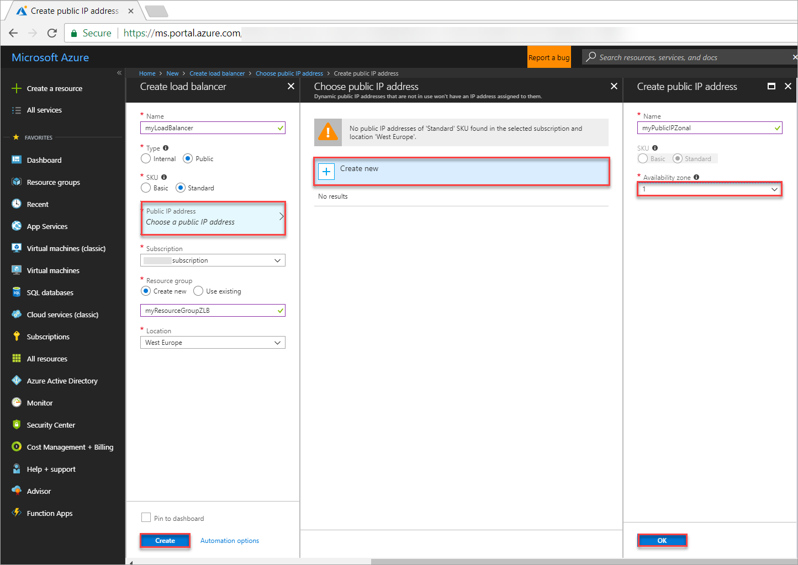
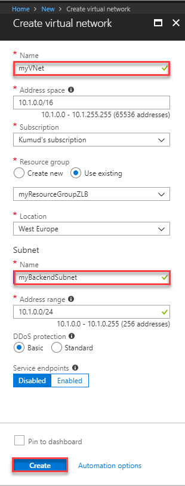

# Load balance VMs within an availability zone with a Standard Load Balancer using the Azure portal

This article steps through creating a public [Load Balancer Standard](https://aka.ms/azureloadbalancerstandard) with a zonal frontend using a Public IP Standard address using the Azure portal. In this scenario, you specify a particular zone for your front-end and back-end instances, to align your data path and resources with a specific zone.

If you prefer, you can complete this tutorial using the [Azure CLI](load-balancer-standard-public-zonal-cli.md).

For more information about using Availability zones with Standard Load Balancer, see [Standard Load Balancer and Availability Zones](load-balancer-standard-availability-zones.md).

> [!NOTE]
> Support for Availability Zones is available for select Azure resources and regions, and VM size families. For more information on how to get started, and which Azure resources, regions, and VM size families you can try availability zones with, see [Overview of Availability Zones](https://docs.microsoft.com/azure/availability-zones/az-overview).

## Log in to Azure

Log in to the Azure portal at [http://portal.azure.com](http://portal.azure.com).

## Create a public Standard Load Balancer

Standard Load Balancer only supports a Standard Public IP address. When you create a new public IP while creating the load balancer, it is automatically configured as a Standard SKU version, and is also automatically zone-redundant.

1. On the top left-hand side of the screen, click **Create a resource** > **Networking** > **Load Balancer**.
2. In the **Create a load balancer** page enter these values for the load balancer:
    - *myLoadBalancer* - for the name of the load balancer.
    - **Public** - for the type of the load balancer.
     - *myPublicIPZonal* - for the new Public IP address that you create. To do so, click **Choose a public IP address**, and then click **Create new**. For name type *myPublicIP*, SKU is Standard by default, and selects **Zone 1** for **Availability zone**.
    - *myResourceGroupZLB* -  for the name of the new resource group that you create.
    - **westeurope** - for the location.
3. Click **Create** to create the load balancer.
   
    


## Create backend servers

In this section, you create a virtual network, create two virtual machines in same zone (namely, zone 1) for the region to add to the backend pool of your load balancer, and then install IIS on the virtual machines to help test the zone-redundant load balancer. Hence, if one VM fails, the health probe for VM in the same zone fails, and traffic continues to be served by other VM within the same zone.

### Create a virtual network
1. On the top left-hand side of the screen click **Create a resource** > **Networking** > **Virtual network** and enter these values for the virtual network:
    - *myVnet* - for the name of the virtual network.
    - *myResourceGroupZLB* - for the name of the existing resource group
    - *myBackendSubnet* - for the subnet name.
2. Click **Create** to create the virtual network.

    

## Create a network security group

1. On the top left-hand side of the screen, click **Create a resource**, in the search box type *Network Security Group*, and in the network security group page, click **Create**.
2. In the Create network security group page, enter these values:
    - *myNetworkSecurityGroup*  - for the name of the network security group.
    - *myResourceGroupLBAZ* - for the name of the existing resource group.
   


### Create NSG rules

In this section, you create NSG rules to allow inbound connections using HTTP and RDP using the Azure portal.

1. In the Azure portal, click **All resources** in the left-hand menu, and then search and click **myNetworkSecurityGroup** that is located in the **myResourceGroupZLB** resource group.
2. Under **Settings**, click **Inbound security rules**, and then click **Add**.
3. Enter these values for the inbound security rule named *myHTTPRule* to allow for an inbound HTTP connections using port 80:
    - *Service Tag* - for **Source**.
    - *Internet* - for **Source service tag**
    - *80* - for **Destination port ranges**
    - *TCP* - for **Protocol**
    - *Allow* - for **Action**
    - *100* for **Priority**
    - *myHTTPRule* for **Name**
    - *Allow HTTP* - for **Description**
4. Click **OK**.
 
 

5. Repeat steps 2 to 4 to create another rule named *myRDPRule* to allow for an inbound RDP connection using port 3389 with the following values:
    - *Service Tag* - for **Source**.
    - *Internet* - for **Source service tag**
    - *3389* - for **Destination port ranges**
    - *TCP* - for **Protocol**
    - *Allow* - for **Action**
    - *200* for **Priority**
    - *myRDPRule* for name
    - *Allow RDP* - for description

    

### Create virtual machines

1. On the top left-hand side of the screen, click **Create a resource** > **Compute** > **Windows Server 2016 Datacenter** and enter these values for the virtual machine:
    - *myVM1* - for the name of the virtual machine.        
    - *azureuser* - for the administrator user name.    
    - *myResourceGroupZLB* - for **Resource group**, select **Use existing**, and then select *myResourceGroupZLB*.
2. Click **OK**.
3. Select **DS1_V2** for the size of the virtual machine, and click **Select**.
4. Enter these values for the VM settings:
    - *zone 1* - for the Availability zone where you place the VM.
    -  *myVNet* - ensure it is selected as the virtual network.
    - *myVM1PIP* - for the Standard Public IP Address that you create. Click *Create new* and then for name type, *myVM1PIP*, for Zone select **1**. The IP address SKU is Standard by default.
    - *myBackendSubnet* - ensure it is selected as the subnet.
    - *myNetworkSecurityGroup* - for the name of the network security group (firewall) that already exists.
5. Click **Disabled** to disable boot diagnostics.
6. Click **OK**, review the settings on the summary page, and then click **Create**.
7. Create a second VM, named, *myVM2* in Zone 1 with *myVnet* as the virtual network, *myVM2PIP* as the Standard Public IP address, *myBackendSubnet* as the subnet,  and **myNetworkSecurityGroup* as the network security group using steps 1-6.

     

### Install IIS on VMs

1. Click **All resources** in the left-hand menu, and then from the resources list click **myVM1** that is located in the *myResourceGroupZLB* resource group.
2. On the **Overview** page, click **Connect** to RDP into the VM.
3. Log into the VM with the user name and password that you specified when creating the VM (you may need to select **More choices**, then **Use a different account**, to specify the credentials you entered when you created the VM), then select **OK**. You may receive a certificate warning during the sign-in process. Select **Yes** to proceed with the connection.
4. On the server desktop, navigate to **Windows Administrative Tools**>**Windows PowerShell**.
6. In the PowerShell Window, run the following commands to install the IIS server, remove the  default.htm file, add a new with default.htm file that displays the name of the VM:
     ```powershell
    Install-WindowsFeature -name Web-Server -IncludeManagementTools
    remove-item  C:\inetpub\wwwroot\iisstart.htm
    Add-Content -Path "C:\inetpub\wwwroot\iisstart.htm" -Value $("Hello from" + $env:computername)
   ```
8. Close the RDP session with *myVM1*
9. Repeat steps 1 to 8 to install IIS on *myVM2*.

## Create load balancer resources

In this section, you  configure load balancer settings for a backend address pool and a health probe, and specify load balancer and NAT rules.


### Create a backend address pool

To distribute traffic to the VMs, a back-end address pool contains the IP addresses of the virtual (NICs) connected to the load balancer. Create the backend address pool *myBackendPool* to include *VM1* and *VM2*.

1. Click **All resources** in the left-hand menu, and then click **myLoadBalancer* from the resources list.
2. Under **Settings**, click **Backend pools**, then click **Add**.
3. On the **Add a backend pool** page, do the following:
    - For name, type *myBackEndPool*, as the name for your backend pool.
    - For **Virtual network**, in the drop-down menu, click *myVNet*
    - For **Virtual machine** and **IP address**  add *myVM1* and *myVM2*  and their corresponding public IP addresses.
4. Click **Add**.
5. Check to make sure your load balancer backend pool setting displays both the VMs - **myVM1** and **myVM2**.
 
     

### Create a health probe

To allow the load balancer to monitor the status of your app, you use a health probe. The health probe dynamically adds or removes VMs from the load balancer rotation based on their response to health checks. Create a health probe *myHealthProbe* to monitor the health of the VMs.

1. Click **All resources** in the left-hand menu, and then click **myLoadBalancer** from the resources list.
2. Under **Settings**, click **Health probes**, then click **Add**.
3. Use these values to create the health probe:
    - *myHealthProbe* - for the name of the health probe.
    - **HTTP** - for the protocol type.
    - *80* - for the port number.
    - *15* - for number of **Interval** in seconds between probe attempts.
    - *2* - for number of **Unhealthy threshold** or consecutive probe failures that must occur before a VM is considered unhealthy.
4. Click **OK**.

   

### Create a load balancer rule

A load balancer rule is used to define how traffic is distributed to the VMs. You define the front-end IP configuration for the incoming traffic and the back-end IP pool to receive the traffic, along with the required source and destination port. Create a load balancer rule *myLoadBalancerRuleWeb* for listening to port 80 in the frontend *FrontendLoadBalancer* and sending load-balanced network traffic to the backend address pool *myBackEndPool* also using port 80. 

1. Click **All resources** in the left-hand menu, and then click **myLoadBalancer** from the resources list.
2. Under **Settings**, click **Load balancing rules**, then click **Add**.
3. Use these values to configure the load balancing rule:
    - *myHTTPRule* - for the name of the load balancing rule.
    - **TCP** - for the protocol type.
    - *80* - for the port number.
    - *80* - for the backend port.
    - *myBackendPool* - for the name of the backend pool.
    - *myHealthProbe* - for the name of the health probe.
4. Click **OK**.
    
    

## Test the load balancer
1. Find the public IP address for the Load Balancer on the **Overview** screen. Click **All resources** and then click **myPublicIP**. 

2. Copy the public IP address, and then paste it into the address bar of your browser. The default page that includes the name of the Web server page is displayed on the browser.

      
3. To see the load balancer in action, you can force-stop the VM that is displayed and refresh the browser to see the other server name displayed on the browser.

## Clean up resources

When no longer needed, delete the resource group, load balancer, and all related resources. To do so, select the resource group that contains the load balancer and click **Delete**.

## Next steps

- Learn more about [Standard Load Balancer](load-balancer-standard-overview.md).
- [Load balance VMs across availability zones](tutorial-load-balancer-standard-public-zone-redundant-portal.md)
