# Run a load test and identify performance bottlenecks

In this article, you'll learn how to load test a sample application to identify performance bottlenecks, including:

> [!div class="checklist"]
> * Set up a sample application to load test. The application consists of a Web API deployed to Azure App Service that interacts with an Azure Cosmos DB data store.
> * Create and run a load test that exercises the sample application.
> * Use the test results to identify performance bottlenecks in the application.
> * Re-run the load test to verify performance improvements after making cloud configuration changes to the application.
> * Clean up resources.


> [!Note]
> The estimated cost to run the sample application is approximately $1 USD every 2-3 hours. When you have completed this tutorial, we recommend following the steps in **[Clean Up Resources](https://github.com/microsoft/azureloadtest/blob/main/tutorial/loadtest.md#clean-up-resources)** to delete the sample application and stop being charged. 


## Prerequisites

1. An Azure subscription that has been allowlisted for the private preview. If you have not already done so, follow the [private preview onboarding instructions](https://github.com/microsoft/azureloadtest#prerequisites).
2. You need [Visual Studio Code](https://code.visualstudio.com/) installed, including the [Azure Load Test extension](https://github.com/microsoft/azureloadtest#installation).
3. Ensure to have the jmeter [Plugins Manager](https://jmeter-plugins.org/install/Install/) installed to run the Jmeter script on a fresh Jmeter install since the JMX utilises an Ultimate Thread group.

## Deploy the sample app

1. In your terminal window, log into Azure and set the subscription to the one that is allowlisted to use the load test service private preview:
   ```cli
   az login
   az account set -s mySubscriptionName
   ```

2. Clone the sample application's source repository. The sample application is a Node.js app consisting of an Azure App Service web component and a Cosmos DB database. The repo also contains a PowerShell script that deploys the sample app to your Azure subscription, and a JMeter script that we'll use in subsequent steps.
   ```txt
    git clone https://github.com/Azure-Samples/nodejs-appsvc-cosmosdb-bottleneck.git
   ```

3. Deploy the sample app using the PowerShell script.
   ```txt
    cd nodejs-appsvc-cosmosdb-bottleneck
    .\deploymentscript.ps1
   ```
        
   > [!TIP]
   > PowerShell Core can also be installed on [Linux/WASL](./powershell/scripting/install/installing-powershell-core-on-linux?view=powershell-7.1#ubuntu-1804&preserve-view=true) or [macOS](./powershell/scripting/install/installing-powershell-core-on-macos?view=powershell-7.1).
   > After installing it, you can run the previous command with `pwsh .\deploymentscript.ps1`.*

4. You will be prompted to supply a unique application name and a location (default is `eastus`).

5. Once deployment is complete, browse to the running sample application with your browser.
   ```txt
    https://<app_name>.azurewebsites.net
   ```

6. You can also go to the [Azure portal](https://portal.azure.com) to view the application's components by going to its resource group.

   

Now that the application is deployed and running, let’s get started with running your first load test against it.

## **Create and run a load test**
The sample application's source repository contains a JMeter script named `SampleApp.jmx`, which performs 3 API calls on each test iteration:
* `add` - performs a data insert operation on Cosmos DB for the number of visitors on the webapp.
* `get` - performs a GET operation from Cosmos DB to retrieve the count.
* `timestamp` - updates the timestamp since the last user visit to the website.

**Make sure to update the JMeter script with the URL of the webapp deployed in the previous steps.**

1. Before starting, make sure you have the directory of the cloned sample app open in Visual Studio Code.

2. Open the JMX script named `SampleApp.jmx` in a text editor, and update lines 36, 81, and 119 with the URL of your newly deployed sample application (tip: the URL needs to be updated in 3 separate places, and do not include the `https://` prefix). Save your changes and close the file.
   ```xml
   <stringProp name="HTTPSampler.domain">APPNAME.azurewebsites.net</stringProp>
   ```

3. Use **Ctrl+Shift+P** to launch the command palette. Begin typing `Azure load` and you would see 2 commands associated with the Azure Load Test extension:
    * **Create New Test**: This command is used to author a new cloud load test from an existing JMeter script.
    * **Run Current File as Load Test in Cloud**: This command is used to run an existing cloud load test at scale in Azure.

   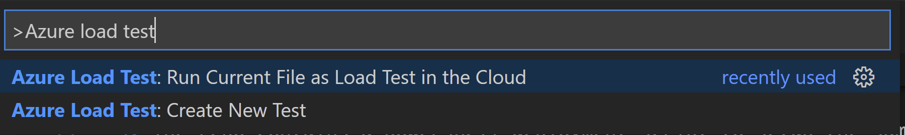

3. Select **Create New Test**

4. Select the test plan **SampleApp.jmx**. If there are multiple test plans in the workspace, they will be shown as a list. There is also a browse option to search for a test plan within your local file system.

   

5. A YAML-based load test with smart defaults will open. By default, the name of the load test matches the JMeter script name we selected in the previous step, but this can be changed to something else. The cloud load test YAML is saved in the current workspace. Know more about the Yaml properties [here](https://github.com/microsoft/azureloadtest/wiki/Common-Terminologies#brief-overview-of-yaml-properties)

   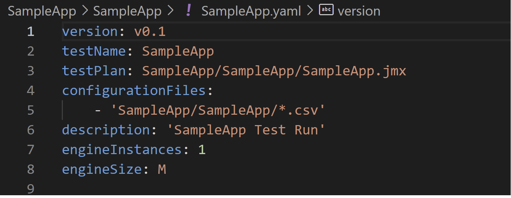

6. You can edit the parameters or comment out the optional parameters if those don’t apply. For instance, since we don’t have any configuration files associated with our current test plan, we can remove these for now.
 
   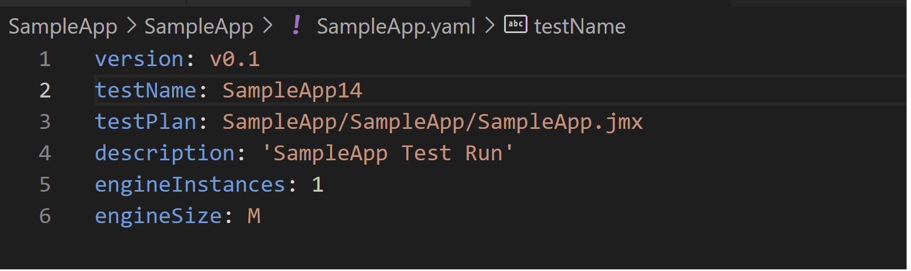

7. Save your YAML changes, and then select **Run Current File as Load Test in Cloud** from the VS Code command palette. Sign in to Azure if prompted.

   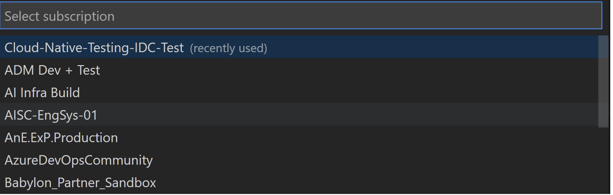

8. Select the subscription from which you will run your load test. IMPORTANT: This needs to be the same subscription that has been allowlisted for the private preview.

9. Select **Create new Test Environment...** and follow the prompts to create this resource (this is an Azure resource that will store load tests, test results, and other related artifacts).

10. Finally, select the resource group *of the sample application we're testing* and press **OK**. This tells the load test service to monitor and display the application's server metrics in the test results.

   

11. If everything is okay, the test will start with status messages as shown below. Click on the **View here** link to go to the Azure portal and see the metrics related to your load test. *Tip: Note that you can stop a load test at any time from the Azure Portal UI.*
 
   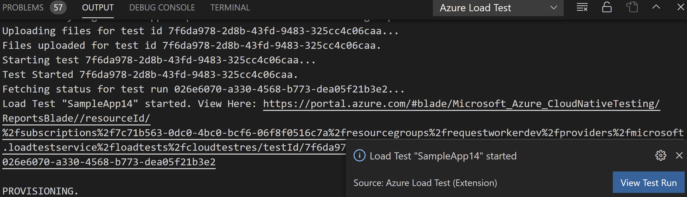

12. You can see the streaming client side metrics while the test is running which auto refreshes every 10s. you can stop the test using the **stop** button and also apply filters to the requests by sampler and errors. The response times can also be aggregated for different percentiles.
 
   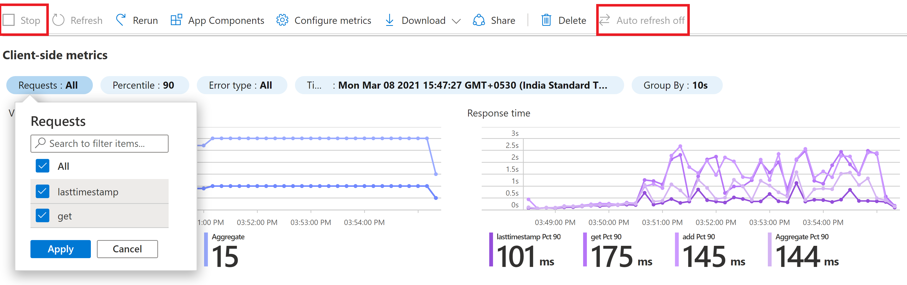

13. Wait until the load test fully completes before proceeding to the next section.

## **Identify performance bottlenecks in the sample app**

Let’s now analyze the load test results to see if there are any performance bottlenecks in our application. We can do this by examining the client-side and server-side metrics in the dashboard.

1. Taking a quick look at the client side metrics reveals an increase in the 90th percentile **Response times** for the API requests (add and get) compared to the timestmap API(the issues may be database-related since the `add` and `get` APIs interact with Cosmos DB). We note a similar pattern for **Errors**.

   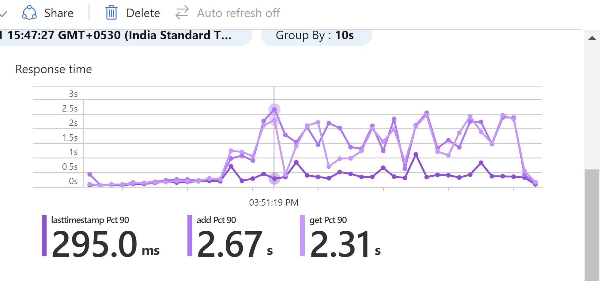

   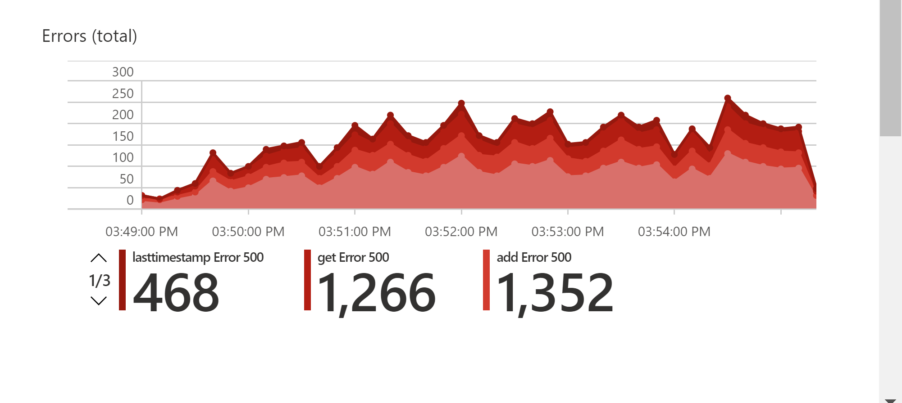

2. To understand why this has happened click scroll down to the **Server side metrics** section. It displays our application's components - in this case an App Service Plan, App Service, and Cosmos DB - and their server metrics.

3. On closer inspection of the App Service Plan metrics, we note that the **CPU Percentage** and **Memory Percentage** metrics are within healthy ranges.

   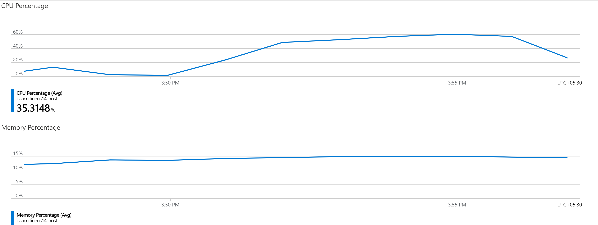

4. Let's now examine metrics for Cosmos DB. We see that the **Normalized RU Consumption** metric shows that we were quickly running at 100% utilization soon after the load test began. This would have caused throttling errors and increased response times for the `add` and `get` web APIs.

   

5. In the chart above, we note that the **Provisioned Throughput** metric shows that our Cosmos DB has been configured with a maximum throughput of 400 RUs. Let's adjust this limit and verify whether it addresses our performance bottleneck.

## Remove bottleneck and verify the performance

1. To manually configure the RU settings, open a new browser tab and navigate to the Cosmos DB resource that was provisioned as part of our sample application deployment.

   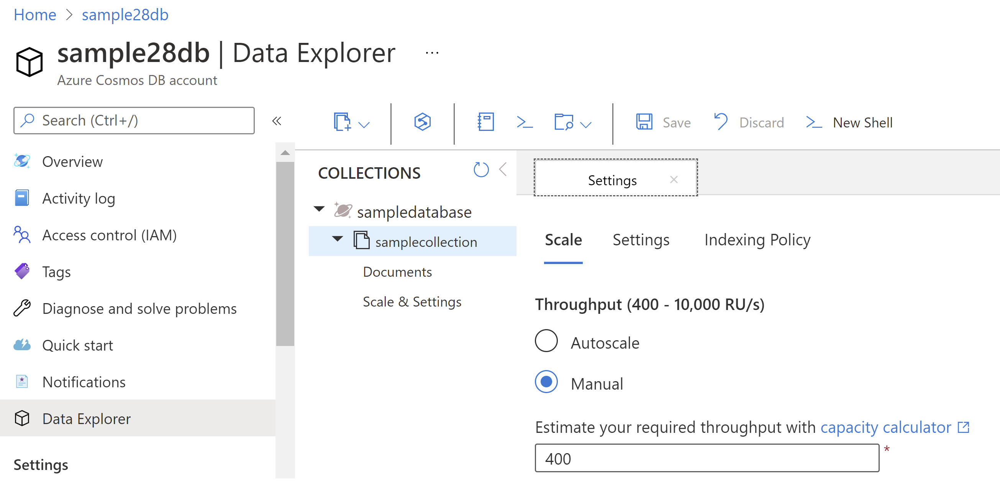

2. Click the **Scale & Settings** option and set the value to 1200 RU. Then, click the **Save** button in the blade's toolbar. You will be able to see the associated cost too.

   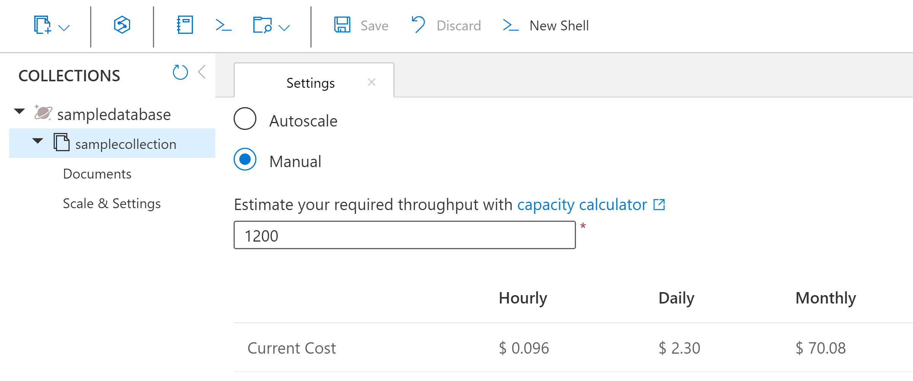

3. Navigate to our load test's browser tab, and click **Rerun** in the blade's toolbar.

   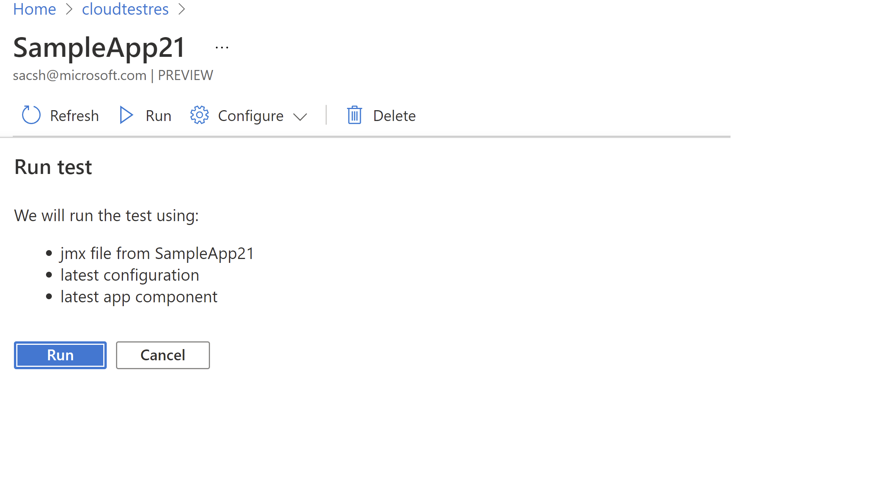

4. You should now see an entry for the new test run with the status column that cycles through Provisioning, Executing, and Done.

5. At any time, click on the test run to view how the load test is progressing.

6. Once the load test has finished, check the client-side metrics (response time and errors graphs) and the server-side metrics for Cosmos DB and verify that performance has improved.

   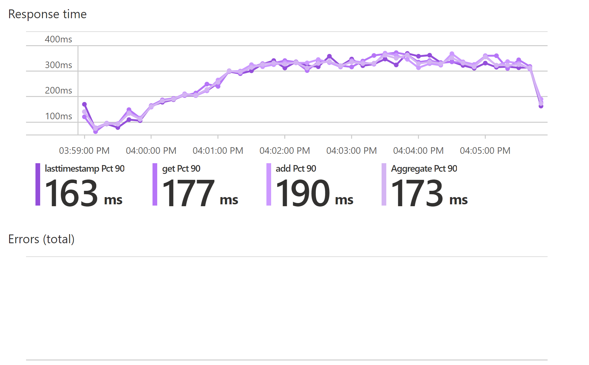

   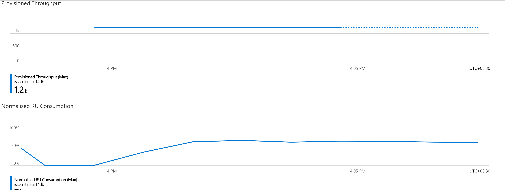

We see that the response time for the `add` and `get` API's has improved compared to our first test run, and also the normalized RU consumption was well under the limits, thereby improving the performance of our application overall.

## **Clean up resources**

Now that you have successfully run your first load test and have identified and corrected performance bottlenecks in your application, you may want to delete the resources to avoid to continue incurring charges. Use the `az group delete` command to remove the resource group and all related resources.
   ```cli
   az group delete --name myResourceGroup
   ```

Similarly, you can utilize the **Delete resource group** toolbar button on the sample application's resource group to remove all the resources.

   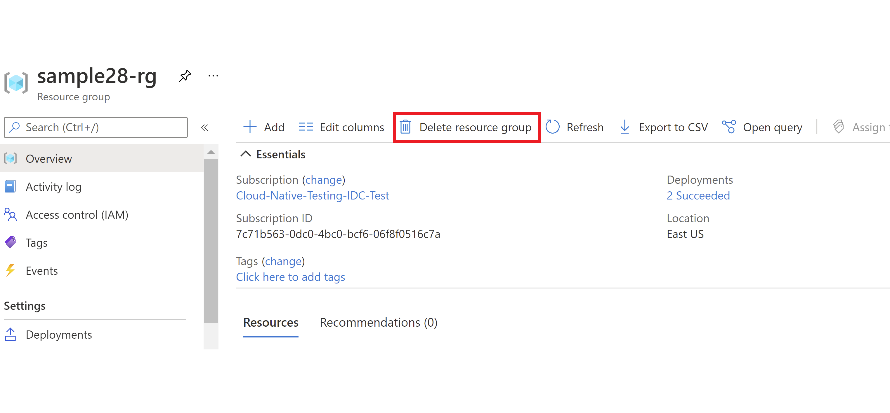