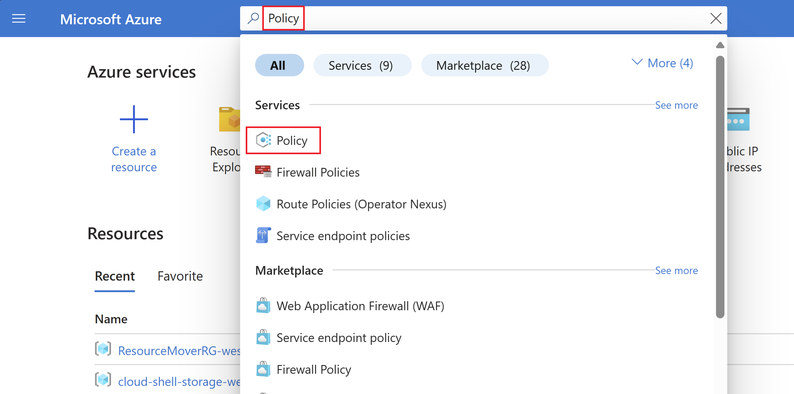
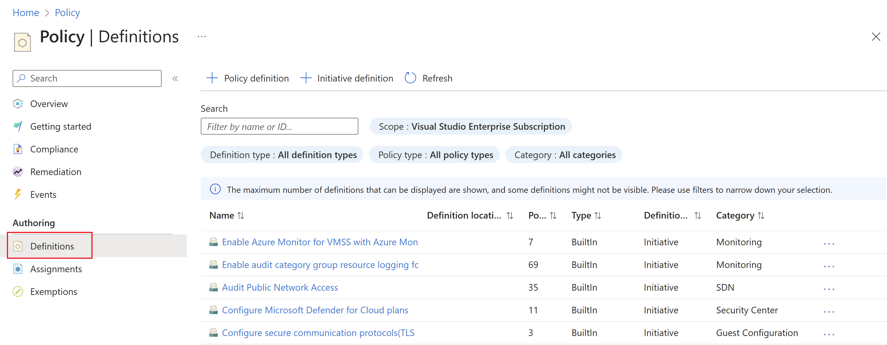
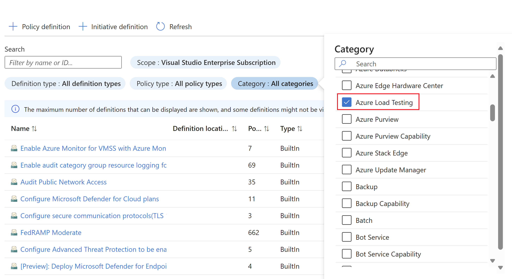
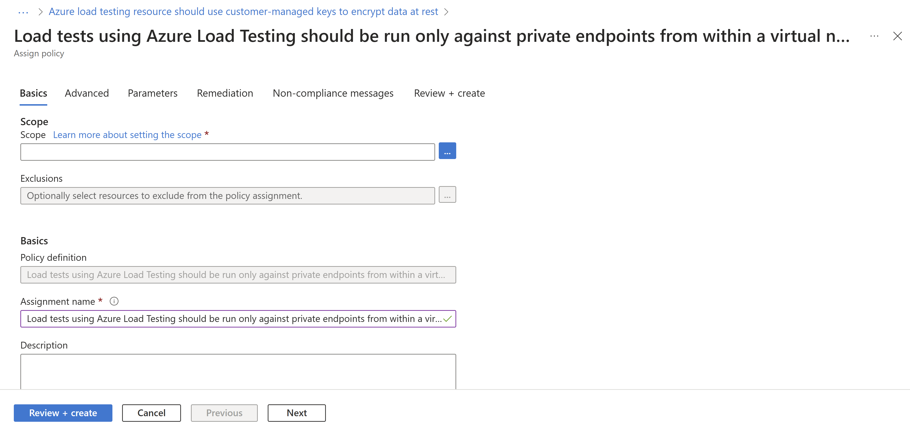
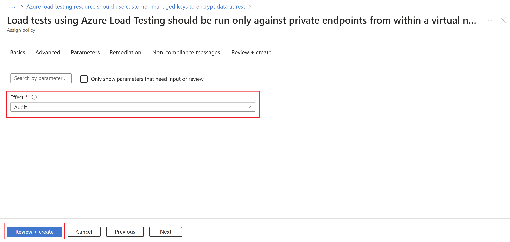

  
# Secure your Azure Load Testing resources with Azure Policy

[Azure Policy](../governance/policy/overview.md) is a governance tool that allows you to enforce organizational standards and to assess compliance at-scale. The policies allow you to perform audits, real-time enforcement, and remediation of your Azure environment. Audit results are available in your compliance dashboard. In the dashboard, you can review which resources and components are compliant and noncompliant, and take remediation actions. For more information, see the [Overview of the Azure Policy service](../governance/policy/overview.md). 

Use Azure policy to manage your load testing resources in scenarios like:

- **Private tests**
  - When you want to ensure that load tests in Azure Load Testing can be created only in private test traffic mode. 
  - When you want to ensure that the resources like virtual machines, Network Security Group (NSG), Azure load balancer and public IP created by the Azure Load Testing service get created only in a set of virtual networks in your subscription. 
- **Customer-managed keys**
  - You want to use customer-managed keys(CMK) to manage the encryption at rest for your Azure Load Testing resource. 

## Types of policy effects and guidance

When enforcing a policy, you can determine its [effect](../governance/policy/policy-glossary.md#effect) over the resulting evaluation. Each policy definition allows you to choose one of multiple [effects](../governance/policy/concepts/effect-basics.md). Therefore, policy enforcement may behave differently depending on the type of operation you are evaluating. In general, the effects for policies that integrate with Azure Load Testing include:

- [**Audit**](../governance/policy/concepts/effects.md#audit): When the effect of a policy is set to `Audit`, the policy doesn't cause any breaking changes to your environment. The policy alerts you to Azure Load Testing resources that don't comply with the policy definitions within a specified scope. Components are marked as noncompliant in the policy compliance dashboard. The `Audit` value is default if no policy effect is selected. 

- [**Deny**](../governance/policy/concepts/effects.md#deny): When the effect of a policy is set to `Deny`, the policy blocks the creation of a new test run that doesn't comply with the policy definition. Existing noncompliant test runs and resources are not affected. The 'Audit' capabilities continue to operate.

- [**Disabled**](../governance/policy/concepts/effects.md#disabled): When the effect of a policy is set to `Disabled`, the policy gets evaluated but enforcement doesn't take effect. This effect is useful to disable the policy for a specific condition as opposed to all conditions.

## Built-in policy definitions

Predetermined policies, referred to as 'built-ins', allow governance over your load testing resources so you don't have to write custom policies in JSON format to enforce commonly used rules associated with best security practices. Even though built-ins are predetermined, certain policies require you to define parameters. For example, by defining the effect of the policy, you can audit the load testing resource before enforcing a deny operation to prevent outages. See [built-in policies for Azure Load Testing](../governance/policy/samples/built-in-policies.md#azure-load-testing) to view the current built-in policies available for Azure Load Testing. 

## Enable and manage a load testing policy

### Select a policy definition

1. Log in to the Azure portal.
1.Search **Policy** in the search bar and select **Policy**.

    

1. In the **Policy** window, select **Definitions**.

    

1. In the *Category* filter, unselect **Select All** and select **Azure Load Testing**.

    

1. Now you should be able to see all the policies available for Azure Load Testing. Make sure you read and understand the [policy guidance](#types-of-policy-effects-and-guidance) and select a policy you want to assign to a scope.  

    

### Assign a policy to a scope

1. Select a policy to apply. In this example, the **Load tests using Azure Load Testing should be run only against private endpoints from within a virtual network** policy is shown. Click the **Assign** button in the top-left corner.

    
  
1. Select the subscription where you want the policy to be applied.

	- You can choose to restrict the scope to only a single resource group within a subscription.
	    
	- If you want to apply the policy to the entire subscription and exclude some resource groups, you can also configure an exclusion list.
	    
	- Set the policy enforcement selector to **Enabled** if you want the effect of the policy (audit or deny) to occur or **Disabled** to turn the effect (audit or deny) off. 

1. To specify the policy effect, select the parameters tab at the top of the screen.
	
	1. Uncheck the *Only show parameters that need input or review* option.
	
	1. Select **Audit** or **Deny** or **Disabled** for the effect of the policy following the [policy guidance](#types-of-policy-effects-and-guidance).
	
	1. Select the **Review + create** button. 

    

## Feature limitations

- The **Load tests using Azure Load Testing should be run only against private endpoints from within a virtual network** policy is only applicable for load tests that are triggered after the policy assignment. If the "audit" effect is selected, the Azure Load Testing resources with load test runs that are violating the policy will be shown as noncompliant. To remediate, delete the test runs that are violating the policy and reassign the policy. 

- Assigning a policy with a "deny" effect may take from 30 mins (on average) or up to one hour to start denying the creation of non-compliant resources. The delay refers to following scenarios:
  1. A new policy is assigned.
  2. An existing policy assignment is modified.
  3. A new Azure Load Testing resource is created in a scope with existing policies.

- The policy evaluation of existing components in an Azure Load Testing resource may take up to one hour (one average) or up to two hours before compliance results are viewable in the portal.

- If the compliance results show up as "Not Started" it may be due to the following reasons:
  - The policy evaluation is not completed. Initial evaluation latency can take up to two hours.
  - There are no Azure Load Testing resources in the scope of the policy assignment.

## Next Steps

- Learn more about the [Azure Policy service](../governance/policy/overview.md)
- See Key Vault samples: [Azure Load Testing built-in policy definitions](../governance/policy/samples/built-in-policies.md#azure-load-testing)
