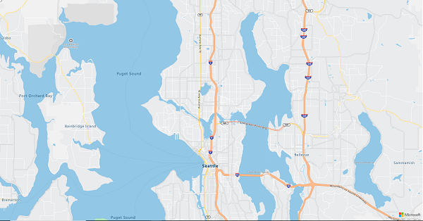

# How To Connect To Azure Location Based REST Services From The Azure Map Control

Azure Location Based Services (LBS) offers a rich set of functionality from the REST APIs. Natively, The Azure Map Control can connect to Azure Location Based Services for vector tiles, making it super easy to render Azure's Maps into various applications. The connectivity to Azure's Location Based Services for other services such as Search or Route may prove to be a bit more challenging for new developers. The following How To provides a code sample and a walkthrough for what it takes to query Azure LBS's Search Service from the Atlas Map Control.  

First, you'll want to ensure you've [setup an Azure Location Based Services account](http://aka.ms/AzureLBSPortal) and have your valid keys available to you through Azure Portal. 

To instatiate the Azure Map Control, you'll want to create a web page that embeds the Azure Map Control. The following code is your "Hello World" of Azure LBS. Create a new HTML file called "HelloAzureLBS.html and paste the code snippet below. Once the code is in your html page, replace the _Insert_AzureLBS_Key_ parameter with your actual Azure LBS key you obtained when you created your Azure Location Based Services account.
```
<!DOCTYPE html>
<html lang="en">
 <head>
 <meta charset="utf-8"><meta name="viewport" content="width=device-width, user-scalable=no">
  <title>Hello Azure LBS</title>
   <link href="https://atlas.microsoft.com/sdk/css/atlas.min.css?api-version=1.0" rel="stylesheet" type="text/css">
    <script src="https://atlas.microsoft.com/sdk/js/atlas.min.js?api-version=1.0"></script>
     <style>
      html,
       body {width: 100%;height: 100%;padding: 0;margin: 0;}
       #map {width: 100%;height: 100%;}
     </style>
    </head>
  <body>
    <div id="map">
    <script>
     var map = new atlas.Map("map", {"subscription-key": "Insert_AzureLBS_Key",center: [-122.33, 47.64], zoom: 12});
    </script>
 </body>
</html>
```
Save the HelloAzureLBS.html file, then open it in a browser. Depending on your screen resolution, you should end up with a full screen map display like this: 


Next, you'll want to add code that connects to the Azure LBS Search Service. The Azure LBS Search Service allows you to find all sorts of geographic entities including addresses, places, business listings and landmarks. You can read all about the Azure LBS Search Service. In order to query the Search Service, you'll want to add the following code. 

```
        var xhttp = new XMLHttpRequest();
        xhttp.onreadystatechange = function () {
            var searchPins = [];

            if (this.readyState === 4 && this.status === 200) {
                var response = JSON.parse(this.responseText);

                // Use the response…
            }
        };

        var url = "https://atlas.microsoft.com/search/fuzzy/json?";
        url += "&api-version=1.0";
        url += "&query=pizza";
        url += "&subscription-key=" + subscriptionKey;

        xhttp.open("GET", url, true);
        xhttp.send();
```
Note, that this code will instantiate a search search for pizza at load time. For more dynamic applications, you'll want to add a search box to your application where user's can input their own search queries and behind the scenes you can pass the contents of the search box to the variables below. That input will be passed to the service where you can return the contents to the map for rendering.


