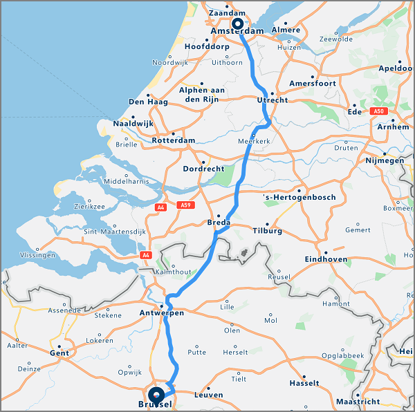
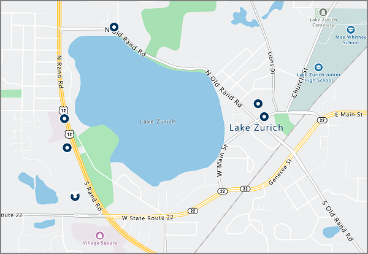

# An introduction to Azure Location Based Services (preview)
Azure Location Based Services is a portfolio of geospatial services that include service APIs for Maps, Search, Routing, Traffic, and Time Zones. The portfolio of Azure OneAPI compliant services allows you to use familiar developer tools to quickly develop and scale solutions that integrate location information into your Azure solutions. Azure Location Based Services provides developers from all industries powerful geospatial capabilities packed with fresh mapping data imperative to providing geographic context to web and mobile applications. Azure Location Based Services is an Azure One API compliant set of REST APIs accompanied with a web-based JavaScript control to make development super easy, flexible, and portable across multiple mediums. 

Azure Location Based Services consists of five primary services to bolster Azure applications requiring geographic context. Each of the services is explained in detail below.

**Render Service** – The Render Service is designed for developers to create web and mobile applications around mapping. The service uses either high-quality raster graphic images, available in 19 zoom levels, or fully customizable vector format map images.


**Route Service** – The Route Service is built with robust real-world infrastructure geometry calculations and multiple transportation mode directions. The service allows for developers to calculate directions across a number of travel modes such as car, truck, bicycle, or walking; as well as, a number of inputs such as traffic conditions, weight restrictions, or hazardous material transport.



**Search Service** – The Search Service is designed for developers to search for addresses, places, business listings by name or category and other geographic information. The Search Service can also [reverse geocode](https://en.wikipedia.org/wiki/Reverse_geocoding) addresses and cross streets based on a latitude/longitude. 



**Time Zone Service** – The Time Zone Service allows you to query current, historical, and future time zone information using either latitude-longitude pairs or an [IANA ID](http://www.iana.org/). The Time Zone service also allows for converting Microsoft Windows time zone IDs to IANA time zones, fetching a time zone offset to UTC and getting the current time in a respective time zone. A typical JSON response for a query to the Time Zone Service looks like the following:

```JSON
{
    "Version": "2017c",
    "ReferenceUtcTimestamp": "2017-11-20T23:09:48.686173Z",
    "TimeZones": [{
        "Id": "America/Los_Angeles",
        "ReferenceTime": {
            "Tag": "PST",
            "StandardOffset": "-08:00:00",
            "DaylightSavings": "00:00:00",
            "WallTime": "2017-11-20T15:09:48.686173-08:00",
            "PosixTzValidYear": 2017,
            "PosixTz": "PST+8PDT,M3.2.0,M11.1.0"
        }
    }]
}
```

**Traffic Service** – The Traffic Service is a suite of web services designed for developers to create web and mobile applications requiring traffic. The offering is split into the following:
1. Traffic Flow - provides real-time observed speeds and travel times for all key roads in the network; and, 
2. Traffic Incidents - provides an accurate view about the traffic jams and incidents around the road network.


Azure Location Based Services is built for mobility and can power cross-platform applications since the programming model is agnostic and supports JSON output through REST APIs. Additionally, Azure LBS offers a convenient JavaScript Map Control with a simple programming model for quick and easy development of both web and mobile applications. 

Azure Location Based Services uses a key-based authentication scheme, so accessing the services is a matter of navigating to the [Azure portal](http://portal.azure.com) and creating an Azure Location Based Services account. Your account comes with two keys pre-generated for you. Start integrating these location capabilities directly into your applications by using either of your keys in the requests to the Azure Location Based Services service.

## Unsupported Regions
Our API is currently unavailable in below countries. Please check your current IP address and verify that your IP address' location is not in one of the unsupported countries below.

* Argentina
* China
* India
* Morrocco
* Pakistan
* South Korea

## Relationship With Bing Maps
The Azure Location Based Services described in this document are distinct from those provided by Bing Maps.  Although they share much of the same functionality, the two services are different and not related.  There is no impact to Bing Maps product offering or roadmap with the availability of this new service within Azure, which will be managed separately.

Microsoft’s goal is to provide choice to the developer community in terms of location service offerings.  Below is some quick guidance for developers on which service to use for various use cases and customer situations.  Please note this guidance applies currently to Azure LBS as it is in Public Preview stage, and will be updated once it reaches General Availability later in 2018.

| Customer Criteria | Use Azure Location Based Services when… | Use Bing Maps when… |
| ------------- | ------------- | ------------- |
| Development Environment | Building in or leveraging other Azure services | Using a third party cloud or other developer environment |
| Development Stage  | Because Azure LBS is currently in Public Preview, it is optimized for early stage testing and Proof of Concept development | An enterprise grade SLA is required for a production environment |
| Pricing Options | Preliminary developer pricing options suffice | Customized enterprise grade pricing is required |
| Use Case Environment | In-vehicle usage is required | In-vehicle usage is not required |
| Geographic Coverage | India, China, Japan and South Korea are not required | India, China, Japan and South Korean map coverage are required |
| Mapping Content | Standard surface maps are sufficient | Satellite, aerial and street side imagery are required |
| Underlying Map Source | TomTom mapping data is preferred | HERE mapping data is preferred |

Sign up for an [Azure Location Based Services account today](http://aka.ms/azurelbsportal).

## Next steps

You now have an overview of the Azure Location Based Services (preview). The next step is to try out a sample app showcasing the Location Based Services, as well as create an end-to-end scenario in your web application.

> [!div class="nextstepaction"]
> [Launch a demo interactive map search using Azure Location Based Services (preview)](quick-demo-map-app.md)
> [Search nearby point of interest using Azure Location Based Services](tutorial-search-location.md)
