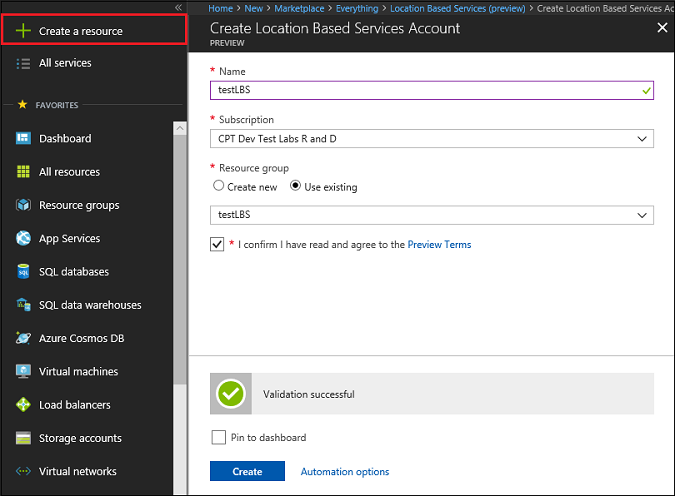
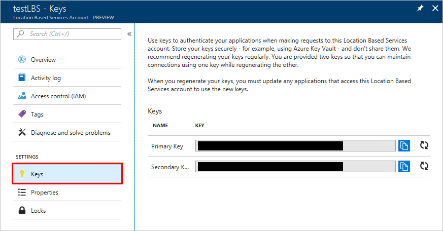
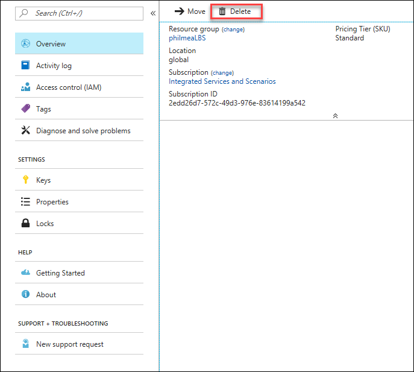

# How to manage your Azure Location Based Services account and keys

You can manage your Azure Location Based Services account and keys through the Azure portal. Once you have an account and a subscription key, you can implement the APIs in your web site or mobile application.

If you don't have an Azure subscription, create a [free account](https://azure.microsoft.com/free/?WT.mc_id=A261C142F) before you begin.

## Log in to Azure 

Log in to the Azure portal at http://portal.azure.com.

## Create a new account

1. Click the **New** button found on the upper left-hand corner of the Azure portal.

2. Search for and select **Location Based Services**, then click **Create**.

3. Enter the Location Based Services Account information. 

## Manage keys on the account page

On the left-hand menu, under settings, click **Keys**.

Use keys to authenticate against Azure Location Based Services and start developing your location-based application.

## Delete an account

You can delete an account by clicking the **Delete** button on the top navigation pane.

