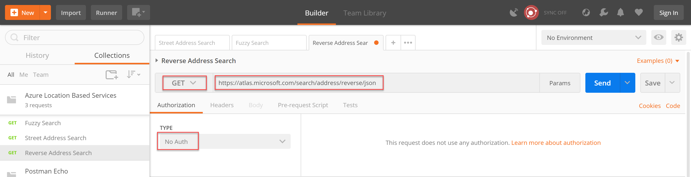

---
# Mandatory fields. See more on aka.ms/skyeye/meta.
title: How to find an address using the Azure Location Based Services Search service  | Microsoft Docs 
description: Learn how to find an address using the Azure Location Based Services Search service
services: location-based-services
keywords: Don’t add or edit keywords without consulting your SEO champ.
author: philmea
ms.author: philmea
ms.date: 11/15/2017
ms.topic: how-to
ms.service: location-based-services
---
# How to find an address using the Azure Location Based Services Search service
The Search service is a RESTful set of APIs designed for developers to search for addresses, places, points of interest, business listings, and other geographic information. The Search Service assigns a latitude/longitude to a specific address, cross street, geographic feature, or point of interest (POI). Latitude and longitude values returned by the Search service APIs can be used as parameters in other Azure Location Based Services such as the Route and Traffic Flow APIs.

For an overview and FAQ of the Azure Search Service, see [Understanding the Azure Location Based Services Search service](concept-search-service.md).

## Prerequisites
Install the [Postman app] (https://www.getpostman.com/apps).

An Azure Location Based Services account and subscription key. For information on creating an account and retrieving a subscription key, see [How to manage your Azure Location Based Services account and keys](how-to-manage-account-keys.md). 

## Using Fuzzy Search

The default API for the Search service is Fuzzy Search, which handles inputs of any combination of address or POI tokens. This search API is the canonical 'single-line search' and is useful when you do not know what your user inputs as a search query. The Fuzzy Search API is a combination of POI search and geocoding. The API can also be weighted with a contextual position (lat./lon. pair), fully constrained by a coordinate and radius, or it can be executed more generally without any geo biasing anchor point.

Most Search queries default to 'maxFuzzyLevel=1' to gain performance and reduce unusual results. This default can be overridden as needed per request by passing in the query parameter 'maxFuzzyLevel=2' or '3'.

### Search for an address using Fuzzy Search 

1. Open the Postman app, click New | Create New, and select **GET request**. Enter a Request name of **Fuzzy search**, select a collection or folder to save it to, and click **Save**. 
 
For more information, see the Postman's Requests documentation.

2. On the Builder tab, select the **GET** HTTP method and enter the request URL for your API endpoint.


| Parameter | Suggested value |
|---------------|------------------------------------------------|
| HTTP method | GET |
| Request URL | https://atlas.microsoft.com/search/fuzzy/json? |
| Authorization | No Auth |

The **json** attribute in the URL path determines the response format. You are using json throughout this article for ease of use and readability. You can find the available response formats in the **Get Search Fuzzy** definition of the [Location Based Services Functional API reference] (https://docs.microsoft.com/en-us/rest/api/location-based-services/search/getsearchfuzzy).

3. Click **Params**, and enter the following Key / Value pairs to use as query or path parameters in the request URL:


| Key | Value |
|------------------|-------------------------|
| api-version | 1.0 |
| subscription-key | *subscription key* |
| query | pizza |

4. Click **Send** and review the response body. 

The ambiguous query string of "pizza" returned 10 point of interest (POI) results with categories falling in "pizza" and "restaurant". Each result returns a street address, latitude / longitude values, view port, and entry points for the location.

The results are varied for this query, not tied to any particular reference location. You can use the **countrySet** parameter to specify only the countries for which your application needs coverage, as the default behavior is to search the entire world, potentially returning unnecessary results.

For a list of all the countries supported by the Azure Search Service, see [Understanding the Azure Location Based Services Search service](concept-search-service.md).

5. Add the following value to the query string and click **Send**:
```
    ,countrySet=US
```
> Ensure that you comma separate the additional URI parameters in the query string.

The results are now bounded by the country code and the query returns pizza restaurants in the United States.

To provide results oriented on a particular location you can query a point of interest and use the returned latitude and longitude values in your call to the Fuzzy Search service. In this case, you used the Search service to return the location of the Seattle Space Needle and used the lat. / lon. values to orient the search.

4. In Params, enter the following Key / Value pairs and click **Send**:


| Key | Value |
|-----|------------|
| lat | 47.62039 |
| lon | -122.34928 |

## Search for address properties and coordinates 

You can pass a complete or partial street address to the Search Address API and receive a response that includes detailed address properties such as municipality or subdivision, as well as positional values in latitude and longitude.

1. In Postman, click **New Request** | **GET request** and name it **Address Search**.
2. On the Builder tab, select the **GET** HTTP method, enter the request URL for your API endpoint, and select an authorization protocol, if any.


| Parameter | Suggested value |
|---------------|------------------------------------------------|
| HTTP method | GET |
| Request URL | https://atlas.microsoft.com/search/address/json? |
| Authorization | No Auth |

2. Click **Params**, and enter the following Key / Value pairs to use as query or path parameters in the request URL:


| Key | Value |
|------------------|-------------------------|
| api-version | 1.0 |
| subscription-key | *subscription key* |
| query | 400 Broad St, Seattle, WA 98109 |

3. Click **Send** and review the response body. 

In this case, you specified a complete address query and receive a single result in the response body. 

4. In Params, edit the query string to the following value:
```
    400 Broad, Seattle
```

5. Add the following value to the query string and click **Send**:
```
    ,typeahead
```

The **typeahead** flag tells the Address Search API to treat the query as a partial input and return an array of predictive values.

## Search for a street address using Reverse Address Search
1. In Postman, click **New Request** | **GET request** and name it **Reverse Address Search**.
2. 
3. On the Builder tab, select the **GET** HTTP method and enter the request URL for your API endpoint.



| Parameter | Suggested value |
|---------------|------------------------------------------------|
| HTTP method | GET |
| Request URL | https://atlas.microsoft.com/search/address/reverse/json? |
| Authorization | No Auth |

2. Click **Params**, and enter the following Key / Value pairs to use as query or path parameters in the request URL:


| Key | Value |
|------------------|-------------------------|
| api-version | 1.0 |
| subscription-key | *subscription key* |
| query | 47.59093,-122.33263 |

3. Click **Send** and review the response body. 

The response will include the POI entry for Safeco Field with a poi category of "stadium". 

4. Add the following value to the query string and click **Send**:
```
    ,number
```
 If the [number](https://docs.microsoft.com/en-us/rest/api/location-based-services/search/getsearchaddressreverse#search_getsearchaddressreverse_uri_parameters) query parameter is sent with the request, the response may include the side of the street (Left/Right) and also an offset position for that number.

5. Add the following value to the query string and click **Send**:
```
    ,spatialKeys
```

When the [spatialKeys](https://docs.microsoft.com/en-us/rest/api/location-based-services/search/getsearchaddressreverse#search_getsearchaddressreverse_uri_parameters) query parameter is set, the response contains proprietary geo-spatial key information for a specified location.

6. Add the following value to the query string and click **Send**:
```
    ,returnSpeedLimit
```

When the [returnSpeedLimit](https://docs.microsoft.com/en-us/rest/api/location-based-services/search/getsearchaddressreverse#search_getsearchaddressreverse_uri_parameters) query parameter is set, the response return of the posted speed limit.

7. Add the following value to the query string and click **Send**:
```
    ,returnRoadUse
```

When the [returnRoadUse](https://docs.microsoft.com/en-us/rest/api/location-based-services/search/getsearchaddressreverse#search_getsearchaddressreverse_uri_parameters) query parameter is set, the response returns the road use array for reversegeocodes at street level.

8. Add the following value to the query string and click **Send**:
```
    ,roadUse
```

You can restrict the reverse geocode query to a specific type of road use using the [roadUse](https://docs.microsoft.com/en-us/rest/api/location-based-services/search/getsearchaddressreverse#search_getsearchaddressreverse_uri_parameters) query parameter.

## Use Search Address Reverse Cross Street

1. In Postman, click **New Request** | **GET request** and name it **Address Reverse Cross Street Search**.

2. On the Builder tab, select the **GET** HTTP method and enter the request URL for your API endpoint.


| Parameter | Suggested value |
|---------------|------------------------------------------------|
| HTTP method | GET |
| Request URL | https://atlas.microsoft.com/search/address/reverse/crossstreet/json? |
| Authorization | No Auth |

3. Click **Params**, and enter the following Key / Value pairs to use as query or path parameters in the request URL:

| Key | Value |
|------------------|-------------------------|
| api-version | 1.0 |
| subscription-key | *subscription key* |
| query | 47.59093,-122.33263 |

4. Click **Send** and review the response body. 

## Next Steps:
- Explore the [Azure Location Based Serices Search service](https://docs.microsoft.com/en-us/rest/api/location-based-services/search) API documentation 