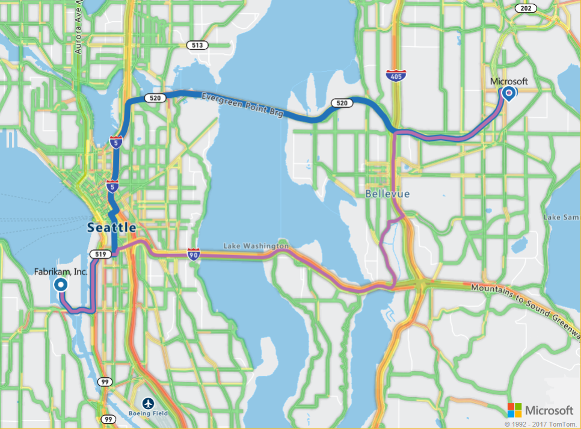

# Find routes for different modes of travel using Azure Location Based Services

This tutorial shows how to use your Azure Location Based Services account and the Route Service SDK, to find the route to your point of interest, prioritized by your mode of travel. In this tutorial, you learn how to:

> [!div class="checklist"]
> * Configure your Route Service query
> * Render routes prioritized by mode of travel

## Prerequisites

Before you proceed, make sure to [create your Azure Location Based Services account](./tutorial-search-location.md#createaccount), and [get the subscription key for your account](./tutorial-search-location.md#getkey). You may also observe how to use the Map Control and Search Service APIs as discussed in the tutorial [Search nearby point of interest using Azure Location Based Services](./tutorial-search-location.md), as well as learn the basic usage of the Route Service APIs as discussed in the tutorial [Route to a point of interest using Azure Location Based Services](./tutorial-route-location.md).


<a id="queryroutes"></a>

## Configure your Route Service query

Use the following steps to create a static HTML page embedded with the Location Based Services' Map Control API. 

1. On your local machine, create a new file and name it **MapTruckRoute.html**. 
2. Add the following HTML components to the file:

    ```HTML
    <!DOCTYPE html>
    <html lang="en">

    <head>
        <meta charset="utf-8" />
        <meta name="viewport" content="width=device-width, user-scalable=no" />
        <title>Map Truck Route</title>
        <link rel="stylesheet" href="https://atlas.microsoft.com/sdk/css/atlas.min.css?api-version=1.0" type="text/css" />
        <script src="https://atlas.microsoft.com/sdk/js/atlas.min.js?api-version=1.0"></script>
        <style>
            html,
            body {
                width: 100%;
                height: 100%;
                padding: 0;
                margin: 0;
            }

            #map {
                width: 100%;
                height: 100%;
            }
        </style>
    </head>
    <body>
        <div id="map"></div>
        <script>
        // Embed Map Control JavaScript code here

        </script>

    </body>

    </html>
    ```
    Note that the HTML header embeds the resource locations for CSS and JavaScript files for the Azure Location Based Services library. Notice also the *script* segment added to the body of the HTML, to contain the inline JavaScript code to access the Azure Map Control API.
3. Add the following JavaScript code to the *script* block of the HTML file. Replace the placeholder *<insert-key>* with your Location Based Services account's primary key.

    ```HTML
            // Instantiate map to the div with id "map"
            var subscriptionKey = "<insert-key>";
            var map = new atlas.Map("map", {
                "subscription-key": subscriptionKey
            });

    ```
    The **atlas.Map** provides the control for a visual and interactive web map, and is a component of the Azure Map Control API.

4. Add the following JavaScript code to the *script* block, to add the traffic flow display to the map:

    ```HTML
            // Add Traffic Flow to the Map
            map.setTraffic({
                flow: "relative"
            });
    ```
    This code sets the traffic flow to `relative`, which is the speed of the road relative to free-flow. You could also set it to `absolute` speed of the road, or `relative-delay` which displays the relative speed where it differs from free-flow. 

5. Add the following JavaScript code to create start and end points for the route:

    ```HTML
            // Create the GeoJSON objects which represent the start and end point of the route
            var startPoint = new atlas.data.Point([-122.356099, 47.580045]);
            var startPin = new atlas.data.Feature(startPoint, {
                title: "Seattle Port",
                icon: "pin-round-blue"
            });

            var destinationPoint = new atlas.data.Point([-122.130137, 47.644702]);
            var destinationPin = new atlas.data.Feature(destinationPoint, {
                title: "Microsoft",
                icon: "pin-blue"
            });
    ```
    This code creates two [GeoJSON objects](https://en.wikipedia.org/wiki/GeoJSON) to represent the start and end points of the route. 

6. Add the following JavaScript code to add layers of *linestrings* to the Map Control, to display routes based on mode of transport, for example, _car_ and _truck_.

    ```HTML
            // Place route layers on the map
            var carRouteLayerName = "car-route";
            map.addLinestrings([], {
                name: carRouteLayerName,
                color: "#B76DAB",
                width: 5,
                cap: "round",
                join: "round",
                before: "labels"
            });
    
            var truckRouteLayerName = "truck-route";
            map.addLinestrings([], {
                name: truckRouteLayerName,
                color: "#2272B9",
                width: 9,
                cap: "round",
                join: "round",
                before: carRouteLayerName
            });
    ```

7. Add the following JavaScript code to add the start and end points to the map:

    ```HTML
            // Fit the map window to the bounding box defined by the start and destination points
            var swLon = Math.min(startPoint.coordinates[0], destinationPoint.coordinates[0]);
            var swLat = Math.min(startPoint.coordinates[1], destinationPoint.coordinates[1]);
            var neLon = Math.max(startPoint.coordinates[0], destinationPoint.coordinates[0]);
            var neLat = Math.max(startPoint.coordinates[1], destinationPoint.coordinates[1]);
            map.setCameraBounds({
                bounds: [swLon, swLat, neLon, neLat],
                padding: 100
            });

            // Add pins to the map for the start and end point of the route
            map.addPins([startPin, destinationPin], {
                name: "route-pins",
                textFont: "SegoeUi-Regular",
                textOffset: [0, -20]
            });
    ``` 
    The API **map.setCameraBounds** adjusts the map window according to the coordinates of the start and end points. The API **map.addPins** adds the points to the Map control as visual components.

8. Save the **MapTruckRoute.html** file on your machine. 

<a id="multipleroutes"></a>

## Render routes prioritized by mode of travel

This section shows how to use the Azure Location Based Services' Route Service API to find multiple routes from a given start point to a destination, based on your mode of transport. The Route Service provides APIs to plan the fastest, shortest, or eco route between two locations, considering the real-time traffic conditions. It also allows users to plan routes in the future by using Azure's extensive historic traffic database and predicting route durations for any day and time. 

1. Open the **MapTruckRoute.html** file created in the preceding section, and add the following JavaScript code to the *script* block, to get the route for a truck using the Route Service.

    ```HTML
            // Perform a request to the route service and draw the resulting truck route on the map
            var xhttpTruck = new XMLHttpRequest();
            xhttpTruck.onreadystatechange = function () {
                if (this.readyState == 4 && this.status == 200) {
                    var response = JSON.parse(this.responseText);

                    var route = response.routes[0];
                    var routeCoordinates = [];
                    for (var leg of route.legs) {
                        var legCoordinates = leg.points.map((point) => [point.longitude, point.latitude]);
                        routeCoordinates = routeCoordinates.concat(legCoordinates);
                    }

                    var routeLinestring = new atlas.data.LineString(routeCoordinates);
                    map.addLinestrings([new atlas.data.Feature(routeLinestring)], {
                        name: truckRouteLayerName
                    });
                }
            };

            var truckRouteUrl = "https://atlas.microsoft.com/route/directions/json?";
            truckRouteUrl += "&api-version=1.0";
            truckRouteUrl += "&subscription-key=" + subscriptionKey;
            truckRouteUrl += "&query=" + startPoint.coordinates[1] + "," + startPoint.coordinates[0] + ":" +
                destinationPoint.coordinates[1] + "," + destinationPoint.coordinates[0];
            truckRouteUrl += "&travelMode=truck";
            truckRouteUrl += "&vehicleWidth=2";
            truckRouteUrl += "&vehicleHeight=2";
            truckRouteUrl += "&vehicleLength=5";
            truckRouteUrl += "&vehicleLoadType=USHazmatClass2";

            xhttpTruck.open("GET", truckRouteUrl, true);
            xhttpTruck.send();
    ```
    This code snippet creates an [XMLHttpRequest](https://xhr.spec.whatwg.org/), and adds an event handler to parse the incoming response. For a successful response, it creates an array of coordinates for the route returned, and adds it the map's `truckRouteLayerName` layer. 
    
    This code snippet also sends the query to the Route Service, to get the route for specified start and end point, for your account's subscription key. The following optional parameters are used to indicate the route for a heavy truck:
        - The parameter `travelMode=truck` specifies the mode of travel as *truck*. Other modes of travel supported are *taxi*, *bus*, *van*, *motorcycle*, and the default *car*. 
        - The parameters `vehicleWidth`, `vehicleHeight`, and `vehicleLength` specify the dimensions of the vehicle in meters, and are considered only if the mode of travel is *truck*. 
        - The `vehicleLoadType` classifies the cargo as hazardous and restricted on some roads. This is also currently considered only for the *truck* mode. 

2. Add the following JavaScript code to get the route for a truck using the Route Service:

    ```HTML
            // Perform a request to the route service and draw the resulting car route on the map
            var xhttpCar = new XMLHttpRequest();
            xhttpCar.onreadystatechange = function () {
                if (this.readyState == 4 && this.status == 200) {
                    var response = JSON.parse(this.responseText);

                    var route = response.routes[0];
                    var routeCoordinates = [];
                    for (var leg of route.legs) {
                        var legCoordinates = leg.points.map((point) => [point.longitude, point.latitude]);
                        routeCoordinates = routeCoordinates.concat(legCoordinates);
                    }

                    var routeLinestring = new atlas.data.LineString(routeCoordinates);
                    map.addLinestrings([new atlas.data.Feature(routeLinestring)], {
                        name: carRouteLayerName
                    });
                }
            };

            var carRouteUrl = "https://atlas.microsoft.com/route/directions/json?";
            carRouteUrl += "&api-version=1.0";
            carRouteUrl += "&subscription-key=" + subscriptionKey;
            carRouteUrl += "&query=" + startPoint.coordinates[1] + "," + startPoint.coordinates[0] + ":" +
                destinationPoint.coordinates[1] + "," + destinationPoint.coordinates[0];

            xhttpCar.open("GET", carRouteUrl, true);
            xhttpCar.send();
    ```
    This code snippet creates another [XMLHttpRequest](https://xhr.spec.whatwg.org/), and adds an event handler to parse the incoming response. For a successful response, it creates an array of coordinates for the route returned, and adds it the map's `carRouteLayerName` layer. 
    
    This code snippet also sends the query to the Route Service, to get the route for the specified start and end point, for your account's subscription key. Since no other parameters are used, the route for the default mode of travel *car* is returned. 

3. Save the **MapTruckRoute.html** file locally, then open it in a web browser of your choice and observe the result. For a successful connection with the Location Based Services' APIs, you should see a map similar to the following. 

    


## Next steps
In this tutorial, you learned how to:

> [!div class="checklist"]
> * Configure your Route Service query
> * Render routes prioritized by mode of travel

Proceed to the **Concepts** and **How To** articles to learn the Azure Location Based Services SDK in depth. 
