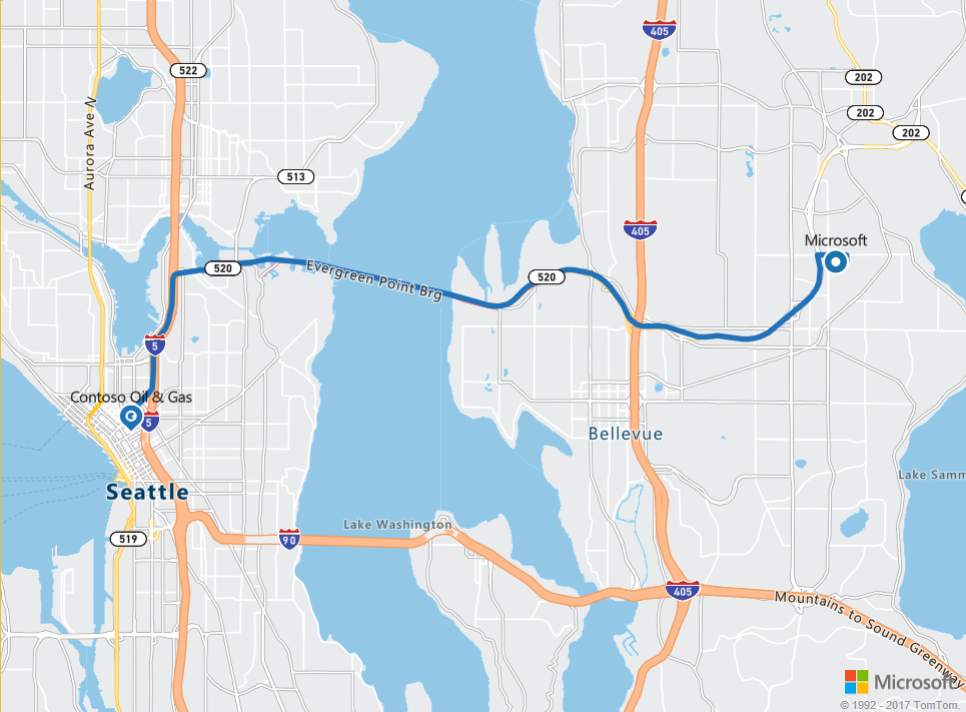

# Route to a point of interest using Azure Location Based Services

This tutorial shows how to use your Azure Location Based Services account and the Route Service SDK, to find the route to your point of interest. In this tutorial, you learn how to:

> [!div class="checklist"]
> * Get address coordinates
> * Query Route Service for directions to point of interest

## Prerequisites

Before you proceed, make sure to [create your Azure Location Based Services account](./tutorial-search-location.md#createaccount), and [get the subscription key for your account](./tutorial-search-location.md#getkey). You may also observe how to use the Map Control and Search Service APIs as discussed in the tutorial [Search nearby point of interest using Azure Location Based Services](./tutorial-search-location.md).


<a id="getcoordinates"></a>

## Get address coordinates

Use the following steps to create a static HTML page embedded with the Location Based Services' Map Control API. 

1. On your local machine, create a new file and name it **MapRoute.html**. 
2. Add the following HTML components to the file:

    ```HTML
    <!DOCTYPE html>
    <html lang="en">

    <head>
        <meta charset="utf-8" />
        <meta name="viewport" content="width=device-width, user-scalable=no" />
        <title>Map Route</title>
        <link rel="stylesheet" href="https://atlas.microsoft.com/sdk/css/atlas.min.css?api-version=1.0" type="text/css" />
        <script src="https://atlas.microsoft.com/sdk/js/atlas.min.js?api-version=1.0"></script>
        <style>
            html,
            body {
                width: 100%;
                height: 100%;
                padding: 0;
                margin: 0;
            }

            #map {
                width: 100%;
                height: 100%;
            }
        </style>
    </head>
    <body>
        <div id="map"></div>
        <script>
        // Embed Map Control JavaScript code here

        </script>

    </body>

    </html>
    ```
    Note how the HTML header embeds the resource locations for CSS and JavaScript files for the Azure Location Based Services library. Notice also the *script* segment in the body of the HTML file, that will contain the inline JavaScript code to access the Azure Location Based Service's APIs.

3. Add the following JavaScript code to the *script* block of the HTML file. Replace the placeholder *<insert-key>* with your Location Based Services account's primary key.

    ```HTML
            // Instantiate map to the div with id "map"
            var subscriptionKey = "<insert-key>";
            var map = new atlas.Map("map", {
                "subscription-key": subscriptionKey
            });

    ```
    The **atlas.Map** provides the control for a visual and interactive web map, and is a component of the Azure Map Control API.

4. Add the following JavaScript code to the *script* block. This adds a layer of *linestrings* to the Map Control to show the route:

    ```HTML
            // Initialize the linestring layer for routes on the map
            var routeLinesLayerName = "routes";
            map.addLinestrings([], {
                name: routeLinesLayerName,
                color: "#2272B9",
                width: 5,
                cap: "round",
                join: "round",
                before: "labels"
            });
    ```

5. Add the following JavaScript code to create start and end points for the route:

    ```HTML
            // Create the GeoJSON objects which represent the start and end point of the route
            var startPoint = new atlas.data.Point([-122.130137, 47.644702]);
            var startPin = new atlas.data.Feature(startPoint, {
                title: "Microsoft",
                icon: "pin-round-blue"
            });

            var destinationPoint = new atlas.data.Point([-122.3352, 47.61397]);
            var destinationPin = new atlas.data.Feature(destinationPoint, {
                title: "Cloister Oil & Gas",
                icon: "pin-blue"
            });
    ```
    This code creates two [GeoJSON objects](https://en.wikipedia.org/wiki/GeoJSON) to represent the start and end points of the route. The end point is the latitude/longitude combination for one of the *gasoline stations* searched in the previous tutorial [Search nearby point of interest using Azure Location Based Services](./tutorial-search-location.md).

6. Add the following JavaScript code to add the start and end points to the map:

    ```HTML
            // Fit the map window to the bounding box defined by the start and destination points
            var swLon = Math.min(startPoint.coordinates[0], destinationPoint.coordinates[0]);
            var swLat = Math.min(startPoint.coordinates[1], destinationPoint.coordinates[1]);
            var neLon = Math.max(startPoint.coordinates[0], destinationPoint.coordinates[0]);
            var neLat = Math.max(startPoint.coordinates[1], destinationPoint.coordinates[1]);
            map.setCameraBounds({
                bounds: [swLon, swLat, neLon, neLat],
                padding: 50
            });

            // Add pins to the map for the start and end point of the route
            map.addPins([startPin, destinationPin], {
                name: "route-pins",
                textFont: "SegoeUi-Regular",
                textOffset: [0, -20]
            });
    ``` 
    The API **map.setCameraBounds** adjusts the map window according to the coordinates of the start and end points. The API **map.addPins** adds the points to the Map control as visual components.

7. Save the **MapRoute.html** file on your machine. 

<a id="getroute"></a>

## Query Route Service for directions to point of interest

This section shows how to use the Azure Location Based Services' Route Service API to find the route from a given start point to a destination. The Route Service provides APIs to plan the fastest, shortest, or eco route between two locations, considering the real-time traffic conditions. It also allows users to plan routes in the future by using Azure's extensive historic traffic database and predicting route durations for any day and time. 

1. Open the **MapRoute.html** file created in the preceding section, and add the following JavaScript code to the *script* block, to illustrate the Route Service.

    ```HTML
            // Perform a request to the route service and draw the resulting route on the map
            var xhttp = new XMLHttpRequest();
            xhttp.onreadystatechange = function () {
                if (this.readyState == 4 && this.status == 200) {
                    var response = JSON.parse(xhttp.responseText);

                    var route = response.routes[0];
                    var routeCoordinates = [];
                    for (var leg of route.legs) {
                        var legCoordinates = leg.points.map((point) => [point.longitude, point.latitude]);
                        routeCoordinates = routeCoordinates.concat(legCoordinates);
                    }

                    var routeLinestring = new atlas.data.LineString(routeCoordinates);
                    map.addLinestrings([new atlas.data.Feature(routeLinestring)], { name: routeLinesLayerName });
                }
            };
    ```
    This code snippet creates an [XMLHttpRequest](https://xhr.spec.whatwg.org/), and adds an event handler to parse the incoming response. For a successful response, it constructs an array of coordinates for line segments of the first route returned. It then adds this set of coordinates for this route to the map's *linestrings* layer.

2. Add the following code to the *script* block, to send the XMLHttpRequest to the Azure Location Based Services' Route Service:

    ```HTML
            var url = "https://atlas.microsoft.com/route/directions/json?";
            url += "&api-version=1.0";
            url += "&subscription-key=" + subscriptionKey;
            url += "&query=" + startPoint.coordinates[1] + "," + startPoint.coordinates[0] + ":" +
                destinationPoint.coordinates[1] + "," + destinationPoint.coordinates[0];
    
            xhttp.open("GET", url, true);
            xhttp.send();
    ```
    The request above shows the required parameters, which are your account's subscription key, and the coordinates for the start and end points, in the given order. 

3. Save the **MapRoute.html** file locally, then open it in a web browser of your choice and observe the result. For a successful connection with the Location Based Services' APIs, you should see a map similar to the following. 

    


## Next steps
In this tutorial, you learned how to:

> [!div class="checklist"]
> * Get address coordinates
> * Query Route Service for directions to point of interest

Proceed to the tutorial [Find routes for different modes of travel using Azure Location Based Services](./tutorial-prioritized-routes.md) to learn how to use the Azure Location Based Services to prioritize routes to your point of interest, based on the mode of transport. 
