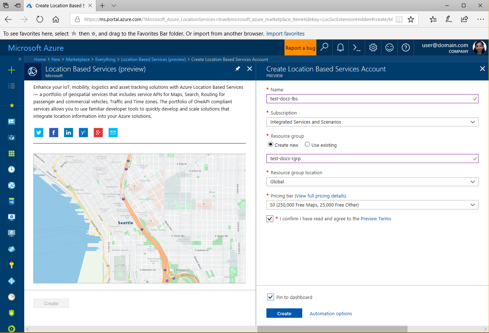
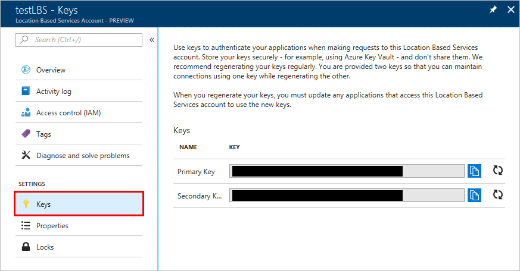
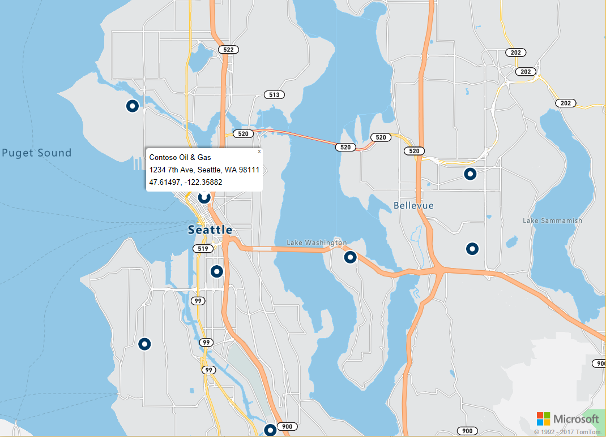

# Search nearby point of interest using Azure Location Based Services

This tutorial shows how to set up an account with Azure Location Based Services, and then use the provided APIs to search for a point of interest. In this tutorial, you learn how to:

> [!div class="checklist"]
> * Create an account with Azure Location Based Services
> * Get the subscription key for your account
> * Create new web page using Map Control API
> * Use Search Service to find nearby point of interest

If you don't have an Azure subscription, create a [free account](https://azure.microsoft.com/free/) before you begin.

# Log in to the Azure portal
Log in to the [Azure portal](https://portal.azure.com).

<a id="createaccount"></a>

## Create an account with Azure Location Based Services

Follow these steps to create a new Location Based Services account.

1. In the upper left-hand corner of the [Azure portal](https://portal.azure.com), click **Create a resource**.
2. In the *Search the Marketplace* box, type **location based services**.
3. From the *Results*, click the **Location Based Services (preview)**. Click **Create** button that appears below the map. 
4. On the **Create Location Based Services Account** page, enter the following values:
    - The *Name* of your new account. 
    - The *Subscription* that you want to use for this account.
    - The *Resource group* name for this account. You may choose to *Create new* or *Use existing* resource group.
    - Select the *Resource group location*.
    - Select the *Pricing tier*.
    - Read the *Preview Terms* and check the checkbox to accept the terms. 
    - Finally, click the **Create** button.
   
    


<a id="getkey"></a>

## Get the subscription key for your account

Once your Location Based Services account is successfully created, follow the steps to link it to its map search APIs:

1. Open your Location Based Services account in the portal.
2. Navigate to your account's **SETTINGS**, and then select **Keys**.
3. Copy the **Primary Key** to your clipboard. Save it locally to use in the proceeding steps. 

    


<a id="createmap"></a>

## Create new web page using Azure Map Control API
Azure Map Control API is a convenient client library that allows you to easily integrate Azure Location Based Services into your web application. It hides the complexity of the bare REST service calls and boosts your productivity with styleable and customizable components. The following steps show you how to create a static HTML page embedded with the Location Based Services' Map Control API. 

1. On your local machine, create a new file and name it **MapSearch.html**. 
2. Add the following HTML components to the file:

    ```HTML
    <!DOCTYPE html>
    <html lang="en">

    <head>
        <meta charset="utf-8" />
        <meta name="viewport" content="width=device-width, user-scalable=no" />
        <title>Map Search</title>

        <link rel="stylesheet" href="https://atlas.microsoft.com/sdk/css/atlas.min.css?api-version=1.0" type="text/css" />
        <script src="https://atlas.microsoft.com/sdk/js/atlas.min.js?api-version=1.0"></script>

        <style>
            html,
            body {
                width: 100%;
                height: 100%;
                padding: 0;
                margin: 0;
            }

            #map {
                width: 100%;
                height: 100%;
            }
        </style>
    </head>
    <body>
        <div id="map"></div>
        <script>
        // Embed Map Control JavaScript code here
        </script>

    </body>

    </html>
    ``` 
    Notice that the HTML header includes the CSS and JavaScript resource files hosted by the Azure Map Control library. Note the *script* segment added to the *body* of the HTML file. This segment will contain the inline JavaScript code to access the Azure Location Based Service's APIs.
 
3.  Add the following JavaScript code to the *script* block of the HTML file. Replace the placeholder *<insert-key>* with your Location Based Services account's primary key. 

    ```HTML/JavaScript
            // Instantiate map to the div with id "map"
            var subscriptionKey = "<insert-key>";
            var map = new atlas.Map("map", {
                "subscription-key": subscriptionKey
            });

    ```
    This segment initiates the Map Control API for your subscription key. **Atlas** is the namespace that contains the Azure Map Control API and related visual components. **atlas.Map** provides the control for a visual and interactive web map. You may observe how the map looks like by opening the HTML page in the browser. 

4. Add the following JavaScript code to the *script* block, to add a layer of search pins to the Map Control:

    ```HTML/JavaScript
            // Initialize the pin layer for search results to the map
            var searchLayerName = "search-results";
            map.addPins([], {
                name: searchLayerName,
                cluster: false,
                icon: "pin-round-darkblue"
            });
    ```

5. Save the file on your machine. 


<a id="usesearch"></a>

## Use Search Service to find nearby point of interest

This section shows how to use the Azure Location Based Services' Search Service API to find a point of interest on your map. It is a RESTful API designed for developers to search for addresses, points of interest and other geographical information. The Search Service assigns a latitude and longitude information to a specified address. 

1. Open the **MapSearch.html** file created in the preceding section, and add the following JavaScript code to the *script* block, to illustrate the Search Service. 
    ```HTML/JavaScript
            // Perform a request to the search service and create a pin on the map for each result
            var xhttp = new XMLHttpRequest();
            xhttp.onreadystatechange = function () {
                var searchPins = [];

                if (this.readyState === 4 && this.status === 200) {
                    var response = JSON.parse(this.responseText);

                    var poiResults = response.results.filter((result) => { return result.type === "POI" }) || [];

                    searchPins = poiResults.map((poiResult) => {
                        var poiPosition = [poiResult.position.lon, poiResult.position.lat];
                        return new atlas.data.Feature(new atlas.data.Point(poiPosition), {
                            name: poiResult.poi.name,
                            address: poiResult.address.freeformAddress,
                            position: poiResult.position.lat + ", " + poiResult.position.lon
                        });
                    });

                    map.addPins(searchPins, {
                        name: searchLayerName
                    });

                    var lons = searchPins.map((pin) => { return pin.geometry.coordinates[0] });
                    var lats = searchPins.map((pin) => { return pin.geometry.coordinates[1] });

                    var swLon = Math.min.apply(null, lons);
                    var swLat = Math.min.apply(null, lats);
                    var neLon = Math.max.apply(null, lons);
                    var neLat = Math.max.apply(null, lats);

                    map.setCameraBounds({
                        bounds: [swLon, swLat, neLon, neLat],
                        padding: 50
                    });
                }
            };
    ```
    This code snippet creates an [XMLHttpRequest](https://xhr.spec.whatwg.org/), and adds an event handler to parse the incoming response. For a successful response, it collects the addresses, names, latitude and logitude information for each location returned, in the `searchPins` variable. Finally, it adds this collection of location points to the `map` control as pins. 

2. Add the following code to the *script* block, to send the XMLHttpRequest to the Azure Location Based Services' Search Service:

    ```HTML/JavaScript
            var url = "https://atlas.microsoft.com/search/fuzzy/json?";
            url += "&api-version=1.0";
            url += "&query=gasoline%20station";
            url += "&subscription-key=" + subscriptionKey;
            url += "&lat=47.6292";
            url += "&lon=-122.2337";
            url += "&radius=100000"

            xhttp.open("GET", url, true);
            xhttp.send();
    ``` 
    This snippet uses the basic search API of the Search Service, called the **Fuzzy Search**. It handles the most fuzzy of inputs handling any combination of address or *POI* tokens. It searches for the nearby **gasoline station**, for the given address in latitude and longitude, and within the specified radius. It uses your account's subscription key provided earlier in the sample file, to make the call to the Location Based Services. It returns the results as latitude/longitude pairs for the locations found. You may observe the search pins by opening the HTML page in the browser. 

3. Add the following lines to the *script* block, to create pop-ups for the points of interest returned by the Search Service:

    ```HTML/JavaScript
            // Add a popup to the map which will display some basic information about a search result on hover over a pin
            var popup = new atlas.Popup();
            map.addEventListener("mouseover", searchLayerName, (e) => {
                var popupContentElement = document.createElement("div");
                popupContentElement.style.padding = "5px";

                var popupNameElement = document.createElement("div");
                popupNameElement.innerText = e.features[0].properties.name;
                popupContentElement.appendChild(popupNameElement);

                var popupAddressElement = document.createElement("div");
                popupAddressElement.innerText = e.features[0].properties.address;
                popupContentElement.appendChild(popupAddressElement);

                var popupPositionElement = document.createElement("div");
                popupPositionElement.innerText = e.features[0].properties.position;
                popupContentElement.appendChild(popupPositionElement);

                popup.setPopupOptions({
                    position: e.features[0].geometry.coordinates,
                    content: popupContentElement
                });

                popup.open(map);
            });
    ```
    The API **atlas.Popup** provides an information window anchored at the required position on the map. This code snippet sets the content and position for the popup, as well as adds an event listener to the `map` control, waiting for the _mouse_ to roll over the popup. 

4. Save the file, and then open the **MapSearch.html** file in a web browser of your choice and observe the result. At this point, the map in the browser shows information pop-ups when you hover over any of the search pins shown, similar to the following. 

    


## Next steps
In this tutorial, you learned how to:

> [!div class="checklist"]
> * Create an account with Azure Location Based Services
> * Get the subscription key for your account
> * Create new web page using Map Control API
> * Use Search Service to find nearby point of interest

Proceed to the tutorial [Route to a point of interest using Azure Location Based Services](./tutorial-route-location.md) to learn how to use the Azure Location Based Services to route to your point of interest. 
