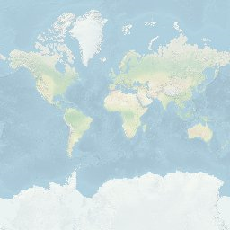
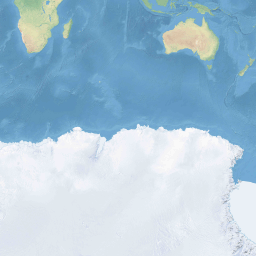
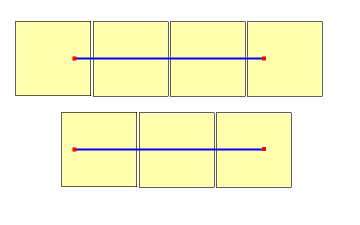
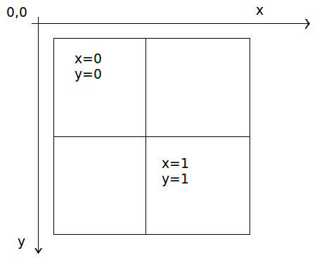

# Zoom Levels and Tile Grid
Azure Location Based Services use the Spherical Mercator projection coordinate system (EPSG: 3857).

The world is divided into square tiles. Render (Raster) has 19 zoom levels, numbered 0 through 18. Render (Vector) has 21 zoom levels, numbered 0 through 20. At zoom level 0, the entire world fits on a single tile:

Zoom level 1 uses 4 tiles to render the world: a 2 x 2 square

      

      

Each subsequent zoom level quad-divides the tiles of the previous one, creating a grid of 2zoom x 2zoom. Zoom level 20 is a grid 220 x 220, or 1,048,576 x 1,048,576 tiles (109,951,162,778 in total).

The full table of values for zoom levels is here:

|zoom level|meters/pixel|meters/tile side|
|--- |--- |--- |
|0|156543|40075008|
|1|78271.5|20037504|
|2|39135.8|10018764.8|
|3|19567.9|5009382.4|
|4|9783.9|2504678.4|
|5|4892|1252352|
|6|2446|626176|
|7|1223|313088|
|8|611.5|156544|
|9|305.7|78259.2|
|10|152.9|39142.4|
|11|76.4|19558.4|
|12|38.2|9779.2|
|13|19.1|4889.6|
|14|9.6|2457.6|
|15|4.8|1228.8|
|16|2.4|614.4|
|17|1.2|307.2|
|18|0.6|152.8|
|19|0.3|76.4|
|20|0.15|38.2|

Tiles are called by zoom level and the x and y coordinates corresponding to the tile's position on the grid for that zoom level.

When determining which zoom level to use, remember that each location is in a fixed position on its tile. This means that the number of tiles needed to display a given expanse of territory is dependent on the specific placement of zoom grid on the world. For instance, if there are two points 900 meters apart, it *may* only take three tiles to display a route between them at zoom level 17. However, if the western point is on the right of its tile, and the eastern point on the left of its, it may take four tiles:

 

Once the zoom level is determined, the x and y values can be calculated. The top left tile in each zoom grid is x=0, y=0; the bottom-right tile is at x=2zoom -1, y=2zoom-1.

Here is the zoom grid for zoom level 1:

