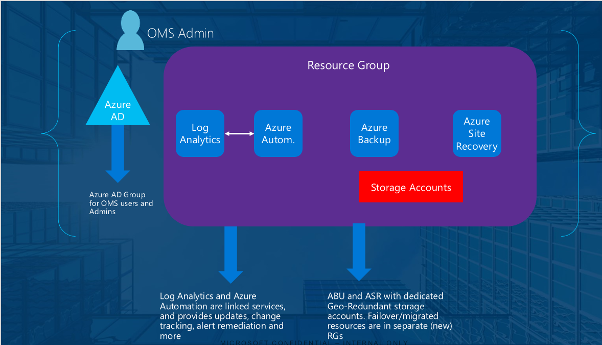
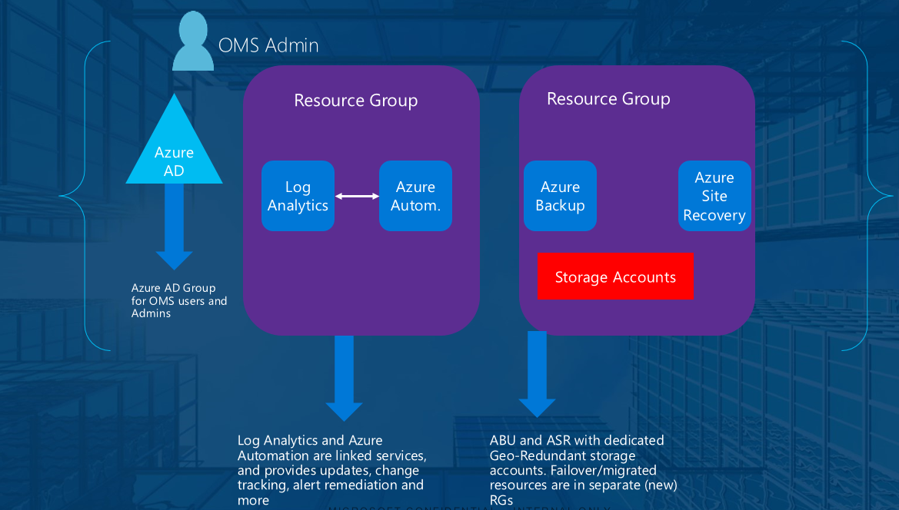
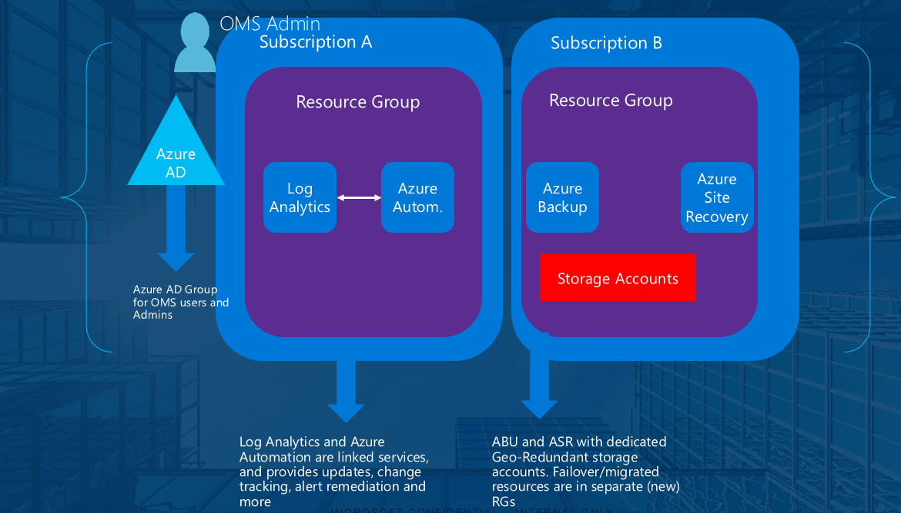
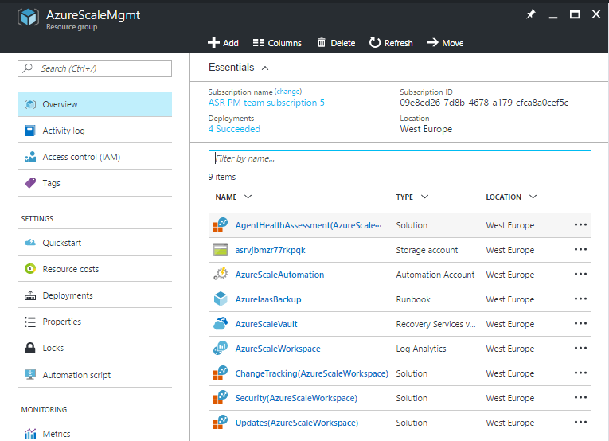
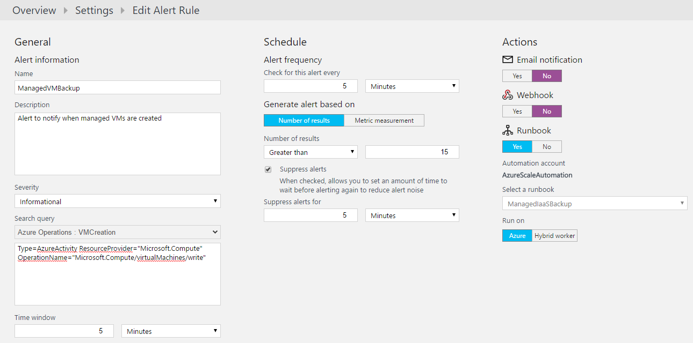
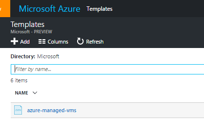
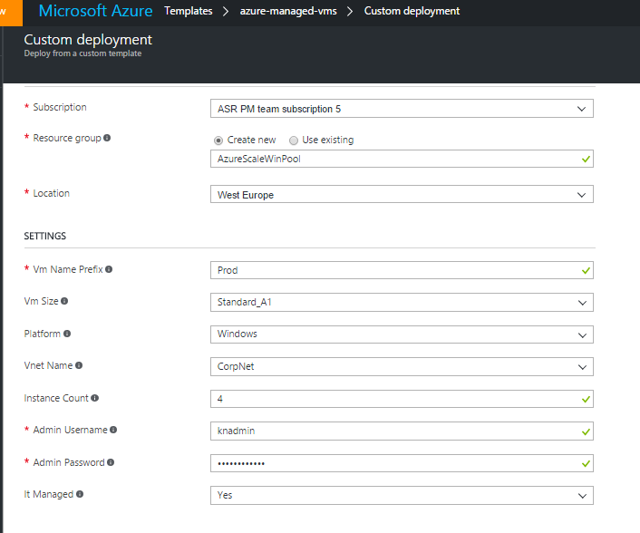
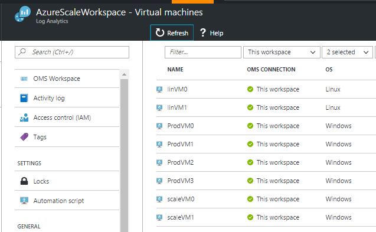
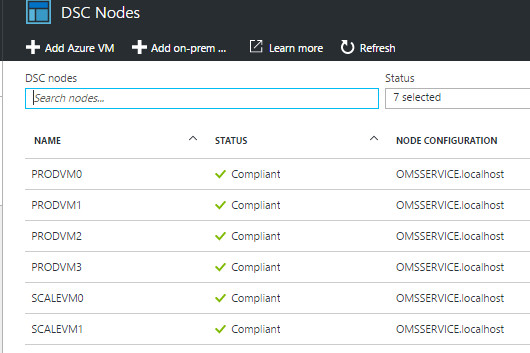
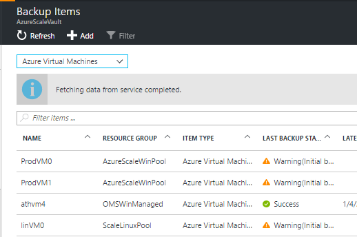

# Azure Management at scale with OMS

Microsoft Operations Management Suite (OMS) is a set of cloud services specifically designed to manage your resources, regardless of platform, location and whether it is IaaS and PaaS. 

This article will focus on - and show examples and provide tutorials of how enterprise organizations and service providers are using OMS to manage their Azure subscriptions and resources *at scale*, combining several technologies such as:

* Azure Resource Manager
* Azure Resource Manager Policies
* Tags
* Role-Based Access Control
* Azure Resource Manager Templates
* Azure Monitor
* Azure Log Analytics
* Azure Automation
* Azure Site Recovery
* Azure Backup

****

## Step 1.1 - Deployment of OMS
###### OMS Services within a single Resource Group
 
Being able to programatically deploy and configure the OMS services is key when managing Azure at scale. Some of the OMS services can be considered to be 'global', meaning that you might only need to deploy the service once into a particular subscription and the service can manage its resources regardless of the subscription hierarchy you have designed. As an example, you can deploy Azure Log Analytics and Azure Automation to a Resource Group in a subscription to one of the regions where they are available and still be able to manage resources across other subscriptions, resource groups and locations.

Azure Backup and Azure Site Recovery, however, might be best suited to be deployed into the subscription and the region(s) where the protected workload will be running, together with the related resources for a protection, replication and migration scenario, such as storage accounts, virtual networks, network security groups and more.

Every OMS service is available in Azure Resource Manager, meaning that you can deploy the services and configure them end-to-end using an Azure Resource Manager template. The template is deployed to an existing or a new Resource Group and every OMS service should be within the same Resource Group. The benefits you get here is that Azure Resource Manager can dynamically retrieve the properties of the resources during deployment, which will simplify the configuration of these services to be integrated with each other, as well as you can simplify Role-Based Access Control and management of the services.

Azure Log Analytics and Azure Automation can be linked, and when using the Per Node licensing, they have to be linked and must reside within the same resource group and ideally the same region. This is required to deliver Change Tracking and Update Management that will integrate process automation and configuration for automated delivery of services using PowerShell.

Azure Backup and Azure Site Recovery shares the same resource provider namespace, meaning that when you deploy Recovery Services you will get both from a single interface. These services are normally deployed into the region where you will have you IaaS instances. You can use the already linked Automation Account together with Azure Backup and Azure Site Recovery, or you can create dedicated and separate automation accounts for the different tasks. However, only a single Automation account can be linked to a single Log Analytics workspace.

###### OMS Services across multiple Resource Groups

When you need to scale the management services, like when you need to protect IaaS instances in a new region other than the region where you have already deployed your services, you must deploy a new Recovery Vault for Azure Backup and Azure Site Recovery within the same region as your virtual machines to enable backup. This might be into a the same or a new resource group in the same subscription as the other OMS services or it can be a *new* resource group in a different subscription than the other OMS services, but for monitoring (using Log Analytics) and process and configuration management (using Automation) you can use the already existing services you have deployed, regardless of subscription, location and resource group.

###### OMS Services across multiple Subscriptions

Since Log Analytics and Automation can reside in a single resource group in a single subscription and capable of manage resources across subscriptions, the only time you need to scale your management services is when there's a need for backup or replication of IaaS instances. Depending on your subscription hierarchy, you might have multiple subscriptions categorized as production, hence need additional instances of Azure Backup and Azure Site Recovery spread across the regions. The design below shows how you can have the OMS services living in separate resource groups and subscriptions.

###### Deploy OMS Services using Azure Resource Manager Template
This particular Azure Resource Manager template that will deploy all the OMS services to a single Resource Groups, and you can specify the preferred region for each service:

 

* Azure Log Analytics

The template is configured to enable some of the solutions from the marketplace, create some saved searches and also be configured with some data sources specifically related to the other OMS services. 

* Azure Automation

The template will create several assets for you to use, such as credentials and variables that can be used out-of-the-box with the runbooks provided. All the dependencies are present and will be created dynamically.

* Azure Backup

Get started immediately post deployment by running the provided runbook in Azure Automation that will enable Azure IaaS backup on your VMs present within the region where you deployed your Recovery Vault

* Azure Site Recovery

After deployment, the remaining part is to add your on-prem resources such as your Hyper-V hosts or/and Management/Configuration Servers to the Recovery Vault and leverage the pre-created Hyper-V site and policies for your replication provider
You can leverage the pre-created storage account as target for your replication scenarios.

## Step 1.2 - Lock Resources with Azure Resource Manager

For any production workload running in Azure, such as your OMS management services, you as an administrator may need to lock a subscription, a Resource Group or individual resources to prevent other users in your organization from accidentally deleting or modifying these critical resources. We support two levels of locks - **CanNotDelete** and **ReadOnly**.

**ReadOnly** will ensure that authorized users are able to *read* a resource, but unable to delete or make any changes.

**CanNotDelete** will ensure that authorized users can read and also modify a resource, but be unable to delete that particular resource 

Here's an example of how you can create a **CanNotDelete** lock on the resource group containing the management services using an **ARM template**:

	{
	    "$schema": "https://schema.management.azure.com/schemas/2015-01-01/deploymentTemplate.json#",
	    "contentVersion": "1.0.0.0",
	    "parameters": {
	        "lockedResourceGroupName": {
	            "type": "string",
	            "metadata": {
	                "description": "Specify the name of the resource group you want to lock"
	            }
	        }
	    },
	    "resources": [
	        {
	            "apiVersion": "2015-01-01",
	            "type": "Microsoft.Authorization/locks",
	            "name": "[parameters('lockedResourceGroupName')]",
	            "properties": {
	                "level": "CannotDelete",
	                "notes": "Contains Management services"
	            }
	        }
	    ],
	    "outputs": {        
	    }
	}

You can also achieve the same using **Azure PowerShell** with the following cmdlet:

		New-AzureRmResourceLock -LockLevel CanNotDelete -ResourceGroupName AzureScaleMgmt -LockName "Mgmt rg lock" -LockNotes "Contains Management services"

For any ARM template that is being shared within the organization in Azure, it's recommended to apply resource locks on the resources or the resource group as part of the template itself, or have a mechanism that will apply the locks afterwards, using a combination of Tags and Automation runbooks.

## Step 1.3 - Create and apply Policies to subscriptions, resource groups and resources

Managing Azure at scale will in many cases involve custom policies that you create and applies at the relevant scopes to ensure a level of govern.
In comparison to RBAC which we have mentioned earlier, policies work well together with RBAC since authentication needs to happen through RBAC. However, policies is an allow or explicit deny system you can apply at different scopes.

Typically use cases of ARM policies are when you need to ensure that certain tags are applied to the resources that are being created, or if you want to control which resources the users should be able to deploy, which SKU and whether they should be able to deploy to a certain Azure region or not.

In the context of managing Azure at scale with OMS, there's two things we would like to cover.

* Lock down the Resource Group containing the OMS services, to avoid that creation of virtual machines can happen in that particular resource group
* Ensure that workloads that are being deployed into the production subscription will get the required tag(s) applied, so that they can automatically be managed by the OMS services post deployment

Policies can be applied using PowerShell, Cli or using the REST API. Most common is to define the policies in a JSON file and apply it using PowerShell.

For the first policy, we have the following JSON, that will deny any creation of virtual machines

	{
	    "$schema": "http://schema.management.azure.com/schemas/2015-10-01-preview/policyDefinition.json",
	    "if": {
	        "source": "action",
	        "equals": "Microsoft.Compute/virtualMachines/write"
	    },
	    "then": {
	        "effect": "deny"
	    }
	}

Next, the policy is defined and applied using PowerShell

	$policydef = New-AzureRmPolicyDefinition -Name "MGMT Resource control" -DisplayName "MGMT Resource Control" -Policy C:\AzureDeploy\AzureMgmt\Mgmt\mgmtRgPolicy.json -Description "Deny creation of compute resources in mgmt resource group"

Once the policy has been defined, we need to retrieve the the resource id of the resource group containing the management services, since the policy will have to be applied at the resource group scope in this example.

We use the following cmdlet to store the resource id in a variable:

	$rg = (Get-AzureRmResourceGroup -name AzureScaleMgmt).resourceId

To apply the policy at the resource group scope, we use the following cmdlet:

	New-AzureRmPolicyAssignment -Name MGMTControl -Scope $rg -PolicyDefinition $policydef

	Name               : MGMTControl
	ResourceId         : /subscriptions/09e8ed26-7d8b-4678-a179-cfca8a0cef5c/resourceGroups/AzureScaleMgmt/providers/Microsoft.Authorization/policyAssignments/MGMTControl
	ResourceName       : MGMTControl
	ResourceType       : Microsoft.Authorization/policyAssignments
	ResourceGroupName  : AzureScaleMgmt
	SubscriptionId     : 09e8ed26-7d8b-4678-a179-cfca8a0cef5c
	Properties         : @{policyDefinitionId=/subscriptions/09e8ed26-7d8b-4678-a179-cfca8a0cef5c/providers/Microsoft.Authorization/policyDefinitions/MGMT Resource control; scope=/subscriptions/09e8ed26-7d8b-4678-a179-cfca8a0cef5c/resourceGroups/AzureScaleMgmt}
	PolicyAssignmentId : /subscriptions/09e8ed26-7d8b-4678-a179-cfca8a0cef5c/resourceGroups/AzureScaleMgmt/providers/Microsoft.Authorization/policyAssignments/MGMTControl

To ensure that every virtual machine that is being created can be automatically picked up by the management services post deployment, we are also assigning a policy at the subscription scope that will ensure that vms in a particular subscription will append the correct tags.

We first create the following JSON with the policy

	{
	    "$schema": "http://schema.management.azure.com/schemas/2015-10-01-preview/policyDefinition.json",
	    "if": {
	        "allOf": [
	            {
	                "not": {
	                    "field": "tags",
	                    "contains": "Managed"
	                }
	            },
	            {
	                "field": "type",
	                "equals": "Microsoft.Compute/virtualMachines"
	            }
	        ]
	    },
	    "then": {
	        "effect": "append",
	        "details": [
	            {
	                "field": "Tags",
	                "value": {"Managed":"True"}
	            }
	        ]        
	    }
	}    

Then we create a new policy definition using PowerShell with this cmdlet:

	$tagspolicydef = new-AzureRmPolicyDefinition -Name "Tags" -DisplayName "Policy to ensure tags for production" -Description "This policy will append tags to vms so they are automatically managed" -Policy C:\AzureDeploy\AzureMgmt\Mgmt\mgmtTagPolicy.json

Since we will apply this policy at the subscription scope, we will use the following cmdlet to store the subscription in a variable

	$subscriptionid = (Get-AzureRmContext).subscription.SubscriptionId

And last, we will apply this policy at the subscription scope using the following cmdlet

	New-AzureRmPolicyAssignment -Name TagControl -Scope /subscriptions/$subscriptionId -PolicyDefinition $tagspolicydef
 	
	Name               : TagControl
	ResourceId         : /subscriptions/09e8ed26-7d8b-4678-a179-cfca8a0cef5c/providers/Microsoft.Authorization/policyAssignments/TagControl
	ResourceName       : TagControl
	ResourceType       : Microsoft.Authorization/policyAssignments
	SubscriptionId     : 09e8ed26-7d8b-4678-a179-cfca8a0cef5c
	Properties         : @{policyDefinitionId=/subscriptions/09e8ed26-7d8b-4678-a179-cfca8a0cef5c/providers/Microsoft.Authorization/policyDefinitions/Tags; scope=/subscriptions/09e8ed26-7d8b-4678-a179-cfca8a0cef5c}
	PolicyAssignmentId : /subscriptions/09e8ed26-7d8b-4678-a179-cfca8a0cef5c/providers/Microsoft.Authorization/policyAssignments/TagControl

Once this policy is applied, all the VMs created within this subscription will get the tag appended, and you are able to leverage this as part of any automation jobs towards these machines by filtering on the tag.

	Find-AzureRmResource -Tags 'Managed'

	Name              : ScaleVm
	ResourceId        : /subscriptions/09e8ed26-7d8b-4678-a179-cfca8a0cef5c/resourceGroups/ScaleVMRg/providers/Microsoft.Compute/virtualMachines/ScaleVm
	ResourceName      : ScaleVm
	ResourceType      : Microsoft.Compute/virtualMachines
	ResourceGroupName : ScaleVMRg
	Location          : westeurope
	SubscriptionId    : 09e8ed26-7d8b-4678-a179-cfca8a0cef5c

## Step 2.1 - Manage IaaS Virtual Machines

Customers are using both Azure Resource Manager and OMS services to manage their virtual machines running in Azure.
For OMS in particular, there's several ways of managing the VM instances in Azure, depending on which service you are working with. Most importantly is that you can use a combination of all the services together to get a streamlined, desired configuration applied to your workloads, while ensuring they are compliant in regards to security, monitoring and backup.

As a quick overview, here's the different endpoints for each OMS service from a VM management perspective in Azure

* Log Analytics

Virtual machines are being managed by Log Analytics when the MMA (Windows) or OMS (Linux) agent is installed. To associate and report to the workspace, these agents need to be instrumented with the workspace *id* and the workspace *key* of the Log Analytics workspace. When running VMs in Azure, there's several ways to deploy the agents.

In the context of doing management *at scale* with Log Analytics, you will often turn to automation to deploy and configure the agents on the workloads, such as adding the OMS VM Extension to your ARM templates when deploying VMs, or Automation DSC to deploy and install the agents - or a combination of those two, where you use ARM to deploy the Extensions and then Automation DSC will add the Service Map agent and also maintain the state of the agents post deployment to ensure they are in the expected state.

To add the OMS VM Extension to your ARM template, you can do so by using the following section:

        {
            "apiVersion": "2015-05-01-preview",
            "type": "Microsoft.Compute/virtualMachines/extensions",
            "name": "[concat(parameters('vmNameSuffix'), 'VM', copyIndex(), '/OMS')]",
            "location": "[resourceGroup().location]",
            "copy": {
                "name": "[concat(parameters('vmNameSuffix'), 'VM', 'OMS')]",
                "count": "[parameters('instanceCount')]"
            },
            "dependsOn": [
                "[concat('Microsoft.Compute/virtualMachines/', parameters('vmNameSuffix'), 'VM', copyIndex())]"
            ],
            "properties": {
                "publisher": "Microsoft.EnterpriseCloud.Monitoring",
                "type": "[variables('managementType').type]",
                "typeHandlerVersion": "1.0",
                "autoUpgradeMinorVersion": true,
                "settings": {
                    "workspaceId": "[reference(resourceId(parameters('workspaceResourceGroupName'), 'Microsoft.OperationalInsights/workspaces/', parameters('workspaceName')), '2015-11-01-preview').customerId]"
                },
                "protectedSettings": {
                    "workspaceKey": "[listKeys(resourceId(parameters('workspaceResourceGroupName'),'Microsoft.OperationalInsights/workspaces/', parameters('workspaceName')), '2015-11-01-preview').primarySharedKey]"
                }
            }
        }

Instead of specifying the workspace *id* and workspace *key* when deploying the template, we can use two functions to retrieve the values automatically during runtime.

For the workspace *id* we use **reference** which has the following syntax to return an object representing another resource's runtime state

	reference (resourceName or resourceId, apiVersion)

For the workspace *key* we use **listKeys** which has the following syntax to return the values for any resource type that supports the list operation

	listKeys (resourceName or resourceId, apiVersion)

This example will automatically deploy the OMS VM Extension to a potentially large number of VMs since we are also using the numeric **copyIndex** function - which will return the index of an iteration loop.

It is also common to combine multiple VM extensions in the ARM templates for IaaS, to ensure that proper agents are being installed, specific scripts are applied to configure an application or a service using a **CustomScript Extension**, or use **PowerShellDSC Extension** to either push the configuration to the guest during runtime, or register with Automation DSC to pull the configuration.

Extensions for virtual machines are first-class resources within Azure Resource Manager, meaning that you can define the order of orchestration within the template itself. For the next section, we will add another extension, PowerShell DSC, that will take a dependency on the OMS VM Extension to be completed before it starts.

	    {
            "type": "Microsoft.Compute/virtualMachines/extensions",
            "name": "[concat(parameters('vmNameSuffix'),'VM', copyIndex(), '/Microsoft.Powershell.DSC')]",
            "apiVersion": "2015-06-15",
            "location": "[resourceGroup().location]",
            "dependsOn": [
                "[concat('Microsoft.Compute/virtualMachines/', parameters('vmNameSuffix'), 'VM', copyIndex(), '/extensions/OMS')]"
            ],
            "copy": {
                "name": "[concat(parameters('vmNameSuffix'), 'VM', 'DSC')]",
                "count": "[parameters('instancecount')]"
            },
            "properties": {
                "publisher": "[variables('managementType').publisher]",
                "type": "[variables('managementType').dscType]",
                "typeHandlerVersion": "[variables('managementType').version]",
                "autoUpgradeMinorVersion": true,
                "protectedSettings": {
                },
                "settings": {
                    "ModulesUrl": "https://github.com/krnese/AzureDeploy/raw/master/OMS/MSOMS/Solutions/ServiceMap/scripts/OMSServiceMap.ps1.zip",
                    "SasToken": "",
                    "ConfigurationFunction": "OMSServiceMap.ps1\\OMSServiceMap"
                }
            }
        } 

In the above example, the VM will apply the DSC configuration doing a *push*, which means it will not be managed by Automation DSC in this case.

The configuration that is being applied will ensure that the OMS agent is running, before the configuration will start to download and apply the Service Map agent - which has a dependency on the OMS agent.

		Configuration OMSServiceMap {
		
	    $RemoteFile = 'https://aka.ms/dependencyagentwindows'
	    $ServiceMapLocalPath = 'C:\ServiceMap\InstallDependencyAgent-Windows.exe'
	    $Arguments = $ServiceMapLocalPath + ' /S'
	
	    Import-DscResource -ModuleName xPSDesiredStateConfiguration
	
	    Node localhost {
	        Service OMSService
	        {
	            Name = 'HealthService'
	            State = 'Running'
	        }
	        xRemoteFile ServiceMapPackage {
	            Uri = $RemoteFile
	            DestinationPath = $ServiceMapLocalPath
	        }
	        WindowsProcess ServiceMap {
	            Ensure = 'Present'
	            Path = $ServiceMapLocalPath
	            Arguments = $Arguments
	            DependsOn = '[xRemoteFile]ServiceMapPackage'
	         
	        }
	        Service ServiceMap {
	            Name = 'Microsoft Dependency Agent'
	            State = 'Running'
	        }
	    }
	}

* Azure Automation

Every resource in Azure can be managed by Azure Automation which can contain the required AzureRm PowerShell modules together with variables and assets you define to fit the purpose. The automation account can also contain DSC configurations and DSC nodes that are under management, that will pull the configuration from the Automation DSC endpoint. For process automation, you can create graphical runbooks, native runbooks and PowerShell workflows that can be associated with your preferred source control system for doing management at scale.

In the example above for Log Analytics, we used PowerShellDSC VM Extension to *push* the DSC configuration to the nodes. However, it might be suitable in scalable environment to use *pull* so you have a single place to maintain the configurations and the nodes. 

To configure the Automation account for this scenario, customers are doing the authoring part locally before submitting the artifacts and compiling the configurations in Azure Automation using an Azure Resource Manager template.

By using a template, you can create all the required assets for your configuration to work without having to do anything manually post deployment. The following example shows the DSC configuration that will be deployed and compiled into Automation DSC, for installing the OMS Agent:

		Configuration OMS {
	  
	    $OMSPackageLocalPath = 'C:\MMA\MMASetup-AMD64.exe'
	    $OMSWorkspaceId = Get-AutomationVariable -Name 'OMSWorkspaceId'
	    $OMSWorkspaceKey = Get-AutomationVariable -Name 'OMSWorkspaceKey'
	
	
	    Import-DscResource -ModuleName xPSDesiredStateConfiguration
	
	    Node localhost {
	        Service OMSService
	        {
	            Name = "HealthService"
	            State = "Running"
	        } 
	
	        xRemoteFile OMSPackage {
	            Uri = "https://go.microsoft.com/fwlink/?LinkID=517476"
	            DestinationPath = $OMSPackageLocalPath
	        }
	
	        Package OMS {
	            Ensure = "Present"
	            Path  = $OMSPackageLocalPath
	            Name = 'Microsoft Monitoring Agent'
	            ProductId = '8A7F2C51-4C7D-4BFD-9014-91D11F24AAE2'
	            Arguments = '/C:"setup.exe /qn ADD_OPINSIGHTS_WORKSPACE=1 OPINSIGHTS_WORKSPACE_ID=' + $OMSWorkspaceId + ' OPINSIGHTS_WORKSPACE_KEY=' + $OMSWorkspaceKey + ' AcceptEndUserLicenseAgreement=1"'
	            DependsOn = '[xRemoteFile]OMSPackage'
	        }
	    }
	} 

In the ARM template we can dynamically create the values for the workspace *id* and *key* by using the functions described earlier, similar to the OMS VM Extension, so that when a DSC node will pull the configuration and gets the automation variables for $OMSWorkspaceId and $OMSWorkspaceKey, these values are populated in the assets store in the automation account, with the correct id and key.

	            {
                    "name": "[variables('assets').aaVariables.OMSWorkspaceId.name]",
                    "type": "variables",
                    "apiVersion": "2015-10-31",
                    "dependsOn": [
                        "[concat('Microsoft.Automation/automationAccounts/', variables('automationName'))]"
                    ],
                    "tags": {},
                    "properties": {
                        "description": "[variables('assets').aaVariables.OMSWorkspaceId.description]",
                        "value": "[concat('\"',reference(resourceId('Microsoft.OperationalInsights/workspaces/', parameters('omsWorkspaceName')), '2015-11-01-preview').customerId,'\"')]"
                    }
                },
                {
                    "name": "[variables('assets').aaVariables.OMSWorkspaceKey.name]",
                    "type": "variables",
                    "apiVersion": "2015-10-31",
                    "dependsOn": [
                        "[concat('Microsoft.Automation/automationAccounts/', variables('automationName'))]"
                    ],
                    "tags": {},
                    "properties": {
                        "description": "Remote file for the passphrase",
                        "value": "[concat('\"',listKeys(resourceId('Microsoft.OperationalInsights/workspaces/', parameters('omsWorkspaceName')), '2015-11-01-preview').primarySharedKey,'\"')]"
                    }
                }

Using the ARM template, we can also import any required PowerShell module into the assets of the Automation account. In the example below we have specified the URI in a complex variable that we are using when creating the resource

	            {
                    "name": "[variables('assets').psModules.xPSDSC.name]",
                    "type": "Modules",
                    "apiVersion": "2015-10-31",
                    "tags": {},
                    "dependsOn": [
                        "[concat('Microsoft.Automation/automationAccounts/', variables('automationName'))]",
                        "[concat('Microsoft.Automation/automationAccounts/', variables('automationName'), '/Variables/', variables('assets').aaVariables.OMSWorkspaceId.name)]",
                        "[concat('Microsoft.Automation/automationAccounts/', variables('automationName'), '/Variables/', variables('assets').aaVariables.OMSWorkspaceKey.name)]"                      
                    ],
                    "properties": {
                        "contentLink": {
                            "uri": "[variables('assets').psModules.xPSDSC.uri]"
                        }
                    }
                }

Once the prerequisites are deployed to the Automation account, the template can proceed to deploy the configuration we described earlier

	           {
                    "name": "[variables('assets').dsc.omsConfig.name]",
                    "type": "Configurations",
                    "apiVersion": "2015-10-31",                    
                    "tags": {},
                    "dependsOn": [
                        "[concat('Microsoft.Automation/automationAccounts/', variables('automationName'))]",
                        "[concat('Microsoft.Automation/automationAccounts/', variables('automationName'), '/Variables/', variables('assets').aaVariables.OMSWorkspaceId.name)]",
                        "[concat('Microsoft.Automation/automationAccounts/', variables('automationName'), '/Variables/', variables('assets').aaVariables.OMSWorkspaceKey.name)]", 
                        "[concat('Microsoft.Automation/automationAccounts/', variables('automationName'), '/Modules/', variables('assets').psModules.xPSDSC.name)]"
                    ],
                    "properties": {
                        "logVerbose": "false",
                        "description": "[variables('assets').dsc.omsConfig.description]",
                        "state": "Published",
                        "overwrite": "true",
                        "Source": {
                            "type": "uri",
                            "Value": "[variables('assets').dsc.omsConfig.uri]"
                        }
                    }
                }

The last part we need in the template is to compile the configuration within the automation account, and the following section will take care of that

	           {
                    "name": "[parameters('DSCJobGuid')]",
                    "type": "compilationJobs",
                    "apiVersion": "2015-10-31",
                    "tags": {},
                    "dependsOn": [
                        "[concat('Microsoft.Automation/automationAccounts/', variables('automationName'))]",
                        "[concat('Microsoft.Automation/automationAccounts/', variables('automationName'),'/Configurations/', variables('assets').dsc.omsConfig.name)]"
                    ],
                    "properties": {
                        "configuration": {
                            "name": "[variables('assets').dsc.omsConfig.name]"
                        }
                    }
                }

The complete template can be explored and deployed by clicking on 'Deploy to Azure' below

 
 

Once a DSC configuration is deployed to the Automation account, you can start to leverage the configuration and attach your virtual machines and specify the settings for the DSC Local Configuration Manager - which instructs the DSC engine how it should behave. This can be done by using PowerShell and the Azure management portal, but when doing this at scale it is recommended to incorporate this into an ARM template using the PowerShell DSC VM Extension.

A typical example of a PowerShell DSC VM Extension that should be configured to *pull* from an Automation DSC can be seen below, where you instead of pushing the configuration to the node, you are instructing the LCM to retrieve the node configuration from the automation endpoint using *pull*

        {
            "type": "Microsoft.Compute/virtualMachines/extensions",
            "name": "[concat(parameters('vmName'),'/Microsoft.Powershell.DSC')]",
            "apiVersion": "2015-06-15",
            "location": "[resourceGroup().location]",
            "properties": {
                "publisher": "Microsoft.Powershell",
                "type": "DSC",
                "typeHandlerVersion": "2.19",
                "autoUpgradeMinorVersion": true,
                "protectedSettings": {
                    "Items": {
                        "registrationKeyPrivate": "[parameters('registrationKey')]"
                    }
                },
                "settings": {
                    "ModulesUrl": "[variables('modulesUrl')]",
                    "SasToken": "",
                    "ConfigurationFunction": "[variables('configurationFunction')]",
                    "Properties": [
                        {
                            "Name": "RegistrationKey",
                            "Value": {
                                "UserName": "PLACEHOLDER_DONOTUSE",
                                "Password": "PrivateSettingsRef:registrationKeyPrivate"
                            },
                            "TypeName": "System.Management.Automation.PSCredential"
                        },
                        {
                            "Name": "RegistrationUrl",
                            "Value": "[parameters('registrationUrl')]",
                            "TypeName": "System.String"
                        },
                        {
                            "Name": "NodeConfigurationName",
                            "Value": "[parameters('nodeConfigurationName')]",
                            "TypeName": "System.String"
                        },
                        {
                            "Name": "ConfigurationMode",
                            "Value": "[variables('configurationMode')]",
                            "TypeName": "System.String"
                        },
                        {
                            "Name": "ConfigurationModeFrequencyMins",
                            "Value": "[variables('configurationModeFrequencyMins')]",
                            "TypeName": "System.Int32"
                        },
                        {
                            "Name": "RefreshFrequencyMins",
                            "Value": "[variables('refreshFrequencyMins')]",
                            "TypeName": "System.Int32"
                        },
                        {
                            "Name": "RebootNodeIfNeeded",
                            "Value": "[variables('rebootNodeIfNeeded')]",
                            "TypeName": "System.Boolean"
                        },
                        {
                            "Name": "ActionAfterReboot",
                            "Value": "[variables('actionAfterReboot')]",
                            "TypeName": "System.String"
                        },
                        {
                            "Name": "AllowModuleOverwrite",
                            "Value": "[variables('allowModuleOverwrite')]",
                            "TypeName": "System.Boolean"
                        }
                    ]
                }
            }
        }

* Azure Backup

Azure Backup will take backup of virtual machines within the region where the Recovery Vault is located, meaning that if you have your Recovery Vault located in East Us, it will only be able to backup virtual machines in East Us.
In order to handle these conditions, although region restrictions can be enforced using ARM policies, a combination of both Log Analytics and Azure Automation is being used to automatically handle protection of virtual machines when certain conditions are met. The same applies for any brownfield scenarios where you have already existing virtual machines in Azure, you can filter based on the preferred conditions (region, resource type, tags etc.) to apply a specific configuration.

In the following example, we will look into a scenario that is commonly used by customers that are managing Azure at scale, combining many of the OMS services together.

Using the Activity Log Analytics solution in Log Analytics, you are able to collect the logs from Azure Resource Manager from any of the Azure subscriptions you manage. This means you can search, correlate and perform forensics on the operations that takes place, such as detecting certain operations like VM creation, deletion and more.

Log Analytics together with Azure Automation makes your operations more event and data driven, so that when specific operations take place in a subscription, this will get logged in Log Analytics where you can define an alert with conditions that can link to an Automation runbook. 

The first step that needs to be completed, is to prepare the automation account with the runbook that will listen to incoming webhooks, since the integration from Log Analytics to Automation will be based on JSON payload using a webhook.

The runbook in our example can be seen below, which will iterate through the search results from the alert, filter out the virtual machine names and check if they are in the same region as the backup vault before applying backup using an ARM template

	param (
    
    [object]$WebhookData
      
      )
            
            $webhookname = $WebhookData.WebhookName		
			
            $webhookHeaders = $WebhookData.RequestHeader						
			
            $webhookBody = $WebhookData.RequestBody

        	$resultsobj = ConvertFrom-Json -InputObject $WebhookData.RequestBody
                                       
        	$SearchResults = $resultsobj.SearchResults.value

            write-output $SearchResults
			
			Try
    {
        "Logging in to Azure..."
        $Conn = Get-AutomationConnection -Name AzureRunAsConnection 
        Add-AzureRMAccount -ServicePrincipal -Tenant $Conn.TenantID -ApplicationId $Conn.ApplicationID -CertificateThumbprint $Conn.CertificateThumbprint

        "Selecting Azure subscription..."
        Select-AzureRmSubscription -SubscriptionId $Conn.SubscriptionID -TenantId $Conn.tenantid 	
    }
    		Catch
    {
        $ErrorMessage = 'Failed to logon to Azure'
        $ErrorMessage += " `n"
        $ErrorMessage += 'Error: '
        $ErrorMessage += $_
        Write-Error -Message $ErrorMessage `
                    -ErrorAction Stop
    }

        # Getting the required Automation variables
        $OMSResourceGroupName = Get-AutomationVariable -Name 'OMSResourceGroupName'
        $TemplateUri='https://raw.githubusercontent.com/krnese/AzureDeploy/master/AzureMgmt/Mgmt/azureIaaSBackup.json'
        $OMSRecoveryVault = Get-AutomationVariable -Name 'OMSRecoveryVault'

	Try {

        $Location = Get-AzureRmRecoveryServicesVault -Name $OMSRecoveryVault -ResourceGroupName $OMSResourceGroupName | select -ExpandProperty Location
    	}

	Catch {
        $ErrorMessage = 'Failed to retrieve the OMS Recovery Location property'
        $ErrorMessage += "`n"
        $ErrorMessage += 'Error: '
        $ErrorMessage += $_
        Write-Error -Message $ErrorMessage `
                    -ErrorAction Stop
      }        
		
	Foreach ($result in $SearchResults)
	{

	# Find the VMName and verify it is in the same region as the vault

        	$serverName = $result.Resource
		
    		$VMs = Get-AzureRmVM | Where-Object {$_.Name -like "*$servername*" -and $_.Location -eq $Location}

	# Enable Backup using ARM template

	Try {

        Foreach ($vm in $vms)
        {
            New-AzureRmResourceGroupDeployment -Name $VM.Name `
                                               -ResourceGroupName $OMSResourceGroupName `
                                               -TemplateUri $TemplateUri `
                                               -omsRecoveryResourceGroupName $OMSResourceGroupName `
                                               -vmResourceGroupName $VM.ResourceGroupName `
                                               -vaultName $OMSRecoveryVault `
                                               -vmName $VM.Name `
                                               -Verbose
        }
    	}

	Catch {
        $ErrorMessage = 'Failed to enable backup using ARM template.'
        $ErrorMessage += "`n"
        $ErrorMessage += 'Error: '
        $ErrorMessage += $_
        Write-Error -Message $ErrorMessage `
                    -ErrorAction Stop
      }            
    }

This runbook can be deployed to the Automation account using the template below by click on 'Deploy to Azure'

 
 

To deploy the template using **PowerShell**, see the following example:

	# Deploy Remediation Runbook for managed IaaS Backup

	$ResourceGroup = 'AzureScaleMgmt'
	$AutomationAccount = 'AzureScaleAutomation'

	New-AzureRmResourceGroupDeployment -Name BackupRemediationRunbook `
                                   	   -ResourceGroupName $ResourceGroup `
                                       -TemplateUri 'https://raw.githubusercontent.com/krnese/AzureDeploy/master/AzureMgmt/Runbooks/remediationTemplate.json' `
                                       -automationName $AutomationAccount `
                                       -sku 'OMS' `
                                       -Verbose

When the remediation runbook is deployed, we need to define a saved search and an alert in Log Analytics that will monitor the creation of new virtual machines in the Azure subscription.

Managing Log Analytics at scale will often involve scripts and templates to perform configuration and maintenance. Like creating multiple searches or alerts in batch operations will be a tedious task using the UI, compared to have a template that will create and update these settings when necessary.

The next section will show how to construct an ARM template that will create an alert based on a saved search, looking for newly created virtual machines and trigger the runbook we deployed earlier, to remediate and enable backup of virtual machines within the same region as the recovery vault. 

The Log Analytics query we will be using is based on the 'Activity Log Analytics' solution, which captures all the events from Azure Resource Manager.

	Log Analytics query

	Type=AzureActivity ResourceProvider="Microsoft.Compute" OperationName="Microsoft.Compute/virtualMachines/write"

The template will be constructed so that the saved search will be created first, followed by a schedule and an *action*, which will associate with the previous deployed runbook

	    {
      "name": "[concat(parameters('workspaceName'), '/', variables('savedSearchID'))]",
      "type": "Microsoft.OperationalInsights/workspaces/savedSearches",
      "apiVersion": "2015-11-01-preview",
      "dependsOn": [
      ],
      "properties": {
        "etag": "*",
        "query": "[parameters('savedSearchQuery')]",
        "displayName": "[parameters('savedSearchName')]",
        "category": "[parameters('savedSearchCategory')]"
      }
    },
    {
      "name": "[concat(parameters('workspaceName'), '/', variables('savedSearchID'), '/', variables('scheduleID'))]",
      "type": "Microsoft.OperationalInsights/workspaces/savedSearches/schedules/",
      "apiVersion": "2015-11-01-preview",
      "dependsOn": [
        "[concat('Microsoft.OperationalInsights/workspaces/', parameters('workspaceName'), '/savedSearches/', variables('savedSearchID'))]"
      ],
      "properties": {  
        "etag": "*",               
        "Interval": "[parameters('scheduleIntervalInMinutes')]",
        "QueryTimeSpan": "[parameters('scheduleQueryTimeSpanInMinutes')]",
        "enabled": true       
      }
    },
    {
      "name": "[concat(parameters('workspaceName'), '/', variables('savedSearchID'), '/', variables('scheduleID'), '/', variables('alertID'))]",
      "type": "Microsoft.OperationalInsights/workspaces/savedSearches/schedules/actions",
      "apiVersion": "2015-11-01-preview",
      "dependsOn": [
        "[concat('Microsoft.OperationalInsights/workspaces/', parameters('workspaceName'), '/savedSearches/', variables('savedSearchID'),'/schedules/', variables('scheduleID'))]"
      ],
      "properties": {
        "etag": "*",
        "Type": "Alert",
        "Name": "[parameters('alertName')]",
        "Description": "[parameters('alertDescription')]",
        "Severity": "[parameters('alertSeverity')]",
        "Remediation": {
          "RunbookName": "[parameters('runbookName')]",
          "WebhookUri": "[parameters('runbookWebhookUri')]"          
        },
        "Throttling": {
          "DurationInMinutes": "[parameters('alertThrottleInMinutes')]"
        },
        "Threshold": {
          "Operator": "[parameters('alertThresholdOperator')]",
          "Value": "[parameters('alertThresholdValue')]"
 
To explore and deploy the entire template to your workspace, click on 'Deploy to Azure' below

This runbook can be deployed to the Automation account using the template below by click on 'Deploy to Azure'

 
 

Deploy using PowerShell - which will create the webhook and use it as an input to the runbookUri parameter in the template:

	# Deploy Saved search, schedule and remediation action to Log Analytics that will invoke the runbook

	# Webhook and runbook details
	$WebhookName = 'OMS Alert Remediation ' + [System.Guid]::NewGuid().toString()
	$RunbookName = 'ManagedIaaSBackup'
	$WorkspaceName = 'AzureScaleWorkspace'

	# Create Webhook for Runbook
	$Webhook = New-AzureRmAutomationWebhook `
				-Name $WebhookName `
				-IsEnabled $True `
				-ExpiryTime (Get-Date).AddYears(2) `
				-RunbookName $RunbookName `
				-ResourceGroup $ResourceGroup `
				-AutomationAccountName $AutomationAccount `
				-Verbose

	New-AzureRmResourceGroupDeployment -Name BackupRemediation `
                                   -ResourceGroupName $ResourceGroup `
                                   -TemplateUri 'https://raw.githubusercontent.com/krnese/AzureDeploy/master/AzureMgmt/Alerts/createOMSAlertWithBackupRemediation.json' `
                                   -workspaceName $WorkspaceName `
                                   -runbookName $RunbookName `
                                   -runbookWebhookUri $Webhook.WebhookURI `
                                   -Verbose

After deployment the Alert should be enabled and associated with the Automation account and the runbook created earlier

## Step 2.2 - Mass Deployment of Managed IaaS Virtual Machines

In enterprises organizations, central IT is responsible to create and publish ARM templates that are designed to be compliant and fit into the environment where they can be deployed. In the Azure management portal, you are able to upload your own templates and share them using RBAC. This means that central IT can create complex templates that's supported within the organization for anyone who's deploying them. This gives them an opportunity to expose only the parameters that's needed in a known configuration and hence will reduce the margin for human errors during deployment.

In the next example, we will explore an ARM template that is designed to meet the requirements for an enterprise organization, which will be completely managed by the OMS services *if* the user select it to be IT managed. Further, we are constructing variables based on the environment that we know so that the user simply can select from a drop-down list what they want to deploy.

Since this will be an end-to-end solution for the enterprises, the approach is to use nested templates, having a main template to receive the input and based on conditions it will route to the respective nested template that will be executed.

We want to achieve the following:

* Let the user select a VM name prefix - for doing deployment at scale
* Select a VM size based on what central IT has defined as allowed sizes
* Select whether the VMs should be Linux or Windows
* Select which network the VMs should be connected to (test or corp network)
* Select the number of instances to deploy
* Select whether the VMs should be IT managed or not

The parameters in the main template will be strict to only allow specific values for each parameter:

	"parameters": {
        "vmNamePrefix": {
            "type": "string",
            "metadata": {
                "description": "Used to name all the created VMs (<Prefix>VM##)."
            }
        },
        "vmSize": {
            "type": "string",
            "defaultValue": "Standard_A1",
            "allowedValues": [
                "Standard_A1",
                "Standard_A2",
                "Standard_A3",
                "Standard_A4",
                "Standard_A5",
                "Standard_A6",
                "Standard_D1",
                "Standard_D2",
                "Standard_D3_v2",
                "Standard_D4_v2",
                "Standard_D5_v2"
            ],
            "metadata": {
                "description": "Size of the VMs to be created."
            }
        },
        "platform": {
            "type": "string",
            "defaultValue": "Linux",
            "allowedValues": [
                "Linux",
                "Windows"
            ],
            "metadata": {
                "description": "OS Type for created VMs"
            }
        },
        "vnetName": {
            "type": "string",
            "defaultValue": "TestNet",
            "allowedValues": [
                "TestNet",
                "CorpNet"
            ],
            "metadata": {
                "description": "Standard VNet to which the VMs will be connected."
            }
        },
        "instanceCount": {
            "type": "int",
            "defaultValue": 1,
            "minValue": 1,
            "maxValue": 10,
            "metadata": {
                "description": "Number of instances of the VM to create."
            }
        },
        "adminUsername": {
            "type": "string",
            "metadata": {
                "description": "Admin username for deployed VMs."
            }
        },
        "adminPassword": {
            "type": "securestring",
            "minLength": 8,
            "metadata": {
                "description": "Admin password for deployed VMs."
            }
        },
        "itManaged": {
            "type": "string",
            "defaultValue": "Yes",
            "allowedValues": [
                "Yes",
                "No"
            ],
            "metadata": {
                "description": "IT management agents will be installed."
            }
        }
    }

Based on the selection above, the conditions are handled in the variables section of the template, where we are using complex variables to construct the variables we are going to use in the resource declaration during deployment and orchestration

	"variables": {
      "templateBase": "https://raw.githubusercontent.com/krnese/AzureDeploy/master/robertrey/test/",
      "itManagedTemplateYesWindows": {
          "templateUri": "[concat(variables('templateBase'), 'itManagedWindows.json')]"
      },
      "itManagedTemplateYesLinux": {
          "templateUri": "[concat(variables('templateBase'), 'itManagedLinux.json')]"
          },
      "itManagedTemplateNoWindows": {
          "templateUri": "[concat(variables('templateBase'), 'unManagedWinLin.json')]"
          },
      "itManagedTemplateNoLinux": {
          "templateUri": "[concat(variables('templateBase'), 'unManagedWinLin.json')]"
          },
      "itManagedTemplate": "[variables(concat('itManagedTemplate',parameters('itManaged'),parameters('platform')))]",      
      "networkCorpNet": {
          "name": "CorpNet",
          "resourceGroupName": "ScaleNWResources",
          "vNetSubnetName": "default"
      },
      "networkTestNet": {
          "name": "TestNet",
          "resourceGroupName": "ScaleNWResources",
          "vNetSubnetName": "default"
      },
      "network": "[variables(concat('network',parameters('vNetName')))]",      
      "omsResourceGroup": "AzureScaleMgmt",
      "omsWorkspace": "AzureScaleWorkspace",
      "omsAutomationEndpoint": "https://we-agentservice-prod-1.azure-automation.net/accounts/3c4b9069-62fd-400c-9d97-74f10b2bf681",
      "omsAutomationKey": "YP6gsD12rIaSpluyn99Q3R6amg24sF3/afYgV3qCqlpaV5965SkQFqyIBgp6qmdNdkkeJAFPfNFlViqO4J372Q=="
    },

To explain further what is happening based on the selection the user is making, a combination of selecting *Windows* as the platform and *ITManagedYes*, will reference to the *itManagedWindows.json* template which will be deployed as a nested template. The only variables we will reference in the resource declaration to deploy VMs will be the variable we are constructing - *itManagedTemplate* that can construct all of the possible configurations based on the parameters selection, and we will reference the *templateUri* property of the complex variable - **[variables('itManagedTemplate').templateUri]**. We are using the same pattern for virtual network selection, and the OMS services we are going to connect to is defined in variables too.

	"resources": [
        {
            "type": "Microsoft.Resources/deployments",
            "apiVersion": "2016-02-01",
            "name": "VMs",
            "properties": {
                "mode": "Incremental",
                "templateLink": {
                    "contentVersion": "1.0.0.0",
                    "uri": "[variables('itManagedTemplate').templateUri]"
                },
                "parameters": {
                    "instanceCount": {
                        "value": "[parameters('instanceCount')]"
                    },
                    "vmNameSuffix": {
                        "value": "[parameters('vmNamePreFix')]"
                    },
                    "platform": {
                        "value": "[parameters('platform')]"
                    },
                    "vmSize": {
                        "value": "[parameters('vmSize')]"
                    },
                    "vNetName": {
                        "value": "[variables('network').name]"
                    },
                    "vNetResourceGroupName": {
                        "value": "[variables('network').resourceGroupName]"
                    },
                    "vNetSubnetName": {
                        "value": "[variables('network').vNetSubnetName]"
                    },
                    "userName": {
                        "value": "[parameters('adminUserName')]"
                    },
                    "pwd": {
                        "value": "[parameters('adminPassword')]"
                    },
                    "omsWorkspaceResourceGroup": {
                        "value": "[variables('omsResourceGroup')]"
                    },
                    "omsWorkspaceName": {
                        "value": "[variables('omsWorkspace')]"
                    },
                    "automationUri": {
                        "value": "[variables('omsAutomationEndpoint')]"
                    },
                    "automationPrimaryKey": {
                        "value": "[variables('omsAutomationKey')]"
                    }
                }
            }
        }
    ],

When a user deploys the template which is shared with RBAC, they can select platform, size, network and It Managed from the drop down.

Post deployment, we can verify that the managed VMs are connected to the Log Analytics workspace, associated with Automation DSC, and also enabled for Azure Backup using a combination of the alert created earlier and the remediation runbook.

* Managed by Log Analytics

* Managed by Automation DSC

* Protected by Azure Backup

## Step 2.3 - Mass management of PaaS Resources

The OMS services can also manage the non-compute resources running in Azure. Using Automation with a wide diversity of different PowerShell modules, it is possible to iterate, correlate and design your own desired process automations that fits into the approach of doing scalable management.

What's common for these resources is that they are are leveraging monitoring that's enabling within the Azure platform itself, using the Azure Monitor RP where the customer can decide if they want to emits the data into a storage account, event hub, Log Analytics workspace - or all of them. 

Here's an example PowerShell script that will search through multiple Azure resource types and provide an overview so you can easily see if they are managed or not

	param (
        [string]$workspaceName='AzureScaleWorkspace'
      )

	# Find the workspace resourceId

	$workspaceId = (Find-AzureRmResource -ResourceType Microsoft.OperationalInsights/workspaces -ResourceNameContains $workspaceName).ResourceId 

	# Specify an array of Azure Resource Types that should be captured

	$Rtypes = @(
    'Microsoft.Automation/automationAccounts',
    'Microsoft.Network/networkSecurityGroups',
    'Microsoft.Batch/batchAccounts',
    'Microsoft.KeyVault/vaults',
    'Microsoft.EventHub/namespaces',
    'Microsoft.Logic/workflows',
    'Microsoft.Network/loadBalancers',
    'Microsoft.ServiceBus/namespaces',
    'Microsoft.Search/searchServices',
    'Microsoft.StreamAnalytics/streamingJobs'
    #placeholder for other resourceTypes
	)

	$AzureResources = Find-AzureRmResource | Where-Object -FilterScript { $_.ResourceType -in $Rtypes } 

	foreach ($AzureResource in $AzureResources)
	{
    	$AzureMonitor = Get-AzureRmDiagnosticSetting -ResourceId $AzureResource.ResourceId 
   	    
        if ($AzureMonitor.Logs.Enabled -eq $False -or $AzureMonitor.Logs -eq $null)
        {
            Write-Output "$($AzureResource.Name) is not monitored"    
        }
        Elseif ($AzureMonitor.Logs.Enabled -eq $True -and $AzureMonitor.WorkspaceId -eq $null)
        {
            Write-Output "$($AzureResource.Name) in $($AzureResource.ResourceGroupName) monitoring is enabled, but not added to Log Analytics"
        }
        ElseIf ($AzureMonitor.Logs.Enabled -eq $True -and $AzureMonitor.WorkspaceId -eq $ws)
        {
            Write-OutPut "$($AzureResource.Name) monitoring enabled to preferred Log Analytics workspace"
        }
        ElseIf ($AzureMonitor.Logs.Enabled -eq $True -and $AzureMonitor.WorkspaceId -ne $ws)
        {
            Write-OutPut "$($AzureResource.Name) monitoring enabled but to a different Log Analytics workspace"
        }
	}

You can then easily put each resource into management with

	Set-AzureRmDiagnosticSetting -WorkspaceId $workspaceId -ResourceId $AzureResource.ResourceId -Enabled $True

The example above is especially good for brownfield scenarios, where you might have Azure subscriptions already that contains multiple resources you want to bring into management.

For greenfield scenarios, management should be included already from the deployment, either incorporate the monitoring settings in the ARM template that is being used, or use a combination of Log Analytics and Automation to monitor and enable monitoring based on the conditions you have set using policies and tags.

To enable monitoring and diagnostics on resources as part of your ARM template, you can explore two examples below that will create and enable monitoring on a Network Security Group and an Automation account, which will start to send data to Log Analytics

#### Network Security Group with monitoring enabled
	{
    "$schema": "https://schema.management.azure.com/schemas/2015-01-01/deploymentTemplate.json#",
    "contentVersion": "1.0.0.0",
    "parameters": {
        "nsgName": {
            "type": "string",
            "metadata": {
                "description": "Name of the managed NSG"
            }
        },
        "region": {
            "type": "string",
            "metadata": {
                "description": "Specify the region to where you want to create the NSG"
            }
        },
        "ruleName": {
            "type": "string",
            "metadata": {
                "description": "Assign a name for the default rule"
            }
        },
        "ruleDescription": {
            "type": "string",
            "metadata": {
                "description": "Assign a description for the rule"
            }
        },
        "ruleProtocol": {
            "type": "string",
            "allowedValues": [
                "TCP",
                "UDP"
            ],
            "defaultValue": "TCP",
            "metadata": {
                "description": "Specify the protocol - TCP or UDP"
            }
        },
        "rulePort": {
            "type": "int",
            "metadata": {
                "description": "Specify the port for this rule"
            }
        },
        "ruleAccess": {
            "type": "string",
            "allowedValues": [
                "Allow",
                "Deny"                
            ],
            "defaultValue": "Allow",
            "metadata": {
                "description": "Allow or Deny access"
            }
        },
        "workspaceResourceGroup": {
            "type": "string",
            "metadata": {
                "description": "Resource Group where the Workspace is located"
            }
        },
        "workspaceName": {
            "type": "string",
            "metadata": {
                "description": "Name of the Log Analytics Workspace"
            }
        }
    },
    "variables": {},
    "resources": [
        {
            "apiVersion": "2015-06-15",
            "type": "Microsoft.Network/networkSecurityGroups",
            "name": "[parameters('nsgName')]",
            "location": "[parameters('region')]",
            "properties": {
                "securityRules": [
                    {
                        "name": "[parameters('ruleName')]",
                        "properties": {
                            "description": "[parameters('ruleDescription')]",
                            "protocol": "[parameters('ruleProtocol')]",
                            "sourcePortRange": "*",
                            "destinationPortRange": "[parameters('rulePort')]",
                            "sourceAddressPrefix": "Internet",
                            "destinationAddressPrefix": "*",
                            "access": "Allow",
                            "priority": 100,
                            "direction": "Inbound"
                        }
                    }
                ]
            },
            "resources": [
                {
                    "apiVersion": "2015-07-01",
                    "type": "/providers/diagnosticSettings",
                    "name": "Microsoft.Insights/service",
                    "dependsOn": [
                        "[concat('Microsoft.Network/networkSecurityGroups/', parameters('nsgName'))]"
                    ],
                    "properties": {
                        "workspaceId": "[concat('/subscriptions/', subscription().subscriptionId, '/resourceGroups/', parameters('workspaceResourceGroup'), '/providers/Microsoft.OperationalInsights/workspaces/', parameters('workspaceName'))]",
                        "logs": [
                            {
                                "category": "NetworkSecurityGroupEvent",
                                "enabled": true,
                                "retentionPolicy": {
                                    "days": 0,
                                    "enabled": false
                                }
                            },
                            {
                                "category": "NetworkSecurityGroupRuleCounter",
                                "enabled": true,
                                "retentionPolicy": {
                                    "days": 0,
                                    "enabled": false
                                }
                            }
                        ],
                        "metrics": [
                            {
                                "timeGrain": "PT1M",
                                "enabled": true,
                                "retentionPolicy": {
                                    "enabled": false,
                                    "days": 0
                                }
                            }
                        ]
                    }
                }
            ]
        }
    ],
    "outputs": {}
    }

You can explore and deploy the template by clicking 'Deploy to Azure' below

 
 

#### Azure Automation account with monitoring enabled

	{
    "$schema": "https://schema.management.azure.com/schemas/2015-01-01/deploymentTemplate.json",
    "contentVersion": "1.0.0.0",
    "parameters": {
        "omsAutomationAccountName": {
            "type": "string",
            "metadata": {
                "description": "Specify the name of the automation account you will create"
            }
        },
        "omsAutomationRegion": {
            "type": "string",
            "defaultValue": "westeurope",
            "metadata": {
                "description": "Specify the region where you want to deploy your automation account"
            }
        },
        "workspaceResourceGroup": {
            "type": "string",
            "metadata": {
                "descrption": "Resource Group where the Workspace is located"
            }
        },
        "workspaceName": {
            "type": "string",
            "metadata": {
                "description": "Name of the Log Analytics Workspace"
            }
        }
    },
    "variables": {},
    "resources": [
        {
            "type": "Microsoft.Automation/automationAccounts",
            "name": "[parameters('omsAutomationAccountName')]",
            "location": "[parameters('omsAutomationRegion')]",
            "apiVersion": "2015-10-31",
            "properties": {
                "sku": {
                    "name": "Free"
                }
            },
            "resources": [
                {
                    "type": "providers/diagnosticSettings",
                    "name": "Microsoft.Insights/service",
                    "apiVersion": "2015-07-01",
                    "dependsOn": [
                        "[concat('Microsoft.Automation/automationAccounts/', parameters('omsAutomationAccountName'))]"
                    ],
                    "properties": {
                        "workspaceId": "[concat('/subscriptions/', subscription().subscriptionId, '/resourceGroups/', parameters('workspaceResourceGroup'), '/providers/Microsoft.OperationalInsights/workspaces/', parameters('workspaceName'))]",
                        "logs": [
                            {
                                "category": "JobLogs",
                                "enabled": true
                            },
                            {
                                "category": "JobStreams",
                                "enabled": true
                            }
                        ]
                    }
                }
            ]
        }
    ],
    "outputs": {}
	}

You can explore and deploy the template by clicking 'Deploy to Azure' below

 
 