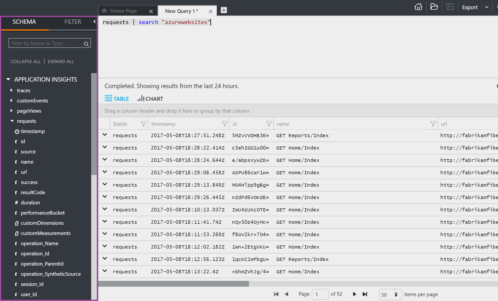
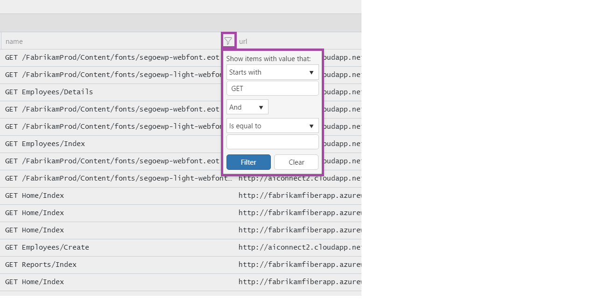
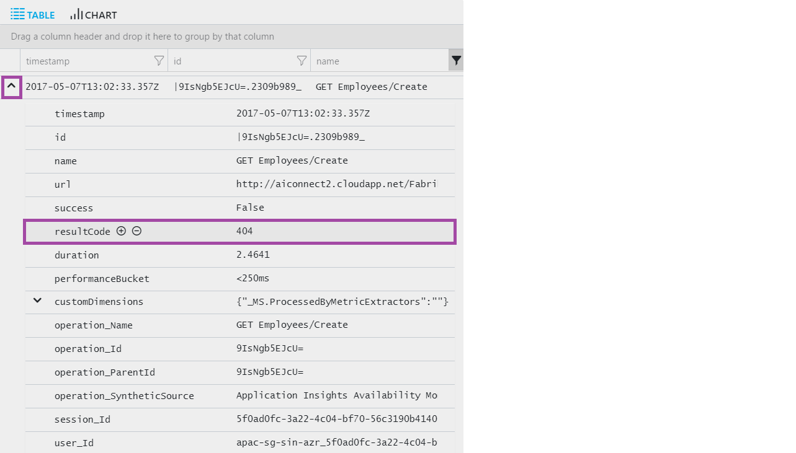
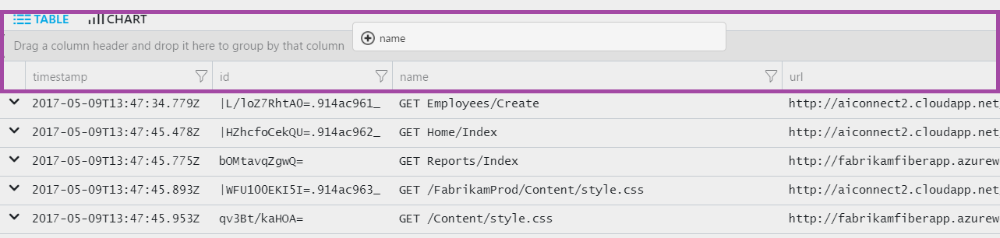
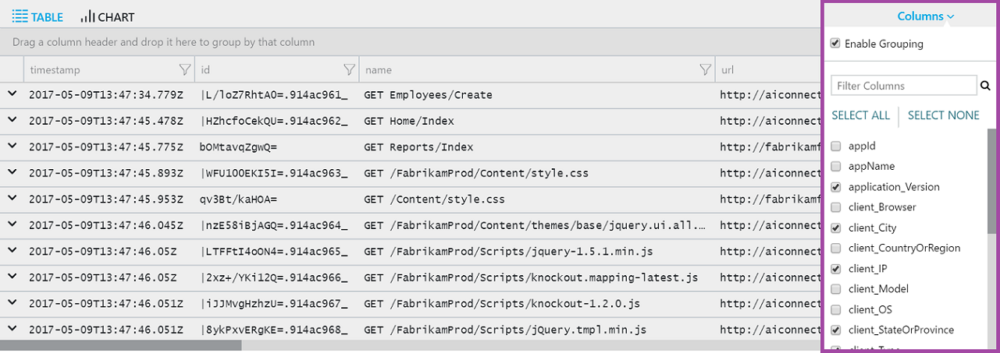
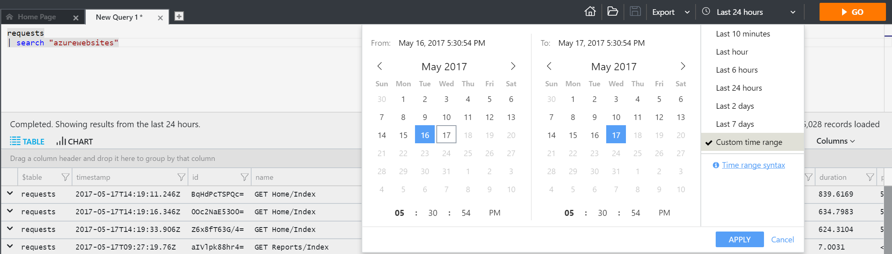
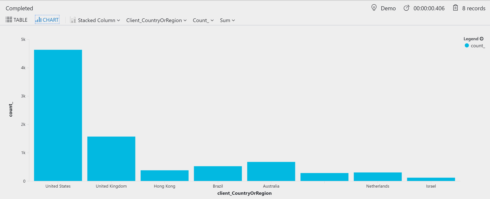
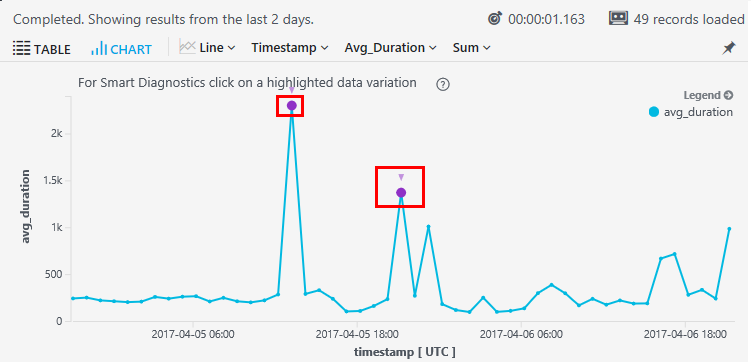

# Get started with the Analytics portal

In this tutorial you will learn how to use the Analytics portal to write Azure Log Analytics queries. It will teach you how to:

- Write simple queries
- Understand the schema of your data
- Filter, sort, and group results
- Apply a time range
- Create charts
- Save and load queries
- Export and share queries


## Meet the Analytics portal
The Analytics portal is a web tool to write and execute Azure Log Analytics queries. If you have an Analytics environment set up you can use it throughout this tutorial. Otherwise, use the _Run query_ button on the below examples, to see results on our demo environment.


The home page offers easy access to useful resources, such as recent and saved queries, and examples. Open a new tab to start writing your own queries.

## Queries
Queries can be used to search terms, identify trends, analyze patterns, and provide many other insights based on your data.

Let's take a look at a basic query:

```OQL
requests | search "azurewebsites"
```

This query searches the requests table for records that contain the term "azurewebsites".

Queries can start with either a table name or a search command. The above example starts with the table name requests, which defines the scope of the query. The pipe (|) character separates commands, so the output of the first one in the input of the following command. You can add as many commands as required (covered in our next tutorial: Getting Started with Queries).

Another way to write that query would be.

```OQL
search in (requests) "azurewebsites"
```

In this example, search is scoped to the requests table, and in it search for all records that contain "azurewebsites".

When running a query, pay attention to the following:

Line breaks - a single break makes your query clearer. Multiple line-breaks split it into separate queries.
Cursor - be sure to put the cursor inside or at the end of the query before executing it.
Time range - A time range of "last 24 hours" is set by default. To use a different range, use the time-picker (located next to the Go button) or add an explicit time range filter to your query.

The examples in this tutorial have the Run Query button, that executes the query automatically. When you write a query manually through the Analytics query editor, click the “Go” button (located at the top right corner) or press Shift-Enter to run it.


## Understand the schema
The schema is a collection of tables, grouped visually under a logical category. In the screenshot below we see the title "Application Insights" which covers different tables, all related to the same product. For example, traces and customEvents are names of tables:



In each table, data is organized in columns of different types, as indicated by the icons. For example, the requests table (expanded in the screenshot) contains the column timestamp which is a date-time, URL as a text column, and duration as a number.

## Filter the results
let's start by getting everything in the requests table.

```OQL
requests
```

Run this query. How many results did you get?

The Analytics portal automatically scopes results by:

Time range - by default, queries are limited to the last 24 hours.
Number of results - results are limited to maximum of 10,000 records.

This query is very general, and it returns too many results to make sense of. We can filter the results either through the table elements, or by explicitly adding a filter to the query.

Note that while filtering results through the table elements applies to the existing result set, adding a filter to the query itself will return a new, filtered, result set and could therefore produce more accurate results.

### Filter through the table elements
Let's focus on requests that execute GET. When reviewing the results, we can identify the relevant information is in the name column.

Click the Filter icon next to the column title, and in the pop-up window select values that Starts with the text GET:



### Add a filter to the query
To the left of each record, an arrow is shown. Click it to open a specific record and review its details.

Hover above a specific value (e.g. resultCode) and 2 icons will appear: "+" and "-".

To add a filter that will return only records with the same value, click the "+" sign. If instead you'd like to exclude records that have this value, click "-".



## Sort and group results
Now we have narrowed down the results to include only failed GET requests, from the last 24 hours. However, the results are not sorted in any way. To sort the results by a specific column - such as timestamp - click the column title. One click sorts in ascending order, two - descending.

One of the common ways to organize results is by groups.

To group results by a specific column, simply drag the column header above the other columns. To create subgroups - drag other columns the upper bar as well.



## Select columns to display
The results table often includes a lot of columns. You might find that some of the returned columns are not displayed by default, or you may want to remove some the columns that are displayed. To select the columns to show, click the Columns button:




## Select a time range
By default, the Analytics portal applies the "last 24 hours" time range. To use a different range, simply select another value through the time picker, and click "Go". If none of the preset values match your needs, use the "Custom time range" option to select an absolute range for your query.



When selecting a custom time range, the selected values are in UTC, which could be different than your local time zone.

If the query explicitly contains a time range filter (such as ... | where timestamp > ago(2d)), the time picker title will show "Set in query". Manual selection will be disabled to prevent a conflict.


## Charts
Query results can be presented in different ways, depending on your preferences. Let's review this example:

```OQL
requests
| where timestamp > ago(1d)
| summarize count() by client_CountryOrRegion
```

By default, results are displayed in a table. Click Chart to see the results in a more graphic view:



Now the results are shown in a stacked bar chart, and the groups proportions are even clearer. Click Stacked Column and select Pie to show another view of the results:


Different properties of the view, such as x and y axes, or grouping and splitting preferences, can be changed manually from the control bar.

You can also set the preferred view in the query itself, using the render operator.

### Smart diagnostics
On a timechart, if there is a sudden spike or step in your data, you may see a highlighted point on the line. This indicates that Smart Diagnostics has identified a combination of properties that filter out the sudden change. Click the point to get more detail on the filter, and to see the filtered version. This may help you identify what caused the change:



## Pin to dashboard
To pin a diagram or table to one of your shared dashboards - just click the pin icon.


This means that, when you put together a dashboard to help you monitor the performance or usage of your web services or resources, you can include quite complex analysis alongside the other metrics.

In order to pin a table to the dashboard, it must have four or fewer columns. Only the top seven rows are displayed.

### ### Dashboard refresh
The chart pinned to the dashboard is refreshed automatically by re-running the query approximately every hours. You can also click the Refresh button.

Automatic simplifications
Certain simplifications are applied to a chart when you pin it to a dashboard:

- Time restriction: Queries are automatically limited to the past 14 days. The effect is the same as if your query includes this time filter:
where timestamp > ago(14d).
- Bin count restriction: If you display a chart that has a lot of discrete bins (typically a bar chart), the less populated bins are automatically grouped into a single "others" bin. For example, this query: requests | summarize count_search = count() by client_CountryOrRegion looks like this in Analytics:


but when you pin it to a dashboard, it looks like this:


## Save queries
Once you've created a useful query, you might want to save it or share with others. On the top bar you can find the "Save" icon.

### Application Insights Analytics portal
In this portal, the Save action applies to the entire query page, which could include one or more queries. Queries can be saved as private queries ("My queries") or be shared with the other users of this application ("Shared queries").


### Log Analytics portal
In this portal, the Save action can save either the entire query page, or a single query as a function (Functions are queries that can also be referenced by other queries, read more here). In order to save a query as a function, you must provide a function alias, which is the name used to call this query when referenced by other queries.


Log Analytics queries are always saved to a selected workspace, and shared with other users of that workspace.

## Load queries
On the top-right area you can find the Query Explorer icon. The query explorer exposes all saved queries by categories, so you can easily find the relevant query. It also enables you to mark specific queries as Favorites, to quickly find them in the future.


## Export and share as link


The analytics portal supports several exporting methods:

### Excel
Save the results as a CSV file, to later review in Excel, for example.

### Power BI
Export the results to power BI, to later generate a PowerBI report. To learn more on this process, review this article.

### Share a link
The query itself can be shared as a link, which can then be sent and executed by other users that have access to the same environment.

## Next steps

- Learn more about [writing Log Analytics queries](get-started-queries.md).
