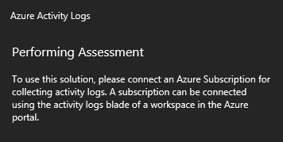
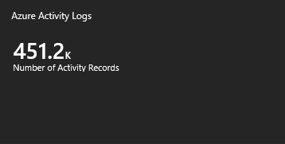
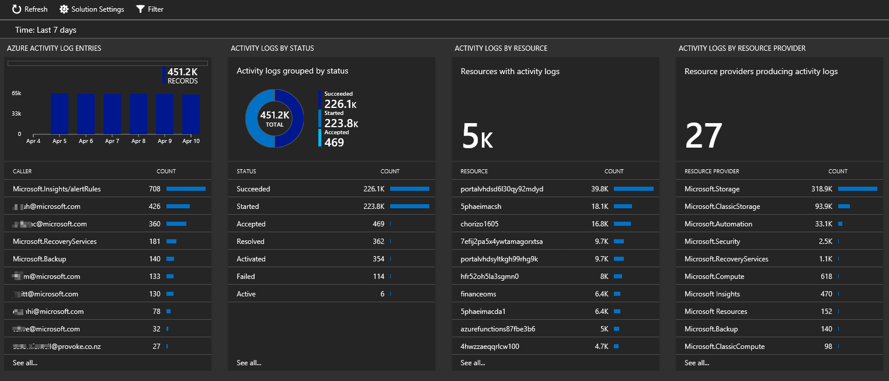

# Collect and analyze Azure activity logs in Log Analytics

The Activity Log Analytics solution helps you analyze and search the [Azure activity log](../monitoring-and-diagnostics/monitoring-overview-activity-logs.md) across all your Azure subscriptions. The Azure Activity Log is a log that offers insights into the operations performed on resources in your subscriptions. The Activity Log was previously known as *Audit Logs* or *Operational Logs* since it reports events for your subscriptions.

Using the Activity Log, you can determine the *what*, *who*, and *when* for any write operations (PUT, POST, DELETE) made for the resources in your subscription. You can also understand the status of the operations and other relevant properties. The Activity Log does not include read (GET) operations or operations for resources that use the Classic deployment model.

When you connect your Azure activity logs to Log Analytics, you can:

- Analyze the activity logs with pre-defined views
- Analyze and search and activity logs from multiple Azure subscriptions
- Keep activity logs for longer than 90 days1
- Correlate activity logs with other Azure platform and application data
- See operational activities aggregated by status
- View trends of activities happening on each of your Azure services
- Report on authorization changes on all your Azure resources
- Identify outage or service health issues impacting your resources
- Use Log Search to correlate user activities, auto-scale operations, authorization changes, and service health to other logs or metrics from your environment

1By default, Log Analytics keeps your Azure activity logs for 90 days, even if you are on the Free tier. Or, if you have a workspace retention setting of less than 90 days. If your workspace has retention that is longer than 90 days, the activity logs are kept based on the retention period of your workspace.

Log Analytics collects activity logs free of charge and stores the logs for 90 days free of charge. If you store logs for longer than 90 days, you will incur data retention charges for the data stored longer than 90 days.

When you're on the Free pricing tier, activity logs do not apply to your daily data consumption.

## Connected sources

Unlike most other Log Analytics solutions, data isn't collected for activity logs by agents. All data used by the solution comes directly from Azure.

| Connected Source | Supported | Description |
| --- | --- | --- |
| [Windows agents](log-analytics-windows-agent.md) | No | The solution does not collect information from Windows agents. |
| [Linux agents](log-analytics-linux-agents.md) | No | The solution does not collect information from Linux agents. |
| [SCOM management group](log-analytics-om-agents.md) | No | The solution does not collect information from agents in a connected SCOM management group. |
| [Azure storage account](log-analytics-azure-storage.md) | No | The solution does not collect information from Azure storage. |

## Prerequisites

- To access Azure activity log information, you must have an Azure subscription.

## Configuration

Perform the following steps to configure the Activity Log Analytics solution for your workspaces.

1. Enable the Activity Log Analytics solution from the [Azure marketplace](https://azuremarketplace.microsoft.com/marketplace/apps/Microsoft.AzureActivityOMS?tab=Overview) or by using the process described in [Add Log Analytics solutions from the Solutions Gallery](log-analytics-add-solutions.md).
2. Configure activity logs to go to your Log Analytics workspace.
    1. In the Azure portal, select your workspace and then click **Azure Activity log**.
    2. For each subscription, click the subscription name.  
        
    3. In the *SubscriptionName* blade, click **Connect**.  
        

If you add the solution using the OMS portal, you'll see the following tile. Sign in to the Azure portal to connect an Azure subscription to your workspace.  

## Using the solution

When you add the Activity Log Analytics solution to your workspace, the **Azure Activity Logs** tile is added to your Overview dashboard. This tile displays a count of the number of Azure activity records for the Azure subscriptions that the solution has access to.

### View Azure Activity logs

Click the **Azure Activity Logs** tile to open the **Azure Activity Logs** dashboard. The dashboard includes the blades in the following table. Each blade lists up to 10 items matching that blade's criteria for the specified scope and time range. You can run a log search that returns all records by clicking **See all** at the bottom of the blade or by clicking the blade header.

Activity log data only appears *after* you've configured your activity logs to go to the solution, so you can't view data before then.

| Blade | Description |
| --- | --- |
| Azure Activity Log Entries | Shows a bar chart of the top Azure activity log entry record totals for the date range that you have selected and shows a list of the top 10 activity callers. Click the bar chart to run a log search for <code>AzureActivity</code>. Click a caller item to run a log search returning all activity log entries for that item. |
| Activity Logs by Status | Shows a doughnut chart for Azure activity log status for the date range that you have selected. Also shows a list a list of the top ten status records. Click the chart to run a log search for <code>AzureActivity &#124; summarize AggregatedValue = count() by ActivityStatus</code>. Click a status item to run a log search returning all activity log entries for that status record. |
| Activity Logs by Resource | Shows the total number of resources with activity logs and lists the top ten resources with record counts for each resource. Click the total area to run a log search for <code>AzureActivity &#124; summarize AggregatedValue = count() by Resource</code>, which shows all Azure resources available to the solution. Click a resource to run a log search returning all activity records for that resource. |
| Activity Logs by Resource Provider | Shows the total number of resource providers that produce activity logs and lists the top ten. Click the total area to run a log search for <code>AzureActivity &#124; summarize AggregatedValue = count() by ResourceProvider</code>, which shows all Azure resource providers. Click a resource provider to run a log search returning all activity records for the provider. |

## Next steps

- Create an [alert](log-analytics-alerts-creating.md) when a specific activity happens.
- Use [Log Search](log-analytics-log-searches.md) to view detailed information from your activity logs.
