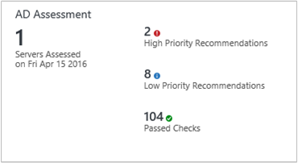
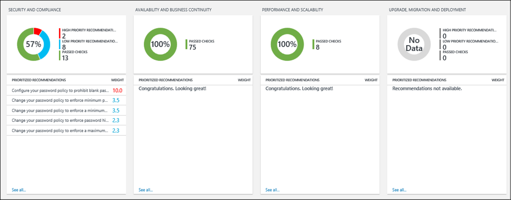
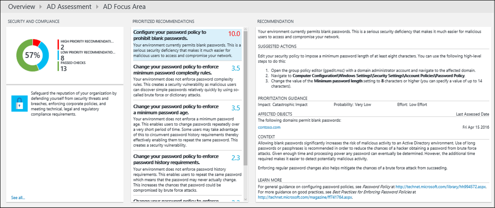
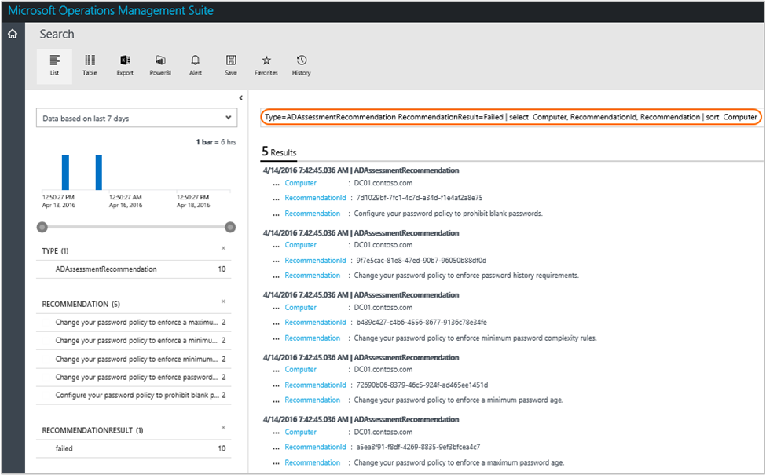

<properties
	pageTitle="Optimize your environment with the Active Directory Assessment solution in Log Analytics | Microsoft Azure"
	description="You can use the Active Directory Assessment solution to assess the risk and health of your server environments on a regular interval."
	services="log-analytics"
	documentationCenter=""
	authors="bandersmsft"
	manager="jwhit"
	editor=""/>

<tags
	ms.service="log-analytics"
	ms.workload="na"
	ms.tgt_pltfrm="na"
	ms.devlang="na"
	ms.topic="article"
	ms.date="06/01/2016"
	ms.author="banders"/>

# Optimize your environment with the Active Directory Assessment solution in Log Analytics

You can use the Active Directory Assessment solution to assess the risk and health of your server environments on a regular interval. This article will help you install and use the solution so that you can take corrective actions for potential problems.

This solution provides a prioritized list of recommendations specific to your deployed server infrastructure. The recommendations are categorized across four focus areas which help you quickly understand the risk and take action.

The recommendations are based on the knowledge and experience gained by Microsoft engineers from thousands of customer visits. Each recommendation provides guidance about why an issue might matter to you and how to implement the suggested changes.

You can choose focus areas that are most important to your organization and track your progress toward running a risk free and healthy environment.

After you've added the solution and an assessment is completed, summary information for focus areas is shown on the **AD Assessment** dashboard for the infrastructure in your environment. The following sections describe how to use the information on the **AD Assessment** dashboard, where you can view and then take recommended actions for your Active Directory server infrastructure.






## Installing and configuring the solution
Use the following information to install and configure the solutions.

- Agents must be installed on domain controllers that are members of the domain to be evaluated.
- The Active Directory Assessment solution requires .NET Framework 4 installed on each computer that has an OMS agent.
- Add the Active Directory Assessment solution to your OMS workspace using the process described in [Add Log Analytics solutions from the Solutions Gallery](log-analytics-add-solutions.md).  There is no further configuration required.

    >[AZURE.NOTE] After you've added the solution, the AdvisorAssessment.exe file is added to servers with agents. Configuration data is read and then sent to the OMS service in the cloud for processing. Logic is applied to the received data and the cloud service records the data.

## Active Directory Assessment data collection details

Active Directory Assessment collects WMI data, registry data, and performance data using the agents that you have enabled.

The following table shows data collection methods for agents, whether Operations Manager (SCOM) is required, and how often data is collected by an agent.

| platform | Direct Agent | SCOM agent | Azure Storage | SCOM required? | SCOM agent data sent via management group | collection frequency |
|---|---|---|---|---|---|---|
|Windows||||	||	7 days|


## Understanding how recommendations are prioritized

Every recommendation made is given a weighting value that identifies the relative importance of the recommendation. Only the ten most important recommendations are shown.

### How weights are calculated

Weightings are aggregate values based on three key factors:

- The *probability* that an issue identified will cause problems. A higher probability equates to a larger overall score for the recommendation.

- The *impact* of the issue on your organization if it does cause a problem. A higher impact equates to a larger overall score for the recommendation.

- The *effort* required to implement the recommendation. A higher effort equates to a smaller overall score for the recommendation.

The weighting for each recommendation is expressed as a percentage of the total score available for each focus area. For example, if a recommendation in the Security and Compliance focus area has a score of 5%, implementing that recommendation will increase your overall Security and Compliance score by 5%.

### Focus areas

**Security and Compliance** - This focus area shows recommendations for potential security threats and breaches, corporate policies, and technical, legal and regulatory compliance requirements.

**Availability and Business Continuity** - This focus area shows recommendations for service availability, resiliency of your infrastructure, and business protection.

**Performance and Scalability** - This focus area shows recommendations to help your organization's IT infrastructure grow, ensure that your IT environment meets current performance requirements, and is able to respond to changing infrastructure needs.

**Upgrade, Migration and Deployment** - This focus area shows recommendations to help you upgrade, migrate, and deploy Active Directory to your existing infrastructure.

### Should you aim to score 100% in every focus area?

Not necessarily. The recommendations are based on the knowledge and experiences gained by Microsoft engineers across thousands of customer visits. However, no two server infrastructures are the same, and specific recommendations may be more or less relevant to you. For example, some security recommendations might be less relevant if your virtual machines are not exposed to the Internet. Some availability recommendations may be less relevant for services that provide low priority ad hoc data collection and reporting. Issues that are important to a mature business may be less important to a start-up. You may want to identify which focus areas are your priorities and then look at how your scores change over time.

Every recommendation includes guidance about why it is important. You should use this guidance to evaluate whether implementing the recommendation is appropriate for you, given the nature of your IT services and the business needs of your organization.

## Use assessment focus area recommendations

Before you can use an assessment solution in OMS, you must have the solution installed. To read more about installing solutions, see [Add Log Analytics solutions from the Solutions Gallery](log-analytics-add-solutions.md). After it is installed, you can view the summary of recommendations by using the Assessment tile on the Overview page in OMS.

View the summarized compliance assessments for your infrastructure and then drill-into recommendations.


### To view recommendations for a focus area and take corrective action

1. On the **Overview** page, click the **Assessment** tile for your server infrastructure.
2. On the **Assessment** page, review the summary information in one of the focus area blades and then click one to view recommendations for that focus area.
3. On any of the focus area pages, you can view the prioritized recommendations made for your environment. Click a recommendation under **Affected Objects** to view details about why the recommendation is made.  
    
4. You can take corrective actions suggested in **Suggested Actions**. When the item has been addressed, later assessments will record that recommended actions were taken and your compliance score will increase. Corrected items appear as **Passed Objects**.

## Ignore recommendations

If you have recommendations that you want to ignore, you can create a text file that OMS will use to prevent recommendations from appearing in your assessment results.

### To identify recommendations that you will ignore

1.	Sign in to your workspace and open Log Search. Use the following query to list recommendations that have failed for computers in your environment.

    ```
    Type=ADAssessmentRecommendation RecommendationResult=Failed | select  Computer, RecommendationId, Recommendation | sort  Computer
    ```

    Here's a screen shot showing the Log Search query:
    

2.	Choose recommendations that you want to ignore. You’ll use the values for RecommendationId in the next procedure.


### To create and use an IgnoreRecommendations.txt text file

1.	Create a file named IgnoreRecommendations.txt.
2.	Paste or type each RecommendationId for each recommendation that you want Log Analytics to ignore on a separate line and then save and close the file.
3.	Put the file in the following folder on each computer where you want OMS to ignore recommendations.
    - On computers with the Microsoft Monitoring Agent (connected directly or through Operations Manager) - *SystemDrive*:\Program Files\Microsoft Monitoring Agent\Agent
    - On the Operations Manager management server - *SystemDrive*:\Program Files\Microsoft System Center 2012 R2\Operations Manager\Server

### To verify that recommendations are ignored

After the next scheduled assessment runs, by default every 7 days, the specified recommendations are marked *Ignored* and will not appear on the assessment dashboard.

1. You can use the following Log Search queries to list all the ignored recommendations.

    ```
    Type=ADAssessmentRecommendation RecommendationResult=Ignored | select  Computer, RecommendationId, Recommendation | sort  Computer
    ```

2.	If you decide later that you want to see ignored recommendations, remove any IgnoreRecommendations.txt files, or you can remove RecommendationIDs from them.

## AD Assessment solutions FAQ

*How often does an assessment run?*
- The assessment runs every 7 days.

*Is there a way to configure how often the assessment runs?*
- Not at this time.

*If another server for is discovered after I’ve added an assessment solution, will it be assessed?*
- Yes, once it is discovered it is assessed from then on, every 7 days.

*If a server is decommissioned, when will it be removed from the assessment?*
- If a server does not submit data for 3 weeks, it is removed.

*What is the name of the process that does the data collection?*
- AdvisorAssessment.exe

*How long does it take for data to be collected?*
- The actual data collection on the server takes about 1 hour. It may take longer on servers that have a large number of Active Directory servers.

*What type of data is collected?*
- The following types of data are collected:
    - WMI
    - Registry
    - Performance counters

*Is there a way to configure when data is collected?*
- Not at this time.

*Why display only the top 10 recommendations?*
- Instead of giving you an exhaustive overwhelming list of tasks, we recommend that you focus on addressing the prioritized recommendations first. After you address them, additional recommendations will become available. If you prefer to see the detailed list, you can view all recommendations using Log Search.

*Is there a way to ignore a recommendation?*
- Yes, see [Ignore recommendations](#ignore-recommendations) section above.


## Next steps

- Use [Log searches in Log Analytics](log-analytics-log-searches.md) to view detailed AD Assessment data and recommendations.
