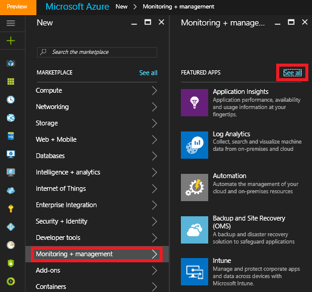
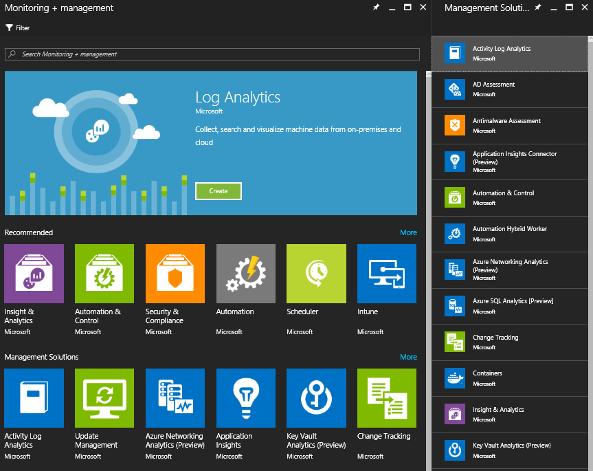
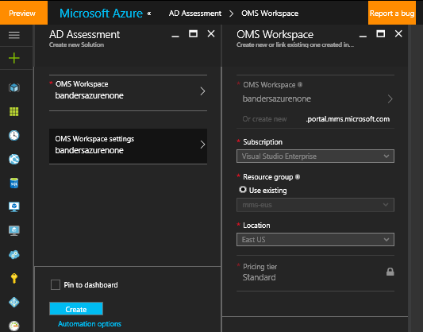
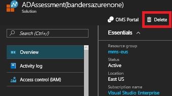

# Add Azure Log Analytics management solutions to your workspace

Log Analytics management solutions are a collection of **logic**, **visualization**, and **data acquisition rules** that provide metrics pivoted around a particular problem area. This article lists management solutions supported by Log Analytics and shows you how to add and remove for a workspace by using the Azure portal. You can also add solutions in the OMS portal using the Solutions Gallery.

Management solutions allow deeper insights to:

* Help investigate and resolve operational issues faster
* Collect and correlate various types of machine data
* Help you be proactive with activities that the solution exposes.

> [!NOTE]
> Log Analytics includes Log Search functionality, so you don't need to install a management solution to enable it. However, you get data visualizations, suggested searches, and insights by adding management solutions to your workspace.

Using this article, you add management solutions to a workspace using the Azure portal Marketplace. After you've added a solution, data is collected from the servers in your infrastructure and sent to the OMS service. Processing by the OMS service typically takes a few minutes to an hour. After the service processes the data, you can view it in OMS.

You can easily remove a management solution when it is no longer needed. When you remove a management solution, its data is not sent to OMS. If you are on the Free pricing tier, removing a solution can reduce the amount of data used, helping you stay under daily quota of data.

## View available management solutions

The Azure marketplace contains the list of [management solutions for Log Analytics](https://azuremarketplace.microsoft.com/marketplace/apps/category/monitoring-management?page=1&subcategories=management-solutions).

You can install management solutions from Azure marketplace by clicking the **Get it now** link at the bottom of each solution.

## Add a management solution
1. If you haven't already done so, sign in to the [Azure portal](https://portal.azure.com) using your Azure subscription.
2. In the **New** blade under **Marketplace**, select **Monitoring + management**.
3. In the **Monitoring + management** blade, click **See all**.  
      
4. To the right of **Management Solutions**, click **More**.
5. In the **Management Solutions** blade, select a management solution that you want to add to a workspace.  
      
6. In the management solution blade, review information about the management solution, and then click **Create**.
7. In the *management solution name* blade, select a workspace that you want to associate with the management solution.
8. Optionally, change workspace settings for the Azure subscription, resource group, and location. You can also choose **Automation options**. Click **Create**.  
      
9. To start using the management solution that you've added to your workspace, navigate to **Log Analytics** > **Subscriptions** > ***workspace name*** > **Overview**. A new tile for your management solution is displayed. Click the tile to open it and start using the solution after data for the solution is gathered.

## Remove a management solution

1. In the [Azure portal](https://portal.azure.com), navigate to **Log Analytics** > **Subscriptions** > ***workspace name*** and then in the ***workspace name*** blade, click **Solutions**.
2. In the list of management solutions, select the solution that you want to remove.
3. In the solution blade for your workspace, click **Delete**.  
      
4. In the confirmation dialog, click **Yes**.

## Offers and pricing tiers

The following table identifies which management solutions belong to each Operations Management Suite offer.
The table also identifies the pricing tiers that are available for each management solution.
All solutions in the following table are available from within the Azure portal and the solutions gallery in the Log Analytics portal.

| Management solution    																	| Offer                                     								| Pricing tiers1													| Notes |
| ---                    																	| ---                                       								| ---           																							| ---   |
| [Activity Log Analytics](log-analytics-activity.md) 																	| <ul><li>Insight&nbsp;and&nbsp;Analytics</li><li>Log Analytics</li></ul> 	| Free  Standard  Premium&nbsp;(OMS)  Per&nbsp;GB&nbsp;(Standalone)  Per&nbsp;Node&nbsp;(OMS) 	| 90 days of data are available free of charge Data not subject to the Free tier cap |
| [AD Assessment](log-analytics-ad-assessment.md)          									| <ul><li>Insight&nbsp;and&nbsp;Analytics</li><li>Log Analytics</li></ul> 	| Free  Standard  Premium&nbsp;(OMS)  Per&nbsp;GB&nbsp;(Standalone)  Per&nbsp;Node&nbsp;(OMS) 	| |
| [AD Replication Status](log-analytics-ad-replication-status.md)  							| <ul><li>Insight&nbsp;and&nbsp;Analytics</li><li>Log Analytics</li></ul> 	| Free  Standard  Premium&nbsp;(OMS)  Per&nbsp;GB&nbsp;(Standalone)  Per&nbsp;Node&nbsp;(OMS) 	| Not available to add from Azure portal/marketplace. |
| [Agent Health](../operations-management-suite/oms-solution-agenthealth.md) 			 																	| <ul><li>Insight&nbsp;and&nbsp;Analytics</li><li>Log Analytics</li></ul> 	| Free  Standard  Premium&nbsp;(OMS)  Per&nbsp;GB&nbsp;(Standalone)  Per&nbsp;Node&nbsp;(OMS) 	| Data not subject to the Free tier cap  Not available to add from Azure portal/marketplace. |
| [Alert Management](log-analytics-solution-alert-management.md) 	     					| <ul><li>Insight&nbsp;and&nbsp;Analytics</li><li>Log Analytics</li></ul> 	| Free  Standard  Premium&nbsp;(OMS)  Per&nbsp;GB&nbsp;(Standalone)  Per&nbsp;Node&nbsp;(OMS) 	| Not available to add from Azure portal/marketplace. |
| [Application Insights Connector (Preview)](log-analytics-app-insights-connector.md) 												| <ul><li>Insight&nbsp;and&nbsp;Analytics</li><li>Log Analytics</li></ul>	| Free  Standard  Premium&nbsp;(OMS)  Per&nbsp;GB&nbsp;(Standalone)  Per&nbsp;Node&nbsp;(OMS) 	| |
| [Automation Hybrid Worker](../automation/automation-hybrid-runbook-worker.md) 																	| <ul><li>Automation and Control</li></ul>									| Free  Per&nbsp;Node&nbsp;(OMS) 							   											| Requires your Log Analytics workspace to be linked to an Automation account |
| [Azure Application Gateway Analytics](log-analytics-azure-networking-analytics.md)  	| <ul><li>Insight&nbsp;and&nbsp;Analytics</li><li>Log Analytics</li></ul> 	| Free  Standard  Premium&nbsp;(OMS)  Per&nbsp;GB&nbsp;(Standalone)  Per&nbsp;Node&nbsp;(OMS) 	| |
| [Azure Network Security Group Analytics](log-analytics-azure-networking-analytics.md)  	| <ul><li>Insight&nbsp;and&nbsp;Analytics</li><li>Log Analytics</li></ul> 	| Free  Standard  Premium&nbsp;(OMS)  Per&nbsp;GB&nbsp;(Standalone)  Per&nbsp;Node&nbsp;(OMS) 	| |
| [Azure SQL Analytics (Preview)](log-analytics-azure-sql.md)  														| <ul><li>Insight&nbsp;and&nbsp;Analytics</li><li>Log Analytics</li></ul> 	| Free Per&nbsp;Node&nbsp;(OMS) 																			| Requires your Log Analytics workspace to be linked to an Automation account|
| [Azure Web Apps Analytics](log-analytics-azure-web-apps-analytics.md)  	| <ul><li>Insight&nbsp;and&nbsp;Analytics</li><li>Log Analytics</li></ul> 	| Free  Standard  Premium&nbsp;(OMS)  Per&nbsp;GB&nbsp;(Standalone)  Per&nbsp;Node&nbsp;(OMS) 	| |
|[Backup](../backup/backup-introduction-to-azure-backup.md)        																			| <ul><li>Insight and Analytics</li></ul> 									| Free  Standard  Premium&nbsp;(OMS)  Per&nbsp;GB&nbsp;(Standalone)  Per&nbsp;Node&nbsp;(OMS) 							   											| Requires a classic Backup vault.  Not available to add from Azure portal/marketplace. |
| [Capacity and Performance (Preview)](log-analytics-capacity.md) 													| <ul><li>Insight&nbsp;and&nbsp;Analytics</li><li>Log Analytics</li></ul> 	| Free  Standard  Premium&nbsp;(OMS)  Per&nbsp;GB&nbsp;(Standalone)  Per&nbsp;Node&nbsp;(OMS) 	| |
| [Change Tracking](log-analytics-change-tracking.md)		 								| <ul><li>Automation and Control</li></ul>									| Free  Per&nbsp;Node&nbsp;(OMS) 							   											| Requires your Log Analytics workspace to be linked to an Automation account |
| [Containers](log-analytics-containers.md) 			 									| <ul><li>Insight&nbsp;and&nbsp;Analytics</li><li>Log Analytics</li></ul> 	| Free  Standard  Premium&nbsp;(OMS)  Per&nbsp;GB&nbsp;(Standalone)  Per&nbsp;Node&nbsp;(OMS) 	| |
| [IT Service Management Connector (Preview)](log-analytics-itsmc-overview.md) 			 									| <ul><li>Insight&nbsp;and&nbsp;Analytics</li><li>Log Analytics</li></ul> 	| Free  Per&nbsp;Node&nbsp;(OMS) 	| |
| HDInsight HBase Monitoring  (Preview) 													| <ul><li>Insight&nbsp;and&nbsp;Analytics</li><li>Log Analytics</li></ul> 	| Free  Standard  Premium&nbsp;(OMS)  Per&nbsp;GB&nbsp;(Standalone)  Per&nbsp;Node&nbsp;(OMS) 	| |
| [Key Vault Analytics](log-analytics-azure-key-vault.md)  					| <ul><li>Insight&nbsp;and&nbsp;Analytics</li><li>Log Analytics</li></ul> 	| Free  Standard  Premium&nbsp;(OMS)  Per&nbsp;GB&nbsp;(Standalone)  Per&nbsp;Node&nbsp;(OMS) 	| |
| [Logic Apps B2B](../logic-apps/logic-apps-track-b2b-messages-omsportal.md)  					| <ul><li>Insight&nbsp;and&nbsp;Analytics</li><li>Log Analytics</li></ul> 	| Free  Standard  Premium&nbsp;(OMS)  Per&nbsp;GB&nbsp;(Standalone)  Per&nbsp;Node&nbsp;(OMS) 	| Not available to add from Azure portal/marketplace. |
| [Malware Assessment](log-analytics-malware.md) 											| <ul><li>Security and Compliance</li></ul>				    				| Free  Standalone Per&nbsp;Node&nbsp;(OMS)							   												| If you add the Security and Compliance solutions after June 19, 2017 [billing is per node](https://azure.microsoft.com/pricing/details/security-compliance/), regardless of the workspace pricing tier. The first 60 days are free.  |
| [Network Performance Monitor](log-analytics-network-performance-monitor.md)  	| <ul><li>Insight and Analytics</li></ul> 									| Free  Per&nbsp;Node&nbsp;(OMS) 																		| |
| [Office 365 Analytics (Preview)](../operations-management-suite/oms-solution-office-365.md)														| <ul><li>Insight&nbsp;and&nbsp;Analytics</li><li>Log Analytics</li></ul> 	| Free  Standard  Premium&nbsp;(OMS)  Per&nbsp;GB&nbsp;(Standalone)  Per&nbsp;Node&nbsp;(OMS) 	| |
| [Security and Audit](../operations-management-suite/oms-security-getting-started.md)		| <ul><li>Security&nbsp;and&nbsp;Compliance</li></ul>				    	| Free  Standalone Per&nbsp;Node&nbsp;(OMS)							   												| Collecting security event logs requires this solution If you add the Security and Compliance solutions after June 19, 2017 [billing is per node](https://azure.microsoft.com/pricing/details/security-compliance/), regardless of the workspace pricing tier. The first 60 days are free. |
| [Service Fabric Analytics (Preview)](log-analytics-service-fabric.md) 					| <ul><li>Insight&nbsp;and&nbsp;Analytics</li><li>Log Analytics</li></ul> 	| Free  Standard  Premium&nbsp;(OMS)  Per&nbsp;GB&nbsp;(Standalone)  Per&nbsp;Node&nbsp;(OMS) 	| |
| [Service Map (Preview)](../operations-management-suite/operations-management-suite-service-map.md) | <ul><li>Insight and Analytics</li></ul> 						| Free  Per&nbsp;Node&nbsp;(OMS) 																		| Available in East US, West Europe, and West Central US 	|
| [Site Recovery](../site-recovery/site-recovery-overview.md)    																			| <ul><li>Insight and Analytics</li></ul> 									| Free  Standard  Premium&nbsp;(OMS)  Per&nbsp;GB&nbsp;(Standalone)  Per&nbsp;Node&nbsp;(OMS) 							   											| Requires a classic Site Recovery vault.  Not available to add from Azure portal/marketplace. |
| [SQL Assessment](log-analytics-sql-assessment.md) 		 	  							| <ul><li>Insight&nbsp;and&nbsp;Analytics</li><li>Log Analytics</li></ul> 	| Free  Standard  Premium&nbsp;(OMS)  Per&nbsp;GB&nbsp;(Standalone)  Per&nbsp;Node&nbsp;(OMS) 	| |
| Start/Stop VMs during off-hours (Preview) 												| <ul><li>Insight&nbsp;and&nbsp;Analytics</li><li>Log Analytics</li></ul> 	| Free  Per&nbsp;Node&nbsp;(OMS) 																		| Requires your Log Analytics workspace to be linked to an Automation account |
| [SurfaceHub](log-analytics-surface-hubs.md) 			 	  								| <ul><li>Insight&nbsp;and&nbsp;Analytics</li><li>Log Analytics</li></ul> 	| Free  Standard  Premium&nbsp;(OMS)  Per&nbsp;GB&nbsp;(Standalone)  Per&nbsp;Node&nbsp;(OMS) 	| Not available to add from Azure portal/marketplace. |
| [System Center Operations Manager Assessment (Preview)](log-analytics-scom-assessment.md)  | <ul><li>Insight and Analytics</li><li>Log Analytics</li></ul> 		| Free  Standard  Premium&nbsp;(OMS)  Per&nbsp;GB&nbsp;(Standalone)  Per&nbsp;Node&nbsp;(OMS) 	| |
| [Update Management](../operations-management-suite/oms-solution-update-management.md)		 	  																| <ul><li>Automation and Control</li></ul>									| Free  Per&nbsp;Node&nbsp;(OMS) 							   											| Requires your Log Analytics workspace to be linked to an Automation account |
| [Update Compliance (Preview)](https://docs.microsoft.com/windows/deployment/update/update-compliance-get-started)  															| <ul><li>Insight&nbsp;and&nbsp;Analytics</li><li>Log Analytics</li></ul> 	| Free  Standard  Premium&nbsp;(OMS)  Per&nbsp;GB&nbsp;(Standalone)  Per&nbsp;Node&nbsp;(OMS) 	| No charge for data or nodes Data not subject to the Free tier cap.  Not available to add from Azure portal/marketplace. |
| [Upgrade Readiness](https://docs.microsoft.com/windows/deployment/upgrade/upgrade-readiness-get-started) 															| <ul><li>Insight&nbsp;and&nbsp;Analytics</li><li>Log Analytics</li></ul> 	| Free  Standard  Premium&nbsp;(OMS)  Per&nbsp;GB&nbsp;(Standalone)  Per&nbsp;Node&nbsp;(OMS) 	| No charge for data or nodes Data not subject to the Free tier cap.  Not available to add from Azure portal/marketplace. |
| [VMware Monitoring (Preview)](log-analytics-vmware.md)  								| <ul><li>Insight&nbsp;and&nbsp;Analytics</li><li>Log Analytics</li></ul> 	| Free  Standard  Premium&nbsp;(OMS)  Per&nbsp;GB&nbsp;(Standalone)  Per&nbsp;Node&nbsp;(OMS) 	| |
| [Wire Data 2.0 (Preview)](log-analytics-wire-data.md) 	  															| <ul><li>Insight and Analytics</li></ul> 					 				| Free  Per&nbsp;Node&nbsp;(OMS) 																		| Available in East US, West Europe, and West Central US |

1 The *Standard* and *Premium (OMS)* pricing tiers are only available for customers who created their Log Analytics workspace prior to September 21, 2016.

### Community provided management solutions

Community provided solutions are available from the [Azure template gallery](https://azure.microsoft.com/resources/templates/?term=Per&nbsp;Node&nbsp;(OMS)) and direct from the authors.

| Management solution         		| Offer 																	| Pricing tiers 						| Notes |
| ---                         		| ---       																| ---           						| ---   |
| All community provided solutions  | <ul><li>Insight&nbsp;and&nbsp;Analytics</li><li>Log Analytics</li></ul> 	| Free  Per&nbsp;Node&nbsp;(OMS) 	|	Requires your Log Analytics workspace to be linked to an Automation account |

## Data collection details
The following tables show data collection methods and other details about how data is collected for Log Analytics management solutions and data sources. The tables are categorized by solution offers, which equate to [subscription pricing tiers](https://go.microsoft.com/fwlink/?linkid=827926). The Activity Log Analytics solution is available to all pricing tiers free of charge.

The Log Analytics Windows agent and System Center Operations Manager agent are essentially the same. The Windows agent includes additional functionality to allow it to connect to the OMS workspace and route through a proxy. If you use an Operations Manager agent, it must be targeted as an OMS agent to communicate with OMS. Operations Manager agents in this table are OMS agents that are connected to Operations Manager. See [Connect Operations Manager to Log Analytics](log-analytics-om-agents.md) for information about connecting your existing Operations Manager environment to OMS.

> [!NOTE]
> The type of agent that you use determines how data is sent to OMS, with the following conditions:
> - You either use the Windows agent or an Operations Manager-attached OMS agent.
> - When Operations Manager is required, Operations Manager agent data for the solution is always sent to OMS using the Operations Manager management group. Additionally, when Operations Manager is required, only the Operations Manager agent is used by the solution.
> - When Operations Manager is not required and the table shows that Operations Manager agent data is sent to OMS using the management group, then Operations Manager agent data is always sent to OMS using management groups. Windows agents bypass the management group and send their data directly to OMS.
> - When Operations Manager agent data is not sent using a management group, then the data is sent directly to OMS—bypassing the management group.

### Insight & Analytics / Log Analytics

| Management solution | Platform | Microsoft monitoring agent | Operations Manager agent | Azure storage | Operations Manager required? | Operations Manager agent data sent via management group | Collection frequency |
| --- | --- | --- | --- | --- | --- | --- | --- |
| Activity Log Analytics | Azure |   |   |   |   |   | on notification |
| AD Assessment |Windows |&#8226; |&#8226; |  |  |&#8226; |7 days |
| AD Replication Status |Windows |&#8226; |&#8226; |  |  |&#8226; |5 days |
| Agent Health | Windows and Linux | &#8226; | &#8226; |   |   | &#8226; | 1 minute |
| Alert Management (Nagios) |Linux |&#8226; |  |  |  |  |on arrival |
| Alert Management (Zabbix) |Linux |&#8226; |  |  |  |  |1 minute |
| Alert Management (Operations Manager) |Windows |  |&#8226; |  |&#8226; |&#8226; |3 minutes |
| Application Insights Connector (Preview) | Azure |   |   |   |   |   | on notification |
| Azure Application Gateway Analytics | Azure |   |   |   |   |   | on notification |
| Azure Network Security Group Analytics | Azure |   |   |   |   |   | on notification |
| Azure SQL Analytics (Preview) |Windows |  |  |  |  |  | 10 minutes |
| Capacity Management |Windows |&#8226; |&#8226; |  |  |&#8226; |on arrival |
| Containers | Windows and Linux | &#8226; | &#8226; |   |   |   | 3 minutes |
| Key Vault Analytics |Windows |  |  |  |  |  |on notification |
| Network Performance Monitor | Windows | &#8226; | &#8226; |   |   |   | TCP handshakes every 5 seconds, data sent every 3 minutes |
| Office 365 Analytics (Preview) |Windows |  |  |  |  |  |on notification |
| Service Fabric Analytics |Windows |  |  |&#8226; |  |  |5 minutes |
| Service Map | Windows and Linux | &#8226; | &#8226; |   |   |   | 15 seconds |
| SQL Assessment |Windows |&#8226; |&#8226; |  |  |&#8226; |7 days |
| SurfaceHub |Windows |&#8226; |  |  |  |  |on arrival |
| System Center Operations Manager Assessment (Preview) | Windows | &#8226; | &#8226; |   |   | &#8226; | seven days |
| Upgrade Analytics (Preview) | Windows | &#8226; |   |   |   |   | 2 days |
| VMware Monitoring (Preview) | Linux | &#8226; |   |   |   |   | 3 minutes |
| Wire Data |Windows (2012 R2 / 8.1 or later) |&#8226; |&#8226; |  |  |  | 1 minute |

### Automation & Control

| Management solution | Platform | Microsoft monitoring agent | Operations Manager agent | Azure storage | Operations Manager required? | Operations Manager agent data sent via management group | Collection frequency |
| --- | --- | --- | --- | --- | --- | --- | --- |
| Automation Hybrid Worker | Windows | &#8226; | &#8226; |   |   |   | n/a |
| Change Tracking |Windows |&#8226; |&#8226; |  |  |&#8226; |hourly |
| Change Tracking |Linux |&#8226; |  |  |  |  |hourly |
| Update Management | Windows |&#8226; |&#8226; |  |  |&#8226; |at least 2 times per day and 15 minutes after installing an update |

### Security & Compliance

| Management solution | Platform | Microsoft monitoring agent | Operations Manager agent | Azure storage | Operations Manager required? | Operations Manager agent data sent via management group | Collection frequency |
| --- | --- | --- | --- | --- | --- | --- | --- |
| Antimalware Assessment |Windows |&#8226; |&#8226; |  |  |&#8226; |hourly |
| Security and Audit1 | Windows and Linux | partial | partial | partial |   | partial | various |

1 The Security and Audit solution can collect logs from Windows, Operations Manager, and Linux agents. See [Data sources](#data-sources) for data collection information about:

- Syslog
- Windows security event logs
- Windows firewall logs
- Windows event logs

### Protection & Recovery

| Management solution | Platform | Microsoft monitoring agent | Operations Manager agent | Azure storage | Operations Manager required? | Operations Manager agent data sent via management group | Collection frequency |
| --- | --- | --- | --- | --- | --- | --- | --- |
| Backup | Azure |   |   |   |   |   | n/a |
| Azure Site Recovery | Azure |   |   |   |   |   | n/a |

### Data sources

| Data source | Platform | Microsoft monitoring agent | Operations Manager agent | Azure storage | Operations Manager required? | Operations Manager agent data sent via management group | Collection frequency |
| --- | --- | --- | --- | --- | --- | --- | --- |
| Azure Activity Logs |Windows |  |  |  |  |  |on notification |
| Azure Diagnostic Logs |Windows |  |  |  |  |  |on notification |
| Azure Diagnostic Metrics |Windows |  |  |  |  |  |on notification |
| ETW |Windows |  |  |&#8226; |  |  |5 minutes |
| IIS Logs |Windows |&#8226; |&#8226; |&#8226; |  |  |5 minutes |
| Performance Counters |Windows |&#8226; |&#8226; |  |  |  |as scheduled, minimum of 10 seconds |
| Performance Counters |Linux |&#8226; |  |  |  |  |as scheduled, minimum of 10 seconds |
| Syslog |Linux |&#8226; |  |  |  |  |from Azure storage: 10 minutes; from agent: on arrival |
| Windows security event logs |Windows |&#8226; |&#8226; |&#8226; |  |  |for Azure storage: 10 min; for the agent: on arrival |
| Windows firewall logs |Windows |&#8226; |&#8226; |  |  |  |on arrival |
| Windows event logs |Windows |&#8226; |&#8226; |&#8226; |  |&#8226; |for Azure storage: 10 min; for the agent: on arrival |

## Preview management solutions and features
By running a service and following devops practices, we are able to partner with customers to develop features and solutions.

During private preview, we give a small group of customers access to an early implementation of the feature or solution to gain feedback and make improvements. This early implementation has minimal features and operational capabilities.

Our goal is to try things quickly so we can find what works, and what doesn’t work. We iterate through this process until the feedback from the private preview customers informs us that we’re ready for a public preview.

During the public preview, we make the feature or solution available for all users to get more feedback and validate our scaling and efficiency. During this phase:

* Preview features appear in the Settings tab and can be enabled by any user.
* Preview solutions are added through the gallery or using a script.

### What should I know about Preview features and solutions?
We’re excited about new features and management solutions and we love working with you to develop them.

Preview features and solutions aren’t right for everyone. Before asking to join a private preview or enabling a public preview, make sure you’re OK working with something that is under development.

When enabling a preview feature through the portal, you see a warning reminding you that the feature is in preview.

#### For both *private* and *public* preview
The following information applies to both public and private previews:

* Things may not always work correctly.
  * Issues range from being a minor annoyance through to something not working at all.
* There is potential for the preview to have a negative impact on your systems / environment.
  * We try to avoid negative things happening to the systems you’re using with OMS but sometimes unexpected things occur.
* Data loss / corruption may occur.
* We may ask you to collect diagnostic logs or other data to help troubleshoot issues.
* The feature or solution may be removed (either temporarily or permanently).
  * Based on our learnings during the preview we may decide to not release the feature or solution.
* Previews may not work or may not have been tested with all configurations, and we may limit:
  * The operating systems that can be used (for example, a feature may only apply to Linux while in preview).
  * The type of agent (MMA, Operations Manager) that can be used (for example, a feature may not work with Operations Manager while in preview).  
* Preview solutions and features are not covered by the Service Level Agreement.
* Usage of preview features incurs usage charges.
* Features or capabilities that you need for the feature / solution to be useful may be missing or incomplete.
* Features / solutions may not be available in all regions.
* Features / solutions may not be localized.
* Features / solutions may have a limit on the number of customers or devices that can use it.
* You may need to use scripts to perform configuration and to enable the solution/feature.
* The user interface (UI) is incomplete and may change from day to day.
* Public previews may not be appropriate for your production / critical systems.

#### For *private* preview
In addition to the items above, the following information is specific to private previews:

* We expect you to provide us with feedback on your experience so that we can make the feature/solution better.
* We may contact you for feedback using surveys, phone calls, or e-mail.
* Things don't always work correctly.
* We may require a Non-Disclosure Agreement (NDA) for participation or may include confidential content.
  * Before blogging, tweeting, or otherwise communicating with third parties, please check with the Program Manager that is responsible for the preview to understand any restrictions on disclosure.
* Do not run on production / critical systems.

### How do I get access to private preview features and solutions?
We invite customers to private previews through several different ways depending on the preview.

* Answering the monthly customer survey and giving us permission to follow up with you improves your chances of being invited to a private preview.
* Your Microsoft account team can nominate you.
* You can sign up based on details posted on twitter [msopsmgmt](https://twitter.com/msopsmgmt).
* You can sign up based on details shared community events – look for us at meet ups, conferences and in online communities.

## Next steps
* [Search logs](log-analytics-log-searches.md) to view detailed information gathered by management solutions.
