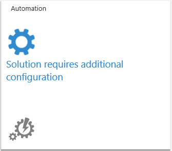
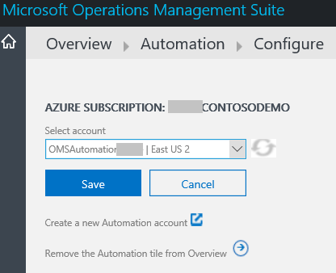

<properties
	pageTitle="Add Log Analytics solutions from the Solutions Gallery | Microsoft Azure"
	description="Log Analytics solutions are a collection of logic, visualization and data acquisition rules that provide metrics pivoted around a particular problem area."
	services="log-analytics"
	documentationCenter=""
	authors="bandersmsft"
	manager="jwhit"
	editor=""/>

<tags
	ms.service="log-analytics"
	ms.workload="na"
	ms.tgt_pltfrm="na"
	ms.devlang="na"
	ms.topic="article"
	ms.date="08/08/2016"
	ms.author="banders"/>

# Add Log Analytics solutions from the Solutions Gallery

Log Analytics solutions are a collection of **logic**, **visualization** and **data acquisition rules** that provide metrics pivoted around a particular problem area. This article lists solutions supported Log Analytics and tells you how to add and remove them using the Solutions Gallery.

Solutions allow deeper insights to:

- help investigate and resolve operational issues faster
- collect and correlate various types of machine data
- help you be proactive with activities such as capacity planning, patch status reporting and security auditing.

>[AZURE.NOTE] Log Analytics includes Log Search functionality, so you don't need to install a solution to enable it. However, you can get data visualizations, suggested searches and insights by adding solutions from the Solution Gallery.

After you've added a solution, data is collected from the servers in your infrastructure and sent to the OMS service. Processing by the OMS service typically takes a few minutes to an hour. After the service processes the data, you can view it in OMS.

You can easily remove a solution when it is no longer needed. When you remove a solution, its data is not sent to OMS, which can reduce the amount of data used by your daily quota, if you have one.

## Solutions supported by the Microsoft Monitoring Agent

At this time, servers that are connected to OMS using the Microsoft Monitoring Agent can use most of the solutions available, including:

- Active Directory Assessment
- Alert Management (without SCOM alerts)
- Antimalware
- Change Tracking
- Security
- SQL Assessment
- System Updates

However, the following solutions are *not* supported with the Microsoft Monitoring Agent and require System Center Operations Manager (SCOM) agent.

- Alert Management (including SCOM alerts)
- Capacity Management
- Configuration Assessment

Refer to [Connecting Operations Manager to Log Analytics](log-analytics-om-agents.md) for information about connecting the SCOM agent to Log Analytics.

### To add a solution using the Solutions Gallery

1. On the Overview page in OMS, click the **Solutions Gallery** tile.    
    
2. On the OMS Solutions Gallery page, learn about each available solution. Click the name of the solution that you want to add to OMS.
3. On the page for the solution that you chose, detailed information about the solution is displayed. Click **Add**.
4. A new tile for the solution that you added appears on the Overview page in OMS and you can start using it after the OMS service processes your data.

## To configure solutions
1. You'll need to configure some solutions. For example, you'll need to configure Automation, Azure Site Recovery, and Backup before you can use them.
2. For any of those solutions, click its tile on the Overview page.  
    
3. Then, configure the solution with the necessary information and then click **Save**.  
    

### To remove a solution using the Solutions Gallery

1. On the Overview page in OMS, click the **Settings** tile.
2. On the Settings page, under the Solutions tab, click **Remove** for the solution that you want to remove.
3. In the confirmation dialog, click **Yes** to remove the solution.

## Data collection details for OMS features and solutions

The following table shows data collection methods and other details about how data is collected for OMS features and solutions. Direct agents and SCOM agents are essentially the same, however the direct agent includes additional functionality to allow it to connect to the OMS workspace and route through a proxy. If you use a SCOM agent, it must be targeted as an OMS agent to communicate with OMS. SCOM agents in this table are OMS agents that are connected to SCOM. See [Connect Operations Manager to Log Analytics](log-analytics-om-agents.md) for information about connecting your existing SCOM environment to OMS.

>[AZURE.NOTE] The type of agent that you use determines how data is sent to OMS, with the following conditions:

- You either use the direct agent or a SCOM-attached OMS agent.
- When SCOM is required, SCOM agent data for the solution is always sent to OMS using the SCOM management group. Additionally, when SCOM is required, only the SCOM agent is used by the solution.
- When SCOM is not required and the table shows that SCOM agent data is sent to OMS using the management group, then SCOM agent data is always sent to OMS using management groups. Direct agents bypass the management group and send their data directly to OMS.
- When SCOM agent data is not sent using a management group, then the data is sent directly to OMS—bypassing the management group.

|data type| platform | Direct Agent | SCOM agent | Azure Storage | SCOM required? | SCOM agent data sent via management group | collection frequency |
|---|---|---|---|---|---|---|---|
|AD Assessment|Windows||||||	7 days|
|AD Replication Status|Windows||||||5 days|
|Alerts (Nagios)|Linux||||||on arrival|
|Alerts (Zabbix)|Linux||||||1 minute|
|Alerts (Operations Manager)|Windows||||||3 minutes|
|Antimalware|Windows|||||| hourly|
|Capacity Management|Windows|||||| hourly|
|Change Tracking|Windows|||||| hourly|
|Change Tracking|Linux||||||hourly|
|Configuration Assessment (legacy Advisor)|Windows|||||| twice per day|
|ETW|Windows||||||5 minutes|
|IIS Logs|Windows||||||5 minutes|
|Key Vaults|Windows||||||10 minutes|
|Network Application Gateways|Windows||||||10 minutes|
|Network Security Groups|Windows||||||10 minutes|
|Office 365|Windows||||||on notification|
|Performance Counters|Windows||||||as scheduled, minimum of 10 seconds|
|Performance Counters|Linux||||||as scheduled, minimum of 10 seconds|
|Service Fabric|Windows||||||5 minutes|
|SQL Assessment|Windows||||||	7 days|
|SurfaceHub|Windows||||||on arrival|
|Syslog|Linux||||||from Azure storage: 10 minutes; from agent: on arrival|
|System Updates|Windows|||||| at least 2 times per day and 15 minutes after installing an update|
|Windows security event logs|Windows|||||| for Azure storage: 10 min; for the agent: on arrival|
|Windows firewall logs|Windows|||||| on arrival|
|Windows event logs|Windows|||||| for Azure storage: 1 min; for the agent: on arrival|
|Wire Data|Windows (2012 R2 / 8.1 or later)|||||| every 1 minute|

## Log Analytics Preview Solutions and Features

By running a service and following devops practices we are able to partner with customers to develop features and solutions.

During private preview we give a small group of customers access to an early implementation of the feature or solution to gain feedback and make improvements. This early implementation has minimal features and operational capabilities.

Our goal is to try things quickly so we can find what works, and what doesn’t work. We iterate through this process until the feedback from the private preview customers informs us that we’re ready for a public preview.

During the public preview, we make the feature or solution available for all users to get more feedback and validate our scaling and efficiency. During this phase:

- Preview features will appear in the Settings tab and can be enabled by any user
- Preview solutions can be added through the gallery or using a published script

### What should I know about Preview Features and Solutions?

We’re excited about new features and solutions and we love working with you to develop them.

Preview features and solutions aren’t right for everyone though, so before asking to join a private preview or enabling a public preview make sure you’re OK working with something that is under development.

When enabling a preview feature through the portal you will be see a warning reminding you that the feature is in preview.

#### For both *private* and *public* preview

The following applies to both public and private previews:

- Things may not always work correctly.
  - Issues range from being a minor annoyance through to something not working at all
- There is potential for the preview to have a negative impact on your systems / environment
  - We try to avoid negative things happening to the systems you’re using with OMS but sometimes unexpected things occur
- Data loss / corruption may occur
- We may ask you to collect diagnostic logs or other data to help troubleshoot issues
- The feature or solution may be removed (either temporarily or permanently)
  - Based on our learnings during the preview we may decide to not release the feature or solution
- Previews may not work or may not have been tested with all configurations, and we may limit:
  - The operating systems that can be used (e.g. a feature may only apply to Linux while in preview)
  - The type of agent (MMA, SCOM) that can be used (e.g. a feature may not work with SCOM while in preview)  
- Preview solutions and features are not covered by the Service Level Agreement
- Usage of preview features will incur usage charges
- Features or capabilities that you need for the feature / solution to be useful may be missing or incomplete
- Features / solutions may not be available in all regions
- Features / solutions may not be localized
- Features / solutions may have a limit on the number of customers or devices that can use it
- You may need to use scripts to perform configuration and to enable the solution/feature
- The user interface (UI) will be incomplete and may change from day to day
- Public previews may not be appropriate for your production / critical systems

#### For *private* preview

In addition to the items above, the following is specific to private previews:

- We expect you to provide us with feedback on your experience so that we can make the feature/solution better
- We may contact you for feedback using surveys, phone calls or e-mail
- Things won't always work correctly
- We may require a Non-Disclosure Agreement (NDA) for participation or may include confidential content
  - Before blogging, tweeting or otherwise communicating with third parties please check with the Program Manager responsible for the preview to understand any restrictions on disclosure
- Do not run on production / critical systems

### How do I get access to private preview features and solutions?

We invite customers to private previews through several different ways depending on the preview.

- Answering the monthly customer survey and giving us permission to follow up with you improves your chances of being invited to a private preview.
- Your Microsoft account team can nominate you.
- You can sign up based on details posted on twitter [msopsmgmt](https://twitter.com/msopsmgmt)
- You can sign up based on details shared community events – look for us at meet ups, conferences and in online communities.

## Next steps

- [Search logs](log-analytics-log-searches.md) to view detailed information gathered by solutions.
