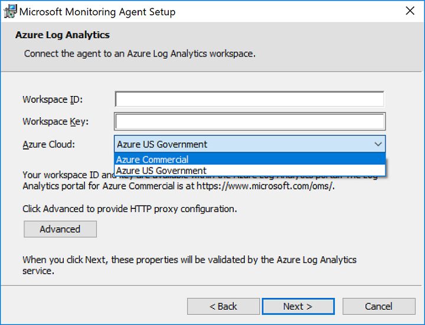
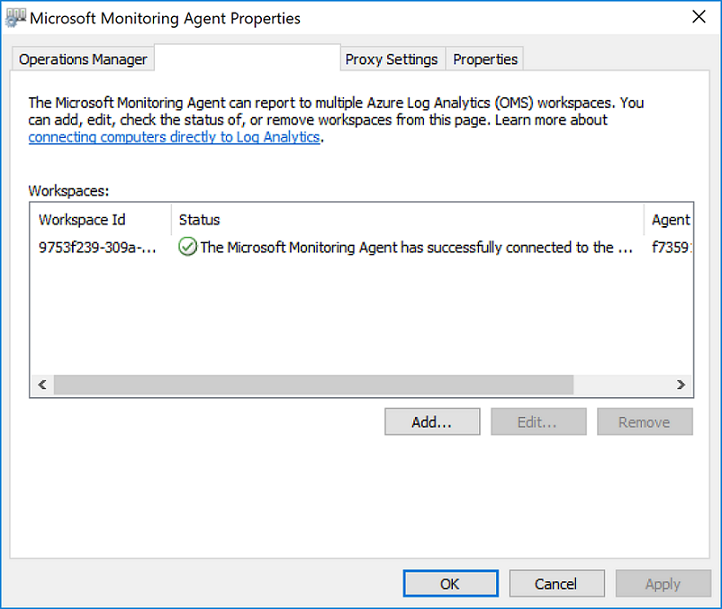

# Connect Windows computers to the Log Analytics service in Azure

In order to monitor and manage virtual machines or physical computers in your local datacenter or other cloud environment with Log Analytics, you need to deploy the Microsoft Monitoring Agent (MMA) and configure it to report to one or more Log Analytics workspaces.  The agent also supports the Hybrid Runbook Worker role for Azure Automation.  

On a monitored Windows computer, the agent is listed as the Microsoft Monitoring Agent service. The Microsoft Monitoring Agent service collects events from log files and Windows event log, performance data, and other telemetry. Even when the agent is unable to communicate with the Log Analytics service it reports to, the agent continues to run and queues the collected data on the disk of the monitored computer. When the connection is restored, the Microsoft Monitoring Agent service sends collected data to the service.

The agent may be installed by using one of the following methods. Most installations use a combination of these methods to install different sets of computers, as appropriate.  Details on using each method are provided later in the article.

* Manual installation. Setup is manually run on the computer using the setup wizard, from the command line, or deployed using an existing software distribution tool.
* Azure Automation Desired State Configuration (DSC). Using DSC in Azure Automation with a script for Windows computers already deployed in your environment.  
* PowerShell script.
* Resource Manager template for virtual machines running Windows on-premises in Azure Stack.  

To understand the supported configuration, review [supported Windows operating systems](log-analytics-concept-hybrid.md#supported-windows-operating-systems) and [network firewall configuration](log-analytics-concept-hybrid.md#network-firewall-requirements).

## Obtain workspace ID and key
Before installing the Microsoft Monitoring Agent for Windows, you need the workspace ID and key for your Log Analytics workspace.  This information is required during setup from each installation method to properly configure the agent and ensure it can successfully communicate with Log Analytics in Azure commercial and US Government cloud.  

1. In the Azure portal, click **All services**. In the list of resources, type **Log Analytics**. As you begin typing, the list filters based on your input. Select **Log Analytics**.
2. In your list of Log Analytics workspaces, select the workspace you intend on configuring the agent to report to.
3. Select **Advanced settings**.<br><br> <br><br>  
4. Select **Connected Sources**, and then select **Windows Servers**.   
5. Copy and paste into your favorite editor, the **Workspace ID** and **Primary Key**.    
   
## Install the agent using setup wizard
The following steps install and configure the agent for Log Analytics in Azure and Azure Government cloud by using the setup wizard for the Microsoft Monitoring Agent on your computer.  

1. In your Log Analyics workspace, from the **Windows Servers** page you navigated to earlier, select the appropriate **Download Windows Agent** version to download depending on the processor architecture of the Windows operating system.   
2. Run Setup to install the agent on your computer.
2. On the **Welcome** page, click **Next**.
3. On the **License Terms** page, read the license and then click **I Agree**.
4. On the **Destination Folder** page, change or keep the default installation folder and then click **Next**.
5. On the **Agent Setup Options** page, choose to connect the agent to Azure Log Analytics (OMS) and then click **Next**.   
6. On the **Azure Log Analytics** page, perform the following:
   1. Paste the **Workspace ID** and **Workspace Key (Primary Key)** that you copied earlier.  If the computer should report to a Log Analytics workspace in Azure Government cloud, select **Azure US Government** from the **Azure Cloud** drop-down list.  
   2. If the computer needs to communicate through a proxy server to the Log Analytics service, click **Advanced** and provide the URL and port number of the proxy server.  If your proxy server requires authentication, type the username and password to authenticate with the proxy server and then click **Next**.  
7. Click **Next** once you have completed providing the necessary configuration settings.<br><br> <br><br>
8. On the **Ready to Install** page, review your choices and then click **Install**.
9. On the **Configuration completed successfully** page, click **Finish**.

When complete, the **Microsoft Monitoring Agent** appears in **Control Panel**. To confirm it is reporting to Log Analytics, review [Verify agent connectivity to Log Analytics](#verify-agent-connectivity-to-log-analytics). 

## Install the agent using the command line
The downloaded file for the agent is a self-contained installation package.  The setup program for the agent and supporting files are contained in the package and need to be extracted in order to properly install using the command line shown in the following examples.    

>[!NOTE]
>If you want to upgrade an agent, you need to use the Log Analytics scripting API. See the topic [Managing and maintaining the Log Analytics agent for Windows and Linux](log-analytics-agent-manage.md) for further information.

The following table highlights the specific Log Analytics parameters supported by setup for the agent, including when deployed using Automation DSC.

|MMA-specific options                   |Notes         |
|---------------------------------------|--------------|
| NOAPM=1                               | Optional parameter. Installs the agent without .NET Application Performance Monitoring.|   
|ADD_OPINSIGHTS_WORKSPACE               | 1 = Configure the agent to report to a workspace                |
|OPINSIGHTS_WORKSPACE_ID                | Workspace Id (guid) for the workspace to add                    |
|OPINSIGHTS_WORKSPACE_KEY               | Workspace key used to initially authenticate with the workspace |
|OPINSIGHTS_WORKSPACE_AZURE_CLOUD_TYPE  | Specify the cloud environment where the workspace is located <br> 0 = Azure commercial cloud (default) <br> 1 = Azure Government |
|OPINSIGHTS_PROXY_URL               | URI for the proxy to use |
|OPINSIGHTS_PROXY_USERNAME               | Username to access an authenticated proxy |
|OPINSIGHTS_PROXY_PASSWORD               | Password to access an authenticated proxy |

1. To extract the agent installation files, from an elevated command prompt run `MMASetup-<platform>.exe /c` and it will prompt you for the path to extract files to.  Alternatively, you can specify the path by passing the arguments `MMASetup-<platform>.exe /c /t:<Path>`.  
2. To silently install the agent and configure it to report to a workspace in Azure commercial cloud, from the folder you extracted the setup files to type: 
   
     ```dos
    setup.exe /qn NOAPM=1 ADD_OPINSIGHTS_WORKSPACE=1 OPINSIGHTS_WORKSPACE_AZURE_CLOUD_TYPE=0 OPINSIGHTS_WORKSPACE_ID=<your workspace id> OPINSIGHTS_WORKSPACE_KEY=<your workspace key> AcceptEndUserLicenseAgreement=1
    ```

   or to configure the agent to report to Azure US Government cloud, type: 

     ```dos
    setup.exe /qn NOAPM=1 ADD_OPINSIGHTS_WORKSPACE=1 OPINSIGHTS_WORKSPACE_AZURE_CLOUD_TYPE=1 OPINSIGHTS_WORKSPACE_ID=<your workspace id> OPINSIGHTS_WORKSPACE_KEY=<your workspace key> AcceptEndUserLicenseAgreement=1
    ```

## Install the agent using DSC in Azure Automation

You can use the following script example to install the agent using Azure Automation DSC.   If you do not have an Automation account, see [Get started with Azure Automation](../automation/automation-offering-get-started.md) to understand requirements and steps for creating an Automation account required before using Automation DSC.  If you are not familiar with Automation DSC, review [Getting started with Automation DSC](../automation/automation-dsc-getting-started.md).

The following example installs the 64-bit agent, identified by the `URI` value. You can also use the 32-bit version by replacing the URI value. The URIs for both versions are:

- Windows 64-bit agent - https://go.microsoft.com/fwlink/?LinkId=828603
- Windows 32-bit agent - https://go.microsoft.com/fwlink/?LinkId=828604


>[!NOTE]
>This procedure and script example does not support upgrading the agent already deployed to a Windows computer.

The 32-bit and 64-bit versions of the agent package have different product codes and new versions released also have a unique value.  The product code is a GUID that is the principal identification of an application or product and is represented by the Windows Installer **ProductCode** property.  The `ProductId value` in the **MMAgent.ps1** script has to match the product code from the 32-bit or 64-bit agent installer package.

To retrieve the product code from the agent install package directly, you can use Orca.exe from the [Windows SDK Components for Windows Installer Developers](https://msdn.microsoft.com/library/windows/desktop/aa370834%28v=vs.85%29.aspx) that is a component of the Windows Software Development Kit or using PowerShell following an [example script](http://www.scconfigmgr.com/2014/08/22/how-to-get-msi-file-information-with-powershell/)  written by a Microsoft Valuable Professional (MVP).  For either approach, you first need to extract the **MOMagent.msi** file from the MMASetup installation package.  This is shown earlier in the first step under the section [Install the agent using the command line](#install-the-agent-using-the-command-line).  

1. Import the xPSDesiredStateConfiguration DSC Module from [http://www.powershellgallery.com/packages/xPSDesiredStateConfiguration](http://www.powershellgallery.com/packages/xPSDesiredStateConfiguration) into Azure Automation.  
2.	Create Azure Automation variable assets for *OPSINSIGHTS_WS_ID* and *OPSINSIGHTS_WS_KEY*. Set *OPSINSIGHTS_WS_ID* to your Log Analytics workspace ID and set *OPSINSIGHTS_WS_KEY* to the primary key of your workspace.
3.	Copy the script and save it as MMAgent.ps1

    ```PowerShell
    Configuration MMAgent
    {
	    $OIPackageLocalPath = "C:\Deploy\MMASetup-AMD64.exe"
	    $OPSINSIGHTS_WS_ID = Get-AutomationVariable -Name "OPSINSIGHTS_WS_ID"
	    $OPSINSIGHTS_WS_KEY = Get-AutomationVariable -Name "OPSINSIGHTS_WS_KEY"

	    Import-DscResource -ModuleName xPSDesiredStateConfiguration
        Import-DscResource -ModuleName PSDesiredStateConfiguration

	    Node OMSnode {
		    Service OIService
		    {
			    Name = "HealthService"
			    State = "Running"
			    DependsOn = "[Package]OI"
		    }

		    xRemoteFile OIPackage {
			    Uri = "https://go.microsoft.com/fwlink/?LinkId=828603"
			    DestinationPath = $OIPackageLocalPath
		    }

		    Package OI {
			    Ensure = "Present"
			    Path  = $OIPackageLocalPath
			    Name = "Microsoft Monitoring Agent"
			    ProductId = "8A7F2C51-4C7D-4BFD-9014-91D11F24AAE2"
			    Arguments = '/C:"setup.exe /qn NOAPM=1 ADD_OPINSIGHTS_WORKSPACE=1 OPINSIGHTS_WORKSPACE_ID=' + $OPSINSIGHTS_WS_ID + ' OPINSIGHTS_WORKSPACE_KEY=' + $OPSINSIGHTS_WS_KEY + ' AcceptEndUserLicenseAgreement=1"'
			    DependsOn = "[xRemoteFile]OIPackage"
		    }
	    }
    }

    ```

4. [Import the MMAgent.ps1 configuration script](../automation/automation-dsc-getting-started.md#importing-a-configuration-into-azure-automation) into your Automation account. 
5. [Assign a Windows computer or node](../automation/automation-dsc-getting-started.md#onboarding-an-azure-vm-for-management-with-azure-automation-state-configuration) to the configuration. Within 15 minutes, the node checks its configuration and the agent is pushed to the node.

## Verify agent connectivity to Log Analytics

Once installation of the agent is complete, verifying it is successfully connected and reporting can be accomplished in two ways.  

From the computer in **Control Panel**, find the item **Microsoft Monitoring Agent**.  Select it and on the **Azure Log Analytics (OMS)** tab, the agent should display a message stating: **The Microsoft Monitoring Agent has successfully connected to the Microsoft Operations Management Suite service.**<br><br> 

You can also perform a simple log search in the Azure portal.  

1. In the Azure portal, click **All services**. In the list of resources, type **Log Analytics**. As you begin typing, the list filters based on your input. Select **Log Analytics**.  
2. On the Log Analytics workspace page, select the target workspace and then select the **Log Search** tile. 
2. On the Log Search pane, in the query field type:  

    ```
    search * 
    | where Type == "Heartbeat" 
    | where Category == "Direct Agent" 
    | where TimeGenerated > ago(30m)  
    ```

In the search results returned, you should see heartbeat records for the computer indicating it is connected and reporting to the service.   

## Next steps

Review [Managing and maintaining the Log Analytics agent for Windows and Linux](log-analytics-agent-manage.md) to learn about how to manage the agent during its deployment lifecycle on your machines.  
