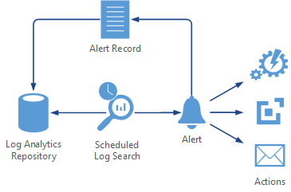
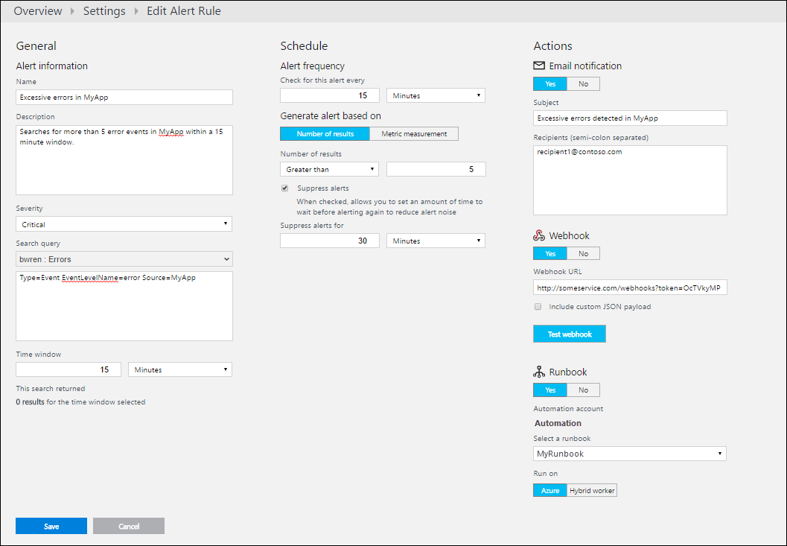
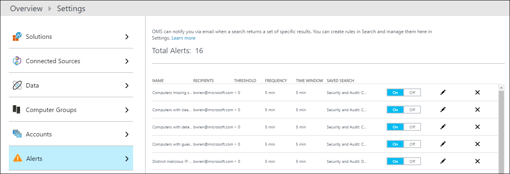

<properties 
   pageTitle="Alerts in Log Analytics | Microsoft Azure"
   description="Alerts in Log Analytics identify important information in your OMS repository and can proactively notify you of issues or invoke actions to attempt to correct them.  This article describes how to create an alert rule and details the different actions they can take."
   services="log-analytics"
   documentationCenter=""
   authors="bwren"
   manager="jwhit"
   editor="tysonn" />
<tags 
   ms.service="log-analytics"
   ms.devlang="na"
   ms.topic="article"
   ms.tgt_pltfrm="na"
   ms.workload="infrastructure-services"
   ms.date="05/12/2016"
   ms.author="bwren" />

# Alerts in Log Analytics

Alerts in Log Analytics identify important information in your OMS repository.  Alert rules automatically run log searches according to a schedule and create an alert record if the results match particular criteria.  The rule can then automatically run one or more actions to proactively notify you of the alert or invoke another process.   

## Alert actions

In addition to creating an alert record, you can configure the alert rule to automatically run one or more actions.  Actions can proactively notify you of the alert or invoke some process that attempts to correct the problem that was detected.  The following sections describe the actions that are currently available.

### Email actions
Email actions send an e-mail with the details of the alert to one or more recipients.  You can specify the subject of the mail, but it's content is a standard format constructed by Log Analytics.  It includes summary information such as the name of the alert in addition to details of up to ten records returned by the log search.  It also includes a link to a log search in Log Analytics that will return the entire set of records from that query.   The sender of the mail is *Microsoft Operations Management Suite Team &lt;noreply@oms.microsoft.com&gt;*. 

### Webhook actions

Webhook actions allow you to invoke an external process through a single HTTP POST request.  The service being called should support webhooks and determine how it will use any payload it receives.  You could also call a REST API that doesn't specifically support webhooks as long as the request is in a format that the API understands.  Examples of using a webhook in response to an alert are using a service like [Slack](http://slack.com) to send a message with the details of the alert or creating an incident in a service like [PagerDuty](http://pagerduty.com/).  

A complete walkthrough of creating an alert rule with a webhook to call a sample service is available at [Webhooks in Log Analytics alerts](log-analytics-alerts-webhooks.md).

Webhooks include a URL and a payload formatted in JSON that is the data sent to the external service.  By default, the payload will include the values in the following table.  You can choose to replace this payload with a custom one of your own.  In that case you can use the variables in the table for each of the parameters to include their value in your custom payload.

| Parameter | Variable | Description |
|:--|:--|:--|
| AlertRuleName | #alertrulename | Name of the alert rule. |
| AlertThresholdOperator | #thresholdoperator | Threshold operator for the alert rule.  *Greater than* or *Less than*. |
| AlertThresholdValue | #thresholdvalue | Threshold value for the alert rule. |
| LinkToSearchResults | #linktosearchresults | Link to Log Analytics log search that returns the records from the query that created the alert. |
| ResultCount  | #searchresultcount | Number of records in the search results. |
| SearchIntervalEndtimeUtc  | #searchintervalendtimeutc | End time for the query in UTC format. |
| SearchIntervalInSeconds | #searchinterval | Time window for the alert rule. |
| SearchIntervalStartTimeUtc  | #searchintervalstarttimeutc | Start time for the query in UTC format. |
| SearchQuery | #searchquery | Log search query used by the alert rule. |
| SearchResults | See below | Records returned by the query in JSON format.  Limited to the first 5,000 records. |
| WorkspaceID | #workspaceid | ID of your OMS workspace. |

For example, you might specify the following custom payload that includes a single parameter called *text*.  The service that this webhook calls would be expecting this parameter.

	{
		"text":"#alertrulename fired with #searchresultcount over threshold of #thresholdvalue."
	}

This example payload would resolve to something like the following when sent to the webhook.

	{
		"text":"My Alert Rule fired with 18 records over threshold of 10 ."
	}

To include search results in a custom payload, add the following line as a top level property in the json payload.  

	"IncludeSearchResults":true

For example, to create a custom payload that includes just the alert name and the search results, you could use the following. 

	{
	   "alertname":"#alertrulename",
	   "IncludeSearchResults":true
	}

You can walk through a complete example of creating an alert rule with a webhook to start an external service at [Log Analytics alert webhook sample](log-analytics-alerts-webhooks.md).

### Runbook actions

Runbook actions start a runbook in Azure Automation.  In order to use this type of action, you must have the [Automation solution](log-analytics-add-solutions.md) installed and configured in your OMS workspace.  If you don't have it installed when you create a new alert rule, a link to its install is displayed.  You can select from the runbooks in the automation account that you configured in the Automation solution.

Runbook actions start the runbook using a [webhook](../automation/automation-webhooks.md).  When you create the alert rule, it will automatically create a new webhook for the runbook with the name **OMS Alert Remediation** followed by a GUID.  The alert rule does not send a payload, and you cannot populate any parameters of the runbook, so you must use a runbook that does not require parameters.

You can also start a runbook from an alert with a webhook action as described in the previous section.  Webhook actions have the advantage of providing a payload to send data to the runbook.  The advantage of runbook actions is that you don't have to create the webhook yourself or understand how to use it.  

## Creating an alert rule
To create an alert rule, you start by creating a log search for the records that should invoke the alert.  The **Alert** button will then be available so you can create and configure the alert rule.

1.	From the OMS Overview page, click **Log Search**.
2.	Either create a new log search query or select a saved log search. 
3.	Click **Alert** at the top of the page to open the **Add Alert Rule** screen.
4. Refer to the tables below for details on the options to configure the alert.
5. When you provide the time window for the alert rule, the number of existing records that match the search criteria for that time window will be displayed.  This can help you determine the frequency that will give you the number of results that you expect.
4.	Click **Save** to complete the alert rule.  It will start running immediately.

| Property | Description |
|:--|:--|
| **Alert information** | |
| Name |  Unique name to identify the alert rule. |
| Severity | Severity of the alert that is created by this rule. |
| Search query | Select **Use current search query** to use the current query or select an existing saved search from the list.  The query syntax is provided in the text box where you can modify it if necessary.  |
| Time window | Specifies the time range for the query.  The query returns only records that were created within this range of  the current time.  This can be any value between 5 minutes and 24 hours.  It should be greater than or equal to the alert frequency.     For example, If the time window is set to 60 minutes, and the query is run at 1:15 PM, only records created between 12:15 PM and 1:15 PM will be returned. |
| **Schedule** |     
| Threshold | Criteria for when to create an alert.  An alert is created if the number of records returned by the query matches this criteria. |
| Alert frequency | Specifies how often the query should be run.  Can be any value between 5 minutes and 24 hours.  Should be equal to or less than the time window. |
| Suppress alerts | When you turn on suppression for the alert rule, actions for the rule are disabled for a defined length of time after creating a new alert.  The rule is still running and will create alert records if the criteria is met.  This is to allow you time to correct the problem without running duplicate actions. |
| **Actions** | |
| Email notification | Specify **Yes** if you want an email to be sent when the alert is triggered. |
| Subject    | Subject in the email.  You cannot modify the body of the mail. |
| Recipients | Addresses of all e-mail recipients.  If you specify more than one address, then separate the addresses with a semicolon (;). |
| Webhook | Specify **Yes** if you want to call a webhook when the alert is triggered. |
| Webhook URL | The URL of the webhook. |
| Include custom JSON payload | Select this option if you want to replace the default payload with a custom payload. |
| Enter your custom JSON payload | The custom payload for the webhook.  See previous section for details. |
| Runbook | Specify **Yes** if you want to start an Azure Automation runbook when the alert is triggered. |
| Select a runbook | Select the runbook to start from the runbooks in the automation account configured in your Automation solution. |
| Run on | Select **Azure** to run the runbook in the Azure cloud.  Select **Hybrid Worker** to run the runbook on a [Hybrid Runbook Worker](..\automation\automation-hybrid-runbook-worker.md) in your local environment. |

## Setting time windows 

### Event alerts

Events include data sources such as Windows event logs, Syslog, and Custom logs.  You may want to create an alert when a particular error event gets created, or when multiple errors events are created within a particular time window.

To alert on a single event, set the number of results to greater than 0 and both the frequency and time window to 5 minutes.  That will run the query every 5 minutes and check for the occurrence of a single event that was created since the last time the query was run.  A longer frequency may delay the time between the event being collected and the alert being created.

Some applications may log an occasional error that shouldn't necessarily raise an alert.  For example, the application may retry the process that created the error event and then succeed the next time.  In this case, you may not want to create the alert unless multiple events are created within a particular time window.  

In some cases, you may want to create an alert in the absence of an event.  For example, a process may log regular events to indicate that it's working properly.  If it doesn't log one of these events within a particular time window, then an alert should be created.  In this case you would set the threshold to *Less than 1*.

### Performance alerts

[Performance data](log-analytics-data-sources-performance-counters.md) is stored as records in the OMS repository similar to events.  The value in each record is the average measured over the previous 30 minutes.  If you want to alert when a performance counter exceeds a particular threshold, then that threshold should be included in the query.

For example, if you wanted to alert when the processor runs over 90% for 30 minutes, you would use a query like *Type=Perf ObjectName=Processor CounterName="% Processor Time" CounterValue>90* and the threshold for the alert rule to *greater than 0*.  

 Since [performance records](log-analytics-data-sources-performance-counters.md) are aggregated every 30 minutes regardless of the frequency that you collect each counter, a time window smaller than 30 minutes may return no records.  Setting the time window to 30 minutes will ensure that you get a single record for each connected source that represents the average over that time.

## Manage alert rules
You can get a list of all alert rules in the **Alerts** menu in Log Analytics **Settings**.  

1. In the OMS console select the **Settings** tile.
2. Select **Alerts**.

You can perform multiple actions from this view.

- Disable a rule by selecting **Off** next to it.
- Edit an alert rule by clicking the pencil icon next to it.
- Remove an alert rule by clicking the **X** icon next to it. 

## Alert records

Alert records created by alert rules in Log Analytics have a **Type** of **Alert** and a **SourceSystem** of **OMS**.  They have the properties in the following table.

| Property | Description |
|:--|:--|
| Type          | *Alert* |
| SourceSystem  | *OMS* |
| AlertSeverity | Severity level of the alert. |
| AlertName     | Name of the alert. |
| Query         | Text of the query that was run.  |
| QueryExecutionEndTime   | End of the time range for the query. |
| QueryExecutionStartTime | Start of the time range for the query.  |
| TimeGenerated | Date and time the alert was created. |

There are other kinds of alert records created by the [Alert Management solution](log-analytics-solution-alert-management.md) and by [Power BI exports](log-analytics-powerbi.md).  These all have a **Type** of **Alert** but are distinguished by their **SourceSystem**.

## Next steps

- Install the [Alert Management solution](log-analytics-solution-alert-management.md) to analyze alerts created in Log Analytics along with alerts collected from System Center Operations Manager (SCOM).
- Read more about [log searches](log-analytics-log-searches.md) that can generate alerts.
- Complete a walkthrough for [configuring a webook](log-analytics-alerts-webhooks.md) with an alert rule.  
- Learn how to write [runbooks in Azure Automation](https://azure.microsoft.com/documentation/services/automation) to remediate problems identified by alerts.