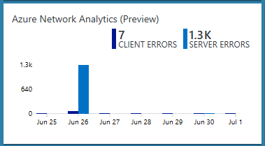
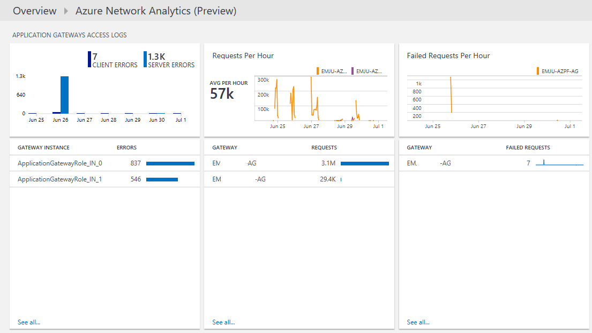
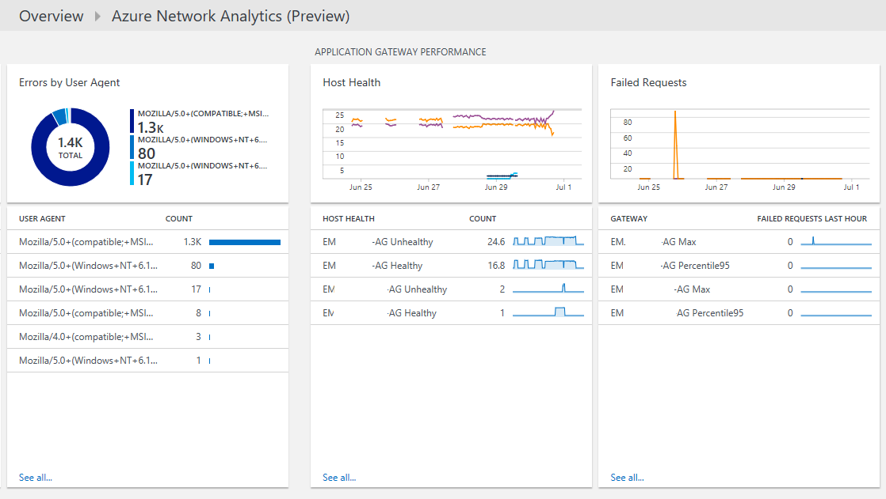
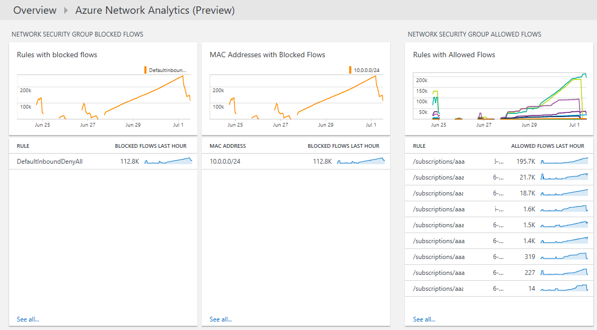

<properties
	pageTitle="Azure Networking Analytics solution in Log Analytics | Microsoft Azure"
	description="You can use the Azure Networking Analytics solution in Log Analytics to review Azure Network Security Group logs and Azure Application Gateway logs."
	services="log-analytics"
	documentationCenter=""
	authors="richrundmsft"
	manager="jochan"
	editor=""/>

<tags
	ms.service="log-analytics"
	ms.workload="na"
	ms.tgt_pltfrm="na"
	ms.devlang="na"
	ms.topic="article"
	ms.date="07/05/2016"
	ms.author="richrund"/>

# Azure Networking Analytics (Preview) solution in Log Analytics

>[AZURE.NOTE] This is a [preview solution](log-analytics-add-solutions.md#log-analytics-preview-solutions-and-features)

You can use the Azure Networking Analytics solution in Log Analytics to review Azure Application Gateway logs and Azure Network Security Group logs.

You can enable logging for Azure Application Gateway logs and Azure Network Security Groups. These logs are written to blob storage and can then be indexed by Log Analytics for searching and analysis.

The following logs are supported for Application Gateways

+ ApplicationGatewayAccessLog
+ ApplicationGatewayPerformanceLog

The following logs are supported for Network Security Groups

+ NetworkSecurityGroupEvent
+ NetworkSecurityGroupRuleCounter

## Installing and configuring the solution

Use the following instructions to install and configure the Azure Networking Analytics solution:

1.	Enable diagnostics logging for the resources you want to monitor:
  + [Application Gateway](../application-gateway/application-gateway-diagnostics.md)
  + [Network Security Group](../virtual-network/virtual-network-nsg-manage-log.md)
2.	Configure Log Analytics to read the logs from blob storage using the process described in [Configure Azure Diagnostics Written to Blob in JSON](log-analytics-azure-storage-json.md).
3.	Enable the Azure Networking Analytics solution using the process described in [Add Log Analytics solutions from the Solutions Gallery](log-analytics-add-solutions.md).  

If you do not enable diagnostic logging for a particular resource type the dashboard blades for that resource will be blank.

## Azure Networking Analytics data collection details

Azure Networking Analytics solution collects diagnostics logs from Azure blob storage for Azure Application Gateways and Network Security Groups.
No agent is required for data collection.

The following table shows data collection methods and other details about how data is collected for Azure Networking Analytics.

| platform | Direct Agent | SCOM agent | Azure Storage | SCOM required? | SCOM agent data sent via management group | collection frequency |
|---|---|---|---|---|---|---|
|Azure||||            || 10 minutes|

## Use Azure Networking Analytics

After the solution is installed, you can view the summary of client and server errors for your monitored Application Gateways by using the **Azure Networking Analytics** tile on the **Overview** page in Log Analytics.

After clicking on the Overview tile you can view summaries of your logs and then drill-into details for the following categories:

+ Application Gateway Access Logs
  - Client and Server errors for Application Gateway access logs
  - Requests per hour for each Application Gateway
  - Failed requests per hour for each Application Gateway
  - Errors by user agent for Application Gateways
+ Application Gateway Performance
  - Host health for Application Gateway
  - Maximum and 95th percentile for Application Gateway failed requests
+ Network Security Group Blocked Flows
  - Network Security Group Rules with blocked flows
  - MAC Addresses with Blocked flows
+ Network Security Group Allowed Flows
  - Network Security Group Rules with allowed flows
  - MAC Addresses with allowed flows

### To view details for any log summary

1. On the **Overview** page, click the **Azure Networking Analytics** tile.
2. On the **Azure Networking Analytics** dashboard, review the summary information in one of the blades and then click one to view detailed information about it in the **log search** page.
3. On any of the log search pages, you can view results by time, detailed results, and your log search history. You can also filter by facets to narrow the results.

## Next steps

- Use [Log searches in Log Analytics](log-analytics-log-searches.md) to view detailed Azure Networking Analytics data.
