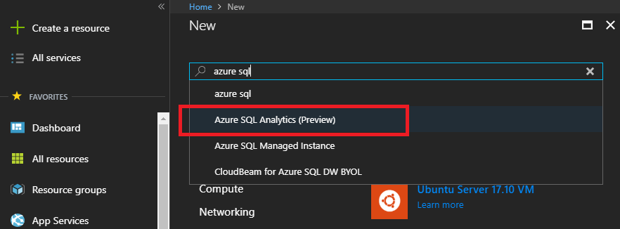
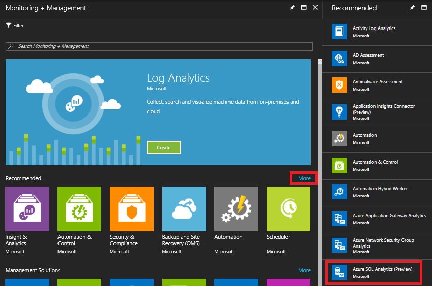
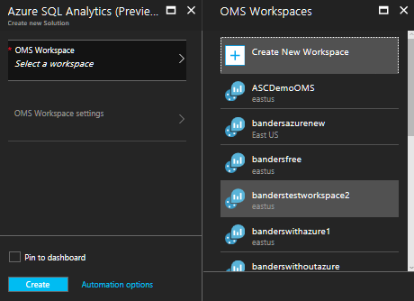
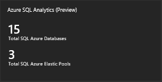
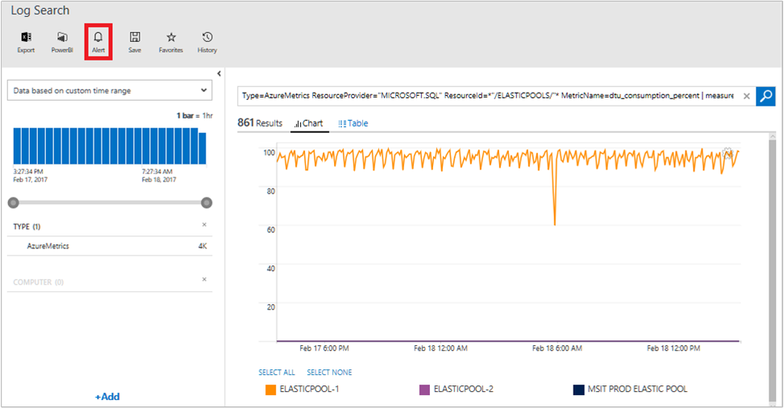
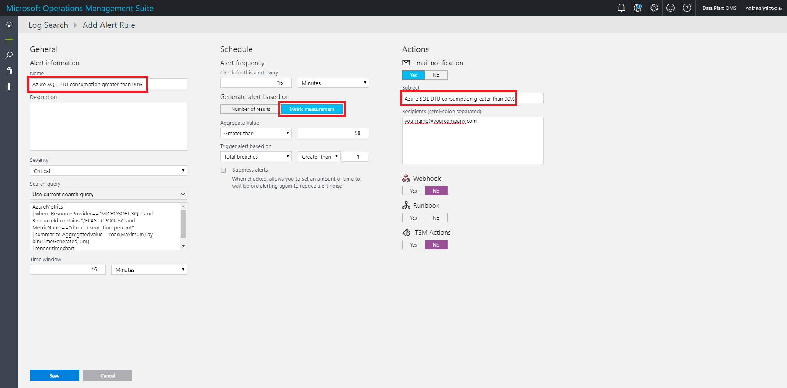
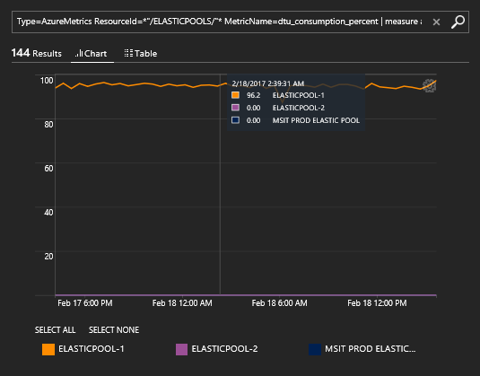

# Monitor Azure SQL Database using Azure SQL Analytics (Preview) in Log Analytics


The Azure SQL Analytics solution in Azure Log Analytics collects and visualizes important SQL Azure performance metrics. By using the metrics that you collect with the solution, you can create custom monitoring rules and alerts. And, you can monitor Azure SQL Database and elastic pool metrics across multiple Azure subscriptions and elastic pools and visualize them. The solution also helps you to identify issues at each layer of your application stack.  It uses [Azure Diagnostic metrics](log-analytics-azure-storage.md) together with Log Analytics views to present data about all your Azure SQL databases and elastic pools in a single Log Analytics workspace.

Currently, this preview solution supports up to 150,000 Azure SQL Databases and 5,000 SQL Elastic Pools per workspace.

The Azure SQL Analytics solution, like others available for Log Analytics, helps you monitor and receive notifications about the health of your Azure resources—in this case, Azure SQL Database. Microsoft Azure SQL Database is a scalable relational database service that provides familiar SQL-Server-like capabilities to applications running in the Azure cloud. Log Analytics helps you to collect, correlate, and visualize structured and unstructured data.

## Connected sources

The Azure SQL Analytics solution doesn't use agents to connect to the Log Analytics service.

The following table describes the connected sources that are supported by this solution.

| Connected Source | Support | Description |
| --- | --- | --- |
| [Windows agents](log-analytics-windows-agents.md) | No | Direct Windows agents are not used by the solution. |
| [Linux agents](log-analytics-linux-agents.md) | No | Direct Linux agents are not used by the solution. |
| [SCOM management group](log-analytics-om-agents.md) | No | A direct connection from the SCOM agent to Log Analytics is not used by the solution. |
| [Azure storage account](log-analytics-azure-storage.md) | No | Log Analytics does not read the data from a storage account. |
| [Azure diagnostics](log-analytics-azure-storage.md) | Yes | Azure metric data is sent to Log Analytics directly by Azure. |

## Prerequisites

- An Azure Subscription. If you don't have one, you can create one for [free](https://azure.microsoft.com/free/).
- A Log Analytics workspace. You can use an existing one, or you can [create a new one](log-analytics-get-started.md) before you start using this solution.
- Enable Azure Diagnostics for your Azure SQL databases and elastic pools and [configure them to send their data to Log Analytics](https://blogs.technet.microsoft.com/msoms/2017/01/17/enable-azure-resource-metrics-logging-using-powershell/).

## Configuration

Perform the following steps to add the Azure SQL Analytics solution to your workspace.

1. Add the Azure SQL Analytics solution to your workspace from [Azure marketplace](https://azuremarketplace.microsoft.com/en-us/marketplace/apps/Microsoft.AzureSQLAnalyticsOMS?tab=Overview) or by using the process described in [Add Log Analytics solutions from the Solutions Gallery](log-analytics-add-solutions.md).
2. In the Azure portal, click **New** (the + symbol), then in the list of resources, select **Monitoring + Management**.  
    
3. In the **Monitoring + Management** list click **See all**.
4. In the **Recommended** list, click **More** , and then in the new list, find **Azure SQL Analytics (Preview)** and then select it.  
    
5. In the **Azure SQL Analytics (Preview)** blade, click **Create**.  
    
6. In the **Create new solution** blade, select the workspace that you want to add the solution to and then click **Create**.  
    


### To configure multiple Azure subscriptions

To support multiple subscriptions, use the PowerShell script from [Enable Azure resource metrics logging using PowerShell](https://blogs.technet.microsoft.com/msoms/2017/01/17/enable-azure-resource-metrics-logging-using-powershell/). Provide the workspace resource ID as a parameter when executing the script to send diagnostic data from resources in one Azure subscription to a workspace in another Azure subscription.

**Example**

```
PS C:\> $WSID = "/subscriptions/<subID>/resourcegroups/oms/providers/microsoft.operationalinsights/workspaces/omsws"
```

```
PS C:\> .\Enable-AzureRMDiagnostics.ps1 -WSID $WSID
```

## Using the solution

When you add the solution to your workspace, the Azure SQL Analytics tile is added to your workspace, and it appears in Overview. The tile shows the number of Azure SQL databases and Azure SQL elastic pools that the solution is connected to.



### Viewing Azure SQL Analytics data

Click on the **Azure SQL Analytics** tile to open the Azure SQL Analytics dashboard. The dashboard includes the blades defined below. Each blade lists up to 15 resources (subscription, server, elastic pool, and database). Click any of the resources to open the dashboard for that specific resource. Elastic Pool or Database contains the charts with metrics for a selected resource. Click a chart to open the Log Search dialog.

| Blade | Description |
|---|---|
| Subscriptions | List of subscriptions with number of connected servers, pools, and databases. |
| Servers | List of servers with number of connected pools and databases. |
| Elastic Pools | List of connected elastic pools with maximum GB and eDTU in the observed period. |
|Databases | List of connected databases with maximum GB and DTU in the observed period.|


### Analyze data and create alerts

You can easily create alerts with the data coming from Azure SQL Database resources. Here are a couple of useful [log search](log-analytics-log-searches.md) queries that you can use for alerting:

*High DTU on Azure SQL Database*

```
Type=AzureMetrics ResourceProvider="MICROSOFT.SQL" ResourceId=*"/DATABASES/"* MetricName=dtu_consumption_percent | measure Avg(Average) by Resource interval 5minutes
```

*High DTU on Azure SQL Database Elastic Pool*

```
Type=AzureMetrics ResourceProvider="MICROSOFT.SQL" ResourceId=*"/ELASTICPOOLS/"* MetricName=dtu_consumption_percent | measure avg(Average) by Resource interval 5minutes
```

You can use these alert-based queries to alert on specific thresholds for both Azure SQL Database and elastic pools. To configure an alert for your OMS workspace:

#### To configure an alert for your workspace

1. Go to the [OMS portal](http://mms.microsoft.com/) and sign in.
2. Open the workspace that you have configured for the solution.
3. On the Overview page, click the **Azure SQL Analytics (Preview)** tile.
4. Run one of the example queries.
5. In Log Search, click **Alert**.  

6. On the **Add Alert Rule** page, configure the appropriate properties and the specific thresholds that you want and then click **Save**.  


### Act on Azure SQL Analytics data

As an example, one of the most useful queries that you can perform is to compare the DTU utilization for all Azure SQL Elastic Pools across all your Azure subscriptions. Database Throughput Unit (DTU) provides a way to describe the relative capacity of a performance level of Basic, Standard, and Premium databases and pools. DTUs are based on a blended measure of CPU, memory, reads, and writes. As DTUs increase, the power offered by the performance level increases. For example, a performance level with 5 DTUs has five times more power than a performance level with 1 DTU. A maximum DTU quota applies to each server and elastic pool.

By running the following Log Search query, you can easily tell if you are underutilizing or over utilizing your SQL Azure elastic pools.

```
Type=AzureMetrics ResourceId=*"/ELASTICPOOLS/"* MetricName=dtu_consumption_percent | measure avg(Average) by Resource | display LineChart
```

In the following example, you can see that one elastic pool has a high usage near 100% DTU while others have very little usage. You can investigate further to troubleshoot potential recent changes in your environment using Azure Activity logs.



## See also

- Use [Log Searches](log-analytics-log-searches.md) in Log Analytics to view detailed Azure SQL data.
- [Create your own dashboards](log-analytics-dashboards.md) showing Azure SQL data.
- [Create alerts](log-analytics-alerts.md) when specific Azure SQL events occur.
