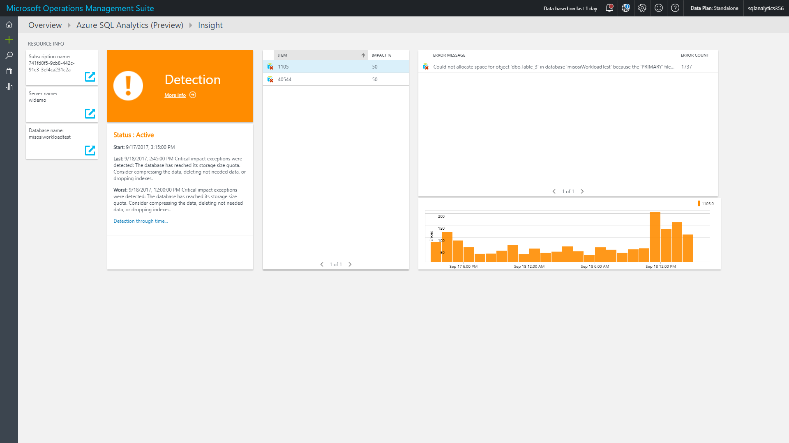
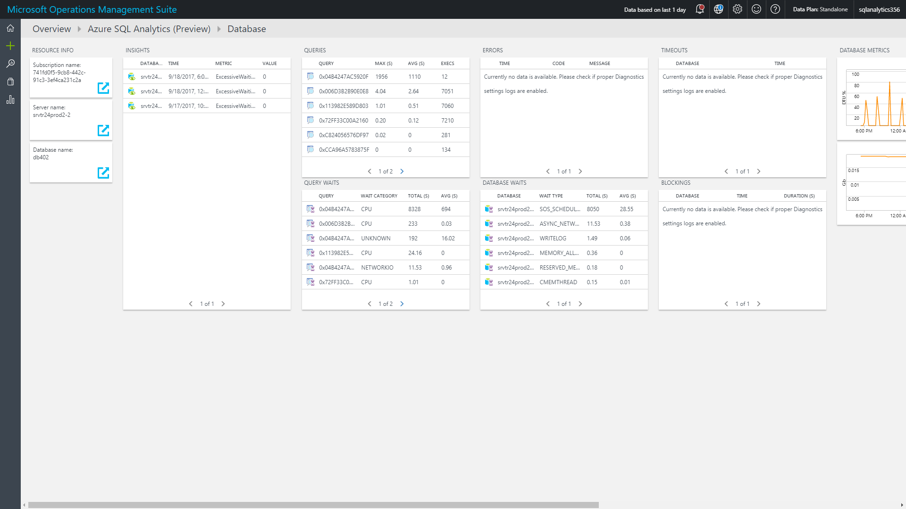
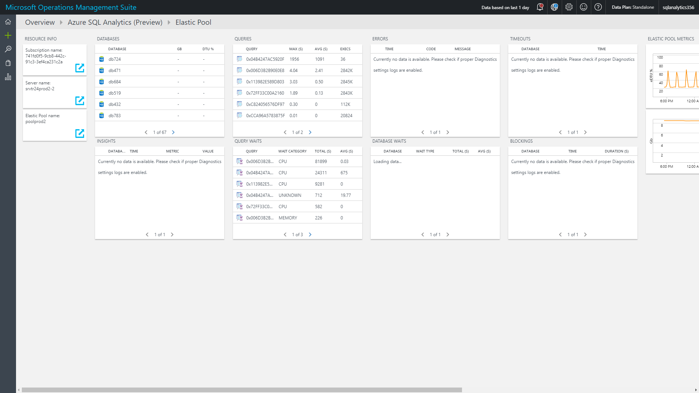
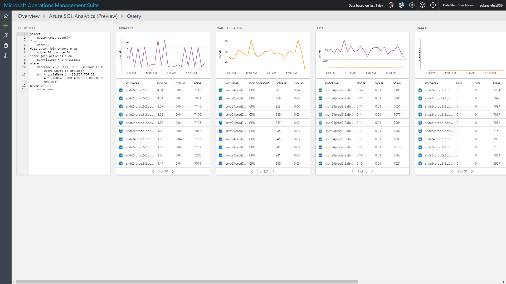

# Monitor Azure SQL Database using Azure SQL Analytics (Preview)


Azure SQL Analytics is a cloud monitoring solution for monitoring performance of Azure SQL databases, elastic pools, and Managed Instances at scale and across multiple subscriptions through a single pane of glass. It collects and visualizes important Azure SQL Database performance metrics with built-in intelligence for performance troubleshooting.

By using metrics that you collect with the solution, you can create custom monitoring rules and alerts. The solution helps you to identify issues at each layer of your application stack. It uses Azure Diagnostic metrics along with Log Analytics views to present data about all your Azure SQL databases, elastic pools, and databases in Managed Instances in a single Log Analytics workspace. Log Analytics helps you to collect, correlate, and visualize structured and unstructured data.

For a hands-on overview on using Azure SQL Analytics solution and for typical usage scenarios, see the embedded video:

>[!VIDEO https://www.youtube.com/embed/GK2Hl21aZqQ]
>

## Connected sources

Azure SQL Analytics is a cloud only monitoring solution supporting streaming of diagnostics telemetry for Azure SQL databases: single, pooled, and Managed Instance databases. As the solution does not use agents to connect to the Log Analytics service, the solution does not support monitoring of SQL Server hosted on-premises or in VMs, see the compatibility table below.

| Connected Source | Supported | Description |
| --- | --- | --- |
| [Azure Diagnostics](log-analytics-azure-storage.md) | **Yes** | Azure metric and log data are sent to Log Analytics directly by Azure. |
| [Azure storage account](log-analytics-azure-storage.md) | No | Log Analytics doesn't read the data from a storage account. |
| [Windows agents](../azure-monitor/platform/agent-windows.md) | No | Direct Windows agents aren't used by the solution. |
| [Linux agents](log-analytics-quick-collect-linux-computer.md) | No | Direct Linux agents aren't used by the solution. |
| [System Center Operations Manager management group](log-analytics-om-agents.md) | No | A direct connection from the Operations Manager agent to Log Analytics is not used by the solution. |

## Configuration

Perform the following steps to add the Azure SQL Analytics solution to your Azure dashboard.

1. Add the Azure SQL Analytics solution to your workspace from [Azure marketplace](https://azuremarketplace.microsoft.com/en-us/marketplace/apps/Microsoft.AzureSQLAnalyticsOMS?tab=Overview).
2. In the Azure portal, click **+ Create a resource**, then search for **Azure SQL Analytics**.  
    
3. Select **Azure SQL Analytics (Preview)** from the list
4. In the **Azure SQL Analytics (Preview)** area, click **Create**.  
    
5. In the **Create new solution** area, create new, or select an existing workspace that you want to add the solution to, and then click **Create**.

    

### Configure Azure SQL Databases, elastic pools and Managed Instances to stream diagnostics telemetry

Once you have created Azure SQL Analytics solution in your workspace, you need to **configure each** resources that you want to monitor to stream its diagnostics telemetry to the solution. Follow detailed instructions on this page:

- Enable Azure Diagnostics for your Azure SQL database to [stream diagnostics telemetry to Azure SQL Analytics](../sql-database/sql-database-metrics-diag-logging.md).

The above page also provides instructions on enabling support for monitoring multiple Azure subscriptions from a single Azure SQL Analytics workspace as a single pane of glass.

## Using the solution

When you add the solution to your workspace, the Azure SQL Analytics tile is added to your workspace, and it appears in Overview. The tile shows the number of Azure SQL databases, elastic pools, Managed Instances, and databases in Managed instances that the solution is receiving diagnostics telemetry from.


The solution provides two separate views -- one for monitoring Azure SQL Databases and elastic pools, and the other view for monitoring Managed Instance, and databases in Managed Instances.

To view Azure SQL Analytics monitoring dashboard for Azure SQL Databases and elastic pools, click on the upper part of the tile. To view Azure SQL Analytics monitoring dashboard for Managed Instance, and databases in Managed Instance, click on the lower part of the tile.

### Viewing Azure SQL Analytics data

The dashboard includes the overview of all databases that are monitored through different perspectives. For different perspectives to work, you must enable proper metrics or logs on your SQL resources to be streamed to Azure Log Analytics workspace.

Note that if some metrics or logs are not streamed into Azure Log Analytics, the tiles in the solution are not populated with monitoring information.

### Azure SQL Database and elastic pool view

Once the Azure SQL Analytics tile for the database is selected, the monitoring dashboard is shown.


Selecting any of the tiles, opens a drill-down report into the specific perspective. Once the perspective is selected, the drill-down report is opened.


Each perspective in this view provides summaries on subscription, server, elastic pool, and database level. In addition, each perspective shows a perspective specific to the report on the right. Selecting subscription, server, pool, or database from the list continues the drill-down.

### Managed Instance and databases in Managed Instance view

Once the Azure SQL Analytics tile for the databases is selected, the monitoring dashboard is shown.


Selecting any of the tiles, opens a drill-down report into the specific perspective. Once the perspective is selected, the drill-down report is opened.

Selecting Managed Instance view, shows details on the Managed Instance utilization, databases it contains, and telemetry on the queries executed across the instance.


### Perspectives

The below table outlines perspectives supported for two versions of the dashboard, one for Azure SQL database and elastic pools, and the other one for Managed Instance.

| Perspective | Description | SQL Database and elastic pools support | Managed Instance support |
| --- | ------- | ----- | ----- |
| Resource by type | Perspective that counts all the resources monitored. | Yes | Yes |
| Insights | Provides hierarchical drill-down into Intelligent Insights into performance. | Yes | Yes |
| Errors | Provides hierarchical drill-down into SQL errors that happened on the databases. | Yes | Yes |
| Timeouts | Provides hierarchical drill-down into SQL timeouts that happened on the databases. | Yes | No |
| Blockings | Provides hierarchical drill-down into SQL blockings that happened on the databases. | Yes | No |
| Database waits | Provides hierarchical drill-down into SQL wait statistics on the database level. Includes summaries of total waiting time and the waiting time per wait type. |Yes | Yes |
| Query duration | Provides hierarchical drill-down into the query execution statistics such as query duration, CPU usage, Data IO usage, Log IO usage. | Yes | Yes |
| Query waits | Provides hierarchical drill-down into the query wait statistics by wait category. | Yes | Yes |

### Intelligent Insights report

Azure SQL Database [Intelligent Insights](../sql-database/sql-database-intelligent-insights.md) lets you know what is happening with performance of all Azure SQL databases. All Intelligent Insights collected can be visualized and accessed through the Insights perspective.



### Elastic pool and Database reports

Both elastic pools and SQL Databases have their own specific reports that show all the data that is collected for the resource in the specified time.





### Query reports

Through the Query duration and query waits perspectives, you can correlate the performance of any query through the query report. This report compares the query performance across different databases and makes it easy to pinpoint databases that perform the selected query well versus ones that are slow.



## Permissions

To use Azure SQL Analytics, users need to be granted a minimum permission of the Reader role in Azure. This role, however, does not allow users to see the query text, or perform any Automatic tuning actions. More permissive roles in Azure that allow using the solution to the fullest extent are Owner, Contributor, SQL DB Contributor, or SQL Server Contributor. You also might want to consider creating a custom role in the portal with specific permissions required only to use Azure SQL Analytics, and with no access to managing other resources.

### Creating a custom role in portal

Recognizing that some organizations enforce strict permission controls in Azure, find the following PowerShell script enabling creation of a custom role “SQL Analytics Monitoring Operator” in Azure portal with the minimum read and write permissions required to use Azure SQL Analytics to its fullest extent.

Replace the “{SubscriptionId}" in the below script with your Azure subscription ID, and execute the script logged in as an Owner or Contributor role in Azure.

   ```powershell
    Connect-AzureRmAccount
    Select-AzureRmSubscription {SubscriptionId}
    $role = Get-AzureRmRoleDefinition -Name Reader
    $role.Name = "SQL Analytics Monitoring Operator"
    $role.Description = "Lets you monitor database performance with Azure SQL Analytics as a reader. Does not allow change of resources."
    $role.IsCustom = $true
    $role.Actions.Add("Microsoft.SQL/servers/databases/read");
    $role.Actions.Add("Microsoft.SQL/servers/databases/topQueries/queryText/*");
    $role.Actions.Add("Microsoft.Sql/servers/databases/advisors/read");
    $role.Actions.Add("Microsoft.Sql/servers/databases/advisors/write");
    $role.Actions.Add("Microsoft.Sql/servers/databases/advisors/recommendedActions/read");
    $role.Actions.Add("Microsoft.Sql/servers/databases/advisors/recommendedActions/write");
    $role.Actions.Add("Microsoft.Sql/servers/databases/automaticTuning/read");
    $role.Actions.Add("Microsoft.Sql/servers/databases/automaticTuning/write");
    $role.Actions.Add("Microsoft.Sql/servers/databases/*");
    $role.Actions.Add("Microsoft.Sql/servers/advisors/read");
    $role.Actions.Add("Microsoft.Sql/servers/advisors/write");
    $role.Actions.Add("Microsoft.Sql/servers/advisors/recommendedActions/read");
    $role.Actions.Add("Microsoft.Sql/servers/advisors/recommendedActions/write");
    $role.Actions.Add("Microsoft.Resources/deployments/write");
    $role.AssignableScopes = "/subscriptions/{SubscriptionId}"
    New-AzureRmRoleDefinition $role
   ```

Once the new role is created, assign this role to each user that you need to grant custom permissions to use Azure SQL Analytics.

## Analyze data and create alerts

Data analysis in Azure SQL Analytics is based on [Log Analytics language](./query-language/get-started-queries.md) for your custom querying and reporting. Find description of the available data collected from database resource for custom querying in [metrics and logs available](../sql-database/sql-database-metrics-diag-logging.md#metrics-and-logs-available).

Automated alerting in the solution is based on writing a Log Analytics query that triggers an alert upon a condition met. Find below several examples on Log Analytics queries upon which alerting can be set up in the solution.

### Creating alerts for Azure SQL Database

You can easily [create alerts](../monitoring-and-diagnostics/alert-metric.md) with the data coming from Azure SQL Database resources. Here are some useful [log search](log-analytics-queries.md) queries that you can use with a log alert:

#### High CPU on Azure SQL Database

```
AzureMetrics
| where ResourceProvider=="MICROSOFT.SQL"
| where ResourceId contains "/DATABASES/"
| where MetricName=="cpu_percent"
| summarize AggregatedValue = max(Maximum) by bin(TimeGenerated, 5m)
| render timechart
```

> [!NOTE]
> - Pre-requirement of setting up this alert is that monitored databases stream diagnostics metrics ("All metrics" option) to the solution.
> - Replace the MetricName value cpu_percent with dtu_consumption_percent to obtain high DTU results instead.

#### High CPU on Azure SQL Database elastic pools

```
AzureMetrics
| where ResourceProvider=="MICROSOFT.SQL"
| where ResourceId contains "/ELASTICPOOLS/"
| where MetricName=="cpu_percent"
| summarize AggregatedValue = max(Maximum) by bin(TimeGenerated, 5m)
| render timechart
```

> [!NOTE]
> - Pre-requirement of setting up this alert is that monitored databases stream diagnostics metrics ("All metrics" option) to the solution.
> - Replace the MetricName value cpu_percent with dtu_consumption_percent to obtain high DTU results instead.

#### Azure SQL Database storage in average above 95% in the last 1 hr

```
let time_range = 1h;
let storage_threshold = 95;
AzureMetrics
| where ResourceId contains "/DATABASES/"
| where MetricName == "storage_percent"
| summarize max_storage = max(Average) by ResourceId, bin(TimeGenerated, time_range)
| where max_storage > storage_threshold
| distinct ResourceId
```

> [!NOTE]
> - Pre-requirement of setting up this alert is that monitored databases stream diagnostics metrics ("All metrics" option) to the solution.
> - This query requires an alert rule to be set up to fire off an alert when there exist results (> 0 results) from the query, denoting that the condition exists on some databases. The output is a list of database resources that are above the storage_threshold within the time_range defined.
> - The output is a list of database resources that are above the storage_threshold within the time_range defined.

#### Alert on Intelligent insights

```
let alert_run_interval = 1h;
let insights_string = "hitting its CPU limits";
AzureDiagnostics
| where Category == "SQLInsights" and status_s == "Active"
| where TimeGenerated > ago(alert_run_interval)
| where rootCauseAnalysis_s contains insights_string
| distinct ResourceId
```

> [!NOTE]
> - Pre-requirement of setting up this alert is that monitored databases stream SQLInsights diagnostics log to the solution.
> - This query requires an alert rule to be set up to run with the same frequency as alert_run_interval in order to avoid duplicate results. The rule should be set up to fire off the alert when there exist results (> 0 results) from the query.
> - Customize the alert_run_interval to specify the time range to check if the condition has occurred on databases configured to stream SQLInsights log to the solution.
> - Customize the insights_string to capture the output of the Insights root cause analysis text. This is the same text displayed in the UI of the solution that you can use from the existing insights. Alternatively, you can use the query below to see the text of all Insights generated on your subscription. Use the output of the query to harvest the distinct strings for setting up alerts on Insights.

```
AzureDiagnostics
| where Category == "SQLInsights" and status_s == "Active"
| distinct rootCauseAnalysis_s
```

### Creating alerts for Managed Instance

#### Managed Instance storage is above 90%

```
let storage_percentage_threshold = 90;
AzureDiagnostics
| where Category =="ResourceUsageStats"
| summarize (TimeGenerated, calculated_storage_percentage) = arg_max(TimeGenerated, todouble(storage_space_used_mb_s) *100 / todouble (reserved_storage_mb_s))
   by ResourceId
| where calculated_storage_percentage > storage_percentage_threshold
```

> [!NOTE]
> - Pre-requirement of setting up this alert is that monitored Managed Instance has the streaming of ResourceUsageStats log enabled to the solution.
> - This query requires an alert rule to be set up to fire off an alert when there exist results (> 0 results) from the query, denoting that the condition exists on the Managed Instance. The output is storage percentage consumption on the Managed Instance.

#### Managed Instance CPU average consumption is above 95% in the last 1 hr

```
let cpu_percentage_threshold = 95;
let time_threshold = ago(1h);
AzureDiagnostics
| where Category == "ResourceUsageStats" and TimeGenerated > time_threshold
| summarize avg_cpu = max(todouble(avg_cpu_percent_s)) by ResourceId
| where avg_cpu > cpu_percentage_threshold
```

> [!NOTE]
> - Pre-requirement of setting up this alert is that monitored Managed Instance has the streaming of ResourceUsageStats log enabled to the solution.
> - This query requires an alert rule to be set up to fire off an alert when there exist results (> 0 results) from the query, denoting that the condition exists on the Managed Instance. The output is average CPU utilization percentage consumption in defined period on the Managed Instance.

### Pricing

While the solution is free to use, consumption of diagnostics telemetry above the free units of data ingestion allocated each month applies, see [Log Analytics pricing](https://azure.microsoft.com/en-us/pricing/details/monitor). The free units of data ingestion provided enable free monitoring of several databases each month. Note that more active databases with heavier workloads ingest more data versus idle databases. You can easily monitor your data ingestion consumption in the solution by selecting OMS Workspace on the navigation menu of Azure SQL Analytics, and then selecting Usage and Estimated Costs.

## Next steps

- Use [Log Searches](log-analytics-queries.md) in Log Analytics to view detailed Azure SQL data.
- [Create your own dashboards](../azure-monitor/platform/dashboards.md) showing Azure SQL data.
- [Create alerts](../monitoring-and-diagnostics/monitoring-overview-alerts.md) when specific Azure SQL events occur.
