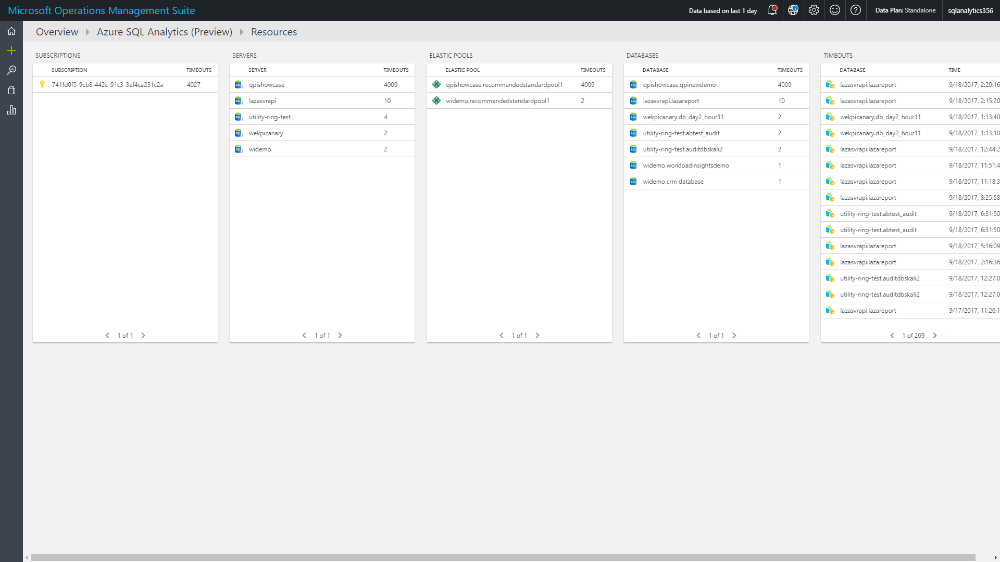

# Monitor Azure SQL Database using Azure SQL Analytics (Preview) in Log Analytics


The Azure SQL Analytics solution in Azure Log Analytics collects and visualizes important SQL Azure performance metrics. By using the metrics that you collect with the solution, you can create custom monitoring rules and alerts. And, you can monitor Azure SQL Database and elastic pool metrics across multiple Azure subscriptions and elastic pools and visualize them. The solution also helps you to identify issues at each layer of your application stack.  It uses [Azure Diagnostic metrics](log-analytics-azure-storage.md) together with Log Analytics views to present data about all your Azure SQL databases and elastic pools in a single Log Analytics workspace.

Currently, this preview solution supports up to 150,000 Azure SQL Databases and 5,000 SQL Elastic Pools per workspace.

The Azure SQL Analytics solution, like others available for Log Analytics, helps you monitor and receive notifications about the health of your Azure resources—in this case, Azure SQL Database. Microsoft Azure SQL Database is a scalable relational database service that provides familiar SQL-Server-like capabilities to applications running in the Azure cloud. Log Analytics helps you to collect, correlate, and visualize structured and unstructured data.

## Connected sources

The Azure SQL Analytics solution doesn't use agents to connect to the Log Analytics service.

The following table describes the connected sources that are supported by this solution.

| Connected Source | Support | Description |
| --- | --- | --- |
| [Windows agents](log-analytics-windows-agents.md) | No | Direct Windows agents are not used by the solution. |
| [Linux agents](log-analytics-linux-agents.md) | No | Direct Linux agents are not used by the solution. |
| [SCOM management group](log-analytics-om-agents.md) | No | A direct connection from the SCOM agent to Log Analytics is not used by the solution. |
| [Azure storage account](log-analytics-azure-storage.md) | No | Log Analytics does not read the data from a storage account. |
| [Azure Diagnostics](log-analytics-azure-storage.md) | Yes | Azure metric and log data is sent to Log Analytics directly by Azure. |

## Prerequisites

- An Azure Subscription. If you don't have one, you can create one for [free](https://azure.microsoft.com/free/).
- A Log Analytics workspace. You can use an existing one, or you can [create a new one](log-analytics-quick-create-workspace.md) before you start using this solution.
- Enable Azure Diagnostics for your Azure SQL databases and elastic pools and [configure them to send their data to Log Analytics](../sql-database/sql-database-metrics-diag-logging.md).

## Configuration

Perform the following steps to add the Azure SQL Analytics solution to your workspace.

1. Add the Azure SQL Analytics solution to your workspace from [Azure marketplace](https://azuremarketplace.microsoft.com/en-us/marketplace/apps/Microsoft.AzureSQLAnalyticsOMS?tab=Overview) or by using the process described in [Add Log Analytics solutions from the Solutions Gallery](log-analytics-add-solutions.md).
2. In the Azure portal, click **New** (the + symbol), then in the list of resources, select **Monitoring + Management**.  
    
3. In the **Monitoring + Management** list click **See all**.
4. In the **Recommended** list, click **More** , and then in the new list, find **Azure SQL Analytics (Preview)** and then select it.  
    
5. In the **Azure SQL Analytics (Preview)** blade, click **Create**.  
    
6. In the **Create new solution** blade, select the workspace that you want to add the solution to and then click **Create**.  
    


### To configure multiple Azure subscriptions

To support multiple subscriptions, use the PowerShell script from [Enable Azure resource metrics logging using PowerShell](https://blogs.technet.microsoft.com/msoms/2017/01/17/enable-azure-resource-metrics-logging-using-powershell/). Provide the workspace resource ID as a parameter when executing the script to send diagnostic data from resources in one Azure subscription to a workspace in another Azure subscription.

**Example**

```
PS C:\> $WSID = "/subscriptions/<subID>/resourcegroups/oms/providers/microsoft.operationalinsights/workspaces/omsws"
```

```
PS C:\> .\Enable-AzureRMDiagnostics.ps1 -WSID $WSID
```

## Using the solution

>[!NOTE]
> Please upgrade your Log Analytics to get the latest version of Azure SQL Analytics.
>

When you add the solution to your workspace, the Azure SQL Analytics tile is added to your workspace, and it appears in Overview. The tile shows the number of Azure SQL databases and Azure SQL elastic pools that the solution is connected to.


### Viewing Azure SQL Analytics data

Click on the **Azure SQL Analytics** tile to open the Azure SQL Analytics dashboard. The dashboard includes the overview of all databases that are monitored through different perspectives. For different perspectives to work, you must enable proper metrics or logs on your SQL resources to be streamed to Azure Log Analytics workspace. 


Selecting any of the tiles, opens a drill-down report into the specific perspective. Once the perspective is selected, drill down report is opened.



Each perspective, provides summaries on subscription, server, elastic pool, and database level. In addition, each perspective shows perspective specific report on the right. Selecting subscription, server, pool, or database from the list continues the drill down.

| Perspective | Description |
| --- | --- |
| Resource by type | Perspective that counts all the resources monitored. Drill-down provides the summary of DTU and GB metrics. |
| Insights | Provides hierarchical drill-down into Intelligent Insights. Learn more about intelligent insights. |
| Errors | Provides hierarchical drill-down into SQL errors that happened on the databases. |
| Timeouts | Provides hierarchical drill-down into SQL timeouts that happened on the databases. |
| Blockings | Provides hierarchical drill-down into SQL blockings that happened on the databases. |
| Database waits | Provides hierarchical drill-down into SQL wait statistics on the database level. Includes summaries of total waiting time and the waiting time per wait type. |
| Query duration | Provides hierarchical drill-down into the query execution statistics such as query duration, CPU usage, Data IO usage, Log IO usage. |
| Query waits | Provides hierarchical drill-down into the query wait statistics by wait category. |

### Intelligent Insights report

All Intelligent Insights collected can be visualized and accessed through the Insights perspective. 


### Elastic Pool and Database reports

Both Elastic Pools and Databases have their own specific reports which show all the data that is collected for the resource in the specified time.


### Query reports

Through Query duration and query waits perspective, you can correlate the performance of any query through the query report. This report compares the query performance across different databases and makes it easy to pinpoint databases that perform the selected query well versus ones that are slow.


### Analyze data and create alerts

You can easily create alerts with the data coming from Azure SQL Database resources. Here are a couple of useful [log search](log-analytics-log-searches.md) queries that you can use for alerting:

[!include[log-analytics-log-search-nextgeneration](../../includes/log-analytics-log-search-nextgeneration.md)]


*High DTU on Azure SQL Database*

```
AzureMetrics | where ResourceProvider=="MICROSOFT.SQL" and ResourceId contains "/DATABASES/" and MetricName=="dtu_consumption_percent" | summarize avg(Maximum) by ResourceId
```

*High DTU on Azure SQL Database Elastic Pool*

```
AzureMetrics | where ResourceProvider=="MICROSOFT.SQL" and ResourceId contains "/ELASTICPOOLS/" and MetricName=="dtu_consumption_percent" | summarize avg(Maximum) by ResourceId
```

You can use these alert-based queries to alert on specific thresholds for both Azure SQL Database and elastic pools. To configure an alert for your OMS workspace:

#### To configure an alert for your workspace

1. Go to the [OMS portal](http://mms.microsoft.com/) and sign in.
2. Open the workspace that you have configured for the solution.
3. On the Overview page, click the **Azure SQL Analytics (Preview)** tile.
4. Run one of the example queries.
5. In Log Search, click **Alert**.  

6. On the **Add Alert Rule** page, configure the appropriate properties and the specific thresholds that you want and then click **Save**.  


## Next steps

- Use [Log Searches](log-analytics-log-searches.md) in Log Analytics to view detailed Azure SQL data.
- [Create your own dashboards](log-analytics-dashboards.md) showing Azure SQL data.
- [Create alerts](log-analytics-alerts.md) when specific Azure SQL events occur.
