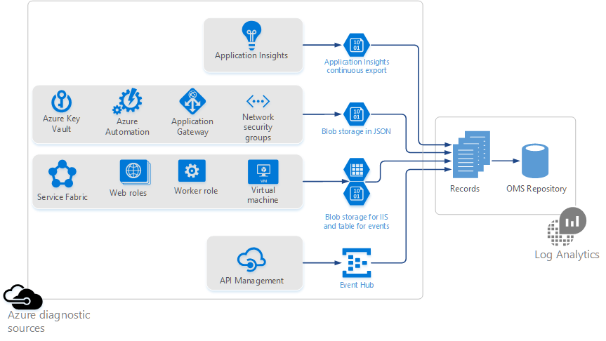

<properties
	pageTitle="Collecting Azure storage data in Log Analytics overview | Microsoft Azure"
	description="Azure resources can write logs and metrics to an Azure storage account, often by using Azure Diagnostics. Log Analytics can index this data and make it searchable."
	services="log-analytics"
	documentationCenter=""
	authors="bandersmsft"
	manager="jwhit"
	editor=""/>

<tags
	ms.service="log-analytics"
	ms.workload="na"
	ms.tgt_pltfrm="na"
	ms.devlang="na"
	ms.topic="article"
	ms.date="07/13/2016"
	ms.author="banders"/>

# Collecting Azure storage data in Log Analytics overview

Many Azure resources are able to write logs and metrics to an Azure storage account. Log Analytics can consume this data and make it easier to monitor your Azure resources.

To write to Azure storage a resource may use Azure diagnostics, or have its own way to write data. This data may be written in various formats to one of the following locations:

+ Azure table
+ Azure blob
+ EventHub

Log Analytics supports Azure services that write data using Azure diagnostics to blob storage in JSON format. In addition, Log Analytics supports other services that output logs and metrics in different formats and locations.  

>[AZURE.NOTE] You'll be charged normal Azure data rates for storage and transactions when you send diagnostics to a storage account and for when Log Analytics reads the data from your storage account.

## Supported Azure Resources

Log Analytics can collect data for the following Azure resources:

| Resource Type | Logs (Diagnostic Categories) | Log Analytics Solution |
| --------------------------------------- | -------------------------------- | --------------- |
| Application Insights | Availability   Custom Events   Exceptions   Requests   | Application Insights (Preview) |
| API Management | | *none* (Preview) |
| Automation   Microsoft.Automation/AutomationAccounts | JobLogs   JobStreams          | AzureAutomation (Preview) |
| Key Vault   Microsoft.KeyVault/Vaults               | AuditEvent                       | KeyVault (Preview) |
| Application Gateway   Microsoft.Network/ApplicationGateways   | ApplicationGatewayAccessLog   ApplicationGatewayPerformanceLog | AzureNetworking (Preview) |
| Network Security Group   Microsoft.Network/NetworkSecurityGroups | NetworkSecurityGroupEvent   NetworkSecurityGroupRuleCounter | AzureNetworking (Preview) |
| Service Fabric                          | ETWEvent   Operational Event   Reliable Actor Event   Reliable Service Event| ServiceFabric (Preview) |
| Virtual Machines | Linux Syslog   Windows Event   IIS Log   Windows ETWEvent | *none* |
| Web Roles   Worker Roles | Linux Syslog   Windows Event   IIS Log   Windows ETWEvent | *none* |

>[AZURE.NOTE] For monitoring Azure virtual machines (both Linux and Windows) we recommend installing the Microsoft Monitoring Agent VM extension. This will provide you with deeper insights on your virtual machines than if you use the diagnostics written to storage.

You can help us prioritize additional logs for OMS to analyze by voting on our [feedback page](http://feedback.azure.com/forums/267889-azure-log-analytics/category/88086-log-management-and-log-collection-policy).

- See [Use JSON files in blob storage](log-analytics-azure-storage-json.md) to learn more about how Log Analytics can read the logs from Azure services that write diagnostics to blob storage in JSON format, including:
  - Azure Key Vault
  - Azure Automation
  - Application Gateway
  - Network security groups
- See [Use blob storage for IIS and table storage for events](log-analytics-azure-storage-iis-table.md) to learn more about how Log Analytics can read the logs for Azure services that write diagnostics to table storage or IIS logs written to blob storage, including:
  - Service Fabric
  - Web Roles
  - Worker Roles
  - Virtual Machines

Application Insights is in private preview and it uses continuous export to blob storage. To join the private preview contact your Microsoft Account team or refer to the details on the [feedback site](https://feedback.azure.com/forums/267889-log-analytics/suggestions/6519248-integration-with-app-insights).

## Next steps

- [Use JSON files in blob storage](log-analytics-azure-storage-json.md) to read the logs from Azure services that write diagnostics to blob storage in JSON format.
- [Use blob storage for IIS and table storage for events](log-analytics-azure-storage-iis-table.md) to read the logs for Azure services that write diagnostics to table storage or IIS logs written to blob storage.
- [Enable Solutions](log-analytics-add-solutions.md) to provide insight into the data.
- [Use search queries](log-analytics-log-searches.md) to analyze the data.
