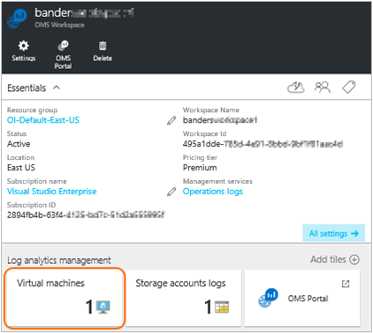
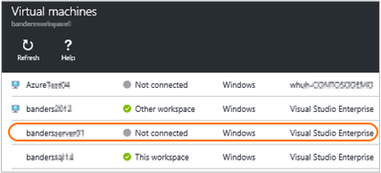
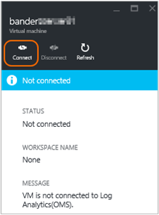
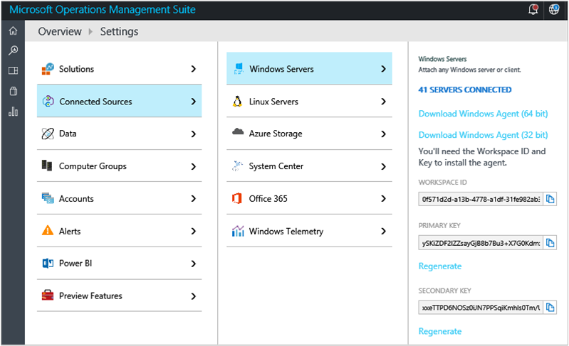
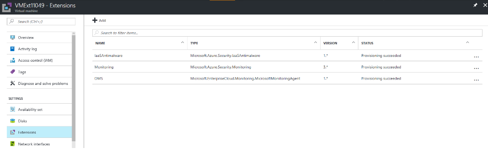
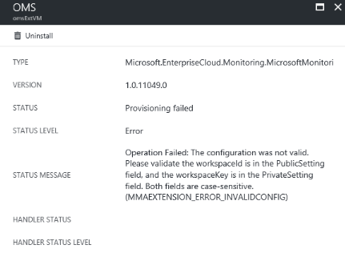

# Connect Azure virtual machines to Log Analytics with a Log Analytics agent

For Windows and Linux computers, the recommended method for collecting logs and metrics is by installing the Log Analytics agent.

The easiest way to install the Log Analytics agent on Azure virtual machines is through the Log Analytics VM Extension.  Using the extension simplifies the installation process and automatically configures the agent to send data to the Log Analytics workspace that you specify. The agent is also upgraded automatically, ensuring that you have the latest features and fixes.

For Windows virtual machines, you enable the *Microsoft Monitoring Agent* virtual machine extension.
For Linux virtual machines, you enable the *OMS Agent For Linux* virtual machine extension.

Learn more about [Azure virtual machine extensions](../virtual-machines/windows/extensions-features.md?toc=%2fazure%2fvirtual-machines%2fwindows%2ftoc.json) and the [Linux agent](../virtual-machines/linux/agent-user-guide.md?toc=%2fazure%2fvirtual-machines%2flinux%2ftoc.json).

When you use agent-based collection for log data, you must configure [data sources in Log Analytics](log-analytics-data-sources.md) to specify the logs and metrics that you want to collect.

> [!IMPORTANT]
> If you configure Log Analytics to index log data by using [Azure diagnostics](log-analytics-azure-storage.md), and you configure the agent to collect the same logs, then the logs are collected twice. You are charged for both data sources. If you have the agent installed, then collect log data by using only the agent - don't configure Log Analytics to collect log data from Azure diagnostics.
>
>

There are three easy ways to enable the Log Analytics virtual machine extension:

* By using the Azure portal
* By using Azure PowerShell
* By using an Azure Resource Manager template

## Enable the VM extension in the Azure portal
You can install the agent for Log Analytics and connect the Azure virtual machine that it runs on by using the [Azure portal](https://portal.azure.com).

### To install the Log Analytics agent and connect the virtual machine to a Log Analytics workspace
1. Sign into the [Azure portal](http://portal.azure.com).
2. Select **Browse** on the left side of the portal, and then go to **Log Analytics (OMS)** and select it.
3. In your list of Log Analytics workspaces, select the one that you want to use with the Azure VM.  
   
4. Under **Log analytics management**, select **Virtual machines**.  
   
5. In the list of **Virtual machines**, select the virtual machine on which you want to install the agent. The **OMS connection status** for the VM indicates that it is **Not connected**.  
   
6. In the details for your virtual machine, select **Connect**. The agent is automatically installed and configured for your Log Analytics workspace. This process takes a few minutes, during which time the OMS Connection status is *Connecting...*  
   
7. After you install and connect the agent, the **OMS connection** status will be updated to show **This workspace**.  
   

## Enable the VM extension using PowerShell
When you configure your virtual machine by using PowerShell, you need to provide the **workspaceId** and **workspaceKey**. 
The property names in your json configuration are **case-sensitive**.

You can find the Id and key on the **Settings** page of the OMS portal, or by using PowerShell as shown in the preceding example.



There are different commands for Azure classic virtual machines and Resource Manager virtual machines. Following are examples for both classic and Resource Manager virtual machines.

For classic virtual machines, use the following PowerShell example:

```PowerShell
Add-AzureAccount

$workspaceId = "enter workspace ID here"
$workspaceKey = "enter workspace key here"
$hostedService = "enter hosted service here"

$vm = Get-AzureVM –ServiceName $hostedService

# For Windows VM uncomment the following line
# Set-AzureVMExtension -VM $vm -Publisher 'Microsoft.EnterpriseCloud.Monitoring' -ExtensionName 'MicrosoftMonitoringAgent' -Version '1.*' -PublicConfiguration "{'workspaceId': '$workspaceId'}" -PrivateConfiguration "{'workspaceKey': '$workspaceKey' }" | Update-AzureVM -Verbose

# For Linux VM uncomment the following line
# Set-AzureVMExtension -VM $vm -Publisher 'Microsoft.EnterpriseCloud.Monitoring' -ExtensionName 'OmsAgentForLinux' -Version '1.*' -PublicConfiguration "{'workspaceId': '$workspaceId'}" -PrivateConfiguration "{'workspaceKey': '$workspaceKey' }" | Update-AzureVM -Verbose
```

For Resource Manager Linux VMs using the following CLI
```azurecli
az vm extension set --resource-group myRGMonitor --vm-name myMonitorVM --name OmsAgentForLinux --publisher Microsoft.EnterpriseCloud.Monitoring --version 1.3 --protected-settings ‘{"workspaceKey": "<workspace-key>"}’ --settings ‘{"workspaceId": "<workspace-id>"}’ 
```

For Resource Manager virtual machines, use the following PowerShell example:

```PowerShell
Login-AzureRMAccount
Select-AzureSubscription -SubscriptionId "**"

$workspaceName = "your workspace name"
$VMresourcegroup = "**"
$VMresourcename = "**"

$workspace = (Get-AzureRmOperationalInsightsWorkspace).Where({$_.Name -eq $workspaceName})

if ($workspace.Name -ne $workspaceName)
{
    Write-Error "Unable to find OMS Workspace $workspaceName. Do you need to run Select-AzureRMSubscription?"
}

$workspaceId = $workspace.CustomerId
$workspaceKey = (Get-AzureRmOperationalInsightsWorkspaceSharedKeys -ResourceGroupName $workspace.ResourceGroupName -Name $workspace.Name).PrimarySharedKey

$vm = Get-AzureRmVM -ResourceGroupName $VMresourcegroup -Name $VMresourcename
$location = $vm.Location

# For Windows VM uncomment the following line
# Set-AzureRmVMExtension -ResourceGroupName $VMresourcegroup -VMName $VMresourcename -Name 'MicrosoftMonitoringAgent' -Publisher 'Microsoft.EnterpriseCloud.Monitoring' -ExtensionType 'MicrosoftMonitoringAgent' -TypeHandlerVersion '1.0' -Location $location -SettingString "{'workspaceId': '$workspaceId'}" -ProtectedSettingString "{'workspaceKey': '$workspaceKey'}"

# For Linux VM uncomment the following line
# Set-AzureRmVMExtension -ResourceGroupName $VMresourcegroup -VMName $VMresourcename -Name 'OmsAgentForLinux' -Publisher 'Microsoft.EnterpriseCloud.Monitoring' -ExtensionType 'OmsAgentForLinux' -TypeHandlerVersion '1.0' -Location $location -SettingString "{'workspaceId': '$workspaceId'}" -ProtectedSettingString "{'workspaceKey': '$workspaceKey'}"


```


## Deploy the VM extension using a template
By using Azure Resource Manager, you can create a template (in JSON format) that defines the deployment and configuration of your application. This template is known as a Resource Manager template and provides a declarative way to define deployment. By using a template, you can repeatedly deploy your application throughout the app lifecycle and have confidence that your resources are being deployed in a consistent state.

By including the Log Analytics agent as part of your Resource Manager template, you can ensure that each virtual machine is pre-configured to report to your Log Analytics workspace.

For more information about Resource Manager templates, see [Authoring Azure Resource Manager templates](../azure-resource-manager/resource-group-authoring-templates.md).

Following is an example of a Resource Manager template that's used for deploying a virtual machine that's running Windows with the Microsoft Monitoring Agent extension installed. This template is a typical virtual machine template, with the following additions:

* workspaceId and workspaceName parameters
* Microsoft.EnterpriseCloud.Monitoring resource extension section
* Outputs to look up the workspaceId and workspaceSharedKey

```json
{
  "$schema": "https://schema.management.azure.com/schemas/2015-01-01/deploymentTemplate.json#",
  "contentVersion": "1.0.0.0",
  "parameters": {
    "adminUsername": {
      "type": "string",
      "metadata": {
        "description": "Username for the Virtual Machine."
      }
    },
    "adminPassword": {
      "type": "securestring",
      "metadata": {
        "description": "Password for the Virtual Machine."
      }
    },
    "dnsLabelPrefix": {
       "type": "string",
       "metadata": {
          "description": "DNS Label for the Public IP. Must be lowercase. It should match with the following regular expression: ^[a-z][a-z0-9-]{1,61}[a-z0-9]$ or it will raise an error."
       }
    },
    "workspaceId": {
      "type": "string",
      "metadata": {
        "description": "OMS workspace ID"
      }
    },
    "workspaceName": {
      "type": "string",
      "metadata": {
         "description": "OMS workspace name"
      }
    },
    "windowsOSVersion": {
      "type": "string",
      "defaultValue": "2012-R2-Datacenter",
      "allowedValues": [
        "2008-R2-SP1",
        "2012-Datacenter",
        "2012-R2-Datacenter",
        "Windows-Server-Technical-Preview"
      ],
      "metadata": {
        "description": "The Windows version for the VM. This will pick a fully patched image of this given Windows version. Allowed values: 2008-R2-SP1, 2012-Datacenter, 2012-R2-Datacenter, Windows-Server-Technical-Preview."
      }
    }
  },
  "variables": {
    "storageAccountName": "[concat(uniquestring(resourceGroup().id), 'standardsa')]",
    "apiVersion": "2015-06-15",
    "imagePublisher": "MicrosoftWindowsServer",
    "imageOffer": "WindowsServer",
    "OSDiskName": "osdiskforwindowssimple",
    "nicName": "myVMNic",
    "addressPrefix": "10.0.0.0/16",
    "subnetName": "Subnet",
    "subnetPrefix": "10.0.0.0/24",
    "storageAccountType": "Standard_LRS",
    "publicIPAddressName": "myPublicIP",
    "publicIPAddressType": "Dynamic",
    "vmStorageAccountContainerName": "vhds",
    "vmName": "MyWindowsVM",
    "vmSize": "Standard_DS1",
    "virtualNetworkName": "MyVNET",
    "resourceId": "[resourceGroup().id]",
    "vnetID": "[resourceId('Microsoft.Network/virtualNetworks',variables('virtualNetworkName'))]",
    "subnetRef": "[concat(variables('vnetID'),'/subnets/',variables('subnetName'))]"
  },
  "resources": [
    {
      "type": "Microsoft.Storage/storageAccounts",
      "name": "[variables('storageAccountName')]",
      "apiVersion": "[variables('apiVersion')]",
      "location": "[resourceGroup().location]",
      "properties": {
        "accountType": "[variables('storageAccountType')]"
      }
    },
    {
      "apiVersion": "[variables('apiVersion')]",
      "type": "Microsoft.Network/publicIPAddresses",
      "name": "[variables('publicIPAddressName')]",
      "location": "[resourceGroup().location]",
      "properties": {
        "publicIPAllocationMethod": "[variables('publicIPAddressType')]",
        "dnsSettings": {
          "domainNameLabel": "[parameters('dnsLabelPrefix')]"
        }
      }
    },
    {
      "apiVersion": "[variables('apiVersion')]",
      "type": "Microsoft.Network/virtualNetworks",
      "name": "[variables('virtualNetworkName')]",
      "location": "[resourceGroup().location]",
      "properties": {
        "addressSpace": {
          "addressPrefixes": [
            "[variables('addressPrefix')]"
          ]
        },
        "subnets": [
          {
            "name": "[variables('subnetName')]",
            "properties": {
              "addressPrefix": "[variables('subnetPrefix')]"
            }
          }
        ]
      }
    },
    {
      "apiVersion": "[variables('apiVersion')]",
      "type": "Microsoft.Network/networkInterfaces",
      "name": "[variables('nicName')]",
      "location": "[resourceGroup().location]",
      "dependsOn": [
        "[concat('Microsoft.Network/publicIPAddresses/', variables('publicIPAddressName'))]",
        "[concat('Microsoft.Network/virtualNetworks/', variables('virtualNetworkName'))]"
      ],
      "properties": {
        "ipConfigurations": [
          {
            "name": "ipconfig1",
            "properties": {
              "privateIPAllocationMethod": "Dynamic",
              "publicIPAddress": {
                "id": "[resourceId('Microsoft.Network/publicIPAddresses',variables('publicIPAddressName'))]"
              },
              "subnet": {
                "id": "[variables('subnetRef')]"
              }
            }
          }
        ]
      }
    },
    {
      "apiVersion": "2015-06-15",
      "type": "Microsoft.Compute/virtualMachines",
      "name": "[variables('vmName')]",
      "location": "[resourceGroup().location]",
      "dependsOn": [
        "[concat('Microsoft.Storage/storageAccounts/', variables('storageAccountName'))]",
        "[concat('Microsoft.Network/networkInterfaces/', variables('nicName'))]"
      ],
      "properties": {
        "hardwareProfile": {
          "vmSize": "[variables('vmSize')]"
        },
        "osProfile": {
          "computername": "[variables('vmName')]",
          "adminUsername": "[parameters('adminUsername')]",
          "adminPassword": "[parameters('adminPassword')]"
        },
        "storageProfile": {
          "imageReference": {
            "publisher": "[variables('imagePublisher')]",
            "offer": "[variables('imageOffer')]",
            "sku": "[parameters('windowsOSVersion')]",
            "version": "latest"
          },
          "osDisk": {
            "name": "osdisk",
            "vhd": {
              "uri": "[concat('http://',variables('storageAccountName'),'.blob.core.windows.net/',variables('vmStorageAccountContainerName'),'/',variables('OSDiskName'),'.vhd')]"
            },
            "caching": "ReadWrite",
            "createOption": "FromImage"
          }
        },
        "networkProfile": {
          "networkInterfaces": [
            {
              "id": "[resourceId('Microsoft.Network/networkInterfaces',variables('nicName'))]"
            }
          ]
        },
        "diagnosticsProfile": {
          "bootDiagnostics": {
             "enabled": "true",
             "storageUri": "[concat('http://',variables('storageAccountName'),'.blob.core.windows.net')]"
          }
        }
      },
      "resources": [
        {
          "type": "extensions",
          "name": "Microsoft.EnterpriseCloud.Monitoring",
          "apiVersion": "[variables('apiVersion')]",
          "location": "[resourceGroup().location]",
          "dependsOn": [
            "[concat('Microsoft.Compute/virtualMachines/', variables('vmName'))]"
          ],
          "properties": {
            "publisher": "Microsoft.EnterpriseCloud.Monitoring",
            "type": "MicrosoftMonitoringAgent",
            "typeHandlerVersion": "1.0",
            "autoUpgradeMinorVersion": true,
            "settings": {
              "workspaceId": "[parameters('workspaceId')]"
            },
            "protectedSettings": {
              "workspaceKey": "[listKeys(resourceId('Microsoft.OperationalInsights/workspaces', parameters('workspaceName')), '2015-03-20').primarySharedKey]"
            }
          }
        }
      ]
    }
  ],
  "outputs": {
      "sharedKeyOutput": {
         "value": "[listKeys(resourceId('Microsoft.OperationalInsights/workspaces/', parameters('workspaceName')), '2015-03-20').primarySharedKey]",
         "type": "string"
      },
      "workspaceIdOutput": {
         "value": "[reference(concat('Microsoft.OperationalInsights/workspaces/', parameters('workspaceName')), '2015-03-20').customerId]",
        "type" : "string"
      }
  }
}
```

You can deploy a template by using the following PowerShell command:

```PowerShell
New-AzureRmResourceGroupDeployment -ResourceGroupName $resourceGroupName -TemplateFile $templateFilePath
```

## Troubleshooting the Log Analytics VM extension
Usually you receive a message when things don't work, from either Azure portal or Azure powershell.

1. Sign into the [Azure portal](http://portal.azure.com).
2. Find the VM and open VM details.
3. Click **Extensions** to check if OMS extension is enabled or not.

   

4. Click the *MicrosoftMonitoringAgent*(Windows) or *OmsAgentForLinux*(Linux) extension and view details. 

   

### Troubleshooting Windows Virtual Machines
If the *Microsoft Monitoring Agent* VM agent extension is not installing or reporting, you can perform the following steps to troubleshoot the issue.

1. Check if the Azure VM agent is installed and working correctly by using the steps in [KB 2965986](https://support.microsoft.com/kb/2965986#mt1).
   * You can also review the VM agent log file `C:\WindowsAzure\logs\WaAppAgent.log`
   * If the log does not exist, the VM agent is not installed.
     * [Install the Azure VM Agent on classic VMs](../virtual-machines/windows/classic/agents-and-extensions.md?toc=%2fazure%2fvirtual-machines%2fwindows%2fclassic%2ftoc.json)
2. Confirm the Microsoft Monitoring Agent extension heartbeat task is running using the following steps:
   * Log in to the virtual machine
   * Open task scheduler and find the `update_azureoperationalinsight_agent_heartbeat` task
   * Confirm the task is enabled and is running every one minute
   * Check the heartbeat logfile in `C:\WindowsAzure\Logs\Plugins\Microsoft.EnterpriseCloud.Monitoring.MicrosoftMonitoringAgent\heartbeat.log`
3. Review the Microsoft Monitoring Agent VM extension log files in `C:\Packages\Plugins\Microsoft.EnterpriseCloud.Monitoring.MicrosoftMonitoringAgent`
4. Ensure the virtual machine can run PowerShell scripts
5. Ensure permissions on C:\Windows\temp haven’t been changed
6. View the status of the Microsoft Monitoring Agent by typing the following command in an elevated PowerShell window on the virtual machine `  (New-Object -ComObject 'AgentConfigManager.MgmtSvcCfg').GetCloudWorkspaces() | Format-List`
7. Review the Microsoft Monitoring Agent setup log files in `C:\Windows\System32\config\systemprofile\AppData\Local\SCOM\Logs`

For more information, see [troubleshooting Windows extensions](../virtual-machines/windows/extensions-troubleshoot.md?toc=%2fazure%2fvirtual-machines%2fwindows%2ftoc.json).

### Troubleshooting Linux Virtual Machines
If the *OMS Agent for Linux* VM agent extension is not installing or reporting, you can perform the following steps to troubleshoot the issue.

1. If the extension status is *Unknown* check if the Azure VM agent is installed and working correctly by reviewing the VM agent log file `/var/log/waagent.log`
   * If the log does not exist, the VM agent is not installed.
   * [Install the Azure VM Agent on Linux VMs](../virtual-machines/linux/agent-user-guide.md?toc=%2fazure%2fvirtual-machines%2flinux%2ftoc.json)
2. For other unhealthy statuses, review the OMS Agent for Linux VM extension logs files in `/var/log/azure/Microsoft.EnterpriseCloud.Monitoring.OmsAgentForLinux/*/extension.log` and `/var/log/azure/Microsoft.EnterpriseCloud.Monitoring.OmsAgentForLinux/*/CommandExecution.log`
3. If the extension status is healthy, but data is not being uploaded review the OMS Agent for Linux log files in `/var/opt/microsoft/omsagent/log/omsagent.log`

For more information, see [troubleshooting Linux extensions](../virtual-machines/linux/extensions-troubleshoot.md?toc=%2fazure%2fvirtual-machines%2flinux%2ftoc.json).

## Next steps
* Configure [data sources in Log Analytics](log-analytics-data-sources.md) to specify the logs and metrics to collect.
* To gather data from virtual machines [Add Log Analytics solutions from the Solutions Gallery](log-analytics-add-solutions.md).
* [Collect data by using Azure Diagnostics](log-analytics-azure-storage.md) for other resources that are running in Azure.

For computers that are not in Azure, you can install the Log Analytics agent by using the methods that are described in the following articles:

* [Connect Windows computers to Log Analytics](log-analytics-windows-agents.md)
* [Connect Linux computers to Log Analytics](log-analytics-linux-agents.md)
